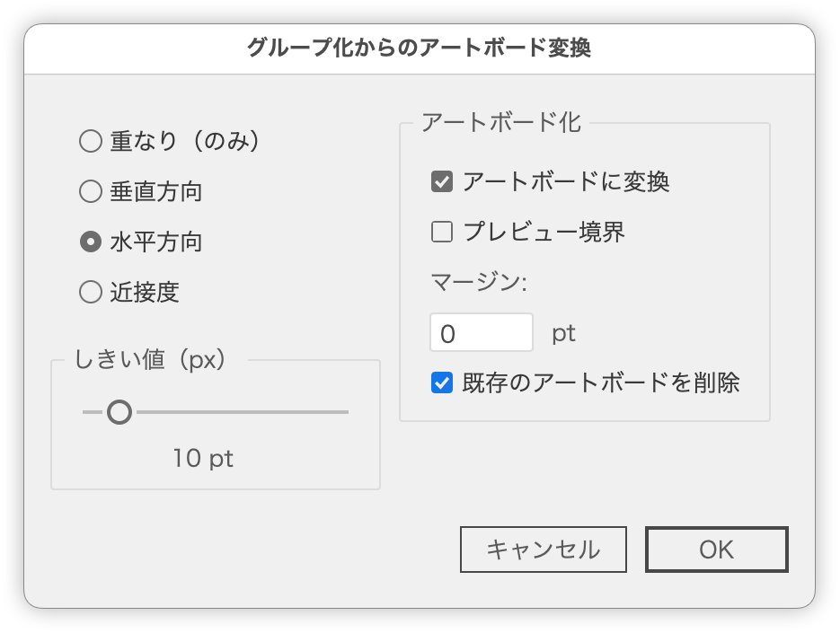
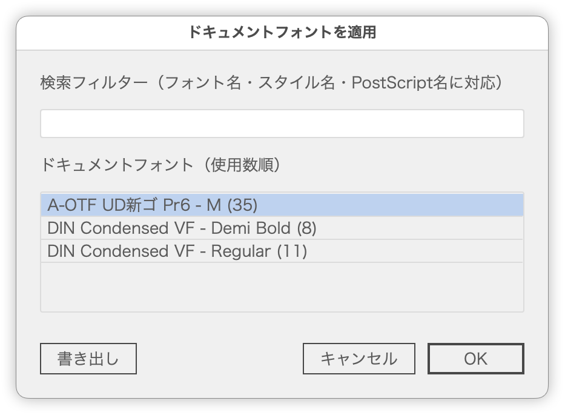
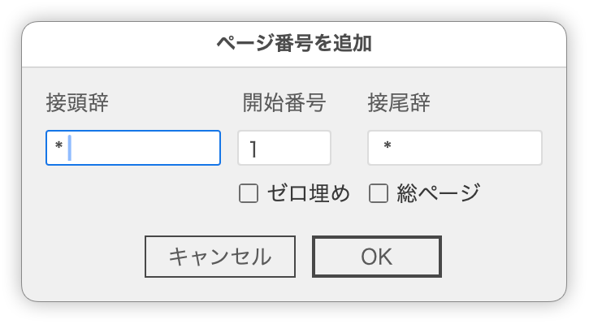
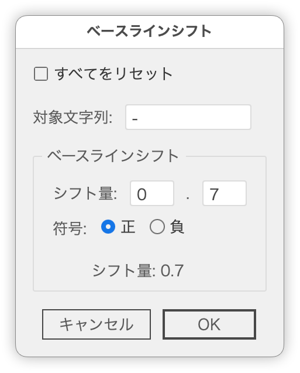
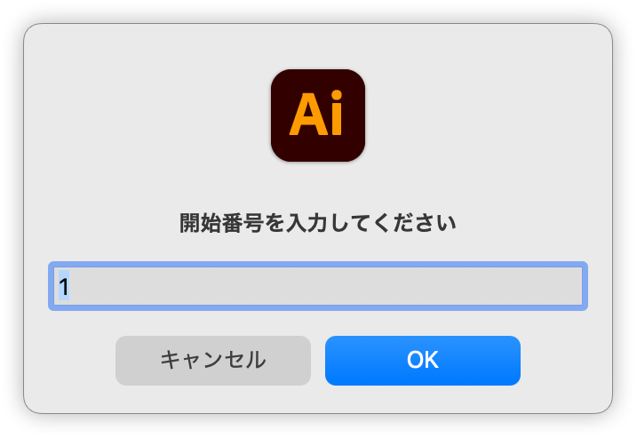

# Change Log

## 20261001

### 調整

- 右側のボタン（キャンセル・OK など）だけのボタン行は、ダイアログの内側の幅（左右の余白を除く）が 200px 以内なら左右中央、それより広ければ右揃えにした（ボタン行の共通の部品）（78本）
- 常に左右中央に並べていたボタン行（{ centered: true }）をほかのスクリプトと同じ形式にし、上と同じく幅で中央・右揃えを切り替えるようにした（60本）
- ウィンドウ・パネルの余白と間隔を共通部品（UIレイアウト）にそろえた。パネルの余白は [16, 20, 16, 12]、ラジオボタンやチェックボックスが縦に並ぶパネルは間隔を 6 に（248本）
- 右側に縦に並べていたボタンや、独自の形で組んでいたボタン行を、ダイアログ下段の標準のボタン行（左に補助ボタン、右にキャンセル → OK）にそろえた（23本）
- ダイアログの手書きの中央配置や、初回に右へずらす独自の配置をやめ、位置と不透明度を共通部品に一本化した（14本）

## 20260930

### 新しいスクリプトを追加

- [アートボードを選んで PNG・JPEG・PDF で書き出し](readme-ja/ArtboardExporter.md)

### 調整

- [全アートボードを名前ごとのルールでPNG書き出し](readme-ja/export-Event.md)（v1.1.0）：書き出すアートボードをダイアログで選べるようにした。一覧に倍率と背景（透明・白）を表示
- 文字ツールで文字を選択して実行するとエラーになる不具合を修正（ダイアログの位置を決める共通の部品）（218本）
- 文字ツールで文字を選択して実行するとエラーになる不具合を修正（選択の読み取り）（9本）
- 初めて開くときにダイアログを右へずらす独自の配置をやめた（選択に重なるときは共通の部品が左右へずらす）（26本）
- 右側のボタン（キャンセル・OK など）だけのボタン行を左右中央に並べるようにした（ボタン行の共通の部品）（76本）
- [重ね順を位置やZインデックスで並べ替え](readme-ja/ZIndexSorter.md)（v1.0.6）：「元の重ね順」を昇順で元のまま・降順で反転・ランダムでシャッフルに。キャンセルで重ね順が逆になって戻る不具合と、ドキュメントなしで実行するとエラーになる不具合を修正。項目名とツールチップを見直し
- [重ね順を位置やZインデックスで並べ替え](readme-ja/ZIndexSorter.md)（v1.0.7）：キャンセルで選択外のオブジェクトとの前後やレイヤーまで元に戻すように。ラジオボタンにキーボードショートカットを追加。パネルの余白を共通の設定に
- [テキストの検索・置換・整形](readme-ja/SmartTextFindReplace.md)（v1.5.1）：［プレビュー］を正規表現のときだけ使えるようにし、［正規表現］のすぐ下に移動。選択ツールでテキストオブジェクトを1つだけ選んで実行したときも、その1行目を検索する文字列の1行目に入れるように。プレビューが ON で開くことがある不具合と、文字を選択して［選択中のオブジェクト］で実行するとエラーになる不具合を修正
- [テキストの検索・置換・整形](readme-ja/SmartTextFindReplace.md)（v1.5.0）：ダイアログのタイトルを「テキストの検索・置換・整形」、「削除・置換」タブを「検索・置換」に変更。検索・置換に［次を選択］［すべてを選択］［選択時に拡大表示］と「空になった行を削除」を追加。文字ツールで文字を選択して実行すると、その文字列を1行目に入れるように。入力欄を7つから5つに。［実行］を［すべてを置換］、［リセット］を［条件をリセット］に改名。文字を選択して実行するとエラーになる不具合を修正
- [カーソルのある段落をひとつ下へ移動](readme-ja/MoveParagraphDown.md)（v1.1.0）：動かす単位を段落と行で切り替える変数 MOVE_BY_PARAGRAPH（1: 段落 / 0: 行）を追加。常駐エンジンで実行するようにし、再描画を最後の1回にまとめて速くした
- [カーソルのある段落をひとつ上へ移動](readme-ja/MoveParagraphUp.md)（v1.1.0）：動かす単位を段落と行で切り替える変数 MOVE_BY_PARAGRAPH（1: 段落 / 0: 行）を追加。常駐エンジンで実行するようにし、再描画を最後の1回にまとめて速くした

## 20260929

### 新しいスクリプトを追加

- [選択オブジェクトを拡大・縮小する常駐パレット](readme-ja/SmartScalePalette.md)

### 調整

- ダイアログの不透明度を98%に変更（218本）
- キーボードショートカットを共通の部品に（⌘などを押しているときは反応しない）（4本）
- 常駐パレットを Esc で閉じるように（5本）
- 基準点（9軸）ウィジェットの色を濃くし、Illustrator の UI に近づけた（11本）
- クリップグループの範囲をマスクで測るように（9本）
- [使用中のフォントをまとめて別のフォントに置換](readme-ja/ReplaceDocumentFonts.md)（v2.2.0）：「表示」パネルに［合成フォントのみ］を追加（置換元・置換先のリストを合成フォントに絞る。option＋C）
- [使用中のフォントをまとめて別のフォントに置換](readme-ja/ReplaceDocumentFonts.md)（v2.1.1）：置換元の選択に連動したテキストのハイライトを廃止。テキストを選択して実行したときは［対象］を［選択範囲のみ］で開くようにした（対象は記憶しない）。［リストの幅をフォント名に合わせる］を追加（OFF は固定幅の簡易表示）。［使っていないフォントスタイルも表示］（旧［使っていないスタイルも表示］）は記憶せず、毎回 OFF で開くようにした。［PostScript名で表示］を［フォント名をPostScript名で表示］に改名。［ソート］をラジオボタンからポップアップに変更し、項目名を［並び順］に。左のパネル名を「表示」に、［全置換］を［すべて置換］に変更。アラートの文言を整理し、ツールチップを補足。キーボードショートカット（option＋D／S／P／L／Tab）を追加。［閉じる］を左端に移動
- [使用中のフォントをまとめて別のフォントに置換](readme-ja/ReplaceDocumentFonts.md)（v2.1.0）：［対象］（ドキュメント全体／選択範囲のみ）、［ソート］（名前順／使用数の降順・昇順）、置換先の［使っていないスタイルも表示］、［文字・段落スタイルも置換］を追加。［PostScript名で表示］［ソート］を左の「オプション」パネルに、置換先の2項目を右の「置換オプション」パネルにまとめた。ファミリー名の行にスタイルの使用数の合計を表示。設定を記憶するようにした。ファミリー名の行を選んだときにリストが大きくスクロールしないようにした。ダイアログのタイトルを「ドキュメントフォントを置換」に変更
- [行頭に箇条書き記号・連番を付ける](readme-ja/AddBulletsAndNumbers.md)（v1.4.3）：カラーピッカーを、自前のダイアログから Illustrator 標準のカラーピッカーに変更（「よく使う色」は廃止）
- [選択オブジェクトのグラデーションを、指定した数のカラーストップでセパレートグラデーション（縞模様）に変換](readme-ja/Convert2SeparateGradient.md)（v1.1.4）：ファイル名を `convert2separategradient.jsx` から `Convert2SeparateGradient.jsx` に変更
- [選択オブジェクトの色からスウォッチとグラデーションを自動生成](readme-ja/CreateGradientFromSelection.md)（v1.10.0）：CreateGradientFromSelection-Blend.jsx を統合し、［複製でブレンドを作成］を追加（選択オブジェクトの複製でブレンドを作る。元のオブジェクトはそのまま）
- [不透明度を塗りのカラーに焼き込む](readme-ja/FlattenOpacityPro.md)（v1.1.0）：FlattenTransparency.jsx を統合し、グラデーションや画像など焼き込めないものを含むときは標準の［透明部分を分割・統合］で処理するようにした
- [インストール済みフォントの見本を自動生成](readme-ja/FontCatalogGenerator.md)（v1.7.3）：文字の単位が級のとき、単位の表示を「Q/H」から「Q」に修正（単位の扱いを共通の表に一本化）
- [PDF/AIをページ範囲で読み込んで配置](readme-ja/PDFAIImporter.md)（v1.3.0）：PDFAISpreadImporter.jsx を統合。見開きの分割（偶数ページの位置は綴じ方向から自動設定）、トリミングの選択、新規ドキュメントへの配置を追加
- [選択中のオブジェクトが「だいたいグリッド状」に並んでいることを前提に、左右・上下の間隔で再配置します](readme-ja/RegridObjects.md)（v1.8.0）：大きさや形の違うオブジェクトが混ざっていても行・列を判定できるように。［中央揃え］を［セル内の揃え］（9軸）に置き換え、［強制グリッド］以外でも使えるように。間隔の欄に数値以外を入れたときは直前の値に戻すように。［連動］がONのときは［上下］の項目名もディム表示に。コード整理
- [奇数番目／偶数番目だけを互い違いに選択](readme-ja/SelectAlternateItems.md)（v1.1.5）：前回の［数える順］が保存されていなかった不具合を修正。［方向］を［数える順］に改名し、重ね順は選択の並びで数えるようにした
- [PDF/AIをグリッド配置してサムネイル一覧を作成](readme-ja/SlideCollage.md)（v1.7.2）：内部構造を整理（重複した配置・グリッド計算の共通化、ラベルの構造化、命名の見直し）。英語表示で［リセット］［軽量プレビュー］が日本語のままだった不具合を修正。項目名にコロンを付け、ヒントを追加。配置範囲の変更で読み込み直すように。間隔などに小数を入力できなかった不具合を修正。回転なしのとき、位置調整がプレビューに反映されなかった不具合を修正。総数が配置数に反映されるように。読み込み後にOKしたとき、マスク・マスク角丸・角丸がかからなかった不具合を修正。見開きを左右に分割して並べる機能を追加（PDFAIImporter から移植）。CMYKドキュメントでカラーピッカーの色が背景色に入らなかった不具合を修正。「スケール：」などの項目名の末尾が切れないよう幅を実測してそろえる。角丸にヒントを追加。［ずらし］をオンにすると、ずらし量（1つ分の高さと間隔の和の半分）を自動で入れるように。［画面にフィット］を追加（アートボードが指定の割合で収まるよう表示を合わせる。キャンセルで元の表示に戻す）。「アートボードとマスク」パネルを右カラムへ移動。画面ズームと［軽量プレビュー］を削除。角丸はプレビューせず、OKのときにかける。［読み込み］ボタンを総数の下へ移動。見開きを分割したとき、片ページの大きさでグリッドを組むよう修正。列数の上限を10から30に。ページ数をファイルの中身から読めないとき、読み込みファイルがすでに開いていると、そのドキュメントを保存せずに閉じてしまう不具合を修正。文字を選択した状態で実行すると止まる不具合、背景が前面に出ることがある不具合を修正。総数にステップボタン（∧∨）を追加。マージンをマスクの右へ移し、マスク角丸の左端をマージンにそろえた。値が続くチェックボックス（角丸・ずらし・回転・背景色・位置調整・マスク角丸）にもコロンを付けた。ダイアログを前回閉じた位置で開き、選択中のオブジェクトに重なるときは左右にずらすようにした。不透明度を97%にそろえた
- [アートボードと同じサイズの長方形を描く](readme-ja/SmartDrawArtboardRectangle.md)（v1.7.0）：カラーの［HEX］［CMYK］を［カスタム］にまとめ、色見本をクリックすると Illustrator 標準のカラーピッカーで色を選ぶようにした
- [選択オブジェクトの絞り込み](readme-ja/SmartSelectionFilter.md)（v1.1.0）：SmartSelectionFilterSimple.jsx を統合し、「対象スコープ」パネル（選択直下のみ／グループ内も対象に含める）を追加。クリップグループのマスク用パスを選択対象から除外
- [外接矩形を2分割した2色の背景に置き換え](readme-ja/SplitForTwo.md)（v2.10.3）：色見本から開くカラー選択を、自前のダイアログから Illustrator 標準のカラーピッカーに変更

## 20260928

### 新しいスクリプトを追加

- [似ているフォントのウェイトを見本で見比べて適用](readme-ja/FontWeightPicker.md)

### 調整

- ダイアログを前回閉じた位置で開き、選択中のオブジェクトに重なるときは左右にずらすように（176本）
- ボタン行（キャンセル・OK など）を共通の部品で組むように（168本）
- キーボードショートカットを共通の部品に（⌘などを押しているときは反応しない）（25本）
- クリップグループの範囲をマスクで測るように（27本）
- ［連動］をチェックボックスからリンクアイコンに変更（17本）
- 設定の保存を共通の部品に（15本）
- 一時アクションの読み込み・実行・解除を共通の処理にし、失敗してもアクションセットと一時ファイルが残らないように（36本）
- 基準点の9マスを共通の部品に（7本）
- 対象の収集を共通の部品に（6本）
- 文字の単位がフィート／インチのとき、1ステップを単位の長さ（1フィート）にそろえた（5本）
- 英語表示で、項目名のコロンの後ろの余分な空白を削除（8本）
- [テキストやオブジェクトの背面に図形を敷く](readme-ja/AddBackdrop.md)（v1.7.2）：日本語表示で、エラーメッセージのコロンを全角にそろえた
- [行頭に箇条書き記号・連番を付ける](readme-ja/AddBulletsAndNumbers.md)（v1.4.2）：文字の単位がフィート・ヤード・メートルのとき、tabストップや行送りなどの値が pt のまま換算されていなかったのを修正。インチの表示を「in」にそろえた
- [選択したテキストのフォント名、フォントサイズなどをテキストとして生成する](readme-ja/AddTextInfoLabel.md)（v1.0.5）：フォントサイズと行送りを環境設定の単位に換算して表示するよう修正（pt の値に mm・Q などの単位名だけを付けていた）。インチ・パイカの表記を「in」「pica」に統一
- [アートボード基準のガイド作成とルーラーガイドの変換](readme-ja/AiCreateArtboardGuides.md)（v1.2.2）：定規単位が歯のときの単位表示を「Q/H」から「H」に修正
- [ドキュメントの不要な要素をまとめて削除](readme-ja/AiDocumentCleaner.md)（v1.1.4）：日本語表示で、結果の件数のコロンを全角にそろえた
- [メモ入力パレット](readme-ja/AiMemoPalette.md)（v1.1.6）：日本語表示で、保存したテキストのフッター（保存元・保存日時）のコロンを全角にした
- [パスファインダー](readme-ja/AiSmartPathfinderPalette.md)（v1.1.3）：日本語表示で、適用後のステータス表示のコロンを全角にそろえた。BridgeTalk 側の一時アクションを共通の部品にした
- [アートボード全体が正方形に近づくよう再配置](readme-ja/ArrangeArtboardsToSquareGrid.md)（v1.1.2）：日本語表示で、アートボード数と推奨列数の表示のコロンを全角にそろえた
- [エリア内文字に自動サイズ調整をワンクリックで適用](readme-ja/AutoFitTextFrame.md)（v1.0.1）：失敗したときは警告を出して止まるようにした
- [アピアランスを消去して塗り・線だけ残す](readme-ja/ClearAppearance.md)（v1.0.4）：日本語表示で、失敗件数と詳細行のコロンを全角にそろえた
- [クリップグループのマスクと内容を調整](readme-ja/ClipMaskAdjust.md)（v3.1.2）：基準点の9個のラジオボタンを、共通の部品の9マスに置き換えた
- [カラーパレットを生成してスウォッチに登録](readme-ja/ColorGenerator.md)（v1.1.2）：英語表示で「HEX:」のコロンの後ろの余分な空白を削除（項目名のコロンを他のスクリプトとそろえた）
- [選択したテキストをフォント情報に置き換え](readme-ja/ConvertFontInfo.md)（v1.1.5）：フォントサイズの px 表示が 96dpi 換算で大きくなっていた不具合を修正（Illustrator では 1px＝1pt）。フィート・メートル・ヤードにも換算するようにし、インチの表記を「in」に統一
- [選択オブジェクトの境界に合わせて長方形を作成](readme-ja/ConvertToRectangle.md)（v1.2.2）：単位が歯（H）のときの換算を修正（1H＝0.25mm ではなく 0.25pt で計算していた）。フィート・メートル・ヤードも換算するようにし、単位表示を「H」「pica」に統一
- [オブジェクトの間に水平の罫線を描く](readme-ja/DrawLinesBetween.md)（v1.1.2）：線幅・延長・線端の前回値が保存されていなかった不具合を修正（Illustrator に無い Photoshop 用の関数を使っていた。保存先: `~/Library/Application Support/illustrator-scripts/DrawLinesBetween.json`）
- [角丸長方形の角の半径を変更](readme-ja/EditCornerRadius.md)（v1.5.0）：吹き出し形状（辺に口が付いた長方形）、複合パスの中の長方形、ダイレクト選択した複合シェイプの中の長方形に対応。選択に対象が無いとき、対象外の表示でダイアログが広がる問題を修正。複合シェイプを「グループ＋［パスファインダー：合体］」に変換して、中の長方形を変更できるように（選択・アートボード・ドキュメント全体）。［選択したオブジェクトのみ］で、選択したグループの中の長方形も対象に。複合シェイプを変換するとき、解除した長方形の「角を丸くする」効果を外し、同じ半径をパスの角丸にするように
- [Excel由来のデータを表組みとして整形](readme-ja/ExcelTableNormalizer.md)（v1.2.2）：線の単位が歯（H）・パイカ・フィートなどのとき、線幅が pt のまま換算されずに引かれていたのを修正
- [あふれを解消してからポイント文字に変換](readme-ja/FitAndConvertToPointType.md)（v1.0.2）：アクションを読み込めないときは変換せずに警告を表示
- [インストール済みフォントの見本を自動生成](readme-ja/FontCatalogGenerator.md)（v1.7.2）：英語 UI の項目名のコロンの後ろの空白を削除（「:」にそろえた）
- [選択テキストのフォントを一つ上／下のウェイトに切り替え](readme-ja/FontWeightUp.md)（v1.0.1）：sw-L / sw-R / sw-B / sw-H を一つのファミリーとして扱うように
- [グラフィックスタイルを読み込んで適用](readme-ja/ImportAndApplyGraphicStylePalette.md)（v1.4.1）：一時アクションの一時ファイルを Folder.temp に置き、失敗してもアクションセットと一時ファイルが残らないようにした。BridgeTalk 側の一時アクションを共通の部品にした
- [［形状に変換］のライブエフェクトを適用するパレット](readme-ja/LEConvertToShapePalette.md)（v1.1.1）：英語 UI の項目名のコロンの後ろの空白をなくした（ローカライズ処理の共通化）
- [［ぼかし］のライブエフェクトを適用](readme-ja/LEFeather.md)（v1.1.2）：半径の単位表示を修正（定規単位が歯のとき「Q」ではなく「H」、フィート・メートル・ヤードが pt 扱いだった不具合も修正）。インチの表記を「in」に統一
- [パスの統計を常駐パレットで表示](readme-ja/PathInspectorPalette.md)（v1.0.3）：日本語表示で、ステータス行のエラー表示のコロンを全角にそろえた
- [複合パスを解除して合体・拡張しオフセット](readme-ja/PathUniteOffsetTool.md)（v1.1.2）：オフセットの単位表示を修正（定規単位が歯のとき「Q」ではなく「H」、フィート・メートル・ヤードが pt 扱いだった不具合も修正）。インチの表記を「in」に統一
- [スタイル・ブラシ・スウォッチ・シンボルの名前を一括置換](readme-ja/RenameAssets.md)（v1.0.3）：キャンセルを右側にそろえた
- [使用中のフォントをまとめて別のフォントに置換](readme-ja/ReplaceDocumentFonts.md)（v2.0.2）：キャンセルを右側にそろえた
- [マスクパスのサイズ変更](readme-ja/ResizeClipMask.md)（v1.3.2）：マスクの検出を共通の部品にした
- [線幅と矢印をまとめて設定](readme-ja/SetStrokeAndArrowheads.md)（v1.1.2）：失敗時の警告を「アクションを実行できませんでした。」に変更
- [PDF/AIをグリッド配置してサムネイル一覧を作成](readme-ja/SlideCollage.md)（v1.6.1）：OK・キャンセルで閉じるときのエラーと、ページ数が足りないときにページを繰り返さない不具合を修正
- [開いているファイルを1つに整列統合](readme-ja/SmartBatchImporter.md)（v1.4.2）：英語表示で、ペースト失敗メッセージのコロンを全角から半角（後ろに空白）にした
- [囲み罫とグリッドを一括生成](readme-ja/SmartGridMaker.md)（v1.7.2）：グループの中の長方形も元の長方形として使えるようにした（クリップのマスク・ガイド・ロック・非表示のパスは除く）
- [テキスト内の数値でグループを並び替えて整列](readme-ja/SortByNumbers.md)（v1.2.2）：間隔の単位を環境設定の定規の単位（rulerType）から取るようにした。歯（H）・フィート・ヤード・メートルでも正しく換算し、インチの表示を「in」にそろえた
- [外接矩形を2分割した2色の背景に置き換え](readme-ja/SplitForTwo.md)（v2.10.2）：グループの中のクリップグループもマスクの範囲で測るようにした
- [テキストの文字情報を統計的に可視化](readme-ja/TextCountStatsPalette.md)（v1.1.3）：日本語表示で、ステータス行のエラー表示のコロンを全角にそろえた
- [画像を省略線でトリミング](readme-ja/TrimWithBreakLine.md)（v1.2.2）：対象がクリップグループのときは、切る向きと位置をマスクの範囲で決めるようにした
- [選択を表として解釈して罫線と塗りを生成](readme-ja/tabularize.md)（v1.3.2）：［プレビュー］のラベルとツールチップがキー名のまま表示されていた不具合を修正
- [選択オブジェクトを一覧から選んだシンボルに置き換え](readme-ja/シンボルに置き換え-sw.md)（v0.5.2）：LABELS を用意する前にダイアログを開いて止まる不具合と、タイトルの版が 0.5.0 のままだった不具合を修正

## 20260927

### 新しいスクリプトを追加

- [メニューコマンド・ツール・環境設定のコードを引く](readme-ja/AiCommandPrefLookup.md)
- [和文・かな・欧文のフォントを指定して合成フォントを作成](readme-ja/CompositeFontMaker.md)
- [合成フォントを構成フォントに置き換え](readme-ja/DeCompositeFontMaker.md)
- [選択テキストのフォントを一つ上／下のウェイトに切り替え](readme-ja/FontWeightUp.md)

### 調整

- 数値欄にステップボタン（∧∨）を追加し、↑↓キーも同じ処理で増減するように（次の整数へ、shift＋で次の10の倍数へ）（121本）
- [背面に白フチを作る](readme-ja/AddOutlineOffsetPath.md)（v1.1.2）：↑↓以外のキーを押しても入力値が丸め直される不具合を修正、ドキュメントが開かれていないときのアラートを追加
- [現在のアートボードに日本式トンボを作成](readme-ja/AddTrimMarkToCurrentArtboard.md)（v1.1.1）：ドキュメントが開かれていないときは何もしないように修正
- [メニューコマンド・ツール・環境設定のコードを引く](readme-ja/AiCommandPrefLookup.md)（v1.0.1）：名前のない履歴の環境設定キー（rulerType_1 など）を一覧から外した
- [スクリプトをキーワードで絞り込んで実行](readme-ja/AiScriptLauncher.md)（v1.4.3）：キーワードボタンの先頭に「Palette」を常に表示（該当ファイルがあるとき）
- [禁則処理のプリセットを適用](readme-ja/AiSetKinsoku.md)（v1.0.1）：ダイアログのタイトルを「禁則処理の設定」、パネル名を「禁則処理」に変更。英語表示とツールチップに対応
- [ドキュメントフォントを適用](readme-ja/ApplyDocumentFonts.md)（v1.1.4）：キャンセル時にグループ内のテキストのフォントも元に戻すよう修正。一覧の見出しを実際の並び（名前順）に合わせ、項目名にコロンとツールチップを追加
- [縦横比を指定してサイズ変更](readme-ja/AspectRatioScaler.md)（v1.8.0）：縦横比に［元の比率］を追加して初期値に。［固定］した辺は元のまま、もう一方の辺を長さか％で調整できるように変更。［固定］に［なし（自由）］を追加（幅・高さをそれぞれ入力）。結果の縦横比をカスタム比の欄に表示。サイズの単位をパネル名に表示。［リセット］ボタン（ダイアログを開く前の大きさに戻す）を追加。UIの文言を見直し。前回 OK したときの設定（縦横比・カスタム比・オプション・向き・基準点・固定）を Illustrator の起動中は保持するように。［リセット］は初期値に戻す。［固定］の初期値を［高さ］に変更。向きアイコンと基準点の天地をそろえた。ダイアログを2カラムに変更、［ピクセルグリッドに最適化］を初期ONに、幅と高さの欄を両方表示（固定する辺だけ編集可）、基準点（9軸）を追加、向きをアイコンで選ぶ形に変更、ドキュメントが無いときに警告を表示、高さを固定したとき幅が単位に合わせて丸められない不具合を修正、ダイアログのタイトル・パネル名・ツールチップの文言を見直し
- [クリップグループのマスクと内容を調整](readme-ja/ClipMaskAdjust.md)（v3.0.2）：英語UIのtooltipを追加。定規の単位の換算を全単位に対応。数値欄で↑↓キー以外の入力時に値が丸め直されないように修正。クリップグループ以外が先頭にあっても動くように修正
- [全アートボードのテキストを集めて並べる](readme-ja/CollectArtboardTexts.md)（v1.0.1）：警告を英語表示に対応
- [散在するガイドを1つのレイヤーに集約](readme-ja/CollectGuides.md)（v1.4.2）：ドキュメントが開かれていないときは何もしないように修正
- [RGB／CMYKの黒をK100に変換](readme-ja/ColorToK100Converter.md)（v1.0.2）：ドキュメントが開かれていないときのアラートを追加、アラートを英語表示にも対応
- [ドキュメント内の日付を検索して置換](readme-ja/DateFindReplace.md)（v1.0.4）：英語UIに対応。Option＋クリックの一括切替と、Escで閉じたときのプレビューの巻き戻しを修正。↑↓キー以外の入力で値が丸め直されないように修正
- [すべてのガイドを削除](readme-ja/DeleteAllGuides.md)（v1.0.1）：ドキュメントが開かれていないときのアラートを、表示言語に合わせて日本語か英語の一方で表示するよう変更
- [アートボード外のオブジェクトを削除](readme-ja/DeleteOutsideArtboard.md)（v1.4.2）：「アートボード外：削除」と［保管用レイヤーに移す］を併用すると何もしなかった不具合を修正。ドキュメントが無いときの警告とツールチップを整理
- [選択の背面にオフセット付きの長方形を作成](readme-ja/DrawRectangleBehindSelectedObject.md)（v1.6.2）：コード整理。パネル名「塗り」を「カラー」、「テキストとグループ化」を「オブジェクトとグループ化」に変更、項目名にコロン・ツールチップを追加。線幅の↑↓キーが2倍に増減する不具合、↑↓以外のキーでも値が丸められる不具合、計測用の一時レイヤーが残る不具合、Escで閉じたときにプレビューが残る不具合を修正
- [オブジェクトごとにアピアランスを分割](readme-ja/ExpandAppearanceEachObject.md)（v1.0.2）：ドキュメントが開かれていないときのアラートを追加、アラートを英語表示にも対応
- [グラデーションを単色オブジェクトに分割](readme-ja/ExpandGradient.md)（v1.2.0）：あわせて、ダイアログを開くとエラーになる問題と、ツールチップが表示されない問題を修正
- [アクションセットを.aiaとして書き出し](readme-ja/ExportActions.md)（v1.0.2）：警告と結果の報告を日英の切り替えに対応
- [入れ子のグループを解除してひとつにまとめ直す](readme-ja/FlattenGroup.md)（v1.0.2）：文字ツールで文字を選択しているときは何もしないように修正
- [不透明度を塗りのカラーに焼き込む](readme-ja/FlattenOpacityPro.md)（v1.0.2）：アラートを英語表示にも対応
- [選択したオブジェクトを1つずつ個別にグループ化](readme-ja/GroupEachSelection.md)（v1.0.2）：処理後に作成したグループを選択するように変更。英語環境ではアラートを英語で表示。文字ツールで文字を選択しているときはアラートを表示して終了するよう修正
- [選択の端または中心を下に揃える](readme-ja/GroupEdgeAlignBOTTOM.md)（v1.0.2）：警告メッセージを英語環境にも対応。GUIDE_SEARCH_MODE の指定が不正なとき、ガイドが無くても警告するように変更
- [選択の端または中心を上下左右中央に揃える](readme-ja/GroupEdgeAlignCENTER.md)（v1.0.2）：警告メッセージを英語環境にも対応。GUIDE_SEARCH_MODE の指定が不正なとき、ガイドが無くても警告するように変更
- [選択の端または中心を左右中央に揃える](readme-ja/GroupEdgeAlignCENTERX.md)（v1.0.2）：警告メッセージを英語環境にも対応。GUIDE_SEARCH_MODE の指定が不正なとき、ガイドが無くても警告するように変更
- [選択の端または中心を上下中央に揃える](readme-ja/GroupEdgeAlignCENTERY.md)（v1.0.2）：警告メッセージを英語環境にも対応。GUIDE_SEARCH_MODE の指定が不正なとき、ガイドが無くても警告するように変更
- [選択の端または中心を左に揃える](readme-ja/GroupEdgeAlignLEFT.md)（v1.0.2）：警告メッセージを英語環境にも対応。GUIDE_SEARCH_MODE の指定が不正なとき、ガイドが無くても警告するように変更
- [選択の端または中心を指定方向に揃える（方向をコード内で指定）](readme-ja/GroupEdgeAlignNoFileName.md)（v1.0.2）：警告メッセージを英語環境にも対応。GUIDE_SEARCH_MODE の指定が不正なとき、ガイドが無くても警告するように変更
- [選択の端または中心を右に揃える](readme-ja/GroupEdgeAlignRIGHT.md)（v1.0.2）：警告メッセージを英語環境にも対応。GUIDE_SEARCH_MODE の指定が不正なとき、ガイドが無くても警告するように変更
- [選択の端または中心を上に揃える](readme-ja/GroupEdgeAlignTOP.md)（v1.0.2）：警告メッセージを英語環境にも対応。GUIDE_SEARCH_MODE の指定が不正なとき、ガイドが無くても警告するように変更
- [配置画像の拡大・縮小率を表示して再スケール](readme-ja/ImageScaler.md)（v1.3.2）：↑↓以外のキー入力で値が丸め直される不具合を修正。項目名にコロンを付け、ダイアログタイトルの余分な空白を削除
- [図形の大きさに画像を合わせてクリッピングマスクを作成](readme-ja/ImgFitMask.md)（v1.0.2）：英語環境ではメッセージを英語で表示
- [複数の図形と画像をまとめてクリッピングマスク化](readme-ja/ImgFitMaskMultiple.md)（v1.0.2）：英語環境ではメッセージを英語で表示
- [段落で使われている禁則処理の値を一覧表示](readme-ja/InspectKinsoku.md)（v1.0.1）：一覧の見出しを「検出された禁則の値：」に変更。アラートを英語表示に対応
- [レイヤーの階層・ロック・表示状態を一覧表示](readme-ja/InspectLayerTree.md)（v1.0.1）：「ドキュメントがありません」を「ドキュメントが開かれていません。」に統一し、英語環境では英語で表示
- [［ぼかし］のライブエフェクトを適用](readme-ja/LEFeather.md)（v1.1.0）：半径の入力欄にステップボタン（∧∨）を追加
- [アクティブレイヤーをテンプレート属性にする](readme-ja/MakeTemplateLayer.md)（v1.0.1）：メッセージを表示言語に合わせて日本語／英語のどちらかで表示
- [線を塗りに変換してから合流して分割](readme-ja/MergeExpand.md)（v1.0.1）：アラートを日英併記から表示言語だけの表示に変更
- [複数のテキストをエリア内文字にまとめる／分割する](readme-ja/MultiAreaText.md)（v1.1.0）：グループ内のテキストにも対応。スレッドでないエリア内文字1つでは［エリア内文字の高さ］だけを実行。UIの文言を見直し。数値欄で↑↓キーによる増減に対応
- [各種環境設定をダイアログから変更](readme-ja/PreferenceManager-unit.md)（v1.2.3）：単位のドロップダウンにツールチップを追加し、「プリント（Q）」のツールチップを東アジア言語=H に訂正。英語UIの項目名のコロンを半角に統一（「Keyboard Increment::」の重複も修正）。コードを整理 / Added tooltips to the unit dropdowns and corrected the "Print (Q)" tooltip to East Asian=H; English field labels now use a single half-width colon (fixed the doubled "Keyboard Increment::"); code cleanup
- [長方形を3点を通る円弧に変換](readme-ja/RectangleToArc.md)（v1.0.2）：アラートを英語表示にも対応
- [塗りと線のカラーをスウォッチに登録して再適用](readme-ja/RegisterAndApplySwatches.md)（v1.0.2）：アラートを英語表示にも対応
- [グループから出してレイヤー直下に移動](readme-ja/ReleaseFromGroup.md)（v1.0.2）：文字ツールで文字を選択しているときは何もしないように修正
- [同じリンクを参照する配置画像を一括で差し替え](readme-ja/RelinkSameImage.md)（v1.2.2）：英語環境ではすべてのメッセージを英語で表示
- [「Guides Preview for Trim View」レイヤーを削除](readme-ja/RemoveTrimViewGuideLayer.md)（v1.0.1）：「ドキュメントがありません」を「ドキュメントが開かれていません。」に統一し、英語環境ではメッセージを英語で表示
- [ジャスティフィケーションの設定を初期値に戻す](readme-ja/ResetJustification.md)（v1.0.2）：完了メッセージを「ジャスティフィケーションの設定を初期値に戻しました。」に変更。アラートを英語表示に対応
- [選択オブジェクトの回転を水平（0°）に補正](readme-ja/ResetRotation.md)（v1.3.2）：「水平とみなす範囲」の項目名にコロンを付け、ツールチップと英語表記を実際の動作に合わせて修正。警告を表示言語だけにした。コードを整理
- [アートボードの幅と高さをプレビューしながら変更](readme-ja/ResizeArtboardsAll.md)（v1.0.2）：作業アートボード以外へ切り替えたときに番号指定欄が使えるまま残る不具合と、入力中の幅・高さが作業アートボードの値で上書きされる不具合を修正。プレビューを毎回元のサイズから計算するよう変更（対象から外したアートボードは元に戻る）。単位を環境設定の定規単位から取得し、H（歯）などにも対応。文言とツールチップを整理
- [行送りと配置を上下方向に調整するパレット](readme-ja/SmartDistributorPalette.md)（v1.1.0）：移動距離「カスタム」の数値欄にステップボタン（∧∨）を追加
- [選択したオブジェクトを書き出すスクリプト](readme-ja/SmartObjectExporter.md)（v1.1.1）：UIの文言を見直し（ドキュメント名は「含める／含めない」、書き出し先は「ドキュメントと同じ場所」、丸めは「定規の単位で整数に」「丸めない」）。透明グリッド・カラーコードの項目名にコロンを付け、透明グリッド・ドキュメント名・区切り文字にツールチップを追加
- [画像やオブジェクトをグリッド／パズルのピースに分割してマスク](readme-ja/SmartSliceWithPuzzlify.md)（v1.5.2）：パズルでも［ケイ線を追加］を使えるように。ダイアログのタイトル・項目名・ツールチップを見直し、分割方法を切り替えたときに無効な項目（グリッド時のバラけなど）が効いてしまう不具合を修正。列数／行数が分割できない値のときはダイアログを閉じずに待つように
- [画像を省略線でトリミング](readme-ja/TrimWithBreakLine.md)（v1.2.0）：切り口の形のラジオボタンを、形を描いたアイコンボタンに変更。数値欄の左にステップボタン（∧∨）を追加
- [カテゴリ別ウェイト順にフォントを一覧表示し、フォント見本を一瞬で作成する](readme-ja/TypefaceSampler.md)（v1.4.1）：「Hair」（Aktiv Grotesk など）を最も細いウェイトとして判定するように修正
- [アートボードと同じ大きさの背景をテンプレート化して最背面へ](readme-ja/bg-template.md)（v1.0.2）：数値欄の↑↓キーで RGB を変えたときも HEX を更新。↑↓以外のキーで値が丸め直される不具合を修正。項目名のコロンを言語別に
- [対象レイヤーにテンプレート属性を設定](readme-ja/bg-template-only.md)（v1.0.1）：エラーメッセージを英語環境では英語で表示
- [アクティブなアートボードをPNG24で書き出し](readme-ja/export200.md)（v1.0.1）：未保存のドキュメントでは警告して中止するよう変更。元から非表示の「Guides Preview for Trim View」レイヤーを書き出し後に表示してしまう不具合を修正。警告を日英の切り替えに対応
- [アートボードをランダムな順序でグリッドに並べ替え](readme-ja/RandomizeArtboards.md)（v1.0.1）：警告を英語表示に対応。設定の定数名を `GRID_COLUMNS` / `ARTBOARD_GAP` に変更
- [2つのオブジェクトの中心位置を入れ替える](readme-ja/swap-2-objects.md)（v1.1.2）：英語環境ではアラートを英語で表示。文字ツールで文字を選択しているときは実行せずにアラートを表示するよう修正

## 20260926

### 新しいスクリプトを追加

- [エリア内文字に自動サイズ調整をワンクリックで適用](readme-ja/AutoFitTextFrame.md)
- [テキストの削除・置換・整形](readme-ja/SmartTextFindReplace.md)

### 調整

- [行頭に箇条書き記号・連番を付ける](readme-ja/AddBulletsAndNumbers.md)（v1.3.0）：Illustrator の箇条書き・番号付きリストに対応（ダイアログを開く前に［テキストに変換］で本文の記号にし、現在の状態の推定と記号の付け替えの対象にする）。箇条書き・番号リスト・なしへの切り替え時は、タブストップをいったんすべて削除してから付加するように変更
- [2つのオブジェクトの上下の間隔をそろえる](readme-ja/AiAdjustVerticalGapPalette.md)（v1.3.3）：ファイル名を `AiAdjustVerticalGap.jsx` から `AiAdjustVerticalGapPalette.jsx` に変更
- [ガイドやアートボードのエッジに整列](readme-ja/AiAlignToArtboardPalette.md)（v1.2.4）：ファイル名を `AiAlignToArtboard.jsx` から `AiAlignToArtboardPalette.jsx` に変更
- [キーオブジェクトから各図形へコネクターを引く](readme-ja/AiConnectorBuilder.md)（v1.0.8）：線端と矢印パネルの項目名が欠けて、コロンが表示されない問題を修正。UIの文言を整理（ダイアログ名を「コネクターを作成」、「開始ポイント」を「開始点」に統一、矢印の「先端」と「位置」の項目名を入れ替え）。起点ダイアログの［ダイアログを閉じて手動で選ぶ］チェックボックスを［手動で設定］ボタンに変更。内部処理を整理
- [メモ入力パレット](readme-ja/AiMemoPalette.md)（v1.1.5）：ファイル名を `AiMemoPallete.jsx` から `AiMemoPalette.jsx` に変更
- [パスファインダー](readme-ja/AiSmartPathfinderPalette.md)（v1.1.2）：ファイル名を `AiSmartPathfinder.jsx` から `AiSmartPathfinderPalette.jsx` に変更
- [表示の回転と角度の制限を切り替える](readme-ja/AiSmartRotateViewPalette.md)（v1.0.2）：ファイル名を `AiSmartRotateView.jsx` から `AiSmartRotateViewPalette.jsx` に変更
- [行頭の文字サイズを基準に行送りを再計算](readme-ja/ApplyLeadingPerTextFramePalette.md)（v1.1.2）：ファイル名を `ApplyLeadingPerTextFrame.jsx` から `ApplyLeadingPerTextFramePalette.jsx` に変更
- [アートボード関連の環境設定マネージャー](readme-ja/ArtboardDisplayPresetManagerPalette.md)（v1.2.5）：ファイル名を `ArtboardDisplayPresetManager.jsx` から `ArtboardDisplayPresetManagerPalette.jsx` に変更
- [アートボードナビゲーター](readme-ja/ArtboardNavigatorPalette.md)（v1.2.7）：ファイル名を `ArtboardNavigator.jsx` から `ArtboardNavigatorPalette.jsx` に変更
- [カーニング設定パレット](readme-ja/AutoKerningPalette.md)（v1.1.3）：ファイル名を `AutoKerningPanel.jsx` から `AutoKerningPalette.jsx` に変更
- [常駐パレットをまとめて閉じる](readme-ja/CloseAllPalettes.md)（v1.0.4）：開いているパレットが無いときのアラートを表示しないように変更。TextFontPanelReinvented（削除）を対象から外した。常駐パレットのファイル名を末尾 Palette に改名したのに合わせて対象名を更新
- [「角度の制限」と「キー増加」を変更](readme-ja/DirectPrefsPalette.md)（v1.0.3）：ファイル名を `DirectPrefs.jsx` から `DirectPrefsPalette.jsx` に変更
- [使用中の文字組み合わせを一覧から選択](readme-ja/DocumentFontListSelectorPalette.md)（v1.1.6）：ファイル名を `DocumentFontListSelector.jsx` から `DocumentFontListSelectorPalette.jsx` に変更
- [角丸長方形の角の半径を変更](readme-ja/EditCornerRadius.md)（v1.1.0）：半径の入力を 1 つにまとめ、角を同じ半径にそろえるように変更。［0の半径は0のままに］［「角を丸くする」効果を含む］［「角を丸くする」効果に変換］と対象（選択／現在のアートボード／ドキュメント全体）の切り替えを追加。半径の初期値を対象の平均に
- [ドキュメント内の段落書式を一覧にして、まとめて変更・置換](readme-ja/FontPresetCollector.md)（v1.0.1）：自動行送り量（％）だけが違う書式へ置換したとき、書式が統合されず段落数が数え直されない問題を修正
- [文字設定を「定番」として登録し、選択テキストへ一括適用](readme-ja/FontPresetPickerPalette.md)（v1.1.1）：ファイル名を `FontPresetPicker.jsx` から `FontPresetPickerPalette.jsx` に変更
- [グラフィックスタイルを読み込んで適用](readme-ja/ImportAndApplyGraphicStylePalette.md)（v1.3.2）：ファイル名を `ImportAndApplyGraphicStyle.jsx` から `ImportAndApplyGraphicStylePalette.jsx` に変更
- [ランダムな変形で手書き・スケッチ風にする](readme-ja/KPTSketchyPalette.md)（v1.2.3）：ファイル名を `KPTSketchy.jsx` から `KPTSketchyPalette.jsx` に変更
- [［形状に変換］のライブエフェクトを適用するパレット](readme-ja/LEConvertToShapePalette.md)（v1.0.1）：ファイル名を `LEConvertToShape.jsx` から `LEConvertToShapePalette.jsx` に変更
- [パスの統計を常駐パレットで表示](readme-ja/PathInspectorPalette.md)（v1.0.2）：ファイル名を `PathInspector.jsx` から `PathInspectorPalette.jsx` に変更
- [行送りと配置を上下方向に調整するパレット](readme-ja/SmartDistributorPalette.md)（v1.0.3）：ファイル名を `SmartDistributor.jsx` から `SmartDistributorPalette.jsx` に変更
- [テキストの削除・置換・整形](readme-ja/SmartTextFindReplace.md)（v1.4.0）：［OK］［キャンセル］をやめ、削除・置換パネルに［実行］、下に［閉じる］を配置。削除・置換もダイアログを閉じずに実行するように。［プレビュー］を削除・置換パネルに移動。英文・整形タブを開いているときは削除・置換を実行しないように。削除・置換後の結果のメッセージを廃止。「削除・置換」「英文」「整形」のタブに分け、英文（大文字/小文字）と整形（タブ・スペース・記号・かな・数字の変換、リストの除去など）を追加。「空になったテキストを削除」を「削除・置換する文字列」パネルに移動。入力欄を5つから7つに。ダイアログのタイトルを「テキストの削除・置換・整形」に変更し、ボタンにツールチップを追加。オプションの名前を Illustrator の［検索と置換］に合わせて変更（「大文字と小文字を区別しない」→「大文字と小文字を区別」、前回の設定は読み替え。「シンボルも検索」→「シンボルを検索」）。前回の設定がダイアログを開いた直後の一致数に反映されない不具合を修正。プレビューを追加。改行・強制改行の挿入ボタンとショートカット、検索結果の挿入ボタン、リセットボタンを追加。置換欄で `\0`〜`\9`・`\\` を使えるように。選択中のテキストを削除して空にしたときのエラーを修正。置換欄を追加
- [テキストの文字情報を統計的に可視化](readme-ja/TextCountStatsPalette.md)（v1.1.2）：ファイル名を `TextCountStats.jsx` から `TextCountStatsPalette.jsx` に変更
- [基本的な文字組み設定を調整するパネル](readme-ja/TypeBasicsPalette.md)（v1.0.5）：ファイル名を `TypeBasicsPanel.jsx` から `TypeBasicsPalette.jsx` に変更
- [統合文字組みパネル](readme-ja/UnifiedTypePalette.md)（v1.3.7）：ファイル名を `UnifiedTypePanel.jsx` から `UnifiedTypePalette.jsx` に変更

## 20260925

### 調整

- [2つのオブジェクトの上下の間隔をそろえる](readme-ja/AiAdjustVerticalGapPalette.md)（v1.3.2）：パレットの参照を常駐エンジンに保持し、CloseAllPalettes.jsx から閉じられるようにした
- [アートボード関連の環境設定マネージャー](readme-ja/ArtboardDisplayPresetManagerPalette.md)（v1.2.4）：幅・高さの入力欄に誤ったツールチップ（プリセット名の説明）が出ていたのを修正。各ボタンにツールチップを追加。定規単位が「歯」のとき単位表示を「H」に。幅・高さの入力欄を↑↓キーで増減できるように（shift併用で±10、option併用で±0.1）。キーを離したときにリサイズを反映。幅・高さを縦並びにし、横にリサイズの基準点を指定する9軸を追加。［再読み込み］ボタンを削除（パレットをアクティブにすると取得し直します）
- [アートボード単位でオブジェクトをレイヤーに整理](readme-ja/ArtboardLayerOrganizer.md)（v1.4.0）：「対象外にする」のロック中／非表示に「ガイド」を追加。個別にロックしたガイドが移動できず失敗件数に数えられていた不具合を修正（OFFならロックを一時解除して移動）。区切り文字のチェックボックスを廃止し、ドロップダウンの「なし」に一本化。UI文言と tooltip の見直し
- [常駐パレットをまとめて閉じる](readme-ja/CloseAllPalettes.md)（v1.0.2）：ArtboardDisplayPresetManager のエンジン名・参照名が本体と食い違っていて閉じられなかったのを修正。常駐パレット13本（AiAlignToArtboard ほか）を対象に追加。AiAdjustVerticalGap / DirectPrefs / DocumentFontListSelector / TextFontPanelReinvented を対象に追加
- [「角度の制限」と「キー増加」を変更](readme-ja/DirectPrefsPalette.md)（v1.0.2）：パレットの参照を常駐エンジンに保持し、CloseAllPalettes.jsx から閉じられるようにした
- [使用中の文字組み合わせを一覧から選択](readme-ja/DocumentFontListSelectorPalette.md)（v1.1.5）：パレットの参照を常駐エンジンに保持し、CloseAllPalettes.jsx から閉じられるようにした
- [文字設定を「定番」として登録し、選択テキストへ一括適用](readme-ja/FontPresetPickerPalette.md)（v1.1.0）：段落前のアキ・段落後のアキを定番に追加。［適用する設定］に「段落前後のアキ」を追加
- [PDF/AIの各ページを見開き分割してアートボードに配置（PDFAIImporter に統合）](readme-ja/PDFAISpreadImporter.md)（v1.1.2）：項目名にコロンを追加し、トリミングとカラーモードにラベル・ツールチップを追加。ボタン名を［ファイルを選択...］、パネル名を［ページ］に変更。トリミング指定の値の誤りを修正し、「仕上がり」「裁ち落とし」「アート」が選んだとおりのボックスで配置されるように。ページ数が多いときにキャンバスからはみ出してエラーになる問題を修正（右端で次の行へ折り返す）。内部の重複を整理
- [決めておいた環境設定一式をダイアログなしで適用](readme-ja/PresetManagerNoDialog.md)（v1.1.0）：`preset1` を PresetManager の［プリセット1］と完全に一致させた。「カンバス上でロック解除」を追加し、スマートガイド／グリッドのスナップ設定を外した。［プリセット1］だけに絞り、`minimal` / `full` と `ACTIVE_PRESET` の切り替えを廃止。環境設定キーと値を1つの表にまとめて簡素化
- [PDF/AIをグリッド配置してサムネイル一覧を作成](readme-ja/SlideCollage.md)（v1.5.2）：トリミング指定の値の誤りを修正し、「仕上がり」「裁ち落とし」「アート」が選んだとおりのボックスで配置されるように
- [画像を省略線でトリミング](readme-ja/TrimWithBreakLine.md)（v1.0.8）：切り口の形に「ギザギザ」（ジグザグ効果）を追加し、大きさと折り返しを指定できるようにした。切り口の形のラジオボタンを2行2列に並べた

## 20260924

### 調整

- [環境設定をまとめて変更](readme-ja/PresetManager.md)（v1.8.2）：［選択範囲・アンカー表示］に［カンバス上でロック解除］（カンバス上のオブジェクトとアートボードを選択してロック解除）を追加。プリセットと「最近使用したフォントの表示数」にツールチップを追加。コードを整理（ダイアログ構築・読み込み・保存を関数に分割）
- [新聞の見出しのような画像を作る](readme-ja/ShimbunTitleMaker.md)（v1.2.0）：新聞ダミー（段組み・上下の段・ぼかし・背景）、回転、マスク、プレビューを追加。マージンを上下・左右の2項目に。新聞ダミーの文字列に句点を追加（禁則処理は「なし」）。項目名の欄を広げて「見出しとのアキ」が切れないように。［オプション］に［マスク］を追加（OFFでクリップグループを作らない。［上下に追加］を0にすると自動でOFF）
- [ドキュメントの切替](readme-ja/SmartSwitchDocs.md)（v0.5.5）：リストの項目をダブルクリックすると切り替えて閉じるよう対応、リストにツールチップを追加。ウィンドウの閉じるボタンで閉じたときも元のドキュメントへ戻るよう修正、パネル名「現在のドキュメント」を「元のドキュメント」に変更してツールチップを追加、ダイアログ構築の一部を関数に分割

## 20260923

### 新しいスクリプトを追加

- [新聞の見出しのような画像を作る](readme-ja/ShimbunTitleMaker.md)

### 調整

- [テキストやオブジェクトの背面に図形を敷く](readme-ja/AddBackdrop.md)（v1.6.4）：入力中の線幅とCMYK値が範囲外になっても補正されなかった不具合、角丸ONのとき前回の半径が復元されなかった不具合、ドキュメント未オープン時のメッセージを修正。内部処理を整理。UI文言を見直し（タイトル・パネル名・項目名のコロン・ツールチップ）、ボタンエリアを左右に分けて［透明グリッドを表示］ボタンを追加
- [縦横比を指定してサイズ変更](readme-ja/AspectRatioScaler.md)（v1.5.2）：数値欄で小数を入力できない不具合を修正、shift／option での増減に対応、UIの文言を見直し
- [選択全体の外接矩形をひとつの長方形に](readme-ja/BoundsToRectangle.md)（v1.4.0）：キーオブジェクトに対応（あれば［塗りと線の引き継ぎ元］で初期選択）。［プレビュー境界を使用］がONのままOKしたとき、オブジェクト境界で計算されていた不具合と、長方形が元のアクティブレイヤー以外に作られることがある不具合を修正。UI文言を見直し（タイトル・パネル名・ツールチップ）、内部処理を整理し、引き継ぎ元のラジオボタンにショートカットキーのツールチップを追加
- [テキストを原稿用紙に組む](readme-ja/GenkoYoshiMaker.md)（v1.2.0）：「文字ごとに長方形を作成」を追加。プリセット「十字線なし（余白つき）」「長方形のマス」を追加
- [ロックしたオブジェクトを履歴に残して戻す](readme-ja/LockHistoryPalette.md)（v1.0.1）：一覧の表示を「1回目」から「#1」に変更
- [ロゴ用の補助線とクリアスペースを生成](readme-ja/LogoGridMaker.md)（v1.4.4）：横線の自動判定を作り直し、ベースライン・ミーンライン・ディセンダーの推定精度を改善。下に伸びる文字が無いと文字の途中にベースラインが引かれる問題、アクセント・点・引用符にアセンダーやミーンラインが引っ張られる問題、小さい文字でベースラインが浮く問題を修正
- [アートボード・シンボル・レイヤー名を一括リネーム](readme-ja/SmartRenamer.md)（v1.6.2）：行の「新しい名前」をフォーカスしたまま［更新］／OK しても手動編集として反映されるよう修正。検索フィルター ON で手動で付け外ししたチェックが［更新］で上書きされる問題、検索フィルター ON 中に「指定範囲」欄が有効に戻る問題、`{#01}` 連番が100件目から "00" に切り詰められる問題を修正。シンボル／グラフィックスタイルは並び替えできないため並び替えボタンを無効化（並び替えが効かないまま別の項目がリネームされていた）。一覧を12行表示＋スクロールバーに変更（項目が多いと下の行が表示されなかった）。「元の名称」で何も入力せずに OK したとき、同名に "_1" が付かないよう入力なしとして扱い、ダイアログを閉じる前に警告するよう変更。アートボードが重なっているとき「最前面のテキスト」が別のアートボードに割り当てられる問題、アートボードの位置の復元に失敗すると一時名が残る問題を修正
- [画像を省略線でトリミング](readme-ja/TrimWithBreakLine.md)（v1.0.7）：「マスク用の図形」パネル（旧「マスクの図形」）に、切り口に沿った方向の大きさ（上下に切るときは幅、左右に切るときは高さ）を追加。スタイル「上昇（直線）」を「直線」に改名し、項目名「スタイル」を外して旗・上昇・直線を横並びにした。UIの文言を見直し、タイトルを「省略線でトリミング」、パネル名「トリミング」を「切り口」に変更。ツールチップを実際の動作に合わせて書き直し、パネル・スタイル・項目名にも追加

## 20260922

### 新しいスクリプトを追加

- [破線を1本ずつの線分に分割](readme-ja/DashNipper.md)
- [グループへの出し入れをダイアログで選んで実行](readme-ja/GroupMembership.md)

### 調整

- [既存のグループにオブジェクトを加える](readme-ja/AddToGroup.md)（v1.0.2）：グループを解除せずにオブジェクトを加えるように変更（クリップグループのマスクや、グループの効果・名前が残る）。文字ツールで文字を選択しているときは何もしないように修正
- [破線計算機（DashGapCalculator）](readme-ja/DashGapCalculator.md)（v2.0.3）：［OK］ボタンがダイアログの右端に揃わない問題を修正
- [破線を1本ずつの線分に分割](readme-ja/DashNipper.md)（v1.1.1）：円周などの丸型線端の破線で、継ぎ目の近くの線分が中心線にならないことがある不具合を修正。破線ごとにグループにまとめるよう変更。グループの中の破線も処理するよう変更し、非表示・ロック中のパス、クリッピングパス、ガイドは除外。破線が無いときは警告を出して終了するよう変更し、アウトライン化済みの図形を1つ選択して変換する機能を廃止。閉じたパスの破線で継ぎ目の近くの線分が変換できない不具合を修正し、アウトライン化で生じた破片は削除するよう変更。塗りのある破線で、塗りが線の前面に残る不具合を修正（塗りは削除）。線幅の5%未満の短い線分が削除される不具合を修正。線分の長さと線幅がほぼ同じとき、線の向きと線幅がずれることがある不具合を修正。丸型線端の破線で、線幅が細いと一部の線分が中心線にならない不具合を修正。中心線にできなかった線分だけを選択して終わるよう変更し、そのまま再実行すると元の線幅で置き換え直せるよう変更
- [選択したグループ内のサブグループを解除して、グループ構造を簡素化](readme-ja/SimplifyGroups.md)（v1.3.1）：処理を整理。テキストでマスクしたクリップグループへの取り込みに対応。ロック・非表示のサブグループは解除せずに残すように変更
- [オブジェクトのまとまりごとにグループ化したり、マスクする](readme-ja/SmartClipAndGroup.md)（v1.0.7）：SmartAutoGroup.jsx と SmartAutoGroup-yoko.jsx を統合。上下方向（列）・左右方向（行）のグループ化を実装し、［間隔が空いたら分ける］［アートボードごと］を追加。作成されるグループの件数表示と、［プレビューを表示］で切り替えるプレビューの枠を追加。グループ化のラジオボタンを2行2列に配置。クリップが途中で止まる不具合、グループ化で重ね順が逆になりアクティブレイヤーへ移る不具合などを修正。UIから選べなかった正方形マスクの処理を削除
- [2つのオブジェクトの背面に2分割の背景を作成](readme-ja/SplitBackgroundForTwo.md)（v2.9.2）：［OK］でダイアログの値ではなく直前のプレビューの値で描いていた不具合を修正（線幅・角丸を空欄にしたときなどに設定が反映されなかった）。［プレビュー］のチェックボックスを廃止し、常にプレビューするよう変更。線幅・角丸が不正なまま［OK］を押すと、その欄に戻るよう変更。線幅の単位が in・cm のとき初期値が 0 になり、プレビューが出ない不具合を修正。キャンセルしても元のオブジェクトが最前面に移動し選択が外れる、オブジェクトのあるレイヤーの印刷・テンプレート設定が書き換わる不具合を修正。空白だけのテキストを選ぶとエラーになる、文字の編集中に2文字を選んで実行すると原点に図形ができる不具合を修正。サブレイヤー上のオブジェクトでプレビューレイヤーが増え続ける不具合を修正。クリップグループはマスクの範囲を基準にするよう変更。［幅］に小数点を打てない不具合を修正。数値の丸めを単位の大きさに合わせ（pt は小数1桁、mm は2桁、in・cm などは3桁）、前回値を pt で保持して単位を変えてもずれないよう変更。上下分割のときの［バランス］のツールチップを上・下の説明に変更。オブジェクトの計測をダイアログを開くときの1回にまとめ、プレビューを高速化。内部処理を整理
- [外接矩形を2分割した2色の背景に置き換え](readme-ja/SplitForTwo.md)（v2.9.4）：ツールチップが「tipColorType」のような内部名のまま表示されていた不具合を修正。キャンセルしても元のオブジェクトが最前面に移動し、選択が外れる不具合を修正。オブジェクトのあるレイヤーの［プリント］がオンに書き換わる不具合を修正。サブレイヤー上のオブジェクトでプレビューレイヤーが増え続け、実行後も残る不具合を修正し、グループは元のオブジェクトのレイヤーに作るよう変更。線幅の単位が in・cm のとき初期値が 0 になり、プレビューが出ない不具合を修正。外枠も区切り線も使わないのに線幅が空欄だとプレビューが消える不具合を修正し、外枠か区切り線を使うのに線幅が不正なまま［OK］を押すと、その欄に戻るよう変更。［バランス］の幅と％に小数点を打てない不具合、shift+↑↓でスライダーを中央より左（上）へ動かせない不具合を修正。カラー選択で数値を直接入力しても色に反映されない不具合を修正。空白だけのテキストを選ぶとエラーになる、文字の編集中に1文字を選んで実行すると誤動作する不具合を修正。同じ #targetengine を使う SplitBackgroundForTwo と前回値が混ざる不具合を修正。英語表示で上下分割に切り替えると「Bottom:」が切れる不具合を修正し、項目名にコロンを付けた。クリップグループはマスクの範囲を基準にするよう変更。数値の丸めを単位の大きさに合わせ（pt は小数1桁、mm は2桁、in・cm などは3桁）、前回値を pt で保持して単位を変えてもずれないよう変更。カラー選択の位置を Illustrator を終了するまで覚えるよう変更。オブジェクトの計測をダイアログを開くときの1回にまとめ、プレビューを高速化。内部処理を整理
- [テキストフレームの見た目に合わせて罫線と背景を生成](readme-ja/TableMaker.md)（v1.0.2）：定規の単位が H（歯）・ft などのときに線幅を換算できず、罫線を作れない不具合を修正。［縦罫］で、先頭のタブストップが 0 の段落があると一部の縦罫が引かれない不具合を修正。内部処理を整理
- [カテゴリ別ウェイト順にフォントを一覧表示し、フォント見本を一瞬で作成する](readme-ja/TypefaceSampler.md)（v1.3.4）：列幅・行の高さを内容に合わせて配置（重なりを解消）、Ultra Condensed などのウェイト判定・引用符検索・全角カンマの不具合を修正、環境にないフォントを除外

## 20260921

### 調整

- [行頭に箇条書き記号・連番を付ける](readme-ja/AddBulletsAndNumbers.md)（v1.2.2）：ColorPicker.jsx を本体に取り込み、このファイル単体で動くよう変更。記号／番号・区切り文字のカラーをクリックしてもカラーピッカーが開かない不具合を修正。CMYKのカラーの見本を、カラーピッカーの表示と同じ色で描くよう変更
- [カラーピッカーの再利用ライブラリ](readme-ja/ColorPicker.md)（v1.0.2）：スライダーにツールチップの言語が渡っておらず、ピッカーを開くとエラーになる不具合を修正
- [数字に桁区切りのカンマを付ける](readme-ja/FormatNumberWithCommas.md)（v1.0.2）：文中のカンマを消さず、プレビューで選んだ数値だけを書き換えるように変更（文字書式を保持）。全角数字には全角カンマを付与。先頭が0の番号（00123456 など）、英字や # に続く数値（SKU12345、#112233）、バージョン番号の一部を除外。「2024.12.31」などの日付の西暦と、スペースの後の電話番号（TEL 03-1234-5678）を除外し、「12000 15000」のような数値の並びは電話番号とみなさないように修正。クレジットカード番号は Luhn チェックを通るものだけを除外。自動車ナンバーの除外を削除（「12-34」はもともとカンマが付かないため）。プレビューは行のクリックで ✓ を付け外しする方式に変更。UI文言を整理し、ツールチップと警告を追加
- [数字・英字・漢数字をソートして連番を振り直す](readme-ja/SmartRenumber.md)（v2.1.0）：英字（A, B, C／a, b, c）、漢数字（一, 二, 三）、ローマ数字（I, II, III）、大字（壱, 弐, 参）に対応し、［開始番号］を［開始値］に変更。［オプション］パネルを追加して［逆順］［ゼロ埋め］を移動、［重ね順調整］（初期値ON）を［並び順］パネルの下に追加。［基準となる値］パネルに書式のラジオ（123／ABC／abc／一二三／I II III／壱弐参）と［開始値］を配置。ダイアログを2カラム＋下部ボタンに再構成。［開始値］に入力した桁数を常に保つようにし、桁数が変わらないときは［ゼロ埋め］をディム表示。↑↓キー以外の入力でも値が書き換わる問題、空欄で↑↓を押すと値が入る問題、［重ね順］が重ね順ではなく選択順になっていた問題、マイナスの開始値でゼロ埋めの桁が揃わない問題を修正。プレビューの巻き戻しを app.undo() から「控えた文字列の書き戻し」に変更し、［開始値］の編集中にテキストが消えることがある問題を修正。内部の命名と構造を整理
- [複数のテキストを1つのエリア内文字に連結](readme-ja/TextMergeToAreaBox-tab.md)（v1.2.2）：行は単純に改行でつなぐよう修正（文末の後の空行・行頭の半角スペースを解消）、禁則を「弱い禁則 v2」に変更（使えないバージョンでは「弱い禁則」）、最終行があふれる場合に枠を下に伸ばすよう修正、幅が狭い選択で作成に失敗しないよう修正、バウンディングボックスを選択状態に依存しないよう修正、1行のときも横組みに統一、ドキュメント未オープン時のガード追加、コードを整理
- [画像を省略線でトリミング](readme-ja/TrimWithBreakLine.md)（v1.0.6）：左右に切り分ける動作（切る方向の自動判定）、画像以外のオブジェクト、前回設定の復元に対応。「マスクの図形」パネル（高さ・上下位置）、省略線の線幅を追加。距離は定規の単位、線幅は「線」の単位に。切る方向の判定を、対象に対するまたぎ具合で行うように修正。UI文言を「省略線」に統一し、線幅・間隔・位置のツールチップを実際の単位と方向に合わせた。パスが対象の端を覆っているときは、その側だけを残すトリミングに対応。切り口のスタイルに「上昇（直線）」を追加。ラジオボタン（スタイル・線種・線端）を縦並びにし、数値欄を1文字分短くした。カーブに負の値を許容（-100〜100%）。マイナスにすると逆向きに曲がる。左右に切り分けたときは、左側のパーツを固定して右側を寄せるように変更

## 20260920

### 調整

- [テキスト内の数字・英字を増分しながら複製](readme-ja/SmartIncrementText.md)（v2.0.2）：項目名を［アキ］［開始値］［1つのテキストに結合］に変更、ゼロ埋めで負の値が崩れる問題を修正、増分対象が1つのときは行を表示しないよう変更、開始値が不正なときは［OK］を無効化、未使用コードの削除とラベル・命名・関数分割の整理
- [距離・角度・スケールを指定してロングシャドウを生成](readme-ja/LongShadowMaker.md)（v1.2.1）：各コントロールにツールチップを追加。プレビューの不具合（グループ選択時に何も表示されない、テキスト選択時に不透明な複製が残る、ダイアログの閉じるボタンで複製が残る）と、スライダー・プリセット・↑↓キーで値が同期しない問題を修正
- [マスクした複製で、ぼかし・スポットライト・ルーペ・部分拡大をつくる](readme-ja/MaskSpotlight.md)（v1.0.1）：効果に「スポットライト」とプリセット「スポットライト」を追加。ダイアログの文言と並びを整理。ルーペのYの向きを「変形効果で拡大」のオン・オフで揃えた

## 20260919

### 新しいスクリプトを追加

- [テキストを原稿用紙に組む](readme-ja/GenkoYoshiMaker.md)
- [決めておいた環境設定一式をダイアログなしで適用](readme-ja/PresetManagerNoDialog.md)

### 調整

- [行頭に箇条書き記号・連番を付ける](readme-ja/AddBulletsAndNumbers.md)（v1.2.1）：読み込む ColorPicker.jsx を `jsx/stroke-table/` のものに変更（`jsx/text/` にあった複製を廃止）
- [よく使う環境設定を常駐パレットで切り替える](readme-ja/AiQuickPrefsPalette.md)（v2.2.1）：AiQuickPrefsPalette-simple.jsx / AiQuickPrefsPalette-SuperSimple.jsx を本スクリプトへ統合。反転・回転は QuickTransformPalette.jsx、アートボード名・枠線は PresetManagerArtboard.jsx へ移管
- [段落を選択](readme-ja/AiSelectParagraph.md)（v1.0.2）：ラベル取得の関数名を getLabel() にそろえた（動作は変わらない）
- [行頭の文字サイズを基準に行送りを再計算（110%）](readme-ja/ApplyLeadingPerTextFrame110.md)（v1.0.1）：内部の命名を整理（動作は変わらない）
- [行頭の文字サイズを基準に行送りを再計算（150%）](readme-ja/ApplyLeadingPerTextFrame150.md)（v1.0.1）：内部の命名を整理（動作は変わらない）
- [各行に自動行送りを設定](readme-ja/ApplyLeadingPerTextFrameAUTO.md)（v1.0.1）：内部の命名を整理（動作は変わらない）
- [エリア内文字を天地・左右とも中央にそろえる](readme-ja/AreaTypeCenterMiddle.md)（v1.0.1）：「閉じたパス1つ＋テキスト1つ」のグループに対応（複数のグループをそれぞれ処理、流し込み後はグループを解除）
- [ポイント文字をパス上文字に変換](readme-ja/AttachTextToPath.md)（v1.0.1）：内部の命名を整理（動作は変わらない）
- [現在の行送りから行送り％を逆算](readme-ja/AutoLeadingCalc.md)（v1.0.1）：ラベル取得の関数名を getLabel() にそろえた（動作は変わらない）
- [文字タッチツールの調整をランダムに付与](readme-ja/AutoTouchType.md)（v1.2.9）：紹介記事へのリンクを追加。ラベル定義のカテゴリ分け、命名の見直し、重複コードの整理など内部構造を整理
- [選択オブジェクトだけを残した複製ドキュメントを作成](readme-ja/CloneDocSelectedOnly.md)（v1.0.2）：内部の命名を整理（動作は変わらない）
- [カラーピッカーの再利用ライブラリ](readme-ja/ColorPicker.md)（v1.0.1）：各コントロールにツールチップを追加
- [選択オブジェクトの境界に合わせて長方形を作成](readme-ja/ConvertToRectangle.md)（v1.1.1）：機能が重複していた `長方形に変換.jsx` を統合（本スクリプトが上位互換）
- [ビットマップとしてコピー](readme-ja/CopyAsPngLikeFigma.md)（v1.0.2）：内部の命名を整理（動作は変わらない）
- [エリア内文字を改行ごとのポイント文字に分割](readme-ja/MimicDynamicText.md)（v1.0.2）：使っていない関数を削除（動作は変わらない）
- [カーソルのある段落をひとつ下へ移動](readme-ja/MoveParagraphDown.md)（v1.0.2）：余分な空行を削除（動作は変わらない）
- [カーソルのある段落をひとつ上へ移動](readme-ja/MoveParagraphUp.md)（v1.0.2）：余分な空行を削除（動作は変わらない）
- [PDF/AIをページ範囲で読み込んで配置](readme-ja/PDFAIImporter.md)（v1.1.2）：配置をダイアログを閉じてから実行するよう変更、行数の表示を追加、倍率をオプションパネルへ分離、ページ計測の重複を解消、切り抜き設定の復元を修正
- [PDF/AIの各ページを見開き分割してアートボードに配置（PDFAIImporter に統合）](readme-ja/PDFAISpreadImporter.md)（v1.1.1）：紹介記事へのリンクを追加、各項目にツールチップを追加。内部の命名と構造を整理
- [開いているすべてのドキュメントへ同じ位置にペースト](readme-ja/PasteInAllDocs.md)（v1.1.0）：メッセージを日本語／英語に対応。コピー元への複製、アートボード違いによる位置ずれ、ペースト失敗を検知できない問題を修正。紹介記事へのリンクを追加
- [複合パスを解除して合体し拡張](readme-ja/PathUnite.md)（v1.0.1）：内部の命名を整理（動作は変わらない）
- [容器の中にタイルを等間隔で敷き詰める](readme-ja/PatternFill.md)（v1.4.2）：`fillinger-pattern.jsx` を統合。グリッド数（列・行）の指定を追加
- [各種環境設定をダイアログから変更](readme-ja/PreferenceManager-unit.md)（v1.2.2）：機能が重複していた `PreferenceManager.jsx` を統合。全項目にツールチップを追加 / Merged the overlapping `PreferenceManager.jsx`; added tooltips to every item
- [アートボード名と枠線の表示設定を切り替える](readme-ja/PresetManagerArtboard.md)（v1.0.1）：パレット版 PresetManager-artboards.jsx を統合
- [決めておいた環境設定一式をダイアログなしで適用](readme-ja/PresetManagerNoDialog.md)（v1.0）：PresetManagerNoDialogFull / PresetManagerPreset1 を統合し、`ACTIVE_PRESET` での切り替え方式に変更
- [オブジェクトのまとまりごとにグループ化したり、マスクする](readme-ja/SmartClipAndGroup.md)（v0.0.6）：ラジオボタンとスライダーにツールチップを追加
- [行送りと配置を上下方向に調整するパレット](readme-ja/SmartDistributorPalette.md)（v1.0.2）：綴り違いの重複 `SmartDistributer.jsx` を統合
- [指定方向で最も近いオブジェクトと位置を入れ替える](readme-ja/SwapNearestItem.md)（v1.0.5）：内部構造を整理（入れ替え方向をユーザー設定の SEARCH_DIRECTION で指定、対象の種類を表にまとめ、命名を見直し。動作は変わらない）
- [配置順で塗り色を抽出してスウォッチグループに登録](readme-ja/SwatchGroupFromSelection.md)（v1.3.1）：使っていない関数を削除（動作は変わらない）
- [PDFをイラレで開いたときのバラバラ文字を、ひとつのエリア内文字に再構成するスクリプト](readme-ja/TextMergeToAreaBox.md)（v1.3.1）：ドキュメントの参照を app.activeDocument に統一（動作は変わらない）
- [グラフィックスタイル「temp_style」を適用](readme-ja/apply-temp-style-or-last.md)（v1.1.1）：内部の命名を整理（動作は変わらない）

## 20260918

### 調整

- [複数のフォルダーを横断して .ai/.svg ファイルを探す](readme-ja/AiFileFinder.md)（v1.0.2）：ファイル名リストを複数選択できるようにし、選んだファイルをまとめて開けるように変更
- [パスの自由変形をアイコンから適用](readme-ja/SmartFreeDistort.md)（v1.5.5）：UI文言を見直し（強度を「弱／標準／強」に、変形量を%表示にして実効値を併記、三角形・対角線・平行四辺形のツールチップを具体化）、ツールチップを追加。プレビュー取り消し後の適用対象の判定と、Undo境界の後始末を修正

## 20260917

### 新しいスクリプトを追加

- [文字設定を「定番」として登録し、選択テキストへ一括適用](readme-ja/FontPresetPickerPalette.md)

### 調整

- [明るさをスライダーで調整](readme-ja/ColorToneSlider.md)（v1.0.1）：スライダーを shift 併用で10%刻みに。［リセット］のラベルから「(R)」を削除、UI文言を見直し（タイトル、スライダー両端の「暗く／明るく」、［調整量］の項目名、アラートの追加）、ツールチップを追加し、内部の命名・関数分割を整理
- [あふれたテキストの文字サイズ・エリア高さを自動調整](readme-ja/FitAreaText.md)（v2.3.2）：選択にエリア内文字があるとき、［エリア内文字の高さ調整］＋［自動サイズ調整］を初期状態に変更。各項目にツールチップを追加。高さ調整のオプションを［処理］パネル内にまとめ、UI文言を見直し（タイトル「テキストの自動調整」、パネル名「調整方法」、項目名・アラートの表記統一）。ハウスルール適用（ユーザー設定・レイアウトのブロック分け、LABELSの入れ子化、JSDoc、重複処理の集約とデッドコード削除）
- [文字設定を「定番」として登録し、選択テキストへ一括適用](readme-ja/FontPresetPickerPalette.md)（v1.0.0）：UnifiedTypePalette.jsx の「定番」タブを常駐パレットとして切り出し
- [ロゴ設計や解析に役立つ補助線を生成](readme-ja/GuideLineBuilder.md)（v1.2.1）：［プレビュー］を既定でONに変更。ダイアログ位置が記憶されない、プレビューを使うと出力先レイヤーが変わる、アンカー図形を［なし］に戻しても前回の図形が残る、の3点を修正。あわせてコードを整理
- [ロゴ用の補助線とクリアスペースを生成](readme-ja/LogoGridMaker.md)（v1.4.2）：［プレビュー］を初期状態でONに変更。内部の命名・関数構成を整理し、各項目にツールチップを追加。［境界線を強調］が座標の誤差で外れる問題、キャンセルしても作成レイヤーだけが残る問題、線幅の単位がH／Qのときの換算を修正
- [使用中のフォントをまとめて別のフォントに置換](readme-ja/ReplaceDocumentFonts.md)（v2.0.0）：ファミリー／スタイルの入れ子表示とスタイルごとの使用数表示、［PostScript名で表示］、置換元の選択に連動したテキストのハイライト、［全置換］に対応。ダイアログの幅を拡大。ハウスルール適用（ユーザー設定・レイアウトのブロック分け、LABELSの入れ子化、JSDoc、ツールチップ追加）

## 20260916

### 調整

- [「_guide」レイヤーのガイドをパスに戻して移動](readme-ja/ReleaseGuidesAsPaths.md)（v1.0.1）：スクリプト名を unlockGuideLayerAndClearGuides から ReleaseGuidesAsPaths に変更。線がK100にならない不具合を修正。ドキュメントや「_guide」レイヤーがないときにアラートを表示。移動先レイヤー名を「ReleasedGuides」に変更（既存の「UnlockedGuides」レイヤーはそのまま使用）
- [囲み罫とグリッドを一括生成](readme-ja/SmartGridMaker.md)（v1.6.1）：UI文言を見直し（タブ名、タイトルの［仕切り線］［線の伸縮］、線種を実線／破線／点線に）、各項目にツールチップを追加。プレビューと生成結果の不一致、辺の伸縮で短い辺が反転する問題、タイトルを左右に置くと内側エリアが生成されない問題など15件を修正。内部の命名と構造を整理
- [シンボル一覧のアートボードを自動生成](readme-ja/SymbolListBuilder.md)（v1.2.3）：コードを整理（重複の共通化・関数の分割・try の削減・命名の見直し）。保存設定の一部が壊れていても、その項目だけ既定値に戻すように変更。キャプション位置の既定値を「下」に統一

## 20260915

### 調整

- [ドキュメントの不要な要素をまとめて削除](readme-ja/AiDocumentCleaner.md)（v1.1.1）：「パス／オブジェクト」に、属性パネルのメモを削除する「メモ」を追加（初期状態はOFF。ほかの削除より後に実行）
- [同じシンボルのインスタンスをすべて選択](readme-ja/FindAllSymbolInstances.md)（v1.1.1）：紹介記事へのリンクを追加。アラートを日本語／英語に対応し、内部の命名と処理を整理
- [選択したオブジェクトをシンボルとして登録](readme-ja/SymbolizeEach.md)（v1.0.2）：［基準点］を9軸ウィジェットに変更。項目名の表示を整え、内部の命名と関数分割を整理

## 20260914

### 調整

- [並びを引き継いでアートボードを追加](readme-ja/AddArtboardPlus.md)（v1.1.3）：UIの文言を見直し（間隔の適用範囲を「追加分にのみ適用／すべてに適用」に、警告文を具体的に）、各項目にショートカットキーや動作を説明するツールチップを追加。内部の関数を役割ごとに分割。座標のわずかなずれで並びの向きや列数を誤判定する問題、間隔を変えずに実行すると丸めた表示値で配置される問題、「追加するアートボードのみ」で挿入したアートボードの後ろの隙間が元の間隔のまま残る問題、↑↓キー以外の入力でも数値が丸められる問題を修正。間隔の負値は 0 として扱うように変更

## 20260913

### 調整

- [グリッド状にガイドを生成](readme-ja/GenerateGuidesGrid.md)（v1.7.3）：ガイドを追加先レイヤーに直接作るよう変更（アクティブレイヤーがロック中でも失敗しない）、プレビューが何も描かなかったときに余分な取り消しでユーザーの作業が巻き戻る不具合を修正、グリッドを描けない設定でもアートボードのエッジを引くよう変更、行・列ラベルの右揃えを修正、「ガイドを引く」OFF時にディムした「伸張」が効いていた不具合を修正、「中心を表示」アクションの後始末を修正、セルの塗り色の生成と単一アートボード時のループを軽量化

## 20260912

### 調整

- [ファイル名を変更して保存](readme-ja/Ai-FileNameManager.md)（v1.3.7）：「構成要素の順序」の 3 つのラジオボタンが排他になっていなかったのを修正（「カスタム順」だけが別グループにあり、ScriptUI の自動排他が効いていなかった）。大文字小文字だけ・濁点の合成違いだけのリネームで、保存したてのファイルをゴミ箱へ送ってしまう事故を修正。.ai 以外の書類ではリネーム・コピーを選べないように変更。整形の結果が空文字になる名前（記号だけ・絵文字だけ）を弾くよう、空チェックを整形の**あと**へ移動。「コピー（複製）を保存」で上書きを承認したのに `File.copy()` が失敗していたのを修正。v 番号・連番の認識を区切り単位に変更（`rev1` のような語を繰り上げない）。「時刻も付与」をオンにしたときタイムスタンプを自動選択。保存時の PDF 互換を `FEATURE_PDF_COMPATIBLE` で明示。プレビューと実保存の整形処理を 1 本にまとめ、フォルダー走査をキャッシュ化。全関数に JSDoc を付与し、未使用のレイアウト補助関数を削除

## 20260911

### 調整

- [回転・シアー・スケール・縦横比をリセット](readme-ja/ResetTransform.md)（v1.6.1）：長方形の回転補正を最小回転量に修正（幅と高さが入れ替わる不具合を解消）。Shift＋↓が10の倍数で止まる不具合、極小スケールが0%に潰れる不具合を修正。配置画像を含まないクリップグループを対象外として通知するように変更。内部整理（重複処理の統合、ダイアログ生成の分割、命名の見直し、JSDoc整備）
- [選択したオブジェクトを書き出すスクリプト](readme-ja/SmartObjectExporter.md)（v1.0.2）：内部構造を整理（設定の読み取り・プレビュー・書き出しの共通化）。横幅指定時の倍率計算、プリセット選択時のエラー、カラー指定のRGB／CMYK書式、倍率ラジオが選べない問題、倍率ラベルへのマージンの反映、暗いUIでの見え方を修正。マージンを上・下・左・右の個別指定（［連動］付き）に変更し、書き出し範囲の丸め方の選択を追加。枠線の有無と接尾辞の有無をチェックボックスに変更。テキストは複製をアウトライン化して範囲を測定するように変更。透明グリッドの1マスを定規単位に依存しない固定サイズ（100%で8pt角）に修正。書き出しサイズのラベルが切れる問題を修正。別レイヤーのオブジェクトの重ね順、途中で失敗したときの作業用レイヤーの残留、同名オブジェクトの誤削除、文字ツールでの文字選択時のエラー、未保存ドキュメントの書き出し先、ドキュメント名を参照しないときの区切り文字、カラーコードを解釈できないときの背景・枠線の扱い、透明グリッドのはみ出しを修正。プリセットのマージン・線幅を mm 基準に統一。UIの文言を見直し、各項目にツールチップを追加

## 20260910

### 調整

- [オブジェクトに合わせてアートボードのサイズを調整](readme-ja/FitArtboardWithMargin.md)（v1.9.2）：［調整基準］に幅・高さのチェックを追加。FitArtboardHeight.jsx を統合し、選択なしで「合わせる」を実行すると各アートボード内のオブジェクトに合わせて全アートボードを調整するように変更。あわせてプレビューの復元漏れ、グループ自身の効果が計測から漏れる問題、アウトライン化失敗時の中断、ダイアログ初回位置の画面外表示を修正

## 20260909

### 調整

- [キーオブジェクトから各図形へコネクターを引く](readme-ja/AiConnectorBuilder.md)（v1.0.5）：キーオブジェクトの検出で取り消し履歴が増えないように変更

## 20260908

### 調整

- [キーオブジェクトから各図形へコネクターを引く](readme-ja/AiConnectorBuilder.md)（v1.0.4）：形状に「カーブ」を追加

## 20260907

### 新しいスクリプトを追加

- [ガイドを線付きのパスに変換してコピー](readme-ja/CopyGuidesAsPaths.md)

### 調整

- [円周に沿ってテキストを繰り返す](readme-ja/CirclePathTextRepeat.md)（v1.0.1）：区切り文字のスケール・ベースラインを文字の内容ではなく位置で適用するよう修正（元テキストに同じ文字が含まれていても影響しない）。Esc / Enter でキャンセル・OK が効くように修正。文字サイズを Illustrator の上限・下限に収めるよう修正。元テキストの改行をスペースに置き換え。UI文言を実際の動作に合わせて調整（「連結文字」→「区切り文字」、「円周の補正」→「補正率」など）し、数値欄のツールチップに ↑↓ 操作を明記。命名・JSDoc・レイアウトをハウスルールに合わせて整理

## 20260906

### 新しいスクリプトを追加

- [複数のオブジェクトを基準に「共通 > アピアランス」を実行](readme-ja/SelectSameAppearanceMulti.md)

### 調整

- [基準にする側を決めて、間隔と位置をそろえる](readme-ja/AdjustPairGap.md)（v1.3.2）：水平／垂直のパネルを［位置調整］1枚に統合、［位置調整］を［オフセット］に改称して単位をパネル名へ。テキストの行揃えをアイコンボタンに変更。修飾キー付き入力の誤作動と、行揃え変更時にテキストがずれる問題を修正
- [キーオブジェクトから各図形へコネクターを引く](readme-ja/AiConnectorBuilder.md)（v1.0.3）：折れ位置が選択オブジェクトにかからないよう自動でずらすように変更。白丸を倍率に追従させ、線とグループ化。［開始点をまとめる］に9分割の位置指定を追加。形状の既定を直線に変更。キーオブジェクト未設定時の起点ダイアログ、分岐の幹＋枝構成、矢印形状のアイコン化、線端と終点の余白、［開始点をまとめる］を追加。開始ポイントに「中心」を追加
- [波括弧（カーリーブラケット）をプレビューしながら作成](readme-ja/AiCurlyBracketMaker.md)（v1.0.2）：同梱の `brushlibrary.ai` からブラシを選べるように。半径（中央）に0を指定できるように
- [重なったオブジェクトを横または縦へ並べ直す](readme-ja/SmartAlignAndTile.md)（v2.0.0）：`SmartAlignAndTile-yoko`（v1.7.1）と `SmartAlignAndTile-tate`（v1.8）を統合し、方向（横／縦）の切り替えに対応。キーオブジェクトを配置の起点にするよう変更、揃えに「なし」を追加、行・列の基準を最大サイズに統一。あわせて Shift+↓のスナップ、行数・列数の下限と丸め、指定した行数・列数の使い切り、環境設定の復元を修正

## 20260905

### 新しいスクリプトを追加

- [キーオブジェクトから各図形へコネクターを引く](readme-ja/AiConnectorBuilder.md)
- [波括弧（カーリーブラケット）をプレビューしながら作成](readme-ja/AiCurlyBracketMaker.md)

### 調整

- [ランダムな変形で手書き・スケッチ風にする](readme-ja/KPTSketchyPalette.md)（v1.2.1）：パレット参照を `$.global` に保持して再実行時に前回のパレットを確実に閉じるよう修正、

## 20260903

### 調整

- [ドキュメントの切替](readme-ja/SmartSwitchDocs.md)（v0.5.3）：［プレビュー］チェックボックスを追加（オフのときは［OK］をクリックしてから切り替え）、ダイアログタイトルにバージョンを表記、ドキュメントが2つのときにアクティブでない方へ確実に切り替わるよう修正、内部の命名と関数分割を整理
- [行のテキストをフォント名（＋サイズ・行送り）とみなして行単位で適用](readme-ja/ApplyFontWithFontsize.md)（v1.3.5）：ApplyFontByLine.jsx を統合し、サイズ・行送りの併記に対応（名称を ApplyFontWithFontsize.jsx に変更）
- [字形の境界を切り替えながら垂直方向に整列](readme-ja/SmartVerticalAlign.md)（v1.1.1）：［字形の境界に整列］をOFFに戻したときもプレビューに反映されるよう修正、整列位置・ショートカット・環境設定キーをテーブル化し、命名と関数分割を整理
- [選択オブジェクトの領域に紙吹雪を散らす](readme-ja/ConfettiMaker.md)（v1.7.4）：内部整理（命名・構成の見直し、形状選択のテーブル化）でプレビューを軽量化。マージンをOFFにしたときにプレビューが更新されない問題を修正
- [アートボードと同じサイズの長方形を描く](readme-ja/SmartDrawArtboardRectangle.md)（v1.5.5）：プレビューレイヤーの後始末を確実化。ガイド化時はオブジェクト名を `<ガイド>` にして選択解除。HEX欄で色名／短縮HEX／grayNN を許容。中心の○はライブシェイプ化したときのみ適用。内部整理（命名・構成の見直し、関数分割）とあわせて、カラー「なし」やHEX不正時にプレビューが薄いままになる問題、裁ち落としで mm／Q・H／pt 以外の単位のとき表示値と実際のオフセットが食い違う問題を修正
- [複数ドキュメントの選択オブジェクトを同じ座標に揃える](readme-ja/SyncSelectionPosition.md)（v1.0.1）：アラートの文言をLABELS＋`getLabel()`に整理して日英切り替えに対応

## 20260902

### 調整

- [カーソルのある段落をひとつ下へ移動](readme-ja/MoveParagraphDown.md)（v1.0.1）：入れ替え後のカーソル復帰で「Error 21: undefined はオブジェクトではありません。」が出る不具合を修正（Story にない `contents` を参照していたため、段落から文字列を取得する方式に変更）
- [カーソルのある段落をひとつ上へ移動](readme-ja/MoveParagraphUp.md)（v1.0.1）：入れ替え後のカーソル復帰で「Error 21: undefined はオブジェクトではありません。」が出る不具合を修正（Story にない `contents` を参照していたため、段落から文字列を取得する方式に変更）
- [カテゴリ別ウェイト順にフォントを一覧表示し、フォント見本を一瞬で作成する](readme-ja/TypefaceSampler.md)（v1.3.2）：ウェイト・種類による絞り込みを追加（TypefaceSampler-text.jsx を統合）

## 20260901

### 新しいスクリプトを追加

- [段落ごとにテキストを分けてアートボードへ順に配置](readme-ja/SplitTextToArtboards.md)

### 調整

- [ガイドやアートボードのエッジに整列](readme-ja/AiAlignToArtboardPalette.md)（v1.0.3）：ガイドやアートボードのエッジへ寄せる方向ボタン（上下左右の4つ）を追加。ダイアログを2カラム（左＝方向ボタン、右＝マージンガイド／オプション）に変更。パネル名を［マージンガイド］、チェックを［ガイドを追加］に改称し、タイトルを「ガイドやアートボードのエッジに整列」に変更

## 20260831

### 調整

- [トンボ作成](readme-ja/AddTrimMark.md)（v1.2.1）：実行後に環境設定・アクティブレイヤー・レイヤーの表示状態を復元。長方形判定の許容誤差を有効化し、面積ゼロの退化パスを除外。すべてのアートボードで実行するたびにレイヤーが増える問題を修正
- [スクリプトをキーワードで絞り込んで実行](readme-ja/AiScriptLauncher.md)（v1.4.2）：「検索条件を記憶」を追加。ONのあいだ、Illustratorのセッション中は前回のキーワードやリストの選択を引き継ぐ
- [テキストの背面に座布団を作る](readme-ja/FitShapeToContent.md)（v2.0.3）：パディング・半径を定規の単位で扱うよう修正。テキストと図形のグループを選んだとき、グループと元の図形を保持するよう変更。パディングの基準をパスの実寸に変更。角丸半径の上限を短辺の半分に修正
- [複数のオブジェクトをアートボードの端・中央・ガイドへ整列](readme-ja/GroupEdgeAlign.md)（v1.0.1）：3×3のラジオボタンを9軸ウィジェット（onDraw描画）に変更、ボタンエリアを左右分割に整理。あわせてヘッダーを概要＋README参照に整理、基本情報に紹介記事URLを追加、ユーザー設定とレイアウトのブロックを分離、LABELSをカテゴリ入れ子に再構成、全関数にJSDocを付与、方向別のif連鎖をテーブルに集約、ガイド探索の重複した判定を統合、プレビューと矢印キーのステップ移動を整列セッションに分離

## 20260828

### 新しいスクリプトを追加

- [エリア内文字を天地・左右とも中央にそろえる](readme-ja/AreaTypeCenterMiddle.md)

### 調整

- [複数のフォルダーを横断して .ai/.svg ファイルを探す](readme-ja/AiFileFinder.md)（v1.0.1）：未マウントの検索フォルダーを設定から落とさないように修正。読み取れないフォルダーがあったときは索引を保存しないように変更。キーワードボタンの折り返し幅、除外条件と年別の関係、更新日時を読み取れないファイルの期間絞り込みを修正

## 20260827

### 新しいスクリプトを追加

- [複数のフォルダーを横断して .ai/.svg ファイルを探す](readme-ja/AiFileFinder.md)
- [カーソルのある段落をひとつ下へ移動](readme-ja/MoveParagraphDown.md)
- [カーソルのある段落をひとつ上へ移動](readme-ja/MoveParagraphUp.md)

### 調整

- [スクリプトをキーワードで絞り込んで実行](readme-ja/AiScriptLauncher.md)（v1.4.1）：キーワード欄にクリア（×）ボタンを追加
- [グラデーションを単色オブジェクトに分割](readme-ja/ExpandGradient.md)（v1.1.2）：分割数が指定より1つ少なくなる問題を修正、「ブレンドに変換」時はステップ数を2に固定してディム表示、紹介記事へのリンクを追加、ExpandGradient-v2.jsx を削除、コードを整理
- [グリッド状にガイドを生成](readme-ja/GenerateGuidesGrid.md)（v1.7.2）：マージン0の辺ではアートボードのエッジを引かないよう変更、行数・列数が空欄のときは1として扱うよう変更、何も描けない設定では既存ガイドを削除しないよう変更、「ガイドを引く」OFF時は「既存ガイドを削除」を無効化、プリセット読み込み後の入力欄の有効／無効を修正、単位換算で桁があふれないよう数値欄を拡大、プレビュー失敗時の通知と巻き戻しを修正。「アートボードのエッジ」を追加、「既存ガイドを削除」をONにした時点で反映＋削除範囲を対象に合わせる、ガイドの重複描画を修正、空欄時のエラーとプレビューのモーダル表示を修正、プリセットの単位換算を実寸に修正、UIレイアウトと命名を整理

## 20260826

### 調整

- [スクリプトをキーワードで絞り込んで実行](readme-ja/AiScriptLauncher.md)（v1.4.0）：左右2リスト構成に変更。キーワードボタン、Finder表示、環境設定ダイアログを追加

## 20260824

### 調整

- [ガイドやアートボードのエッジに整列](readme-ja/AiAlignToArtboardPalette.md)（v1.0.0）：［マージンを使う］［ガイドを表示］［ガイドを保持］を追加（ガイドはパレットを閉じるときに削除、［ガイドを保持］がONなら残す）。［字形の境界に整列］を字形の実測による補正に変更し、複数選択でも効くように修正。整列先が［アートボード］でないときを検出して中止するように変更。環境設定を整列後に元へ戻すように変更。マージン入力欄で小数が入力できなかった不具合を修正

## 20260823

### 新しいスクリプトを追加

- [ガイドやアートボードのエッジに整列](readme-ja/AiAlignToArtboardPalette.md)

## 20260821

### 新しいスクリプトを追加

- [横位置を保ったまま天地中央に整列](readme-ja/VerticalCenterAlignAsGroup.md)

### 調整

- [位置関係を保ったまま中央に整列](readme-ja/CenterAlignAsGroup.md)（v1.0.1）：選択を含むアートボードへの自動切り替えを追加、1行だけのテキストは行揃えも中央揃えに

## 20260820

### 新しいスクリプトを追加

- [あふれを解消してからポイント文字に変換](readme-ja/FitAndConvertToPointType.md)

## 20260819

### 調整

- [位置・スケール・回転・不透明度・カラーをランダムに変化](readme-ja/RandomizeObjects.md)（v2.2.1）：不具合修正 — 回転・スケールのプレビューが［キャンセル］／［リセット］で元に戻らない（PageItemに存在しない`matrix`で復元しようとしていたため。掛けた変形を逆順に打ち消す方式へ変更し、長方形だけ角度を戻す暫定処理を廃止。元から傾けて描いた長方形が水平になる問題も解消）、回転の入力欄からスライダーへの同期が効かない、回転がスライダーの上限（180°）を超えて適用される、スケールの［連動］で幅と高さに別々の乱数を使っていて縦横比が崩れる、移動距離の［連動］を切り替えてもプレビューが更新されない、［リセット］がプレビューの基準を戻さず［中央に集める］の位置が残る、［重なりを避ける］の結果が次のプレビューで失われる／失敗時に試行で散らばった位置が残る／置ききれなかったときも移動距離が書き換わる／入力欄が0のとき実際に使った移動距離が書き戻されない、×ボタンで閉じるとライブコーナーが戻らず変形も確定される、文字ツールで文字を選択したまま実行するとエラーになる。あわせて［リセット］でスライダーも0に戻すよう変更。整理として全体をIIFEでラップし、ヘッダーを概要＋README参照に整理、基本情報ブロック（READMEリンク・紹介記事URL）を追加、ユーザー設定とレイアウトのブロックを分離、LABELSをカテゴリ分けして`getLabel()`に統一、UIヘルパー（setupPanel/setupRow/addPanel/addNumericFieldRow）で重複整理、移動距離とスケールのパネル生成を共通化、状態記録・プレビュー・パネル構築・ダイアログ結線を関数分割、全関数にJSDocを付与、変数・関数名を命名規約に統一、未使用コードを削除

## 20260818

### 新しいスクリプトを追加

- [箇条書きと番号付きリストを解除](readme-ja/ClearBulletsAndNumbering.md)

### 調整

- [行頭に箇条書き記号・連番を付ける](readme-ja/AddBulletsAndNumbers.md)（v1.2.0）：「段落設定」に行揃えのボタンを追加（既定はポイント文字＝左揃え、エリア内文字＝均等配置（最終行左揃え）を自動選択）。行送りを固定値ではなく自動行送りの値（％）として設定するよう変更。「リセット」後にキャンセルしても、タブストップ・インデント・段落後のアキが元に戻らない不具合を修正。「マーカーの書式」「段落設定」のラベルを右揃えに変更。「なし」「箇条書き記号」「白丸・黒丸数字」にツールチップを追加し、「開始番号」「リセット」の説明を補足。「本文」の位置をディムするとき、ラベルと単位も一緒に薄くなるよう修正。プレビュー更新のたびに行一覧を作り直していたのをやめ、和文フォント判定のキーワード表を使い回すよう変更して高速化。ダイアログの余白・間隔を共通の値に統一。タブストップ・比率などの入力中はプレビューの更新を遅延させ、入力が落ち着いてから反映するよう変更

## 20260817

### 調整

- [アートボード単位でオブジェクトをレイヤーに整理](readme-ja/ArtboardLayerOrganizer.md)（v1.3.1）：ロック／非表示の除外をOFFにしたときの移動不具合を修正、レイヤー名プレビューを追加
- [ガイドの交点で区切られた区画に長方形を一括生成](readme-ja/MakeRectangleFromGuides.md)（v1.1.0）：「レイヤー」「現在のアートボードのみ」「作成先（指定レイヤー）」「シェイプに変換」を追加。作成予定数とガイド本数をダイアログに表示。重なったガイドから生じるつぶれた長方形を抑止
- [方向・位置・単位を指定してガイドを作成](readme-ja/NewGuideMaker.md)（v1.2.2）：キャンセル時に「_guide」レイヤーを元の状態へ復元（新規作成した空レイヤーは削除、既存レイヤーのロック状態を復帰）、ロックされたレイヤー選択時の警告を1回だけに変更、リピート本数に上限（1000本）を追加、H/Vキーをキャプチャフェーズで受けて数値欄への文字混入を防止。あわせてヘッダーを概要＋README参照に整理、基本情報にREADMEリンクと紹介記事URLを追加、ユーザー設定とレイアウトのブロックを分離、色・線幅・レイヤー名などを定数化、全関数にJSDocを付与、変数・関数名を命名規約に統一（`L()`→`getLabel()` など）、プレビュー処理とダイアログ構築を関数分割、対象切替とH/V処理の重複を統合

## 20260816

### 新しいスクリプトを追加

- [クリップボードの申し込み内容から領収書・請求書・納品書のPDFを作成](readme-ja/InvoiceFromClipboard.md)

### 調整

- [クリップボードの申し込み内容から領収書・請求書・納品書のPDFを作成](readme-ja/InvoiceFromClipboard.md)（v1.0.1）：タブ区切りの見出し行＋値行の形式に対応
- [メモ入力パレット](readme-ja/AiMemoPalette.md)（v1.1.3）：クリップボードへのコピーを再描画＋メニューコマンド方式にして安定化、文字ツールで文字を選択中に読み込んだときに選択中の文字を削除しないよう修正、内部構造を整理

## 20260814

### 調整

- [選択したテキストをアーチ・円・弓のパス上文字に変換、または行の幅をそろえる](readme-ja/DynamicTextGenerator.md)（v1.1.0）：パス上文字オプションに「占有率」スライダー（30〜100）を追加。パスの形は変えずに、文字が占める長さの割合を指定できるようにした。モード名「上向きアーチ」を「アーチ」に変更。「調整」を「合わせ方」に、効果名をIllustratorの表記（虹形・階段状・重力）に、パネル名・チェックボックス・ボタンの文言を整理し、「合わせ方」「カーニング」の各項目にツールチップを追加。カーブ・占有率スライダーをshiftキー併用で10刻みにした

## 20260813

### 調整

- [破線計算機（DashGapCalculator）](readme-ja/DashGapCalculator.md)（v2.0.1）：内部構造を整理。ランダムモードで使っていない分割数のせいで確定できないことがある問題を修正、各項目にツールチップを追加
- [PDFをイラレで開いたときのバラバラ文字を、ひとつのエリア内文字に再構成するスクリプト](readme-ja/TextMergeToAreaBox.md)（v1.3.0）：禁則を「弱い禁則 v2」に変更（テキスト全体に適用し［段落］パネルにも反映、使えないバージョンでは「弱い禁則」にフォールバック）、半角文字だけの行でも文末で改行するよう修正、最終行があふれる場合に枠を下に伸ばすよう修正、幅が狭い選択で作成に失敗しないよう下限を追加

## 20260812

### 調整

- [選択したテキストをアーチ・円・弓のパス上文字に変換、または行の幅をそろえる](readme-ja/DynamicTextGenerator.md)（v1.0.2）：モード名を「上向きアーチ」「下向き弓」に変更。カーブ最大でちょうど半円になるよう真円の円弧に変更。句読点で改行の対象に `！？.,!?` を追加し、閉じ括弧・引用符を前の行に残すように変更。「行数を指定」で句読点がないときは単語の切れ目にそろえるように変更。「行末の句読点を削除」を追加。UIの文言を整理
- [外接矩形から指定角度の引き出し線を作成](readme-ja/LeaderLineBuilder.md)（v1.5.2）：テキスト整列時に先端マーカーが逆側に付く不具合を修正、フチONで先端マーカーなしのときにグループ化が選べない問題を修正、内部構造を整理

## 20260811

### 新しいスクリプトを追加

- [選択したテキストをアーチ・円・弓のパス上文字に変換、または行の幅をそろえる](readme-ja/DynamicTextGenerator.md)
- [各行の幅を最長行にそろえて変倍](readme-ja/DynamicTextGeneratorSimple.md)

### 調整

- [選択したテキストをアーチ・円・弓のパス上文字に変換、または行の幅をそろえる](readme-ja/DynamicTextGenerator.md)（v1.0.0）：公開バージョン

## 20260807

### 調整

- [アートボード名を最前面のテキストや特定のレイヤーのテキストに設定](readme-ja/SmartArtboardRenamer.md)（v1.5.4）：プレビューとリネームの処理を共通化し、命名・レイアウト・コメントを整理

## 20260803

### 調整

- [選択したオブジェクトに対してガイドを自動作成](readme-ja/CreateGuidesFromSelection.md)（v1.9.1）：「描画先」（選択オブジェクトと同じレイヤー／「_guide」レイヤー）を追加、「描画するガイドをグループ化」を追加、「オブジェクトごとに作成」に整理、中心線のみのときはマージンをディム、テキストと図形の混在選択時の境界計算を修正、内部リファクタリング

## 20260802

### 新しいスクリプトを追加

- [フォントサイズの調整](readme-ja/AdjustFontSize.md)

### 調整

- [ドキュメントの不要な要素をまとめて削除](readme-ja/AiDocumentCleaner.md)（v1.1.0）：処理対象を選ぶ「処理対象」パネルを追加（最前面のドキュメント／開いているすべてのドキュメント／フォルダー指定）。フォルダー指定はフォルダー直下の .ai ファイルを一括処理して上書き保存し、実行前に確認ダイアログを表示。選択中のフォルダーパスを表示（Dropbox 配下はマウントパスを省略、それ以外は `~` で短縮）。「すべてのガイド（ロックも解除）」がロックされたサブレイヤー上のガイドとロックされたガイド自体にも対応。アクションを再生できなかった項目を「0件」と区別して警告表示。「セット」ポップアップ（基本／すべてOFF／すべてON／パネル項目のみ／カスタム）と、option（Alt）＋クリックによるパネル単位の一括切り替えを追加。前回の設定・対象フォルダー・ダイアログ位置をセッション中だけ記憶。「使用中の項目も削除」が空でないアートボードまで削除していた問題を修正（この設定はパネル項目だけに効くよう変更し、ラベルを「使用中のパネル項目も削除」に）。空レイヤーの削除に失敗したときロック状態を元へ戻すよう修正。UIの文言を見直し（タイトル「不要な要素を一括削除」、「使用中の項目も削除」→「使用中のパネル項目も削除」、ガイドの選択肢、［指定...］［実行］ボタン、全角スラッシュへの統一）、［指定...］［実行］「削除しない」と「処理対象」パネルにツールチップを追加
- [登録済みAIファイルからスタイル・ブラシ・フォント見本を読み込み](readme-ja/ImportStyles.md)（v1.5.1）：スタイル用フォルダーをスクリプト内固定から環境設定への保存へ変更（初回起動時に選択、［フォルダー…］で変更可）、ペースト先ラジオ（現在のレイヤー／指定レイヤー、既定は現在のレイヤー）を追加、カテゴリーに「すべて」を追加、⌘F で検索欄へ移動、作業アートボードが空のときの誤ペーストを防止、ドキュメント未オープンの判定を起動直後へ移動、TSV がない場合はフォルダー内の AI ファイルを自動列挙、ロック／非表示レイヤーへのペーストを事前に中止

## 20260801

### 調整

- [環境設定をまとめて変更](readme-ja/PresetManager.md)（v1.8.1）：アンカーポイントのサイズ（4段階スライダー）を追加。プリセットにガイドのスタイルを追加。ヒストリー数が 1 に落ちる不具合、チェックONのまま0を保存できる不具合を修正。ダイアログの表示位置のオフセットを廃止。長いラベルを短縮しツールチップへ移動。UIの明るさスウォッチは `SHOW_BRIGHTNESS_UI` で切り替える方式に変更

## 20260727

### 新しいスクリプトを追加

- [埋め込み画像をリンク画像に変換（アクション方式）](readme-ja/UnembedToLinks.md)

### 調整

- [ページ番号を一括配置](readme-ja/AddPageNumberFromTextSelection.md)（v2.1.0）：UI文言を「ページ番号」に統一。ツールチップを追加。チェックボックスや入力確定でもプレビューを更新。サブレイヤーの `_pagenumber` 検出、アートボード外テキストの除外、カット失敗時の中断など不具合を修正。内部処理を整理
- [環境設定をまとめて変更](readme-ja/PresetManager.md)（v1.8.0）：変数名・ラベル定義・UIレイアウトを整理（UIの明るさスウォッチはコメントアウト、［ファイル管理を開く］ボタンは削除）
- [画像を分割してアートボード化](readme-ja/Slice2Artboards.md)（v1.6）：未使用の旧オフセット処理（`createOffsetEffectXML` / `applyOffsetPathToSelection`）を削除。どこからも呼ばれておらず、呼ぶとスコープ外の関数を参照してエラーになる状態でした（オフセットは従来どおり矩形の座標調整で行われます）。あわせてコードを整理し、日本語のままだったUI文言（「ファイル名を参照」「記号」「なし」）を日英対応に変更、ドキュメント未オープン時・未選択時にメッセージを表示するように追加しました。効果のなかった `app.undoGroup` への代入を削除（Illustratorに該当プロパティは存在せず、取り消しはまとまりません）

## 20260724

### 調整

- [ドキュメントの不要な要素をまとめて削除](readme-ja/AiDocumentCleaner.md)（v1.0.3）：空グループ・空レイヤーの掃除を他の削除より後に実行、非表示オブジェクト削除の取りこぼしを修正、アートボード空判定でガイドを除外、一時ファイルを一時フォルダへ変更。アートボード外削除でガイドを除外し、空グループ掃除をサブレイヤーにも再帰。ラベルを整理（「ロックされていないガイド」「現在のアートボード以外」「塗りも線もないパス」）、「使用中の項目も削除」の上に区切り線を追加

## 20260723

### 調整

- [ファイル名を変更して保存](readme-ja/Ai-FileNameManager.md)（v1.3.6）：バージョン／連番の自動繰り上げを、整形（クリーン・変換・区切り記号統一）の**あと**に実行するよう修正。フォルダー内の既存ファイル名は整形済みで保存されているため、整形前の名前で照合すると最大値を取りこぼして繰り上がらないことがあったのを解消（プレビューと実処理の両方）。UI レイアウトの共通設定（`setupWindow` / `setupPanel` などと余白定数）を 1 か所に集約し、メインダイアログと並び順サブダイアログのウィンドウ余白を統一
- [よく使う環境設定を常駐パレットで切り替える](readme-ja/AiQuickPrefsPalette.md)（v2.0.4）：「ファイル管理を開く」ボタンを追加

## 20260722

### 調整

- [ランダムな変形で手書き・スケッチ風にする](readme-ja/KPTSketchyPalette.md)（v1.2.0）：常駐パレット化、DOM操作を BridgeTalk でメインエンジンへ委譲、2カラムUIへ再構成

## 20260721

### 調整

- [パスの自由変形をアイコンから適用](readme-ja/SmartFreeDistort.md)（v1.5.4）：プレビュー、対象抽出、プリセット定義を整理。全プリセットをアイコン化し、平行四辺形を8種類へ拡張。プレビュー解除、対象判定、部分適用時の通知を改善。概要を現在のプリセット数と適用フローに合わせて更新。日本語・英語READMEを追加し、スクリプトの基本情報からリンク
- [2つのオブジェクトの位置を入れ替え](readme-ja/SwapObjects.md)（v1.3.0）：「両端の位置を保って交換」が動作しない不具合を修正、全体をリファクタリング（IIFE化、共通レイアウト設定、ラベルのカテゴリ分け）、ツールチップとドキュメント未オープン時のチェックを追加

## 20260712

### 調整

- [ファイル名を変更して保存](readme-ja/Ai-FileNameManager.md)（v1.3.5）：mergeFragmentedText が page/date/status/version など認識済みセグメントをタイトルへ再結合しないよう修正（text 値のみ結合）。既存 pageNN 検出時は prefs より優先して連番を必ず ON に。連番の初期候補を「既存番号 +1」とし、フォルダー検索失敗時も既存番号を下回らないように。「ファイル名の設定」パネルのラベルを右揃えに変更。loadPrefs が CRLF 保存された prefs の行末を除去するよう堅牢化。moveToTrash がゴミ箱へコピー後にオリジナル削除へ失敗した場合、コピーを後始末して二重化を防止。先頭トークンは常に base（先頭日付も base）である仕様とバージョン番号の初期値が「なし」であることをコメントへ明記。内部の変数名・関数名を推測しやすい具体名へ整理（挙動不変）。概要コメントを最新実装に更新

## 20260708

### 調整

- [回転・シアー・スケール・縦横比をリセット](readme-ja/ResetTransform.md)（v1.6.0）：内部整理（IIFE化、共通ローカライズ L 関数と LABELS のカテゴリ構造化、共通UIレイアウト setupPanel、未使用コード削除、変数・関数名の明確化）。挙動は v1.5 と同等。↑↓キーの小数（0.1）刻みを廃止し整数のみに。スケール％の下限を 20% に変更。長方形の回転補正を最大44°まで拡大＋BBoxリセット化、実行後に元の選択を復元、ドキュメント未オープン時のガードを追加

## 20260706

### 調整

- [方向・位置・単位を指定してガイドを作成](readme-ja/NewGuideMaker.md)（v1.2.1）：ダイアログウィンドウ生成を関数化、記号のロケール対応、各入力ラベルに「：」を付与、2カラム＋下部ボタンバー化、単位を共有ドロップダウン＋各欄の単位表記に集約、カンバスの原点補正を撤回（座標系不一致による誤配置を修正）、UIヘルパー（addPanel/addColumnGroup/addLabeledField）で重複整理、主要フィールドにツールチップ追加、未使用の記号ケースを整理

## 20260702

### 新しいスクリプトを追加

- [ポイント文字・パス上文字とエリア内文字の相互変換](readme-ja/ConvertAreaAndPointType.md)

### 調整

- [ポイント文字・パス上文字とエリア内文字の相互変換](readme-ja/ConvertAreaAndPointType.md)（v1.0.0）：選択に応じてポイント文字・パス上文字 ⇔ エリア内文字を相互変換。共通ダイアログ「テキストの変換」で選択内容とスタイル保持（保持する／保持しない）を選択。順変換はアピアランス分割で計測した実寸でエリア内文字化、逆変換はポイント文字化（保持しない時は塗り2枚＋固定サイズの長方形背景）。縦中央配置とグラフィックスタイル登録はダイナミックアクションで一時的に処理
- [表示領域の中心に欧文のポイントテキストを作成](readme-ja/InsertNewTextE.md)（v1.1）：見た目の境界（visibleBounds）を基準に中心へ配置するよう変更
- [テキストの文字情報を統計的に可視化](readme-ja/TextCountStatsPalette.md)（v1.1）：常駐パレット化（#targetengine ＋ BridgeTalk 委譲）、更新ボタン・ステータス表示・ローカライズ整理
- [見た目を保ったままエリア内文字に変換](readme-ja/TextWithShapeToAreaTypeSimple.md)（v1.3.0）：「スタイルの読み込み」機能（読み込み／再読み込みボタン、外部 AI ファイルからのスタイル取り込み、参照ファイルの記憶）、グラフィックスタイルの選択 UI（元の見た目／読み込んだスタイルのラジオ）、テキスト＋長方形の合体ロジック（長方形をフレーム化してテキストを流し込む処理）を撤去。ポイント文字・パス上文字を実寸計測でエリア内文字へ変換する処理に単純化。アピアランスの引き継ぎ（選択テキストの見た目を一時グラフィックスタイルとして登録・適用し、適用後に削除）は従来どおり維持 ／ Removed the "Load Styles" feature (Load/Reload buttons, importing styles from an external AI file, remembering the source file), the graphic-style selection UI (original/loaded-style radios), and the text + rectangle merge logic (turning a rectangle into the frame and flowing the text in). Simplified to converting point/path text into area type at the measured real size, while keeping the appearance inheritance as before (register the source text's look as a temp graphic style, apply it, then remove it)

## 20260701

### 調整

- [エリア内文字用のグラフィックスタイルを適用](readme-ja/ApplyAreaTypeStyle.md)（v1.6.0）：ローカライズを構造化（ネスト LABELS ＋ ドット区切り L()）、全体を IIFE 化、パネル共通設定（setupPanel）を追加、変数名・関数名を整理、追加フローを関数分割、重複コード・不要な try を削減。検索・追加・候補リスト（ListBox／カテゴリ選択）を撤去。ラジオ（文字白抜き／枠のみ）で選んだグラフィックスタイルを、必要に応じて AI ファイルから取り込み、選択オブジェクトへ適用する構成に変更
- [グラフィックスタイルを読み込んで適用](readme-ja/ImportAndApplyGraphicStylePalette.md)（v1.3.0）：ダイアログにグラフィックスタイル選択（元の見た目／文字白抜き／枠のみ）を追加。外部 AI ファイル（TARGET_FILE_PATH）から未登録スタイルを取り込んで適用（ImportGraphicStyles より移植）。角丸オプションを削除／ Added a graphic-style choice (original appearance / white text / frame only); imports the chosen style from an external AI file when it is not yet registered (ported from ImportGraphicStyles). Removed the round-corners option。固定パス（TARGET_FILE_PATH）と固定スタイル名（文字白抜き／枠のみ）を撤去。ダイアログに「スタイルの読み込み」ボタンを追加し、選んだ AI ファイルとスタイル名を Folder.userData に記憶。取り込んだスタイル名からラジオを自動生成する構成へ変更（ImportGraphicStyles v1.7.0 より移植）／ Removed the hardcoded path (TARGET_FILE_PATH) and fixed style names (white text / frame only); added a "Load Styles" button that remembers the picked AI file and style names in Folder.userData; radios are now generated automatically from the imported style names (ported from ImportGraphicStyles v1.7.0)。モーダルダイアログを常駐パレット化（#targetengine ＋ $.global 単一インスタンスガード）。DOM 処理は BridgeTalk でメインエンジンへ委譲し、パレットは開いたまま実行。「変換」ボタンはエリア内文字オプションパネル内に配置。グラフィックスタイルの listbox はクリックした時点で選択オブジェクトへ即適用（「適用」ボタンなし）。閉じるボタンは廃止し、パレットをアクティブにして Esc キーで閉じる。worker と重複していた旧・非worker実装を一掃／ Converted the modal dialog into a resident palette (#targetengine + a $.global single-instance guard); DOM work is delegated to the main engine via BridgeTalk and runs while the palette stays open; the "Convert" button now sits inside the Area Type Options panel; clicking a graphic style in the listbox live-applies it to the current selection (no Apply button); the Close button was dropped in favor of pressing Esc while the palette is active; removed the legacy non-worker code duplicated by the workers
- [AIファイルからグラフィックスタイルを取り込む](readme-ja/ImportGraphicStyles.md)（v1.7.0）：ローカライズを構造化（ネスト LABELS ＋ ドット区切り L()）、全体を IIFE 化、パネル共通設定（setupPanel）を追加、変数名・関数名を整理、追加フローを関数分割、重複コード・不要な try を削減。検索・追加・候補リスト（ListBox／カテゴリ選択）を撤去。ラジオ（文字白抜き／枠のみ）で選んだグラフィックスタイルを、必要に応じて AI ファイルから取り込み、選択オブジェクトへ適用する構成に変更。参照ファイルをスクリプト固定から「スタイルを読み込み」ボタンでの選択式に変更（Folder.userData に記憶）。取り込んだスタイル名からラジオを自動生成する構成に変更。固定スタイル名（文字白抜き／枠のみ）を撤去
- [登録済みAIファイルからスタイル・ブラシ・フォント見本を読み込み](readme-ja/ImportStyles.md)（v1.5.0）：ローカライズを構造化（ネスト LABELS ＋ ドット区切り L()）、全体を IIFE 化、パネル共通設定（setupPanel）を追加、変数名・関数名を整理、追加フローを関数分割、重複コード・不要な try を削減
- [見た目を保ったままエリア内文字に変換](readme-ja/TextWithShapeToAreaTypeSimple.md)（v1.2.0）：ダイアログにグラフィックスタイル選択（元の見た目／文字白抜き／枠のみ）を追加。外部 AI ファイル（TARGET_FILE_PATH）から未登録スタイルを取り込んで適用（ImportGraphicStyles より移植）。角丸オプションを削除／ Added a graphic-style choice (original appearance / white text / frame only); imports the chosen style from an external AI file when it is not yet registered (ported from ImportGraphicStyles). Removed the round-corners option。固定パス（TARGET_FILE_PATH）と固定スタイル名（文字白抜き／枠のみ）を撤去。ダイアログに「スタイルの読み込み」ボタンを追加し、選んだ AI ファイルとスタイル名を Folder.userData に記憶。取り込んだスタイル名からラジオを自動生成する構成へ変更（ImportGraphicStyles v1.7.0 より移植）／ Removed the hardcoded path (TARGET_FILE_PATH) and fixed style names (white text / frame only); added a "Load Styles" button that remembers the picked AI file and style names in Folder.userData; radios are now generated automatically from the imported style names (ported from ImportGraphicStyles v1.7.0)

## 20260629

### 調整

- [基準にする側を決めて、間隔と位置をそろえる](readme-ja/AdjustPairGap.md)（v1.3.1）：ダイアログの名称とパネル構成を整理

## 20260628

### 調整

- [基準にする側を決めて、間隔と位置をそろえる](readme-ja/AdjustPairGap.md)（v1.3.0）：アートボードモード、テキストの行揃え、位置オフセット、整列のキーボードショートカットを追加
- [選択したオブジェクトに対してガイドを自動作成](readme-ja/CreateGuidesFromSelection.md)（v1.9.0）：ライブプレビュー追加、ローカライズ構造化、プレビュー中は既存ガイドを非表示

## 20260627

### 新しいスクリプトを追加

- [ドキュメントの不要な要素をまとめて削除](readme-ja/AiDocumentCleaner.md)

## 20260618

### 新しいスクリプトを追加

- [混在した文字サイズを先頭文字のサイズに統一](readme-ja/FontSizeToScaleConverter.md)

### 調整

- [PDFをイラレで開いたときのバラバラ文字を、ひとつのエリア内文字に再構成するスクリプト](readme-ja/TextMergeToAreaBox.md)（v1.2.1）：コードを整理（IIFE化・関数分割・命名見直し）、1行のときも横組みに統一、バウンディングボックスを選択状態に依存しないよう修正、ドキュメント未オープン時のガード追加

## 20260614

### 調整

- [PDF/AIをページ範囲で読み込んで配置](readme-ja/PDFAIImporter.md)（v1.1.1）：内部構造の整理

## 20260612

### 新しいスクリプトを追加

- [円周に沿ってテキストを繰り返す](readme-ja/CirclePathTextRepeat.md)

## 20260611

### 調整

- [基準にする側を決めて、間隔と位置をそろえる](readme-ja/AdjustPairGap.md)（v1.2.2）：設定の記憶とクリップグループの境界に対応
- [選択したテキストをフォント情報に置き換え](readme-ja/ConvertFontInfo.md)（v1.1.2）：OK確定時の二重適用を廃止しクラッシュを回避（プレビュー状態をそのまま確定）

## 20260610

### 調整

- [基準にする側を決めて、間隔と位置をそろえる](readme-ja/AdjustPairGap.md)（v1.2.1）：垂直方向に対応。整列（移動側）のパネルを追加

## 20260609

### 調整

- [基準にする側を決めて、間隔と位置をそろえる](readme-ja/AdjustPairGap.md)（v1.1.0）：グループモードを追加

## 20260608

### 新しいスクリプトを追加

- [基準にする側を決めて、間隔と位置をそろえる](readme-ja/AdjustPairGap.md)

### 調整

- [選択したテキストをフォント情報に置き換え](readme-ja/ConvertFontInfo.md)（v1.1.1）：文字の部分選択（TextRange）からも実行可能に、OKをデフォルトボタン化、内部リファクタ

## 20260603

### 調整

- [シンボル一覧のアートボードを自動生成](readme-ja/SymbolListBuilder.md)（v1.2.2）：パネル名・ラベル・ツールチップの文言を整理。画面ズームスライダーを廃止し、ビュー合わせボタン（シンボル一覧＝作成アートボードにフィット＋90%／全体表示＝全アートボードにフィット＋90%）を最下段ボタン行の左に配置。更新チェックを「作成するアートボード」パネル末尾へ移動。収集対象ラジオを横並びに。作成位置を「基準（最終アートボード／番号指定）＋方向（右側／下側）」の 2 グループに再編し、指定番号の既定値にキャンバス最右下のアートボードを自動採用。更新 ON 時は旧「シンボル一覧」アートボード上のオブジェクトをすべて削除。レイヤー／アートボード名をロケール別にし、既存判定は両言語対応

## 20260601

### 調整

- [アートボードと同じサイズの長方形を描く](readme-ja/SmartDrawArtboardRectangle.md)（v1.5.4）：最前面がテンプレート／ロックレイヤーのときの Error 8705 を修正
- [アクティブレイヤーのテンプレート属性を切り替える](readme-ja/ToggleTemplateLayer.md)（v1.3）：テンプレート OFF に対応し、ON/OFF を小ダイアログで選択。アクティブレイヤー名を動的に取得して parameter-3 に注入。一時アクションの生成・実行を定型パターンに整理

## 20260531

### 調整

- [アートボードと同じサイズの長方形を描く](readme-ja/SmartDrawArtboardRectangle.md)（v1.5.3）：中心の○を表示、単位テーブル統合、CMYK入力修正、ホットキー再編。オブジェクト名を `<長方形>` に変更、オフセット入力欄の幅を調整

## 20260530

### 新しいスクリプトを追加

- [行頭に箇条書き記号・連番を付ける](readme-ja/AddBulletsAndNumbers.md)

## 20260528

### 調整

- [選択オブジェクトの色からスウォッチとグラデーションを自動生成](readme-ja/CreateGradientFromSelection.md)（v1.9.2）：現行バージョン

## 20260527

### 新しいスクリプトを追加

- [ファイル名を変更して保存](readme-ja/Ai-FileNameManager.md)

## 20260524

### 調整

- [選択オブジェクトの境界に合わせて長方形を作成](readme-ja/ConvertToRectangle.md)（v1.1.0）：単位換算情報を集約し、表示切替の復元処理を安全化

## 20260520

### 新しいスクリプトを追加

- [選択オブジェクトの境界に合わせて長方形を作成](readme-ja/ConvertToRectangle.md)

## 20260519

### 調整

- [選択したテキストをアーチ状のパス上文字に変換](readme-ja/ArcTextGenerator.md)（v1.1.0）：公開バージョン
- [長方形を3点を通る円弧に変換](readme-ja/RectangleToArc.md)（v1.0.1）：現行版

## 20260516

### 調整

- [ページ番号を一括配置](readme-ja/AddPageNumberFromTextSelection.md)（v2.0.1）：内部整理。OK確定時の雛形判定、プレビューUndo管理、`_pagenumber` 復元処理を改善

## 20260515

### 調整

- [選択オブジェクトを各アートボードの9点へ整列](readme-ja/AlignToArtboards.md)（v1.1.2）：現在バージョン

## 20260513

### 新しいスクリプトを追加

- [全アートボードのテキストを集めて並べる](readme-ja/CollectArtboardTexts.md)

### 調整

- [カンバス上の並びで［アートボード］パネルの並び順を変更](readme-ja/ReorderArtboardsByPosition.md)（v1.4.0）：パネル上の並び順を「名前順／カンバス上の並び順に／変更しない」のラジオボタンに変更、名前順は数字列を10桁ゼロ埋めした自然順ソート

## 20260511

### 調整

- [アートボード・シンボル・レイヤー名を一括リネーム](readme-ja/SmartRenamer.md)（v1.6.0）：種類（アートボード／シンボル／レイヤー）切替対応、フィルターパネル追加、「元の名称」モード追加、検索でフィルター、検索・置換（正規表現対応）、検索正規表現ショートカット、`{#N}` 連番トークン、Option+クリック孤立化、［更新］後の再ベースライン化、シンボル／レイヤーの即時更新、［更新］後に設定変更なしで OK した場合の二重適用防止を追加

## 20260510

### 新しいスクリプトを追加

- [複合パスを解除して合体し拡張](readme-ja/PathUnite.md)
- [複合パスを解除して合体・拡張しオフセット](readme-ja/PathUniteOffsetTool.md)

## 20260509

### 新しいスクリプトを追加

- [シンボル一覧のアートボードを自動生成](readme-ja/SymbolListBuilder.md)

## 20260508

### 調整

- [カンバス上の並びで［アートボード］パネルの並び順を変更](readme-ja/ReorderArtboardsByPosition.md)（v1.3.1）：再配置とパネル並び順の実行順を入れ替え、再配置後の見た目に合わせてパネル順が更新されるよう修正。アートボード名パネル追加（「行-列」形式の自動命名、既存名の整形、区切り文字／桁数の選択）、再配置ロジックとUI構築を責務ごとの関数に分割、ローカライズを1つの関数に統一、列間／行間の連動処理を整理
- [アートボード名を最前面のテキストや特定のレイヤーのテキストに設定](readme-ja/SmartArtboardRenamer.md)（v1.5.3）：同名重複時、最初のアートボードから "_1" を付加するように変更（重複しない名前はそのまま）。［更新］ボタンで右カラムの手動編集名と並び替えも確定するように変更
- [アートボード・シンボル・レイヤー名を一括リネーム](readme-ja/SmartRenamer.md)（v1.5.3）：同名重複時、最初のアイテムから "_1" を付加するように変更（重複しない名前はそのまま）。［更新］ボタンで右カラムの手動編集名と並び替えも確定するように変更

## 20260428

### 調整

- [選択したテキストをフォント情報に置き換え](readme-ja/ConvertFontInfo.md)（v1.1.0）：変換形式を拡張し、実フォント情報プレビュー、キー操作、OK時の再適用を追加

## 20260427

### 調整

- [貼り付けた長方形から罫線を自動生成](readme-ja/CenterLineConnectorFromRect.md)（v1.6.5）：UI 構造の改善（事後処理パネル追加、オプション整理、ラベル改善）、生成レイヤー設計の最適化。UI 構造の分離、単位管理の整理、安全操作ヘルパー導入、命名整理、生成専用レイヤー対応

## 20260424

### 新しいスクリプトを追加

- [パスの自由変形をアイコンから適用](readme-ja/SmartFreeDistort.md)

## 20260422

### 調整

- [環境設定をまとめて変更](readme-ja/PresetManager.md)（v1.7.0）：ローカライズ、命名、コメント、構造を整理

## 20260415

### 調整

- [レイヤーを統合する](readme-ja/FlattenLayers.md)（v1.7.4）：除外レイヤー内のガイドをガイドレイヤーへ移動するオプションを追加（「別レイヤーに移動」選択時、デフォルトON）
- [カンバス上の並びで［アートボード］パネルの並び順を変更](readme-ja/ReorderArtboardsByPosition.md)（v1.2.0）：左上基準専用ツールとしてUIと構成を整理、再配置設定とプレビュー表示を調整

## 20260414

### 新しいスクリプトを追加

- [アピアランスを消去して塗り・線だけ残す](readme-ja/ClearAppearance.md)

### 調整

- [ランダムな変形で手書き・スケッチ風にする](readme-ja/KPTSketchyPalette.md)（v1.1.0）：変形（倍率・移動・回転）とパスのオフセットを追加

## 20260413

### 調整

- [レイヤーを統合する](readme-ja/FlattenLayers.md)（v1.7.3）：除外レイヤー名を「bg」のみに変更（「背景」「background」を削除）
- [PDF/AIをページ範囲で読み込んで配置](readme-ja/PDFAIImporter.md)（v1.1.0）：枠線と角丸の指定を追加

## 20260408

### 調整

- [レイヤーを統合する](readme-ja/FlattenLayers.md)（v1.7.1）：対象外UIの自動ディム表示、一括切替の有効項目限定、skipLockedLayers / skipHiddenLayers のサブレイヤーまでの一貫適用、ガイド panel 初期化の明確化、概要とコメントの更新

## 20260406

### 調整

- [2つのオブジェクトの位置を入れ替え](readme-ja/SwapObjects.md)（v1.2.1）：公開バージョン

## 20260401

### 新しいスクリプトを追加

- [トンボ作成](readme-ja/AddTrimMark.md)

### 調整

- [現在のアートボードに日本式トンボを作成](readme-ja/AddTrimMarkToCurrentArtboard.md)（v1.1）：「トンボ」レイヤーがロックされている場合はいったん解除して処理し、終了時に元のロック状態へ戻すように変更

## 20260331

### 新しいスクリプトを追加

- [テキストを一覧表示してクリップボードにコピー](readme-ja/SelectText.md)

## 20260328

### 新しいスクリプトを追加

- [雨のような罫線を生成](readme-ja/VTRainMaker.md)

## 20260323

### 新しいスクリプトを追加

- [アートボード名と枠線の表示設定を切り替える](readme-ja/PresetManagerArtboard.md)

### 調整

- [環境設定をまとめて変更](readme-ja/PresetManager.md)（v1.6）：UI配置調整、ローカライズ改善、不要機能削除、キー修正（useSysDefEdit）

## 20260314

### 調整

- [外接矩形を2分割した2色の背景に置き換え](readme-ja/SplitForTwo.md)（v2.9.2）：バージョン表記と更新日を更新

## 20260306

### 新しいスクリプトを追加

- [既存のグループにオブジェクトを加える](readme-ja/AddToGroup.md)

## 20260305

### 調整

- [表示領域の中心付近に正方形を5つ作成](readme-ja/InsertNewRectangle5Times.md)（v1.3）：重なりを回避して配置するように変更
- [位置・スケール・回転・不透明度・カラーをランダムに変化](readme-ja/RandomizeObjects.md)（v2.2）：［重なりを避ける］の配置ロジックを、他スクリプトへ流用しやすい汎用関数として抽出

## 20260304

### 新しいスクリプトを追加

- [複数のテキストをエリア内文字にまとめる／分割する](readme-ja/MultiAreaText.md)

### 調整

- [あふれたテキストの文字サイズ・エリア高さを自動調整](readme-ja/FitAreaText.md)（v2.3.1）：公開バージョン

## 20260228

### 新しいスクリプトを追加

- [隣接アンカーを結ぶ直線を描画範囲いっぱいに延長](readme-ja/ExtendLines.md)

### 調整

- [破線計算機（DashGapCalculator）](readme-ja/DashGapCalculator.md)（v2.0）：ランダムモードを追加
- [2つのオブジェクトの背面に2分割の背景を作成](readme-ja/SplitBackgroundForTwo.md)（v2.9）：プレビュー専用レイヤーに描画してレイヤー単位で掃除する方式に変更し、プレビュー残骸やダブりをさらに抑止。プレビューのロールバックをUndo依存から、プレビュー印（PREVIEW_NOTE）付きオブジェクトの直接削除方式に変更し、線幅プレビューが更新されない／線がダブる問題を修正。プレビュー更新時に直前のプレビューを1回Undoして差し替える方式に変更し、［OK］時に図形や線が二重に生成される問題を修正

## 20260227

### 調整

- [位置・スケール・回転・不透明度・カラーをランダムに変化](readme-ja/RandomizeObjects.md)（v2.1）：［完全シャッフル］をランダム色生成に変更（CMYKのKは0〜30）、カラーの反映を［ランダム］実行時に統一

## 20260225

### 新しいスクリプトを追加

- [破線計算機（DashGapCalculator）](readme-ja/DashGapCalculator.md)
- [距離・角度・スケールを指定してロングシャドウを生成](readme-ja/LongShadowMaker.md)

### 調整

- [破線計算機（DashGapCalculator）](readme-ja/DashGapCalculator.md)（v1.5）：複数パスへの対応、部分表示・開始位置プリセットの追加

## 20260224

### 調整

- [囲み罫とグリッドを一括生成](readme-ja/SmartGridMaker.md)（v1.4.1）：プレビュー処理と生成処理を分離、セッション復元に対応。内側エリアのオフセットUIを3段組に変更、外側エリアに角丸オプションを追加。マージンを上下左右に分割し連動に対応、UI生成を関数分割。タイトルエリアの角丸対応、画面表示パネルを追加。角丸処理の安定性を改善（Error 23対策）

## 20260201

### 新しいスクリプトを追加

- [クリップ形状を正方形・正円・六角形に置き換え](readme-ja/ClipMaskShapeChanger.md)

## 20260131

### 調整

- [2つのオブジェクトの背面に左右2分割の背景を作成](readme-ja/SmartTableMaker.md)（v1.2）：プレビュー時のUndo履歴を汚さないように app.undo() を用いたプレビュー管理（PreviewManager）を導入。OK時は一度ロールバックして本番処理を1回だけ再実行し、Ctrl+Z一回で戻せるように調整

## 20260126

### 調整

- [2つのオブジェクトの背面に左右2分割の背景を作成](readme-ja/SmartTableMaker.md)（v1.1）：［バランス］（なし／左／右）と［幅］指定による左右背景の比率調整に対応。［幅］はオブジェクト間ギャップを最大値として自動計算し、スライダー／数値入力／矢印キー操作に対応
- [2つのオブジェクトの背面に2分割の背景を作成](readme-ja/SplitBackgroundForTwo.md)（v2.6）：PreviewHistory.undo() 後に一時アウトライン生成物が復活するケースを除去（TEMPマーカーを即掃除）。［OK］時にプレビュー削除で last 値が初期化される不具合を修正（角丸等が反映されない問題）。［OK］時にプレビューUndo後も必ず最終描画を行い、直前の見た目で確定するよう修正。PreviewHistory によるプレビュー一括Undoを追加（プレビューでヒストリーを汚さない）。#targetengine を追加し、Illustrator再起動までは前回閉じたダイアログ値を復元。選択オブジェクトの位置関係から左右／上下を自動判別し、ダイアログの［方向］UIを省略。［方向］（左右／上下）に対応。上下配置時は背景を上下2分割で作成し、バランス（なし／上／下）と幅でギャップ内の分割位置を調整可能。［バランス］（なし／左／右）と［幅］指定による左右背景の比率調整に対応。［幅］はオブジェクト間ギャップを最大値として自動計算し、スライダー／数値入力／矢印キー操作に対応

## 20260124

### 新しいスクリプトを追加

- [2つのオブジェクトの背面に左右2分割の背景を作成](readme-ja/SmartTableMaker.md)
- [2つのオブジェクトの背面に2分割の背景を作成](readme-ja/SplitBackgroundForTwo.md)
- [テキストフレームの見た目に合わせて罫線と背景を生成](readme-ja/TableMaker.md)

## 20260108

### 調整

- [ページ番号を一括配置](readme-ja/AddPageNumberFromTextSelection.md)（v2.0）：ロールバック型のプレビュー管理を追加

## 20251228

### 新しいスクリプトを追加

- [明るさをスライダーで調整](readme-ja/ColorToneSlider.md)

## 20251227

### 新しいスクリプトを追加

- [複数ドキュメントの選択オブジェクトを同じ座標に揃える](readme-ja/SyncSelectionPosition.md)

## 20251118

### 調整

- [テキスト内の日付・曜日・数値を一括で増減](readme-ja/IncrementDatesAndNumbers.md)（v1.2）：公開バージョン

## 20251113

### 新しいスクリプトを追加

- [スクリプトをキーワードで絞り込んで実行](readme-ja/AiScriptLauncher.md)

## 20251109

### 調整

- [選択の背面にオフセット付きの長方形を作成](readme-ja/DrawRectangleBehindSelectedObject.md)（v1.6）：プレビュー安定化（debounce/cancelの整備、before/afterRender導入、bump互換、即時更新の不具合修正）。塗りロジックの見直し（HEX→CMYK変換、オーバープリント抑止、Normal固定）

## 20250902

### 調整

- [選択の背面にオフセット付きの長方形を作成](readme-ja/DrawRectangleBehindSelectedObject.md)（v1.4）：ロジック調整

## 20250829

### 新しいスクリプトを追加

- [アートボードの幅と高さをプレビューしながら変更](readme-ja/ResizeArtboardsAll.md)

## 20250828

### 調整

- [選択の背面にオフセット付きの長方形を作成](readme-ja/DrawRectangleBehindSelectedObject.md)（v1.3）：ダイアログ位置・不透明度・各パラメーター記憶機能を追加

## 20250824

### 調整

- [アートボードと同じサイズの長方形を描く](readme-ja/SmartDrawArtboardRectangle.md)（v1.5.1）：ライブシェイプ化・ガイド化などのオプションを追加

## 20250823

### 調整

- [選択の背面にオフセット付きの長方形を作成](readme-ja/DrawRectangleBehindSelectedObject.md)（v1.2）：種別（塗り/線）、線幅指定、プリセット保存機能を追加。プレビュー・カラー選択機能を追加

## 20250822

### 新しいスクリプトを追加

- [選択の背面にオフセット付きの長方形を作成](readme-ja/DrawRectangleBehindSelectedObject.md)

### 調整

- [グループの境界にマージンを加えてアートボード化](readme-ja/Group2Artboards.md)（v1.3）：キー操作（↑/↓、Shift+↑/↓、Option+↑/↓）での数値増減を追加

## 20250820

### 新しいスクリプトを追加

- [スタイル・ブラシ・スウォッチ・シンボルの名前を一括置換](readme-ja/RenameAssets.md)

## 20250818

### 調整

- [回転・シアー・スケール・縦横比をリセット](readme-ja/ResetTransform.md)（v1.5）：反転（上下／左右）の対応を追加

## 20250817

### 調整

- [回転・シアー・スケール・縦横比をリセット](readme-ja/ResetTransform.md)（v1.4）：配置/ラスタの［縦横比］オプションを追加（100%/100% 基準の等比化、整数％丸め）。クリップグループの縦横比（配置画像＋マスクパスへ同時適用）を実装。複合パス・ネストに対応し、変形の確実性を向上

## 20250816

### 新しいスクリプトを追加

- [散在するガイドを1つのレイヤーに集約](readme-ja/CollectGuides.md)
- [配置画像の拡大・縮小率を表示して再スケール](readme-ja/ImageScaler.md)

### 調整

- [散在するガイドを1つのレイヤーに集約](readme-ja/CollectGuides.md)（v1.4）：Redraw 抑制オプションを追加。ターゲットレイヤー名を定数で切り替え可能に。実行後のガイド表示／ロック状態の復帰設定を追加。ガイドを含むレイヤーだけに絞り込む対象限定スキャンを追加。ガイド集約、再帰走査、ロック／可視状態の復元
- [配置画像の拡大・縮小率を表示して再スケール](readme-ja/ImageScaler.md)（v1.2）：入力値の即時適用（OKは閉じるのみ）、ローカライズ対応。キーボード操作による値変更機能追加
- [回転・シアー・スケール・縦横比をリセット](readme-ja/ResetTransform.md)（v1.2）：スケール％入力とホットキー、選択内容によるパネル自動ディム、安定化（atan2・EPS 集約）

## 20250815

### 新しいスクリプトを追加

- [選択オブジェクトの回転を水平（0°）に補正](readme-ja/ResetRotation.md)

### 調整

- [エリア内文字用のグラフィックスタイルを適用](readme-ja/ApplyAreaTypeStyle.md)（v1.4）：CANDIDATES に削除オプションを記録。CANDIDATES を外部 TSV から読み込み可能に。カテゴリ列（スタイル／ブラシ／シンボル／フォント）対応、追加時にカテゴリ選択（ドロップダウン）。標準 ListBox（2 列ヘッダ）へ刷新、削除オプションを廃止、カテゴリラジオ＆検索ボタンを追加、貼り付け先を「// _imported」に統一、ドキュメント刷新
- [AIファイルからグラフィックスタイルを取り込む](readme-ja/ImportGraphicStyles.md)（v1.4）：CANDIDATES に削除オプションを記録。CANDIDATES を外部 TSV から読み込み可能に。カテゴリ列（スタイル／ブラシ／シンボル／フォント）対応、追加時にカテゴリ選択（ドロップダウン）。標準 ListBox（2 列ヘッダ）へ刷新、削除オプションを廃止、カテゴリラジオ＆検索ボタンを追加、貼り付け先を「// _imported」に統一、ドキュメント刷新
- [登録済みAIファイルからスタイル・ブラシ・フォント見本を読み込み](readme-ja/ImportStyles.md)（v1.4）：標準 ListBox（2列ヘッダ）へ刷新、削除オプションを廃止、カテゴリラジオ＆検索ボタンを追加、貼り付け先を「// _imported」に統一、ドキュメント刷新。カテゴリ列（スタイル／ブラシ／シンボル／フォント）対応、追加時にカテゴリ選択（ドロップダウン）。CANDIDATES を外部 TSV から読み込み可能に。CANDIDATES に削除オプションを記録
- [選択オブジェクトの回転を水平（0°）に補正](readme-ja/ResetRotation.md)（v1.3）：テキストフレームの縦横比保持オプション追加。クリップ範囲を「最上位のクリップ」に固定。UIから選択を削除。しきい値UI、矢印キー増減、クリップグループ対応、画像の鏡像補正、回転直後の Reset Bounding Box を実装

## 20250814

### 新しいスクリプトを追加

- [エリア内文字用のグラフィックスタイルを適用](readme-ja/ApplyAreaTypeStyle.md)
- [AIファイルからグラフィックスタイルを取り込む](readme-ja/ImportGraphicStyles.md)
- [登録済みAIファイルからスタイル・ブラシ・フォント見本を読み込み](readme-ja/ImportStyles.md)

## 20250813

### 新しいスクリプトを追加

- [背面に白フチを作る](readme-ja/AddOutlineOffsetPath.md)
- [表示領域の中心にサンプルのエリア内文字を作成](readme-ja/InsertNewAreaText.md)

### 調整

- [背面に白フチを作る](readme-ja/AddOutlineOffsetPath.md)（v1.1.0）：オフセット値の自動計算
- [画像を中心基準の正方形でクリップ](readme-ja/ClipWithSquare.md)（v1.1）：クリッピング解除→再構築の安定化、コメント整理
- [表示領域の中心に長めの欧文ポイントテキストを作成](readme-ja/InsertNewTextELong.md)（v1.1）：設定値とフォント候補の外出し、ユーティリティ関数への分割、段落中央揃えを追加
- [表示領域の中心に和文のポイントテキストを作成](readme-ja/InsertNewTextJ.md)（v1.1）：設定値とフォント候補の外出し、ユーティリティ関数への分割、段落中央揃えを追加

## 20250812

### 新しいスクリプトを追加

- [数字に桁区切りのカンマを付ける](readme-ja/FormatNumberWithCommas.md)

## 20250810

### 調整

- [ページ番号を一括配置](readme-ja/AddPageNumberFromTextSelection.md)（v1.9）：`_pagenumber` レイヤーの自動作成・一時解除・復元に対応
- [回転・シアー・スケール・縦横比をリセット](readme-ja/ResetTransform.md)（v1.1）：クリップグループ回転の子要素処理、2カラムUI、最大面積代表子選定

## 20250807

### 新しいスクリプトを追加

- [環境設定をまとめて変更](readme-ja/PresetManager.md)

## 20250806

### 新しいスクリプトを追加

- [入力したテキストをインストール済みフォントで表示](readme-ja/FontSampler.md)
- [単位と数値インクリメントを変更](readme-ja/PreferenceManager-print-pt.md)
- [テキストの文字情報を統計的に可視化](readme-ja/TextCountStatsPalette.md)
- [重ね順を位置やZインデックスで並べ替え](readme-ja/ZIndexSorter.md)

## 20250805

### 新しいスクリプトを追加

- [回転・シアー・スケール・縦横比をリセット](readme-ja/ResetTransform.md)

## 20250804

### 新しいスクリプトを追加

- [よく使う環境設定を常駐パレットで切り替える](readme-ja/AiQuickPrefsPalette.md)
- [テキストフレームの背面にK15%の長方形を敷く](readme-ja/GridTextLayout.md)
- [各種環境設定をダイアログから変更](readme-ja/PreferenceManager-unit.md)

### 調整

- [各種環境設定をダイアログから変更](readme-ja/PreferenceManager-unit.md)（v1.2）：角の拡大のロジックを修正 / Fixed logic for corner scaling。ダイアログを2カラムに改修、単位とフォント設定を追加 / Dialog changed to two columns; added units and font settings
- [字形の境界を切り替えながら垂直方向に整列](readme-ja/SmartVerticalAlign.md)（v1.1）：ダイアログボックスを開くときのロジックを調整

## 20250803

### 調整

- [テキストフレームを行・列単位で整列またはグループ化](readme-ja/TextGridAligner.md)（v1.1）：ダイアログUI改善とコード整理

## 20250802

### 新しいスクリプトを追加

- [テキストフレームを行・列単位で整列またはグループ化](readme-ja/TextGridAligner.md)
- [2つのオブジェクトの中心位置を入れ替える](readme-ja/swap-2-objects.md)

### 調整

- [選択したオブジェクトに対してガイドを自動作成](readme-ja/CreateGuidesFromSelection.md)（v1.8.0）：UIの整理、文言とツールチップの調整
- [2つのオブジェクトの中心位置を入れ替える](readme-ja/swap-2-objects.md)（v1.1）：クリップグループのマスクパスを基準にするよう対応

## 20250801

### 調整

- [基準サイズと倍率からタイプスケールを生成](readme-ja/TypeScaler.md)（v1.2）：ダイアログボックスを再度開いたときに値を記憶する機能を追加

## 20250729

### 新しいスクリプトを追加

- [アートボードと同じ大きさの背景をテンプレート化して最背面へ](readme-ja/bg-template.md)

### 調整

- [基準サイズと倍率からタイプスケールを生成](readme-ja/TypeScaler.md)（v1.1）：UI改善とローカライズ対応

## 20250728

### 新しいスクリプトを追加

- [基準サイズと倍率からタイプスケールを生成](readme-ja/TypeScaler.md)

## 20250724

### 新しいスクリプトを追加

- [特定の文字のフォントサイズやベースラインの調整](readme-ja/AdjustTextScaleBaseline.md)

## 20250722

### 新しいスクリプトを追加

- [アスペクト比で変形](readme-ja/AspectRatioScaler.md)

## 20250718

### 新しいスクリプトを追加

- [PDFをイラレで開いたときのバラバラ文字を、ひとつのエリア内文字に再構成するスクリプト](readme-ja/TextMergeToAreaBox.md)

## 20250716

### 調整

[特定の文字のベースラインシフトを調整](readme-ja/SmartBaselineShifter.md)をアップデート。自動調整版とマージ。

## 20250713

### 新しいスクリプトを追加

- [Photoshopの「新規ガイド」をIllustratorでも可能にする](readme-ja/NewGuideMaker.md)

### 調整

- [選択したオブジェクトに合わせてアートボードを調整に ↑↓キー、shift + ↑↓キーによる入力機能を追加](readme-ja//FitArtboardWithMargin.md)

## 20250712

### 新しいスクリプトを追加

- [選択したオブジェクトに対してガイドを自動作成](readme-ja/CreateGuidesFromSelection.md)
- [すべてのガイドを削除](https://github.com/swwwitch/illustrator-scripts/blob/master/jsx/guide/single-function/DeleteAllGuides.jsx)

## 20250710

### 新しいスクリプトを追加

- [画像を分割してアートボード化](readme-ja/Slice2Artboards.md)を追加

### 新しいスクリプトを追加

[マスクパスのサイズ変更](readme-ja/ResizeClipMask.md)を追加

### 調整

「対象：現在のアートボード、すべてのアートボード」を追加

- [選択オブジェクトに合わせてアートボードサイズを設定するときにマージンを付ける](readme-ja/FitArtboardWithMargin.md)を追加

 

## 20250709

### 新しいスクリプトを追加

- [選択オブジェクトに合わせてアートボードサイズを設定するときにマージンを付ける](readme-ja/FitArtboardWithMargin.md)を追加

### 調整

[グループをアートボードに変換するスクリプトを調整](https://github.com/swwwitch/illustrator-scripts/blob/master/jsx/artboard/Group2Artboards.jsx)

## 20250708

### 新しいスクリプトを追加

- [アートボード外のオブジェクトを削除](readme-ja/DeleteOutsideArtboard.md)

## 20250707

- [カンバス上の並びで［アートボード］パネルの並び順を変更](readme-ja/ReorderArtboardsByPosition.md)を追加

- [選択したグループ内のサブグループを解除して、グループ構造を簡素化](readme-ja/SimplifyGroups.md)

## 20250706

- [座標を基準に重ね順を変更](readme-ja/SortItemsByPosition.md)

- 日本語版のREADMEを整備（スクリプトごとにMDファイルを分割）
- ローカライズの甘いスクリプトを調整

## 20250704

指定文字のベースラインを自動的に天地中央にするスクリプトを追加

- [指定文字のベースラインを自動的に天地中央にする](readme.ja/AdjustBaselineVerticalCenter.md)

## 20250703

特定の文字のベースラインシフトを調整するスクリプトを追加

- [特定の文字のベースラインシフトを調整](readme.ja/SmartBaselineShifter.md)

レイヤー管理ツールを追加

- [オブジェクトを指定レイヤーへ移動](readme.ja/SuperLayerManage.md)

## 20250702

「グループ化」スクリプトにアートボード変換を追加

https://github.com/swwwitch/illustrator-scripts/blob/d07214f51eb2695fe0c9117f092b0c5bc46a48c2/jsx/SmartAutoGroup.jsx

## 20250629

「[ドキュメントフォントを適用](https://github.com/swwwitch/illustrator-scripts/blob/master/jsx/ApplyDocumentFonts.jsx)」スクリプトを追加

- [解説記事（note）](https://note.com/dtp_tranist/n/n01d6ef7e9b5f)

「ページ番号を挿入」スクリプトをアップデート

- v1.0.4 「001」のようなゼロ埋め対応
- v1.0.5 接尾辞フィールド追加し、ダイアログボックスのUIを変更

SmartBaselineShifter.jsxを追加

https://github.com/swwwitch/illustrator-scripts/blob/807a117b19ac3f623781bb9290b30e8e30cdb51b/jsx/SmartBaselineShifter.jsx

解説記事：

https://note.com/dtp_tranist/n/n2e19ad0bdb83

## 20250628

「ページ番号を挿入」を修正。

https://github.com/swwwitch/illustrator-scripts/blob/9606b06755b8ddb24f229bd09e5a5828c39b6c1d/jsx/AddPageNumberFromTextSelection.jsx

## 20250627

- [オブジェクトを入れ替え（ダイアログボックス版）](https://github.com/swwwitch/illustrator-scripts/blob/master/jsx/SwapNearestItemWithDialogbox.jsx)を追加
- 「ページ番号を挿入」スクリプト（初版）

## 20250625

- [「スウォッチの連続適用」スクリプト](https://github.com/swwwitch/illustrator-scripts/blob/master/jsx/ApplySwatchesToSelection.jsx)に、スウォッチを選択していないときには、全スウォッチを対象にする機能を追加

## 20250624

- [「スウォッチの連続適用」スクリプト](https://github.com/swwwitch/illustrator-scripts/blob/master/jsx/ApplySwatchesToSelection.jsx)を追加
- [「カラーのランダム適用」スクリプト](https://github.com/swwwitch/illustrator-scripts/blob/master/jsx/ShuffleObjectColors.jsx)を追加
