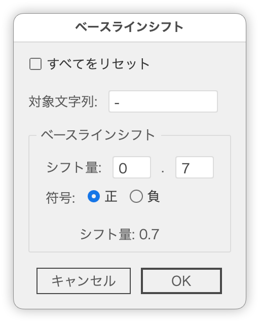

# Change Log

## 20250713

### 新しいスクリプトを追加

- [Photoshopの「新規ガイド」をIllustratorでも可能にする](readme-ja/NewGuideMaker.md)

### 調整

- [選択したオブジェクトに合わせてアートボードを調整に ↑↓キー、shift + ↑↓キーによる入力機能を追加](readme-ja//FitArtboardWithMargin.md)

## 20250712

### 新しいスクリプトを追加

- [選択したオブジェクトに対してガイドを自動作成](readme-ja/CreateGuidesFromSelection.md)
- [すべてのガイドを削除](https://github.com/swwwitch/illustrator-scripts/blob/master/jsx/guide/DeleteAllGuides.jsx)

## 20250710

### 新しいスクリプトを追加

- [画像を分割してアートボード化](readme-ja/Slice2Artboards.md)を追加

### 新しいスクリプトを追加

[マスクパスのサイズ変更](readme-ja/ResizeClipMask.md)を追加

### 調整

「対象：現在のアートボード、すべてのアートボード」を追加

- [選択オブジェクトに合わせてアートボードサイズを設定するときにマージンを付ける](readme-ja/FitArtboardWithMargin.md)を追加

 

## 20250709

### 新しいスクリプトを追加

- [選択オブジェクトに合わせてアートボードサイズを設定するときにマージンを付ける](readme-ja/FitArtboardWithMargin.md)を追加

### 調整

[グループをアートボードに変換するスクリプトを調整](https://github.com/swwwitch/illustrator-scripts/blob/master/jsx/artboard/Group2Artboards.jsx)

## 20250708

### 新しいスクリプトを追加

- [アートボード外のオブジェクトを削除](readme-ja/DeleteOutsideArtboard.md)

## 20250707

- [カンバス上の並びで［アートボード］パネルの並び順を変更](readme-ja/ReorderArtboardsByPosition.md)を追加

- [選択したグループ内のサブグループを解除して、グループ構造を簡素化](readme-ja/SimplifyGroups.md)

## 20250706

- [座標を基準に重ね順を変更](readme-ja/SortItemsByPosition.md)

## 20250706

- 日本語版のREADMEを整備（スクリプトごとにMDファイルを分割）
- ローカライズの甘いスクリプトを調整

## 20250704

指定文字のベースラインを自動的に天地中央にするスクリプトを追加

- [指定文字のベースラインを自動的に天地中央にする](readme.ja/AdjustBaselineVerticalCenter.md)

## 20250703

特定の文字のベースラインシフトを調整するスクリプトを追加

- [特定の文字のベースラインシフトを調整](readme.ja/SmartBaselineShifter.md)

レイヤー管理ツールを追加

- [オブジェクトを指定レイヤーへ移動](readme.ja/SuperLayerManage.md)

## 20250702

「グループ化」スクリプトにアートボード変換を追加

https://github.com/swwwitch/illustrator-scripts/blob/d07214f51eb2695fe0c9117f092b0c5bc46a48c2/jsx/SmartAutoGroup.jsx

## 20250629

「[ドキュメントフォントを適用](https://github.com/swwwitch/illustrator-scripts/blob/master/jsx/ApplyDocumentFonts.jsx)」スクリプトを追加

- [解説記事（note）](https://note.com/dtp_tranist/n/n01d6ef7e9b5f)

「ページ番号を挿入」スクリプトをアップデート

- v1.0.4 「001」のようなゼロ埋め対応
- v1.0.5 接尾辞フィールド追加し、ダイアログボックスのUIを変更

SmartBaselineShifter.jsxを追加

https://github.com/swwwitch/illustrator-scripts/blob/807a117b19ac3f623781bb9290b30e8e30cdb51b/jsx/SmartBaselineShifter.jsx

解説記事：

https://note.com/dtp_tranist/n/n2e19ad0bdb83

## 20250628

「ページ番号を挿入」を修正。

https://github.com/swwwitch/illustrator-scripts/blob/9606b06755b8ddb24f229bd09e5a5828c39b6c1d/jsx/AddPageNumberFromTextSelection.jsx

## 20250627

- [オブジェクトを入れ替え（ダイアログボックス版）](https://github.com/swwwitch/illustrator-scripts/blob/master/jsx/SwapNearestItemWithDialogbox.jsx)を追加
- 「ページ番号を挿入」スクリプト（初版）

## 20250625

- [「スウォッチの連続適用」スクリプト](https://github.com/swwwitch/illustrator-scripts/blob/master/jsx/ApplySwatchesToSelection.jsx)に、スウォッチを選択していないときには、全スウォッチを対象にする機能を追加

## 20250624

- [「スウォッチの連続適用」スクリプト](https://github.com/swwwitch/illustrator-scripts/blob/master/jsx/ApplySwatchesToSelection.jsx)を追加
- [「カラーのランダム適用」スクリプト](https://github.com/swwwitch/illustrator-scripts/blob/master/jsx/ShuffleObjectColors.jsx)を追加

