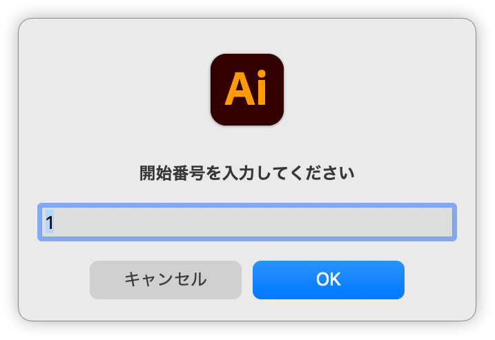

# Change Log

## 20250624

- [「スウォッチの連続適用」スクリプト](https://github.com/swwwitch/illustrator-scripts/blob/master/jsx/ApplySwatchesToSelection.jsx)を追加
- [「カラーのランダム適用」スクリプト](https://github.com/swwwitch/illustrator-scripts/blob/master/jsx/ShuffleObjectColors.jsx)を追加

## 20250625

- [「スウォッチの連続適用」スクリプト](https://github.com/swwwitch/illustrator-scripts/blob/master/jsx/ApplySwatchesToSelection.jsx)に、スウォッチを選択していないときには、全スウォッチを対象にする機能を追加

## 20250627

- [オブジェクトを入れ替え（ダイアログボックス版）](https://github.com/swwwitch/illustrator-scripts/blob/master/jsx/SwapNearestItemWithDialogbox.jsx)を追加

- 「ページ番号を挿入」スクリプト（初版）

### 20250628

「ページ番号を挿入」を修正。

https://github.com/swwwitch/illustrator-scripts/blob/9606b06755b8ddb24f229bd09e5a5828c39b6c1d/jsx/AddPageNumberFromTextSelection.jsx