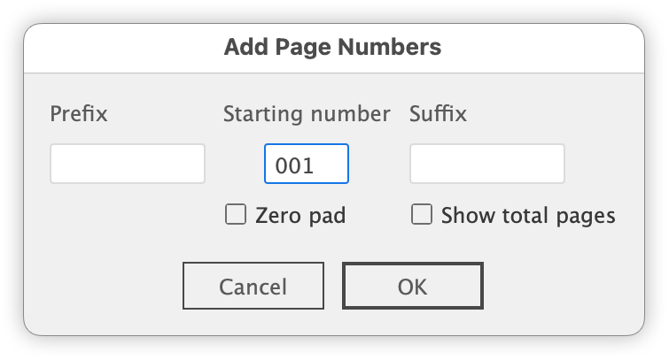
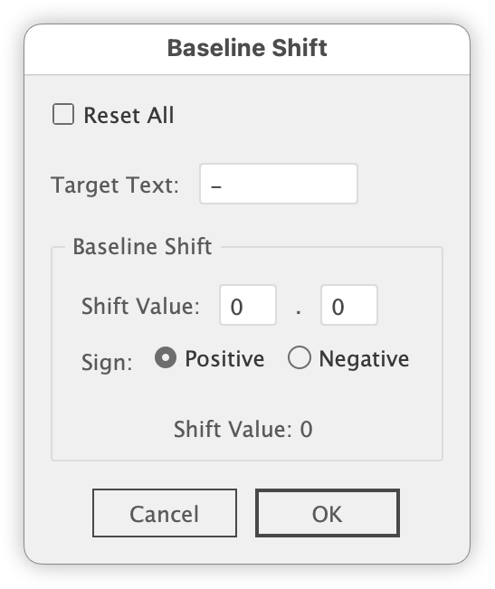

# Adobe Illustrator Scripts

## AddPageNumberFromTextSelection.jsx

### Overview:

Based on the text selected in the _pagenumber layer,
this script duplicates the text as sequential page numbers on all artboards.
The user is prompted to enter a starting number, and page numbers are assigned according to the number of artboards.

### Conditions:

- The selected text must be point text in the _pagenumber layer.
- Paragraph alignment will not be changed.

https://github.com/swwwitch/illustrator-scripts/blob/839e5bd54cbed5093bec13f92d3e8a0a46438689/jsx/AddPageNumberFromTextSelection.jsx

### Updated

- Preview
- Zero padding
- Prefix/Suffix
- 001

## ApplyDocumentFonts.jsx

This script collects fonts used in the document and displays them in a dialog sorted by usage count. You can apply a selected font to the currently selected text objects immediately.
You can also export the list of fonts as a text file on your desktop.

https://github.com/swwwitch/illustrator-scripts/blob/master/jsx/ApplyDocumentFonts.jsx

## SmartBaselineShifter.jsx

Targets the selected text. Supports multiple text frames.

### Target Text
Characters other than numbers and spaces from the selected text are automatically inserted here.

This field is editable.

For example, if you enter :-, both : and - will be targeted.

### Shift Value
Since it’s tedious to type values like -3.2 directly, the input is split into integer and decimal fields.

If you want to make it negative, simply select the negative radio button.

The final result is previewed in the “Shift Value” display.

### Reset
Resets the baseline shift not only for the target characters but also for all characters in the selected text.

https://github.com/swwwitch/illustrator-scripts/blob/a4e2d62479bb5599949ccbc404e8c87c60cfc985/jsx/SmartBaselineShifter.jsx