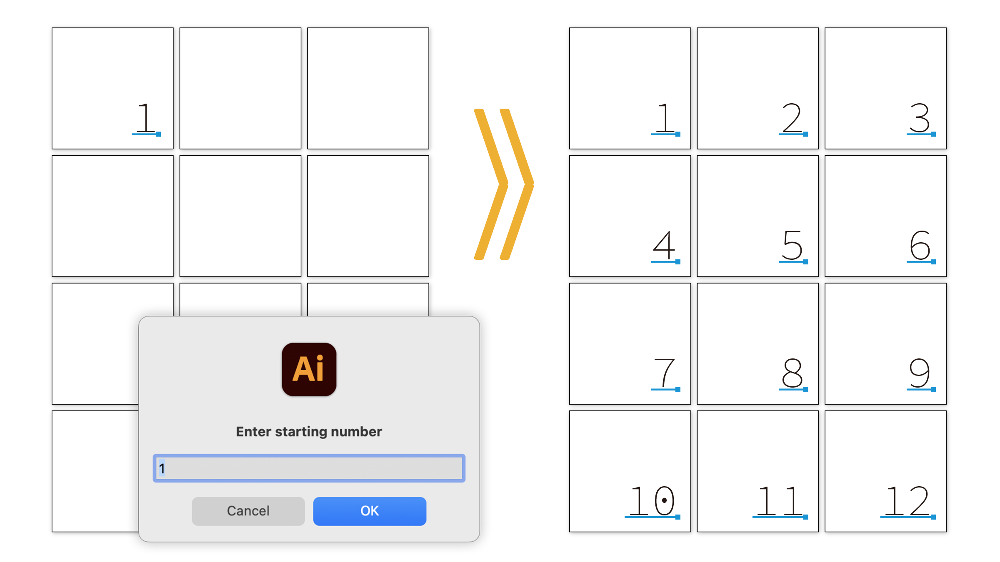

# Adobe Illustrator Scripts

## AddPageNumberFromTextSelection.jsx

### Overview:

Based on the text selected in the _pagenumber layer,
this script duplicates the text as sequential page numbers on all artboards.
The user is prompted to enter a starting number, and page numbers are assigned according to the number of artboards.

### Conditions:

- The selected text must be point text in the _pagenumber layer.
- Paragraph alignment will not be changed.

https://github.com/swwwitch/illustrator-scripts/blob/839e5bd54cbed5093bec13f92d3e8a0a46438689/jsx/AddPageNumberFromTextSelection.jsx

## ApplyDocumentFonts.jsx

This script collects fonts used in the document and displays them in a dialog sorted by usage count. You can apply a selected font to the currently selected text objects immediately.
You can also export the list of fonts as a text file on your desktop.

https://github.com/swwwitch/illustrator-scripts/blob/master/jsx/ApplyDocumentFonts.jsx