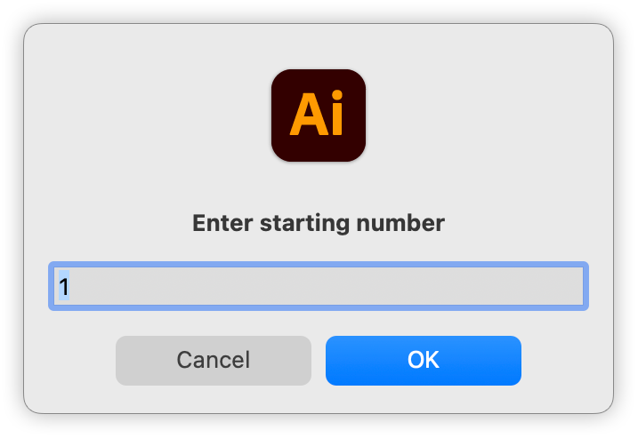
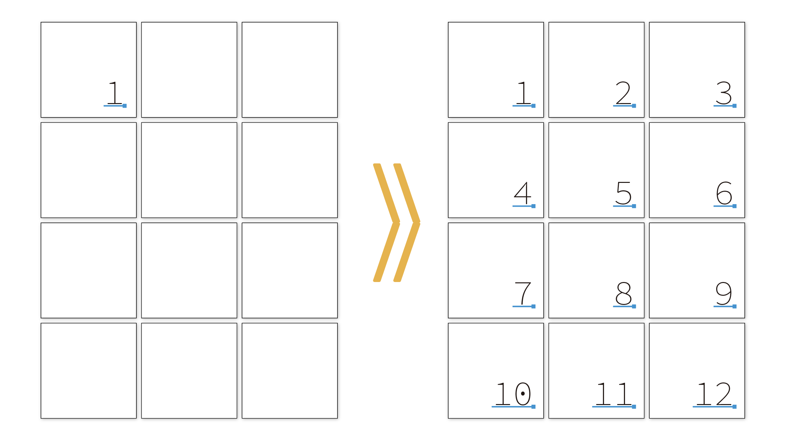

# Adobe Illustrator Scripts

## AddPageNumberFromTextSelection.jsx

Overview:
Based on the text selected in the _pagenumber layer,
this script duplicates the text as sequential page numbers on all artboards.
The user is prompted to enter a starting number, and page numbers are assigned according to the number of artboards.

Conditions:
- The selected text must be point text in the _pagenumber layer.
- Paragraph alignment will not be changed.

https://github.com/swwwitch/illustrator-scripts/blob/4ac57fc0fa1c2560a2d44bd39afb2ac0d80554ff/jsx/AddPageNumberFromTextSelection.jsx

