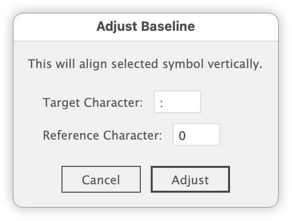

# AdjustBaselineVerticalCenter.jsx

---

### Overview

- A script to adjust the vertical position (baseline) of specified characters to align with a reference character.
- Can be applied to multiple text frames at once.

### Main Features

- Supports specifying multiple target characters
- Automatically adjusts baseline shift to match the center of the reference character
- Automatically detects the most frequent symbol as default target
- Japanese and English UI support

### Process Flow

1. Specify target and reference characters in the dialog
2. Duplicate outlines to calculate center Y positions
3. Automatically apply baseline shift based on the difference

### Original / Acknowledgements

Egor Chistyakov https://x.com/tchegr

### Update History

- v1.0.0 (20250704): Initial release
- v1.0.6 (20250705): Supported multiple target characters and batch adjustment