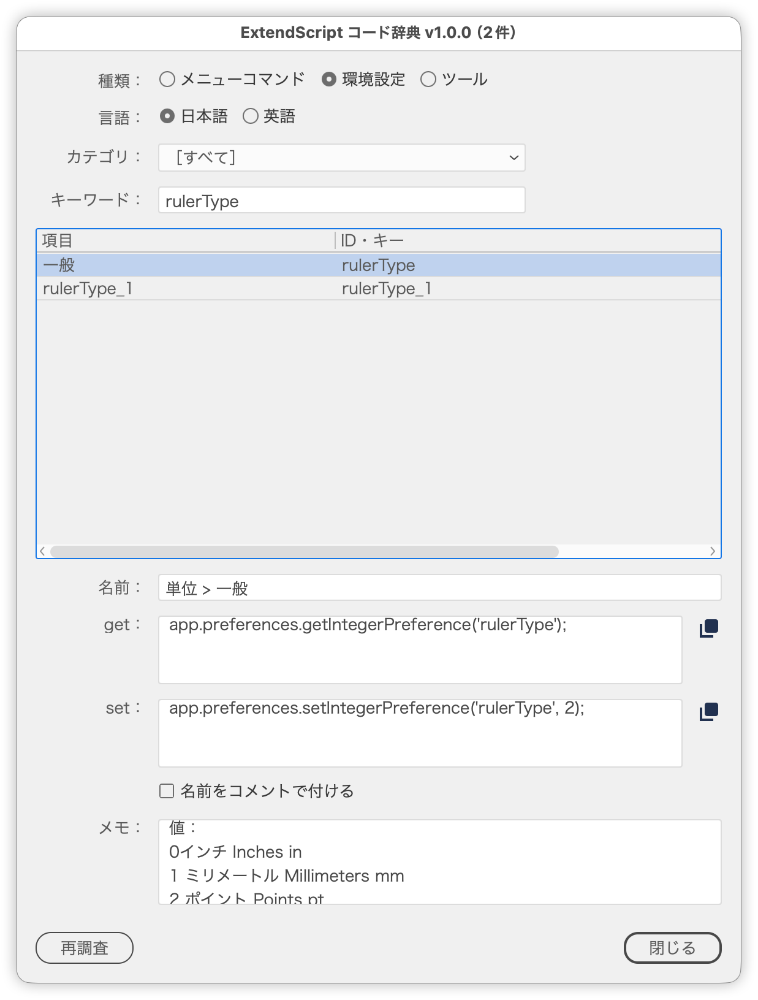
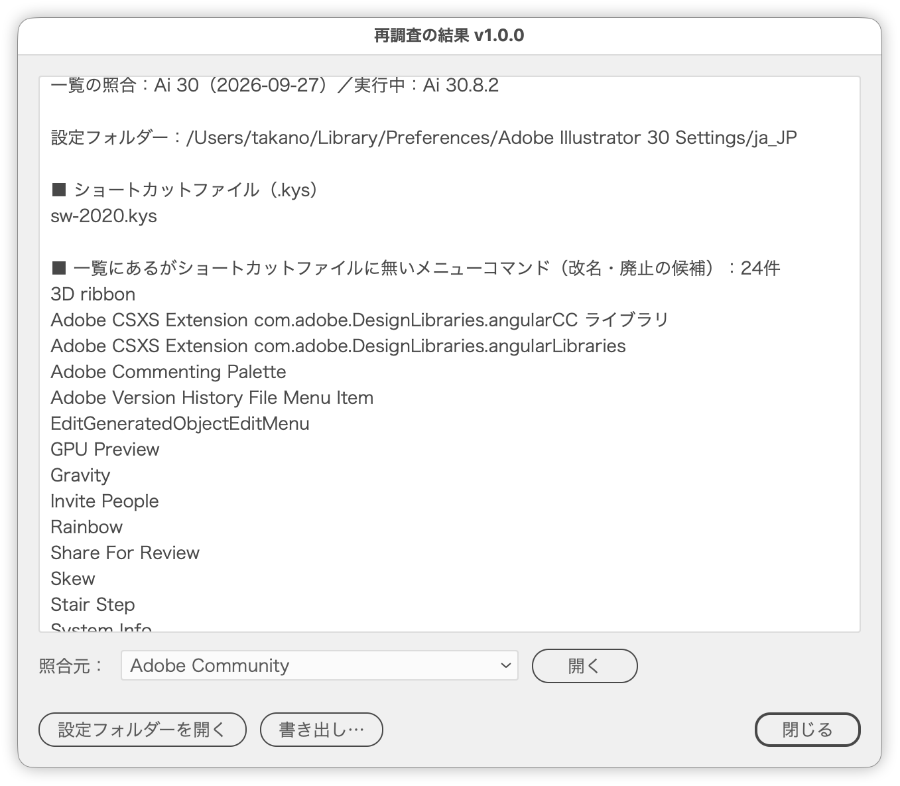

# Look up code for menu commands, tools and preferences

---

### Overview

Pick items from the list built into the script and get `app.executeMenuCommand()`, `app.selectTool()` or `app.preferences` get/set code. Use it as a reference for looking up IDs and keys from menu or setting names.

 Hide/Show Edges)" src="../png/ss-1184-1578-144-20260927-161848.png" width="45%" />

### Features

- Kind: switch between Menu commands, Preferences and Tools
  - Menu commands: `app.executeMenuCommand('…');`
  - Tools: `app.selectTool('…');`
  - Preferences: `app.preferences.get…Preference('…');` and `set…Preference('…', value);` in separate fields (Boolean / Integer / Real / String by type; the sample value comes from the actual preference file)
- Language: show menu and setting names in Japanese or English
- Category: filter by top-level menu (File, Edit, Object…) or preference section
- Keyword: filters names and IDs/keys as you type (case-insensitive, regular expressions allowed)
- With several items selected, the code is listed in list order
- Add names as comments: appends the name, such as `// File > New...`, to each line (off by default)
- Copy buttons: the button to the right of each code field copies that code to the clipboard (get and set can be copied separately for preferences)
- Memo: shows what a preference value means (such as the unit codes of `rulerType`) and caveats such as "takes effect after a restart"
- Recheck: finds items that need updating after an Illustrator upgrade (see below)

### How to use

1. Run the script (no document needs to be open)
2. Choose the kind and language, then filter by category or keyword
3. Select an item to see its name, code and memo
4. Copy the code with the copy button and paste it into your script

### Recheck

Recheck reads the settings folder of the running Illustrator (showing a progress bar while reading) and shows how it differs from the list.

- Compares with the keyboard shortcut files (.kys): lists menu commands and tools that may have been renamed or removed, and IDs missing from the list
- Compares with the preference files (Adobe Illustrator Cloud Prefs / Adobe Illustrator Prefs): lists keys missing from the list and type mismatches
- Opens the reference URLs in a browser (the Adobe Community thread, Ai Command Palette, sttk3's Notion database, Ten A's list)
- Opens the settings folder and saves the result as a text file (including the candidates as lines in the list format)

To update the source list, hand the saved text to Claude Code and ask it to check the candidates against the references, update the list and re-embed it.

When the Illustrator version the list was checked with differs from the running one, a notice appears at the top of the result.

### Notes

- The list is built into the script. Its source is a text file combining the menu command list and the preference key list; embed it again after updating
- Trailing spaces are part of some IDs (e.g. `'Live PSAdapter_plugin_Ct  '`). Do not remove them from the output code
- A shortcut file is created when you save a set in Keyboard Shortcuts. Without one, Recheck cannot compare menu commands and tools
- Absence from the shortcut or preference files does not prove removal: commands outside the shortcut list and settings never changed are not written to those files
- The copy button creates a temporary text object, copies it and deletes it right away, because Illustrator scripts cannot send text to the clipboard directly. With no document open, it creates a temporary document and closes it

### Article

https://note.com/dtp_tranist/n/n0cf4826bf4a7

### Changelog

- v1.0.0 (20260927) : Initial release
- v1.0.1 (20260927) : Removed unnamed history preference keys (such as rulerType_1) from the list
- v1.0.2 (20260928) : The dialog now reopens where it was last closed and moves sideways to avoid covering the selection; opacity unified at 97%
- v1.0.3 (20260928) : The button row is now built with the shared part
- v1.0.4 (20260929) : Dialog opacity changed to 98%
- v1.0.5 (20260930) : Fixed an error when running with characters selected by the Type tool
- v1.0.6 (2026-10-01) Unified the window and panel margins and spacing with the shared layout part
