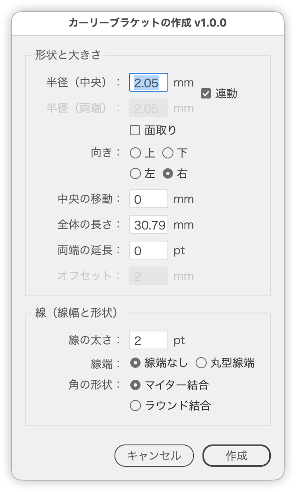

# Draw a curly bracket against a live preview

---

### Overview

Creates a curly bracket path. The on-artboard preview updates as the two radii, the center shift, the length and the stroke settings change, and Create commits exactly what is shown. Running it with a selection seeds the size and direction from that selection and hugs its edge.

### Features

- Four directions — up, down, left and right. Choosing where the middle point faces rotates the whole geometry
- Separate radii for the middle and the ends; Link makes the end radius follow the center one and dims its field
- Length is the overall length of the bracket: changing a radius keeps it, and resizes the straight sections instead
- Center Shift slides the middle point along the length while the overall length holds
- Chamfer replaces the arcs with straight runs, by applying a Zig Zag effect
- Extension that runs outward from both ends
- Stroke width, cap (none / round) and corner shape (miter / round join); switching the cap switches the corner to match
- Automatic placement against the selection, with an adjustable offset
- Brackets are marked, so selecting one and running again redraws it in place, facing the same way
- Arrow keys step the numeric fields (Shift for 10s, Option for 0.1), noted in every field's tooltip
- Dialog state is remembered for the rest of the Illustrator session and restored on the next run
- Japanese / English UI

### Usage

1. Select the object to work from (running with nothing selected is fine).
2. Run the script.
3. Adjust the values, check the preview on the artboard, and click Create.

After Create, only the new bracket is left selected, so running the script again redraws it in place.

### Selection and placement

What the selection is decides how it is treated.

| Selection | Treated as |
| --- | --- |
| A bracket this script made | A redraw. Rebuilt on the same center and facing the same way; the original is removed on Create (Offset is dimmed) |
| A single open path | A size reference. Hidden as the dialog opens, and removed on Create |
| Several objects, text, or a closed path | Something to bracket. Left untouched |
| Nothing | The bracket is centered on the artboard (Offset is dimmed) |

The initial direction comes from the selection too. Switching the direction in the dialog re-reads the length across it: the height for left/right, the width for up/down.

| Selection | When taller than wide | When wider than tall |
| --- | --- | --- |
| Size reference (a single open path) | Left | Up |
| Something to bracket | Right | Down |

The bracket is placed so that its arm ends touch the edge of the selection. Offset sets the gap from that edge.

### Options

**Shape & Size**

| Item | Description |
| --- | --- |
| Center Radius | Radius of the arcs that form the point in the middle (mm) |
| End Radius | Radius of the arcs that curl outward at both ends (mm). **0 leaves a right angle** with no arc. While Link is on it follows the center radius and cannot be edited |
| Chamfer | Applies a Zig Zag effect (size 0, ridges 0) so the arcs become straight chamfers |
| Direction | Where the middle point faces (up / down / left / right) |
| Center Shift | Moves the middle point along the length (mm, 0 keeps it centered). Up for a left/right bracket, right for an up/down one; negative reverses. The overall length is unchanged |
| Length | Overall length of the bracket (mm). The straight sections are derived as "length / 2 − end radius − center radius" |
| End Extension | Straight run added at both ends, away from the middle (pt). With a zero end radius it turns at a right angle |
| Offset | Gap between the selection and the bracket (mm) |

**Stroke (Width & Shape)**

| Item | Description |
| --- | --- |
| Stroke Width | Stroke width of the bracket (pt) |
| Cap | Butt Cap / Round Cap |
| Corner Shape | Miter join / Round join |

### Notes

- The initial radius is the overall length divided by 15. Once the dialog is open, the radii and the length are independent.
- When the overall length falls below twice the sum of both radii, the straight sections collapse to zero and the bracket is arcs only.
- Closing the dialog any other way (Cancel, ESC) removes the preview and restores the hidden reference path.
- The dialog state is stored whenever the dialog closes, Cancel included, and is gone once Illustrator quits. Running with a selection re-derives the length, direction and radii from that selection, so the selection wins over the stored state.
- Chamfer is applied as an effect, so the path itself keeps its curves until the appearance is expanded. It is not carried over when a bracket is selected and redrawn (the dialog's stored state restores it within the same session).
- The script does not run when the active layer is locked or hidden.

### Article

https://note.com/dtp_tranist/n/nd6b3e36ff79d

### Update History

- v1.0.0 (20260905) : Initial release
