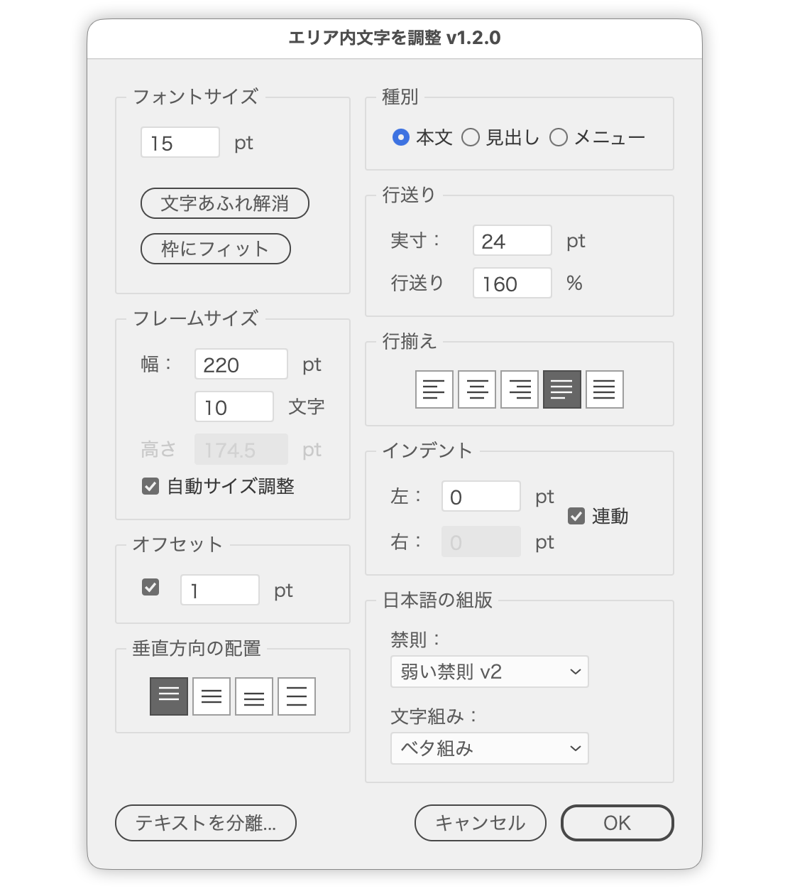

# AreaTypeToolkit.jsx

---

## Overview

Headings and button labels often start life as point text, and only later do you wish they were Area Type — so the copy wraps inside a box when it grows, or sits centred in it.

Doing that by hand means drawing a rectangle, converting it, pouring the text in, and setting the font again. And once you have Area Type, tuning it (frame size, leading, indents, vertical alignment) still means moving between panels.

This script puts **creation and adjustment into one flow**.

## Usage

1. Select point text, path text, a shape (closed path), or existing Area Type
2. Run the script
3. Pick a creation method in the convert dialog, then set the typesetting in the adjust dialog

**With only Area Type selected, the convert dialog is skipped and you start at the adjust dialog.**

With nothing selected the script warns and stops.

## Convert dialog

Four creation methods. Methods that don't apply to the current selection are dimmed automatically.

| Method | What it does |
| --- | --- |
| Simple | Uses a rectangle the size of the point text plus 1pt |
| Button style | Uses a rectangle 1.2x wide and 1.8x tall, with the text centred both ways |
| Pour into selected shape | Duplicates the selected shape as the frame and pours the selected text into it |
| Dummy text in selected shape | Turns the selected shape itself into Area Type and fills it with dummy text |

| Selection | Available methods |
| --- | --- |
| Point / path text only | Simple, Button style |
| Shapes only | Dummy text in selected shape |
| Text plus shapes | Pour into selected shape, Dummy text in selected shape |

Path text is split off into point text first. Per-character font, size, fill, stroke, and leading are snapshotted and restored, so the appearance survives the trip. The split happens **when you click [Convert]**, so closing with [Cancel] leaves the original path text untouched.

### Pairing text with shapes

"Pour into selected shape" accepts several text-and-shape pairs at once. Each text is matched to **the shape whose bounds contain the text's centre**, or failing that **the shape whose centre is nearest**. Matching uses `geometricBounds` (rectangular bounds).

Compound paths work as shapes too (the first path becomes the frame).

If nothing could be converted, the script says so and leaves the dialog open.

## Adjust dialog

Everything about the Area Type's typesetting, in one place. **Preview is always on** — every change shows up straight away.

The panels are laid out like this:

- Left: font size, frame size, offset, vertical alignment
- Right: role, leading, justification, indent, Japanese composition
- Bottom: [Separate text...], then [Cancel] and [OK]

[OK] commits, [Cancel] reverts and closes — except for vertical text alignment, auto-size, the role presets, Clear overset, Fit to frame and Separate text, which are committed the moment you click them (see below).

When you open the dialog on existing Area Type, **settings you don't touch are left alone**: vertical alignment, height, kinsoku and mojikumi stay as they are until you change them or pick a role. (Vertical alignment and auto-size cannot be read back from the DOM, so what the dialog shows for them may not match the frame.)

### Role

One click applies a whole preset for the text's purpose.

| Role | Leading | Justification | Kinsoku | Mojikumi | Vertical alignment | Tab stops |
| --- | --- | --- | --- | --- | --- | --- |
| Body | 160% | Justify (last line left) | Loose v2 | Solid | Top | Cleared |
| Heading | 120% | Left | Loose v2 | Tight | Top | Cleared |
| Menu | 150% | Right | Loose v2 | Tight | Top | Right-aligned tab with a "…" leader at 400pt |

"Menu" sets that tab on every paragraph. Changing the justification away from right drops the Menu role and clears the tab stops it set.

### Font size

| Control | What it does |
| --- | --- |
| Font size | Set directly |
| Clear overset | Shrinks the font until the overset clears (binary search, up to 40 passes) |
| Fit to frame | Grows until it oversets, then shrinks — filling the frame |

Clear overset and Fit to frame are **unavailable for text with line breaks** — holding the line count would drive the size absurdly small, so the script warns and stops. When the frame mixes font sizes, they are flattened to a single size.

Both commit as soon as you click, writing the resulting size back into the font-size field and the new frame size into the frame-size fields. If even the smallest size still oversets, the original size is restored rather than left microscopic.

They stay available while auto-size is on. Since the frame follows the text and never oversets, auto-size is **switched off for the pass and back on afterwards** — turning it back on redraws the frame around the new font size. Frames auto-sized outside the script cannot be detected, so there the growth pass bails out and restores the original size as soon as the frame height moves.

### Leading

Leading is set as an **auto-leading amount (%)**. Illustrator shows it as "Auto", so the ratio holds when the font size changes.

| Control | What it does |
| --- | --- |
| Actual | Font size x %, in points. Enter a value here to back-calculate the % |
| Leading | Auto-leading amount, in % |

For text with a fixed leading the fields open empty, and nothing is applied while they stay empty.

### Justification / Vertical alignment

Justification (left, center, right, justify with last line left, justify all lines) and vertical text alignment within the frame (top, center, bottom, justify).

Justification uses **icon buttons**, matching Illustrator's own Paragraph panel; the names show up as tooltips. It also responds to the **L / C / R / J / F** keys (disabled while an input field has focus).

Vertical text alignment cannot be set reliably through the DOM, so it is applied via a dynamic action (`adobe_frameAlignment`) loaded from a temp file at startup and discarded on exit — nothing is left in the Actions panel. The action sets are named `AreaTypeToolkit_Alignment` and `AreaTypeToolkit_AutoSize`, so they never collide with your own actions.

That action cannot run from the preview inside a modal dialog, so it is **committed the moment you click an icon** (the preview is reverted, the alignment applied, then the preview goes back on).

The current alignment cannot be read from the DOM either, so opening the dialog on existing Area Type always shows "Top". **The frame's alignment does not change until you click an icon.**

### Japanese composition

| Control | What it does |
| --- | --- |
| Kinsoku | None / Strict / Loose / Loose v2 |
| Mojikumi | Mojikumi spacing set (None / Line-end punct full-half / Half-width punctuation / ... / Tight / Solid) |

These are paragraph attributes, so they apply to every paragraph in the frame. With mixed settings the Mojikumi menu opens empty; leave it alone and nothing changes.

Opening the dialog on existing Area Type shows that frame's current settings — "None" when nothing is set — and nothing changes unless you touch them. Freshly converted frames get `DEFAULT_KINSOKU` (Loose v2) and `DEFAULT_MOJIKUMI_INDEX` (Solid) from the top of the script as their starting values.

### Frame size

Width and height in the ruler unit. The width can also be driven by a character count (Japanese UI only — Roman glyph widths vary too much for the arithmetic to hold).

The character count is the width minus the offset and both indents, divided by the font size.

[Auto-size], under the height, makes the frame's height follow the amount of text. It is toggled through a dynamic action (`adobe_SLOAreaTextDialog`), which cannot run from the preview, so it is **committed the moment you tick it** (the preview is reverted, the setting applied, then the preview goes back on).

While it is on, the **height field is dimmed** — the frame follows the text, so it cannot be set from here. The height is left untouched in that state, so the preview never drags the frame back.

The current auto-size state cannot be read from the DOM, so the checkbox always opens unticked. On existing Area Type the height is **not written back to the frame until you edit the height field**, so it never fights a frame that is already auto-sized.

### Indent / Offset

- Indents: left and right ("Link" is on by default — the right follows the left and its field is dimmed; text whose two indents differ opens with the link off)
- Offset: the distance between the frame and the text (tick the box to enter a value)

## Separate text dialog

Opened with the [Separate text...] button at the bottom left of the adjust dialog. It breaks Area Type apart into **a rectangle plus point text**.

| Option | What it does |
| --- | --- |
| Frame: 1pt black | Gives the rectangle a 1pt black stroke (default) |
| Frame: unpainted | Leaves the rectangle unpainted |
| Delete frame | Deletes the rectangle |

[OK] separates, then closes the adjust dialog too, since there is no Area Type left to adjust. [Cancel] does nothing and returns to the adjust dialog.

Clicking [Separate text...] first commits what is set in the adjust dialog (frame size and the rest), so the rectangle is built from that size plus the offset — you can settle the width, then separate.

The resulting point text keeps the justification, indents, leading, kinsoku, mojikumi and tab stops set in the adjust dialog, and **per-character font, size, fill, stroke, baseline shift and scaling are preserved**. Once separated, the new rectangle and point text are left selected.

## Input fields

Every numeric field responds to the arrow keys.

| Key | Step |
| --- | --- |
| Up / Down | ±1 |
| Shift + Up / Down | ±10 (snaps to multiples of 10) |
| Option (Alt) + Up / Down | ±0.1 |

## Targets

TextFrame (point / path / area text), PathItem and CompoundPathItem (closed paths)

## Notes

- Width and height reject zero, negative, NaN, and extreme values, falling back to the last valid entry (the cap is the equivalent of 100000pt).
- Preview is undone with `app.undo()`. Mixing it with other operations may leave things out of step.
- Ruler units supported: mm, cm, inch, pt, pica, px, Q.
- The mojikumi set meaning "none" is named differently per UI language, so `なし` is tried first, then `None`.

## Change log

- v1.2.2 (2026-08-03) Fixed path text being replaced even when the convert dialog was cancelled — the split now happens once [Convert] is clicked. Fixed opening existing Area Type and clicking OK resetting the vertical alignment to Top and overwriting kinsoku / mojikumi with the defaults. Renamed the dynamic action sets to `AreaTypeToolkit_AutoSize` and `AreaTypeToolkit_Alignment` so a user's own same-named action sets are no longer unloaded. Fixed "Pour into selected shape" ignoring compound paths. Fixed clearing the mojikumi on a non-Japanese UI
- v1.2.0 (2026-07-28) Moved "Separate text" into its own dialog, reached from a [Separate text...] button in the adjust dialog; separating now preserves per-character formatting and selects the resulting rectangle and point text. Dropped the preview checkbox — the preview is now always on. Added the Role (Body / Heading / Menu), Leading, and Japanese-composition (kinsoku / mojikumi) panels. Justification and text alignment are now icon buttons. Folded the leader-tabs checkbox into the Menu role. Auto-size is now a checkbox that applies on click; while it is on the height field is dimmed and the height is no longer overwritten, and the font-fit passes switch it off for the pass. Renamed "Inset spacing" to "Offset". Clear overset and Fit to frame now stop on text with line breaks and write the resulting size back to the font-size and frame-size fields. Aligned the UI wording with Illustrator's own terms and added tooltips. Fixed reading justification and indents from existing Area Type. "Pour into selected shape" now handles multiple pairs. Added Q (ha) ruler unit. Added a warning when nothing can be converted
- v1.1.3 (2026-03-04) Added input validation for width and height
- v1.0.0 (2026-03-03) Initial release

### note

- [An Illustrator script for working comfortably with Area Type (Japanese)](https://note.com/dtp_tranist/n/nfd6cc5e13654)
