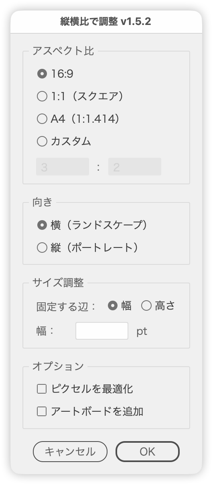

# Adjust by Aspect Ratio

---

### Readme (GitHub)：

https://github.com/swwwitch/illustrator-scripts/blob/master/jsx/shape/AspectRatioScaler.jsx

### Description：

- Transforms selected objects based on aspect ratio
- Supports a preview-enabled dialog box UI

### Main Features：

- Choose from 16:9, 1:1, A4, or custom ratio
- Choose which side to keep (width or height)
- "Make Pixel Perfect" option
- "Add Artboard" option
- Real-time preview and value adjustment via arrow keys

### Workflow：

- Display dialog to select ratio, side to keep, orientation, and options
- Simulate resizing in real time as preview
- Apply final settings by pressing OK

### Update History：

- v1.0 (20250720): Initial release
- v1.1 (20250721): Added artboard conversion & custom ratio
- v1.2 (20250722): Improved dialog structure, localization, and key input
- v1.5.2 (20260923): Fixed decimals being dropped while typing in numeric fields; added shift/option stepping; revised UI wording