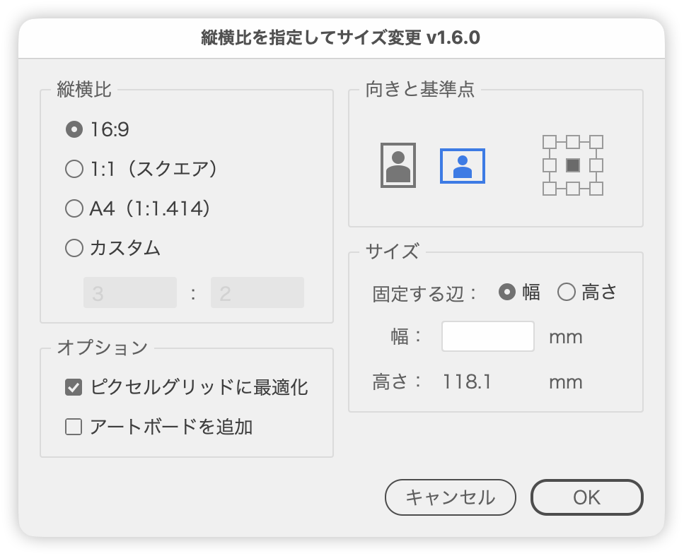

# Resize to Aspect Ratio

---

### Overview

Resizes the selected objects to a chosen aspect ratio (16:9, 1:1, A4 or custom). You can also set the length of the fixed side and the reference point. With nothing selected, it draws a rectangle of that ratio at the center of the artboard.

### Key Features

- Aspect ratio: 16:9, 1:1 (Square), A4 (1:1.414), or Custom (enter width:height)
- Orientation: choose Portrait or Landscape with icons
- Reference point: pick the point that stays put with the 9-axis widget (center by default)
- Size: choose Fixed (width or height) and enter its length; the other side shows the length from the ratio
- Live preview on the artboard as you change settings
- Numeric fields step to the next whole number (1.5 → 2) with the ∧∨ buttons and arrow keys, to the next multiple of 10 with Shift, and by ±0.1 with Option

### Usage

1. Select objects and run the script (it also runs with nothing selected)
2. Choose the aspect ratio and orientation
3. Optionally set the reference point, the fixed side and its length
4. Click OK to apply, or Cancel to restore

### Options

- **Make Pixel Perfect**: runs Make Pixel Perfect after applying (on by default)
- **Add Artboard**: adds an artboard matching the result; the objects stay in place

### Notes

- When the fixed-side field is blank, each object's current length is used
- With several objects selected, the other side's length is not shown (it differs per object)
- With nothing selected and a blank fixed-side field, the rectangle’s fixed side is 200 pt

### Article (Japanese)

https://note.com/dtp_tranist/n/n4a212e6eacf1

### Update History

- v1.0 (20250720): Initial release
- v1.1 (20250721): Added artboard conversion & custom ratio
- v1.2 (20250722): Improved dialog structure, localization, and key input
- v1.5.2 (20260923): Fixed decimals being dropped while typing in numeric fields; added shift/option stepping; revised UI wording
- v1.6.0 (20260927): Two-column dialog layout; "Make Pixel Perfect" now on by default; width and height fields shown together (only the fixed side is editable); added a reference point (9-axis) picker; orientation is now chosen with icons; shows an alert when no document is open; the width is now rounded to the ruler unit when the height is fixed; revised the dialog title, panel names and tooltips
- v1.7.0 (20260927): Added stepper buttons to the number fields. The arrow keys now share the steppers' logic (to the next whole number; Shift to the next multiple of ten)
