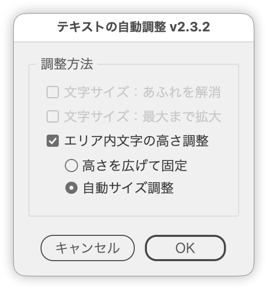

# AutoFitTextFrame

---

### Description

- Script that resolves overset text in selected area type / path text by adjusting the font size or the height of the area type.
- Besides simply removing the overset, it can also maximize the font size up to the largest size that still fits.
- When the selection contains area type, "Adjust Area Text Height" with "Auto size" is the default, so the frame height follows the text without touching the font size.
- In documents using variables / data sets, the original values are recorded in a tag and reset before each data set is processed.

### Main Features

- **Shrink Text to Fit** (on by default): shrink the font size in 0.1 pt steps until the overset is gone
- **Maximize Text Size** (on by default): grow the font size (doubling) until it oversets, then shrink to fit — so the text fills the frame even when there was slack
- With both on, "Maximize" runs first, then "Shrink"
- **Adjust Area Text Height** (on by default when the selection contains area type): turning it on disables the font-size options and enables:
  - **Expand and fix**: toggle Auto Size on then off, expanding the frame just enough and fixing that height
  - **Auto size** (selected by default): apply Auto Size to the area type (expand only; never turned back off)
- When manual leading is set, the leading follows the font size at the same ratio
- Area type uses Illustrator's built-in `overflows` check when available; path text uses the character count on visible lines
- Text inside selected groups and text ranges (cursor selections) are also processed
- Tooltips on every option; automatic Japanese / English UI
- The default states (height mode, the option selected first, the font-size options) and the shrink step can be changed in the "User settings" block at the top of the script

### How to Use

1. Select area type or path type (a group, or a cursor selection inside the text, also works).
2. Run the script.
3. Choose what to run under "Adjustment Method" and click OK.

### Workflow

1. Alert and exit when nothing is selected; otherwise collect area type / path text recursively from the selection (de-duplicated)
2. On the first data set, record the original font size / height in a tag, and reset from it before each run
3. Apply the chosen adjustment (Maximize / Shrink / Expand and fix / Auto size) to the targets
4. Remove the tags after the last data set is processed

### Not Supported

- No open document, or nothing selected
- Point text (only area type and path text are targets)
- Locked, hidden, or non-editable text
- Text containing line breaks (the font-size processing alerts and aborts)
- Height adjustment and Auto Size do nothing when the selection contains no area type

### Article

https://note.com/dtp_tranist/n/n8c2e2568a6b7 (Japanese)

### Update History

- v2.3.2 (2026-09-17) Adjust Area Text Height with Auto size is now the default when the selection contains area type. Added tooltips to every option, moved the height options inside the panel (now "Adjustment Method"), revised the UI wording, and applied the house rules (user-settings / layout blocks, nested LABELS, JSDoc, shared helpers and dead-code removal)
- v2.3.1 (2026-03-04) Public release
