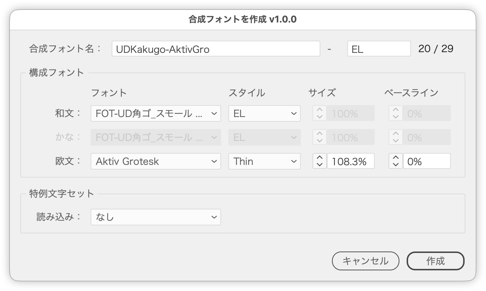

# Create a composite font from Japanese, Kana and Roman fonts

---

### Overview

Creates an Illustrator composite font from just three fonts: Japanese, Kana and Roman. Illustrator has no scripting command for composite fonts, so the script writes a file in the same format the Composite Fonts dialog saves, straight into the composite font folder. Restart Illustrator to use the new composite font.

With Also create in InDesign on, the same composite font is created in the running InDesign as well (no restart needed there).

### Main Features

- Only three fonts to choose
  - **Japanese**: Kanji, full-width punctuation, full-width symbols
  - **Kana**: hiragana, katakana
  - **Roman**: half-width alphabetic characters and numerals
- Set the size and baseline of Kana and Roman relative to the Japanese font (Kanji)
- Picks up fonts from the selected text as the initial values
- When Kana or Roman in the selected text differs in size from the Japanese text, uses the ratio as the initial size (e.g. 10 pt Japanese and 10.8 pt Roman → 108%)
- When the baseline shift differs from the Japanese text, uses the difference relative to the Japanese size as the initial baseline (e.g. 10 pt Japanese, Roman raised 1 pt → 10%)
- Even a single line mixing Japanese, Kana and Roman is read by character type: font (weight), size and baseline shift. When Kana or Roman has several settings, the one used by the most characters wins
- The composite font name has two fields joined with a hyphen: [JapanesePS-KanaPS-RomanPS]-[weight]
  - The name part fills in from the chosen fonts' PostScript names with the weight removed (-Bold, -W3, ...; e.g. PA1MinchoStdN-Bold → PA1MinchoStdN); Kana is omitted when same as Japanese
  - The weight fills in from the Japanese style name (spaces and non-ASCII removed; left empty, no weight is added)
- Custom sets: load the custom sets from an existing composite font (such as sw-B) and set the font, size and baseline of each
- Also create in InDesign: creates a composite font with the same name, fonts, size, baseline and custom sets in the running InDesign
- Numeric fields step to the next integer with the ∧∨ buttons and the arrow keys (1.5 → 2); add Shift for the next multiple of 10, Option for ±0.1

### How to Use

1. Select the text to use as the font sample and run the script (it also runs with nothing selected)
2. Check the Japanese, Kana and Roman fonts (family and style)
3. Adjust the size and baseline of Kana and Roman if needed
4. To use custom sets, choose the source composite font under Load from in the Custom Character Sets panel, then adjust each set
5. To create it in InDesign as well, launch InDesign and turn on Also create in InDesign
6. Check the composite font name (name part and weight) and click Create
7. Restart Illustrator; the composite font appears in the font menu (InDesign can use it without restarting)

### Reading the Selected Text

The font, size and baseline shift are read from the selected text as initial values.

#### Two or more lines

The texts are ordered top to bottom, and each one's first character is read.

| Texts from the top | Assigned to |
|---|---|
| 2 | Japanese, Roman (Kana uses the Japanese font at 100% / 0%, and its row is dimmed) |
| 3 | Japanese, Kana, Roman |

- With several text objects selected, they are ordered by their top edge (left to right at the same height)
- With one text object, or characters selected, paragraphs are used in order

#### A single line (one paragraph)

Each character type is read separately.

| Type | Characters | Read from |
|---|---|---|
| Japanese | Kanji (full-width punctuation or symbols if no Kanji) | The first character |
| Kana | Hiragana, katakana | The setting used by the most characters |
| Roman | Half-width letters, digits and symbols | The setting used by the most characters |

- A "setting" is the combination of font, size and baseline shift; on a tie, the earlier one wins
- Kana is picked up only when it differs from Japanese in font (or size / baseline shift). Without Kana, or when it matches Japanese, Kana follows the Japanese font and its row is dimmed

#### Both cases

- Anything not picked up falls back to Kozuka Gothic Pr6N R (Japanese) and Myriad Pro Regular (Roman)

### Custom Character Sets

Choose a composite font that has custom sets under Load from in the Custom Character Sets panel, and its sets (parentheses, small kana, prolonged sound mark, and so on) appear one per row.

- Only composite fonts in the composite font folder that have custom sets are listed
- Each set's initial font follows its characters: Roman when every character is half-width alphabetic or numeric, Kana when all are kana, otherwise Japanese. Size and baseline start from that group's values too
- Hover over a set name to see its characters
- Changing the source reopens the dialog, keeping your entries
- The Chars… button on each row shows and edits the set's characters, one per character; duplicates, spaces and line breaks are ignored
- Custom sets cannot be created in the dialog; use a composite font whose sets were made in Illustrator's Custom Character Sets as the source

### Notes

- Composite font names (including the hyphen and weight) are limited to 29 ASCII letters, digits and symbols (no "/" or ":"). A composite font with a 43-character name kept Illustrator from launching; names up to 29 characters are confirmed to work
- The automatic name part is cut so that it fits in 29 characters together with the weight
- If a composite font with the same name exists, the script asks before overwriting it
- The Japanese font stays at 100% size and 0% baseline; vertical and horizontal scale are always 100%
- Variable fonts are not listed. A composite font containing a variable font crashed Illustrator when applied. Fonts whose PostScript or family name contains "VF" or "Var" are not listed; variable fonts that the name does not reveal (such as Bodoni Moda) are caught on Create, with a warning. Variable fonts in the selected text are not used as initial values either
- Files are saved to `~/Library/Application Support/Adobe/Adobe Illustrator <version>/ja_JP/合成フォント/`; if that folder is not found, you choose one
- If Illustrator ever fails to launch, move the composite font file you created out of that folder

### InDesign Composite Fonts

- InDesign manages its composite fonts itself. `~/Library/Preferences/Adobe InDesign/<version>/<locale>/CompositeFont/` is only where it exports them: files placed there are not imported and are deleted on launch. The script therefore writes no file and creates the font through InDesign scripting (`app.compositeFonts.add()`) via BridgeTalk
- Nothing is created in InDesign when it is not running (the Illustrator font is still created). Launch InDesign first
- The font goes into the application defaults (available to new documents) of the newest installed InDesign
- If InDesign already has a composite font with the same name, the script asks before overwriting it; overwriting rewrites the six standard sets and recreates the custom sets
- If InDesign lacks a font, nothing is created there and the missing PostScript names are reported

### Article (Japanese)

https://note.com/dtp_tranist/n/ne0f78458ddd3

### Update History

- v1.0.0 (20260927): Initial release
- v1.0.1 (20260927):
  - Reads a single line by character type (Japanese, Kana, Roman)
  - When Kana or Roman has several settings, uses the one with the most characters
  - Kana is picked up only when its setting differs from Japanese
  - Baseline shift is used as an initial value too
- v1.1.0 (20260928):
  - Added Also create in InDesign, which creates the same composite font in the running InDesign
- v1.2.0 (20260928):
  - Code cleanup (dialog and initial values split into functions, shared range parsing, fewer try blocks); no change in behavior
- v1.2.1 (20260928):
  - The dialog now reopens where it was last closed and moves sideways to avoid covering the selection; opacity unified at 97%
