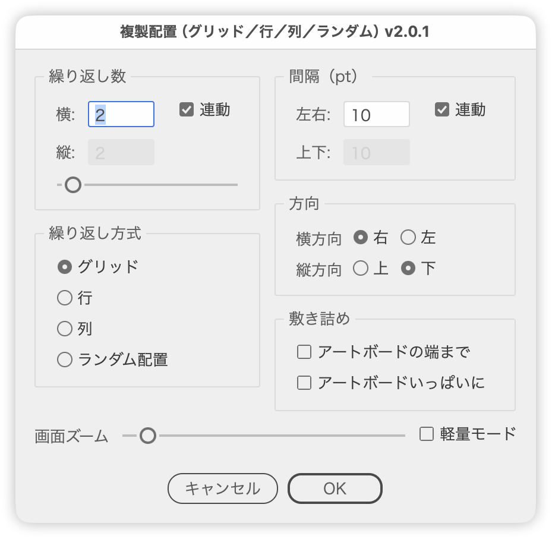

# DuplicateInGridPlus.jsx

---

## Overview

Duplicates the selected object with a given count and spacing. Besides a grid (rows × columns), it can lay the copies out as a single row, a single column, or scatter them randomly — four repeat methods in all.

The dialog is laid out in two columns: Count and Repeat Method on the left, Gap, Direction, and Fill on the right. Every change refreshes a live preview, so the result can be checked before committing. The preview is drawn on a dedicated "_preview" layer and cleaned up on both OK and Cancel.

Spacing is entered in the current ruler unit (the unit set in Preferences) and converted to points internally. The unit in the Gap panel title shows which one is active.

## Main features

- **Repeat method** (pick one)
  - Grid: rows × columns (counts are normally linked)
  - Row: a single row of the horizontal count (vertical is always 1; vertical direction and vertical gap are disabled)
  - Column: a single column of the vertical count (horizontal is always 1; horizontal direction and horizontal gap are disabled)
  - Random: scattered around the center of the original object
- **Count**: horizontal and vertical entered separately. With Link on, vertical follows horizontal. A slider (1–20) drives the same value, and preview updates are throttled while dragging to reduce flicker
- **Gap**: horizontal and vertical in the current ruler unit. With Link on, vertical follows horizontal
- **Direction**: right / left and up / down (disabled depending on the repeat method)
- **Fill**
  - Fill to Artboard Edge: counts the rows and columns that fit from the selected object to the artboard edge
  - Fill Full Artboard: counts the largest grid that fits the artboard and, on OK, moves the whole set (original plus copies) to the artboard center
- **Zoom**: change Illustrator's zoom level without closing the dialog. With Light mode on, the zoom is applied only when the slider is released, not while dragging
- Numeric fields respond to the up/down arrow keys (shift for steps of 10, option/alt for steps of 0.1)
- Uses the clipping mask's bounds when the object is clipped, otherwise the visible bounds
- Multiple selected objects are grouped automatically before processing
- Japanese / English UI

## How to use

1. Select the object you want to duplicate.
2. Run `DuplicateInGridPlus.jsx`.
3. Choose a repeat method, then enter the count and the gap.
4. Set the direction and the Fill options as needed.
5. Check the preview and click OK.

## Repeat methods

| Method | Count | Gap | Direction |
| --- | --- | --- | --- |
| Grid | Horizontal × vertical (linkable) | Horizontal & vertical (linkable) | Right / left, up / down |
| Row | Horizontal only (vertical is 1) | Horizontal only | Right / left |
| Column | Vertical only (horizontal is 1) | Vertical only | Up / down |
| Random | Horizontal only (vertical is 1) | Horizontal & vertical (always linked) | Disabled |

In Random mode the gap value becomes the scatter range. Setting a gap to 0 turns randomness off for that axis, so the copies can be scattered on one axis only. The generated layout is cached, so pressing OK keeps exactly what the preview showed.

## Fill

| Option | Behavior |
| --- | --- |
| Fill to Artboard Edge | Counts the rows and columns that fit from the selected object's current position to the artboard edge in the chosen direction. The direction stays editable |
| Fill Full Artboard | Ignores the direction and counts the largest grid that fits the artboard. The direction radios are dimmed, and on OK the whole set is moved to the artboard center |

The two options are mutually exclusive — turning one on turns the other off. While Fill to Artboard Edge is on, choosing Left or Up as the direction turns it off automatically.

## Keyboard shortcuts

| Key | Action |
| --- | --- |
| G | Repeat method: Grid |
| R | Repeat method: Row |
| C | Repeat method: Column |
| A | Repeat method: Random |
| shift + R | Direction: Right |
| L | Direction: Left |
| T | Direction: Up |
| B | Direction: Down |

## Notes

- The preview is drawn on the "_preview" layer. If the layer does not exist it is created and brought to the front.
- Cleanup only removes the temporary items the script created (identified by a tag stored in `note`). Anything else sitting on the same layer is left alone.
- Running the script with several objects selected groups them into one group when OK is pressed, then duplicates that group. The grouping is not undone, so undo afterwards if the original structure matters. Cancelling skips the grouping entirely and leaves the document untouched.
- The gap is entered in the current ruler unit. After switching units, reopen the dialog to see the new unit.
- The count slider runs from 1 to 20. Typing into the fields accepts larger values.
- While a Fill option is on the counts are calculated automatically, so the slider is disabled — otherwise a computed count above 20 would be clamped away by the slider.
- A zoom level changed with the Zoom slider is restored on Cancel or when the dialog is closed. Confirming with OK keeps the new zoom level.
- A large number of copies takes time to process. Turn Light mode on if the preview feels sluggish.

## Article

[Duplicating objects in a grid with an Illustrator script (Japanese)](https://note.com/dtp_tranist/n/n228720785a71)

## Changelog

- v2.0.2 (2026-08-15): Multi-selection grouping now happens after OK, so cancelling leaves the document untouched. The count slider is disabled while a Fill option is on. Fixed: returning to Grid from Row/Column/Random left Link off and the slider dead; toggling the gap Link did not recalculate the fill counts; the slider truncated its value and landed one below the drag position; preview cleanup could abort partway and leave duplicates behind; grouping stopped at the first item that refused to move; and the per-method direction states were overwritten by the Fill checkboxes. Preview updates no longer repaint twice, which reduces flicker. Switching from Column to Random now carries the count over
- v2.0.1 (2026-02-26): Repeat methods (grid / row / column / random), fill options (to artboard edge / full artboard), the count slider, and the zoom control
- (2025-10-23): Initial release
