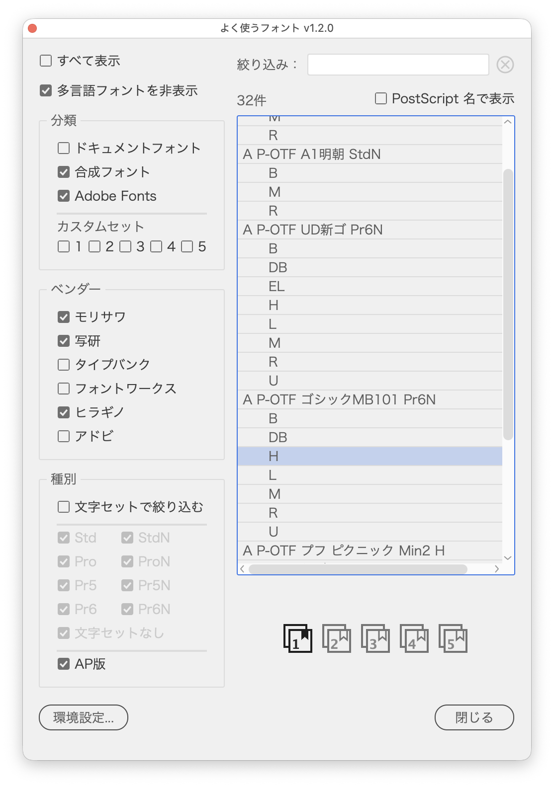

# Pick from your favorite fonts and apply one

---

### Overview

- An Illustrator script that lists the fonts you use often, narrowed by category and character set, and applies the one you pick to the selected text
- Of the same typeface in several character sets (Pr6N, Pr5, etc.), only the highest-priority checked character set stays in the list
- Chinese, Korean, Thai and other non-Japanese fonts are left out of the list by default
- The font you click in the list is applied to the selected text right away
- A persistent palette: keep it open, select other text and apply again
- Adapted from "よく使うフォントパネル" (Favorite Font Panel, favoriteFont_AI.jsx v1.1.2, MIT License) by KOUJI & 相棒（Gem）. Main changes:
  - The single-column dialog is now two columns: filters on the left, the list on the right
  - The tree view is now a list with weights under family headers
  - Styles within a family are ordered by weight (thin to bold) instead of install order
  - The character set dropdown, once usable only under Show all, is now the Character set checkboxes (they work without Show all too)
  - Hiragino, Adobe, Adobe Fonts and Composite fonts categories added; Morisawa detection now matches by prefix
  - Hide multilingual fonts added (the languages to leave out — Chinese, Korean, Thai, Other — are chosen in Preferences)
  - Fonts whose PostScript names contain non-ASCII characters, and composite fonts, are now listed (they were left out)
  - Document font names now match whole words instead of prefixes ("Pr5" does not match "Pr5N")
  - Custom became five Custom sets, filled with the buttons below the list
  - Preferences… added, gathering Rescan, the languages to leave out, and Custom set export and import
  - Filter field, font count and Show PostScript names added
  - Preview on the selected text, plus an Apply button (double-click or Enter in the list also applies)
  - The dialog became a persistent palette (keep it open, change the selection and apply again)
  - The current font of the selected text is preselected on open
  - Checkboxes and the filter text are restored next time
  - A progress bar shows while font information is read; the cache is checked and reread automatically when fonts change
  - The "extract from the current document" button removed (reading _ProjectFonts.txt stays)
  - English UI

### Main Features

**List**

- Two columns: filter checkboxes on the left, the font list on the right
- Each family is a header with its weights indented below (single-style families and composite fonts take one row)
- Within a family, styles run by weight (thin to bold), read from numbers such as W3 and W6 or words such as Light and Bold; Condensed, Display, Italic and the like come after (same scoring as TypefaceSampler)
- Show PostScript names: one row per font by PostScript name (such as RyuminPr6N-Light)
- On opening, the font of the selected text is chosen in the list

**Filtering**

- Category and Vendor: everything checked in the two panels is combined
- Custom sets 1–5 (at the bottom of Category): fonts added with the numbered buttons below the list; the checked sets are combined, shown without thinning out character sets or exclusions (Hide multilingual fonts included)
- Category
  - Document fonts: fonts listed in `_ProjectFonts.txt` next to the document (the file made by the InDesign version), shown without thinning out character sets or exclusions (Hide multilingual fonts included)
  - Composite fonts: those made with Type > Composite Fonts, not filtered or thinned out by character set
  - Adobe Fonts: fonts activated through Creative Cloud, judged by the family names in the Creative Cloud sync state (`entitlements.xml`)
- Vendor
  - Morisawa / Shaken (A P-SK) / TypeBank (TB) / Fontworks (FOT-) / Hiragino: matched by the start of the family or PostScript name
  - Adobe: Adobe's own Japanese typefaces (Kozuka, Source Han, Ryo, Ten Mincho, Momochidori and Kazuraki)
- Show all: ignores Category, Vendor, character set thinning and `EXCLUDE_FONTS`, and lists every font (Type and Hide multilingual fonts still apply, composite fonts included)
- Character sets under Type: plain character sets (Std, Pro, Pr5, Pr6) on the left, N variants on the right. Shows only the checked character sets (and No character set); for each typeface the highest-priority checked character set is kept (uncheck Pr6N and Pr6 or Pr5 stays)
- Filter by character set: when off, the Character set checkboxes are ignored (each typeface keeps its highest-priority character set of all). On by default
- AP versions under Type: when on, lists only fonts starting with A P-OTF (Shaken A P-SK is not counted), apart from the character set settings and also under Show all and for listed Custom set and Document fonts. When off, AP versions are thinned out for typefaces that have a regular version (A-OTF, etc.). Off by default
- Option (Alt)-click a Category, Vendor, Type or Preferences language checkbox to switch, panel by panel, between "only this one" and "all on"
- Filter: substring match on the family, style or PostScript name; the circled × button on the right clears it
- Hide multilingual fonts: leaves fonts in the languages chosen in Preferences (Chinese / Korean / Thai / Other; all by default) out of the list (on at every launch; applies under Show all too, while listed Custom set and Document fonts stay). The language is judged by the font name

**Managing fonts**

- Numbered buttons (1–5): put the family of the chosen font in or out of that Custom set (for the sets it is in, the whole icon turns dark and the bookmark is filled). Removing a name that also matches other fonts (such as "DIN") asks first
- Preferences… (bottom left):
  - Rescan: reads the installed fonts again
  - Choose the languages left out by Hide multilingual fonts
  - Show each Custom set, and export it to or import it from a text file with one name per line (importing adds to the set and skips duplicates)

**Applying**

- Click a font in the list to apply it to the text selected now (the palette stays open; moving with the arrow keys applies too)
- To apply the row already chosen to other text, double-click it or press Enter
- Close or the Esc key closes the palette
- The checkboxes (Hide multilingual fonts included), the Custom set fonts and the filter text are restored next time

### Usage

1. Select a text frame or a group (or some characters with the Type tool)
2. Run the script
3. Narrow the list with the checkboxes on the left and the Filter field
4. Click a font to apply it (Cmd+Z undoes it)
5. To apply to other text, select it on the artboard with the palette still open and repeat step 4 (for the same font, double-click or press Enter)

To keep fonts you use often, choose one in the list and click a numbered button below it to put it in that Custom set. Next time, check that number under Category to bring them back.

The Filter field updates the list as you type while the result is 800 fonts or fewer; above that it shows only the count until you press Enter (change the limit with `LIVE_SEARCH_MAX_FONTS`).

### Options (user settings at the top of the script)

| Setting | Description | Default |
|---|---|---|
| CUSTOM_FONTS | Initial fonts of Custom set 1; later changed in the palette and saved | Graphik, DIN |
| CUSTOM_SET_COUNT | Number of Custom sets | 5 |
| EXCLUDE_FONTS | Fonts left out of the list (case-sensitive substring match; ignored by Show all, Custom and Document fonts) | NT |
| RESCUE_FONTS | Fonts kept even when EXCLUDE_FONTS matches them (case-sensitive substring match) | none |
| PRIORITY_PREFIXES | Prefix priority (first wins) | A-OTF, A P-OTF, AP-OTF, G-OTF, U-OTF |
| PRIORITY_SUFFIXES | Character set priority; also listed as the character set checkboxes under Type | Pr6N, Pr6, Pr5N, Pr5, ProN, Pro, StdN, Std |
| FOUNDRY_FILTERS | Foundry categories (prefix match on the family or PostScript name) | Morisawa, Shaken, TypeBank, Fontworks, Hiragino, Adobe, Adobe Fonts |
| LANGUAGE_GROUPS | Languages left out by Hide multilingual fonts and the name rules that detect them (prefixes, regular expressions) | Chinese, Korean, Thai, Other |
| LIVE_SEARCH_MAX_FONTS | Max result count updated on every keystroke | 800 |

Custom names match by prefix ("DIN" matches "DIN 2014" and "DINPro"). Document font names match whole words ("Pr5" does not match "Pr5N").

### Notes

- On the first run, and whenever the installed fonts change (judged by the total and 32 names sampled at even intervals), the font information is read before the palette opens (with a progress bar). If a change slips through, click Rescan in Preferences…. The cache is `~/Library/Application Support/illustrator-scripts/FavoriteFontPicker-fonts.txt`
- The font goes to the text selected when you click. Nothing happens when no text is selected
- Every click applies, so each one adds an undo step
- After editing or updating the script, close the palette before running it again (while it stays open, the old code keeps running)
- When Rescan does not work from the palette, the cache is removed and the fonts are reread the next time it opens
- Missing fonts are not listed
- Locked or hidden text is left as is

### Article

- [DTP Transit 別館｜note](https://note.com/dtp_tranist/n/ncf9ff6feebf0)

### Update History

- v1.2.4 (2026-10-06) Confirmation dialogs for deleting or overwriting now default to No (Enter cancels)
- v1.2.3 (2026-10-04) Japanese labels now end with " :" (half-width space and colon) (shared part update)
- v1.2.2 (2026-10-03) Moved to the shared persistent engine `SwwwitchPalettes` so CloseAllPalettes can close it
- v1.2.1 (20261002) : Styles within a family are now listed by weight (thin to bold, with Condensed, Italic and the like after), using the same scoring as TypefaceSampler
- v1.2.0 (20261002) : Now a persistent palette
  - Keep it open, change the selection on the artboard and apply again (Cancel became Close; Esc closes it too)
  - Clicking a font in the list applies it; Preview on selected text and the Apply button were removed
  - Added Shaken to Category (below Morisawa). Standard is now Character set (Filter by standard → Filter by character set, No standard → No character set)
  - The Character set panel is now Type, with a new AP versions checkbox. Japanese fonts only is now Hide multilingual fonts and is on at every launch
  - Category is split into two panels: Category (Document fonts, Composite fonts, Adobe Fonts, Custom sets) and Vendor. AP versions, when on, now narrows the list to AP versions only
  - Fixed "NT" in `EXCLUDE_FONTS` matching case-insensitively, which left Latin fonts with "nt" in the name (Montserrat, Century, etc.) out of Adobe Fonts and other categories. Fixed excluded names taking part in thinning, which could hide their other character sets too
  - The "TB (TypeBank)" and "FOT (Fontworks)" categories are now "TypeBank" and "Fontworks". The list is one row taller and the Custom set buttons are centered in the column
  - Document fonts (_ProjectFonts.txt) are reread each time you return to the palette
  - Renamed from FavoriteFontPicker.jsx to FavoriteFontPickerPalette.jsx (settings and cache carry over)
- v1.1.0 (20261002) : New features and bug fixes
  - Added Preferences…, which now holds Rescan and the languages to leave out, plus showing, exporting and importing Custom sets. Exclude non-Japanese became Japanese fonts only in the main window
  - Clicking a family header no longer selects the family above
  - Custom matches by prefix again ("DIN" also shows DINPro and DINOT)
  - Hiragino Sans CNS now counts as Chinese under Exclude non-Japanese
  - Options > Exclude is now a single panel titled Exclude non-Japanese
  - UI wording revised: Document → Document fonts, Hangul / Other multilingual → Korean / Other; tooltips added to the foundry categories and Apply
  - Composite fonts now follows Document fonts in Category, with a divider before the foundry categories
  - Added a clear button to the right of Filter, and more space below the font list
  - Option-click switching now works in Exclude non-Japanese too, which is laid out in two columns
  - Show all moved above Category, and Filter by standard to the top of the Standard panel
  - Custom is now five Custom sets (the old Custom carries over to set 1), with five numbered buttons below the list
  - Checkboxes respond faster
  - Added Adobe Fonts to Category (above the foundry divider); Ten Mincho and Momochidori now count as Adobe
  - Removed Record used fonts in folder. The count and Show PostScript names now sit above the list, Preview moved next to Rescan as Preview on selected text, Add to Custom and Remove from Custom are one bookmark toggle button, and the list grows when the dialog is made taller
- v1.0.0 (20261001) : Initial version, adapted from "よく使うフォントパネル" v1.1.2
  - Two-column dialog; a list with weights under family headers; Show PostScript names
  - Standard is now a set of checkboxes that also works without Show all; Filter by standard; Option-click switching
  - Filter field, adding and removing Custom fonts, preview, the Apply button, preselecting the current font, saved state
  - Hiragino, Adobe and Composite fonts categories, and Options to exclude languages
  - Rescans automatically when the installed fonts change
  - Morisawa detection no longer picks up every name containing "ud", and Document names match whole words. Document fonts are no longer hidden by the standard thinning
