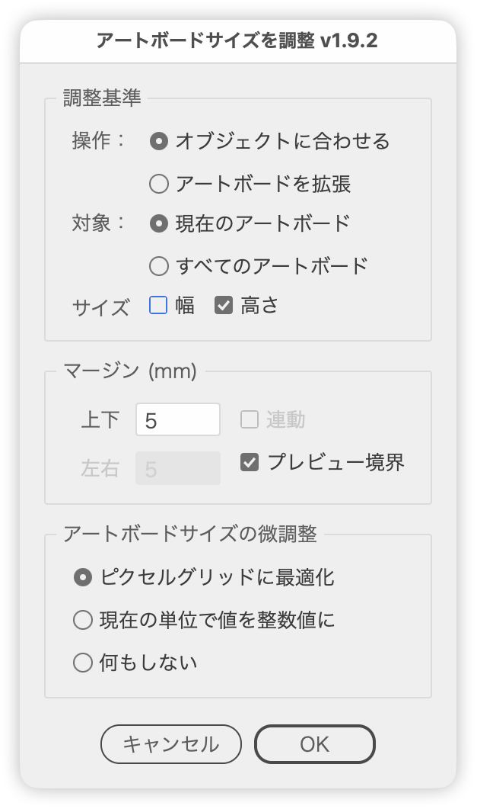

# Fit artboard size to your objects

---

### Overview

Adjusts artboard size by operation (fit to objects / expand the artboard), target (current / all artboards) and size (width & height). The artboard preview updates as you change margins and rounding, and OK commits exactly what you see.

### Main Features

- Two operations: fit to the selected objects' bounds, or grow/shrink the artboards themselves
- Target the current artboard or all artboards
- Adjust width only or height only (the axis you switch off keeps its original size)
- Run Fit with nothing selected to resize every artboard to the objects it contains
- Separate vertical and horizontal margins, with a Linked option that mirrors the vertical value
- Margin unit follows the ruler unit, with per-unit defaults (mm=5, px=20, pt=10)
- Switch between preview bounds (including strokes and effects) and geometric bounds
- Rounding for artboard position and size: optimize to pixel grid / round in the current unit / do nothing
- Live preview; Cancel restores the state from when the dialog opened
- Arrow keys change the value: Shift snaps to multiples of 10, Option steps by 0.1
- Remembers the last settings and dialog position for the session
- Japanese / English UI

### Usage

1. Pick an artboard, or select the objects you want to fit to.
2. Run the script.
3. Choose the operation, target and size under Adjustment basis, then enter the margins.
4. Check the preview and click OK.

With Expand artboard, the margin is added to the artboard's own size; enter a negative value to shrink it.

Width and Height can be switched on independently. Option-click one of them to turn that one on and the other off.

### Options

**Adjustment basis**

| Item | Description |
| --- | --- |
| Operation | Fit to objects / Expand artboard |
| Target | Current artboard / All artboards |
| Size | Which dimensions to change (width & height). The one you switch off keeps its original size |

**Margin**

| Item | Description |
| --- | --- |
| Vertical | Amount applied to the top and bottom (editable while Height is on) |
| Horizontal | Amount applied to the left and right (editable while Width is on) |
| Linked | Applies the vertical value to horizontal as well |
| Preview bounds | On measures the visible bounds incl. strokes and effects; off measures geometric path bounds (Fit only) |

**Artboard size fine-tuning**

| Item | Description |
| --- | --- |
| Optimize to pixel grid | Rounds position and size to integer pixels |
| Round values in current unit | Rounds position and size to integers in the current ruler unit |
| Do nothing | Applies the measured values without rounding |

Rounding rounds X, Y, width and height once each, then rebuilds the right/bottom edges as X+width and Y−height, so no value is rounded twice.

### Notes

- Fit + Current artboard requires a selection. With nothing selected, the target is locked to All artboards.
- Fit + All artboards ignores the selection and uses the objects overlapping each artboard. Locked, hidden and guide objects — and objects on locked or hidden layers — are excluded, and artboards with no objects are left untouched.
- Text is measured by outlining a duplicate, so the original text frames are never touched (ID, stacking order, name and tags are preserved).
- Clip groups are measured by their clipping path.
- Any artboard whose width or height would become zero or less is skipped, and a message is shown.
- Settings are kept for the session only and reset when Illustrator restarts.

### Credits

Gorolib Design
https://gorolib.blog.jp/archives/71820861.html

### Article

https://note.com/dtp_transit/n/n15d3c6c5a1e5

### Changelog

- v1.0 (2025-04-20): Initial version
- v1.1 (2025-07-08): UI improvements, updated default point value
- v1.2 (2025-07-09): UI improvements and bug fixes
- v1.3 (2025-07-10): UI improvements, added panel and radio buttons
- v1.9.2 (2026-09-10): Added width/height checkboxes to Adjustment basis; merged FitArtboardHeight.jsx so that running Fit with nothing selected resizes every artboard to the objects it contains. Also fixed preview restore on a partial failure, group-level effects being dropped from measurements, outlining failures aborting the run, and the first-run dialog appearing off-screen
