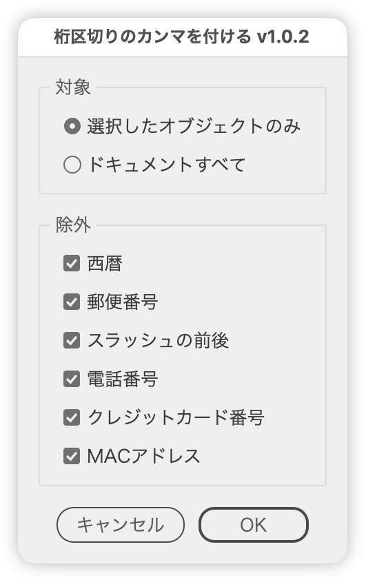

# Add thousands separators to numbers

---

### Overview

Adds thousands separators to numbers of four or more digits in text, and fixes misplaced commas (such as `12,34,567`).

Numbers that should not get commas, such as years, postal codes and phone numbers, are skipped. You choose which numbers to change in a preview. Only commas are rewritten, so character formatting and commas in running text stay as they are.

### Usage

1. Select the text you want to change. To process the whole document, no selection is needed.
2. Run the script.
3. Set **Scope** and **Exclude**, then click **OK**.
4. The preview lists the numbers that will get commas added or fixed.
   - Only rows with ✓ are changed.
   - Click a row to toggle its ✓. **Select All** puts ✓ back on every row.
   - **#** numbers each text from the top (left to right at the same height).
5. Click **OK** to apply.

### Options

**Scope**

| Option | Description |
| --- | --- |
| Selection only | Selected text, including text inside selected groups and clipping groups |
| Whole document | All text in the document |

**Exclude** (all on by default)

| Option | Skipped numbers |
| --- | --- |
| Years | 4-digit numbers from 1000 to 2999 followed by 年 or next to a date separator (/ . -), and years in dates such as `2024.12` or `2024.12.31` |
| Postal codes | Numbers in the `123-4567` form, with or without 〒 |
| Next to a slash | Numbers directly before or after a slash (/ ／) |
| Phone numbers | Numbers that start with 0, + or a parenthesis and are split by hyphens, spaces or parentheses |
| Credit card numbers | 13–19 digit numbers, including ones split by hyphens or spaces, that pass the Luhn check |
| MAC addresses | Addresses separated by colons or hyphens, such as `00:1A:2B:3C:4D:5E` |

### Notes

- These numbers are always skipped, whatever the Exclude settings:
  - Numbers starting with 0 (`00123456`, `0312345678`)
  - Numbers directly after letters or # (`SKU12345`, `#112233`)
  - Numbers following a digit and a period (the `19045` in `10.0.19045`)
- Letters after a number are treated as a unit, so the number still gets commas (`12000mm` → `12,000mm`).
- Full-width digits get a full-width comma (，), and their sign and decimal point are made full-width too. Half-width digits get half-width commas, signs and points.
- A number from 1000 to 2999 with a two-digit fraction from 01 to 12 (such as `1500.10`) is treated as a year and month, and skipped.
- Text that cannot be edited, such as locked text, is skipped.

### Article

- [DTP Transit 別館 (Japanese)](https://note.com/dtp_tranist/n/n21f07978f177)

### Update History

- v1.0.2 (20260921) : Commas in running text are kept, and only the numbers chosen in the preview are rewritten, preserving character formatting. Full-width digits get full-width commas. Numbers with a leading zero (such as 00123456), numbers following letters or # (SKU12345, #112233) and parts of version numbers are excluded. Years in dates such as 2024.12.31 and phone numbers after a space (TEL 03-1234-5678) are now excluded, and runs of numbers such as 12000 15000 are no longer treated as phone numbers. Credit card numbers are excluded only when they pass the Luhn check. Removed the license plate exclusion, since 12-34 never gets commas. In the preview, clicking a row now toggles its ✓. Revised UI wording and added tooltips and alerts.
- v1.0 (20250812) : Initial version

### Script info

- Version: v1.0.2
