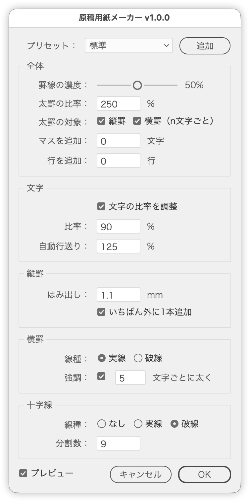

# Set text on manuscript paper

---

### Overview

This script sets the selected text one character to a cell and draws the rules of the grid. It matches the character scale, the advance and the leading to the cells, then draws the cell rules, the rules along both sides of each line, and the crosshairs.

Vertical and horizontal, point and area text are all supported, and the writing direction is left as it is. Every change is reflected in the preview, so you can check the result without closing the dialog.

### Main features

- Character attributes matched to the cells (scale, tracking, tsume, proportional metrics, leading, justification, kerning)
- The scale is set in the dialog (90% by default); turning it off keeps the scaling but still matches the advance to it
- A quarter of the tracking added as kerning at the start of every line, centering the glyphs in their cells
- Vertical and horizontal text (the panel names follow the writing direction)
- Several lines, with the gutter set by the auto leading (125% by default = a quarter of a cell)
- Square cells the size of the font, so the scaled-down glyphs do not narrow the grid
- Solid or dashed cell rules, thickened at a given character interval
- One rectangle per cell instead of the rules, when that suits the artwork better
- Rules along both sides of every line, with an adjustable extension and projecting caps
- An emphasis weight given as a ratio, applied to the line rules, the interval cell rules or both
- One more rule outside the outermost line, at the same distance as the gutter
- Crosshairs at the center of every cell (none, solid or dashed); the dash and the gap are equal and divide one cell
- Empty cells before and after the text, and empty lines outside it
- Rule density set with a 0-100% slider (Shift snaps to steps of 10%)
- Presets that fill the whole dialog at once, with an Add button
- The settings confirmed with OK come back as the defaults until Illustrator quits
- A live preview that leaves the original untouched and shows a copy instead
- Area text frames fitted to the text with Auto Size before the rules are drawn
- Rules created on a dedicated layer (`Manuscript Grid`) and sent to the back
- Japanese and English UI

### How to use

1. Select a single text object (vertical or horizontal).
2. Run `GenkoYoshiMaker.jsx`.
3. Pick a preset, or set the options in the Overall, Characters, line-rule, cell-rule and Crosshairs panels.
4. Check the result in the preview (turn off "Preview" to hide it).
5. Click "OK" to draw the rules.

### Options

| Option | Default | Description |
| --- | --- | --- |
| Preset | Standard | Standard, No outer rules, No crosshairs, Simple or Custom; editing any value switches to Custom |
| Add | - | Adds the current settings to the preset list and shows the code for them |
| Draw a rectangle for each character | Off | Creates one rectangle per cell in place of the cell rules and the rules along each line; the emphasis and line-rule options are dimmed |
| Rule density | 50% | Density of the rules, set with a slider (Shift snaps to steps of 10%) |
| Emphasis ratio | 250% | Weight of the emphasized rules, as a ratio of the normal ones (0.1mm) |
| Emphasis applies to | Both | Which rules use the ratio: the rules along each line, and the cell rules at the given interval |
| Add cells | 0 | Empty cells added before and after the text |
| Add lines | 0 | Empty lines added outside the text |
| Adjust the character scale | On | Scale the characters to the cells; the advance is matched either way |
| Scale | 90% | Horizontal and vertical scale of the characters |
| Auto leading | 125% | Distance from line to line; anything over 100% becomes the gutter, and the outer rules follow it |
| Extension | A quarter of the font size | How far the line rules run past the cells; the default is a quarter of the font size in millimeters, rounded to one decimal |
| Add one more outside | On | Adds a rule outside the outermost line, at the same distance as the gutter |
| Style (cell rules) | Solid | Solid or dashed (1mm / 1mm) |
| Emphasis (thicker every n characters) | On / 5 | Thickens the cell rule at the given interval, counted from the first character |
| Style (crosshairs) | Dashed | None, solid or dashed |
| Segments (crosshairs) | 9 | Dashes per crosshair line; rounded to zero or an odd number of 3 or more |
| Preview | On | Shows the result without closing the dialog |

Numeric fields step with the up and down arrow keys (Shift steps by 10 and snaps to multiples of 10). The segment count steps 0, 3, 5, 7 instead.

### Rule specifications

| Rule | Weight | Density |
| --- | ---: | ---: |
| Rules along each line | 0.25mm when emphasized (0.1mm × ratio), 0.1mm otherwise | Rule density |
| Cell rules | 0.1mm | Rule density |
| Emphasized cell rules | 0.25mm when emphasized (0.1mm × ratio), 0.1mm otherwise | Rule density |
| Outer rules | Same as the rules along each line | Rule density |
| Cell rectangles | 0.1mm | Rule density |
| Crosshairs | 0.1mm | 30% (`LAYOUT.crossGray`) |

In vertical text the line rules run vertically and the cell rules horizontally; in horizontal text it is the other way around, and the dialog panels swap accordingly. The line rules and the outer rules are drawn with projecting caps.

In RGB documents, the equivalent gray RGB values are used.

### Character attributes

The following attributes are set so that the characters land on the cells.

| Attribute | Value |
| --- | --- |
| Horizontal and vertical scale | The scale set in the dialog (90% by default) |
| Tracking | Derived from the scale (`100000 / scale - 1000`, about 111 at 90%) |
| Kerning (start of every line) | A quarter of the tracking (1/1000 em) |
| Auto leading | The value set in the dialog (125% = one cell plus a quarter of a cell) |
| Justification | Start of the writing direction (top for vertical, left for horizontal); the text is moved back so it does not shift |
| Tsume | 0 |
| Proportional metrics | Off |
| Aki before and after | Auto |
| Automatic kerning | Japanese monospaced |

Tsume, proportional metrics and automatic kerning are written per paragraph, because writing them to the whole story has no effect.

### Where the grid is anchored

| Kind of text | Along the writing direction | Along the line axis |
| --- | --- | --- |
| Point text | The start of the glyphs (top for vertical, left for horizontal) | The center of the glyphs |
| Area text | The start of the frame (top for vertical, left for horizontal) | The left edge of the frame (the top for horizontal) |

Area text is fitted to its contents with Auto Size when the script starts and again on OK, through an action that is loaded temporarily.

### Notes

- Compatible with Illustrator 2024 to 2026.
- Select exactly one text object before running the script.
- The cell size comes from the font size of the first character, so text with mixed font sizes will not line up with the rules.
- Half-width characters do not fill one cell, so the text drifts from the rules when they are mixed in.
- The leading is set through auto leading (the percentage is set in the dialog), so it follows the font size, but the original leading setting is not kept.
- The kerning at the start of each line is applied after the grid is measured, so that the rules do not shift with the text.
- Tracking is measured in 1/1000 em, so it does not change with the font size; it is recalculated only when the scale changes.
- With "Draw a rectangle for each character" on, the cell rules and the rules along each line (including the outer one) are left out, and one unfilled, stroked rectangle is drawn per cell. The style (solid or dashed) and the density follow the rule settings, and the crosshairs follow the Crosshairs panel.
- Running the script again rebuilds only the `Rules` group drawn for that text; grids drawn for other text objects are left alone.
- While the dialog is open the script shows a copy of the selected text and toggles the selection edges. Cancelling restores the original state.
- The frame of an area text is fitted with Auto Size as soon as the script runs, and cancelling does not restore its former size.
- A preset added this way lives only for that run. Paste the code it shows into `PRESETS` to keep it for next time.
- After the run, the script reports only the attributes that could not be set.

### Change log

- v1.1.0 (2026-09-23): Added "Draw a rectangle for each character"
- v1.0.0 (2026-09-19): Initial release
