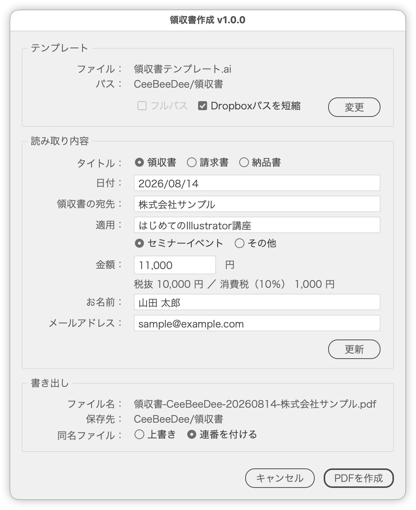

# InvoiceFromClipboard.jsx

[](https://github.com/swwwitch/illustrator-scripts/blob/master/jsx/data/InvoiceFromClipboard.jsx)

[](https://github.com/swwwitch/illustrator-scripts/blob/master/readme-ja/InvoiceFromClipboard.md)

[](https://github.com/swwwitch/illustrator-scripts/blob/master/README.md)

---

## Overview

A worked example that turns a copied form response into a single receipt, invoice or delivery-note PDF.

It reads heading-and-value text from the clipboard — stacked and blank-line separated, or a tab-separated heading row and value row — replaces `<tag>` placeholders in an Illustrator template, and exports a PDF. After the export it reveals the output folder and opens a mail draft with the recipient, subject and body already filled in.

Replacement happens on a working copy, so the template itself is never modified.

Where `VariableDataImport.jsx` builds many artboards from one data file, this one builds a single PDF from a single record.



## Features

- Reads per-heading values from the text on the clipboard (stacked or tab-separated)
- Dialog for reviewing and correcting what was read (swap the clipboard and press Reload)
- Choose the document type (receipt / invoice / delivery note); the template's file name sets the initial pick
- Derives the ex-tax amount and the tax from the tax-inclusive amount (single rate)
- Radio buttons choose how the 適用 line is worded
- Replaces `<tag>` placeholders in the template, keeping the character formatting applied to the tag
- Remembers the template path across Illustrator restarts
- Exports next to the template at Smallest File Size, PDF 1.6
- Choose what happens when the file name is taken (overwrite or add a serial number)
- Copies the reply mail to the clipboard
- Opens a mail draft with the recipient, subject and body filled in
- Reveals the output folder afterwards
- Shortens Dropbox paths on screen, with a full-path toggle

## Usage

1. Design the receipt in Illustrator and write the variable parts as tags, such as `<日付>` and `<御中>`. **Save the file.**
2. Copy the form response — headings and values, either stacked or tab-separated.
3. Run `InvoiceFromClipboard.jsx`.
4. Pick the template with **Choose** in the Template panel. It is remembered, so later runs only need **Change** when you want a different file.
5. Review the values in the Clipboard Data panel and correct them if needed. Editing the amount recalculates the ex-tax amount and the tax on the spot. The radio buttons under 適用 choose how the "but" line is worded.
6. The Export panel shows the resulting file name and folder, plus what to do when that name is taken.
7. Click **Create PDF**. The PDF is exported, then the output folder and a mail draft open. Drag the PDF from the folder onto the draft to attach it.

Replace the clipboard contents and press **Reload** to read the next record without reopening the dialog.

The dialog also opens when nothing could be read from the clipboard. Type the values in, or copy the right text and press **Reload**.

## Clipboard format

Two layouts are supported; the script tells them apart on its own.

### Stacked (a heading line, a value line, a blank line, repeated)

```
お名前
山田 太郎

メールアドレス
sample@example.com

金額
11,000

購入くださった窓口
STORES

領収書の宛先
株式会社サンプル

該当イベント名
【法人向け】はじめてのIllustrator講座

日付
2026/08/14
```

- A blank line ends a field.
- Blocks whose heading is not in the map (such as `購入くださった窓口` above) are skipped.
- A value spanning several lines is joined into one with spaces.

### Side by side (a tab-separated heading row and a value row)

The layout you get by copying the heading row plus one data row out of a spreadsheet or a form response sheet.

```
お名前	メールアドレス	金額	購入くださった窓口	領収書の宛先	該当イベント名	日付
山田 太郎	sample@example.com	11,000	STORES	株式会社サンプル	はじめてのIllustrator講座	2026/8/14
```

- A tab-separated line carrying two or more known headings is taken as the heading row, and the first non-empty line below it holds the values (`MIN_HEADER_ROW_MATCHES` changes the threshold).
- When several value rows follow, only the first one is read.
- Lines above the heading row (a table title, say) are ignored.
- Dropped trailing empty cells are fine.

In both layouts, leading and trailing spaces are stripped from every value.

## Tag map

Defined in `FIELD_MAPPINGS`. The defaults are:

| Template tag | Heading | Value |
| --- | --- | --- |
| `<タイトル>` | (chosen in the dialog) | `領収書` |
| `<日付>` | 日付 | `2026年8月14日` |
| `<御中>` | 領収書の宛先 | `株式会社サンプル` |
| `<適用>` | 該当イベント名 | `セミナーアーカイブ（はじめてのIllustrator講座）` |
| `<Price>` | 金額 | `11,000` (incl. tax) |
| `<PriceWithoutTax>` | 金額 | `10,000` (ex-tax, derived) |
| `<Tax>` | 金額 | `1,000` (tax, derived) |

Enter the amount including tax. The ex-tax amount is floored and the tax is `total − ex-tax`, so the three figures always add up.

## The 適用 line

Tag the whole "but" line in the template:

```
但  <適用>
```

Radio buttons under the 適用 field choose how it is worded.

| Choice | Value merged into `<適用>` |
| --- | --- |
| セミナーイベント (default) | `セミナーアーカイブ（はじめてのIllustrator講座）` |
| その他 | `はじめてのIllustrator講座` |

Add or change the choices in `APPLICATION_PRESETS`. `#heading#` is replaced with that field's value, and the first entry is selected by default.

## Generated files

| File | Example |
| --- | --- |
| PDF | `領収書-CeeBeeDee-20260814-株式会社サンプル.pdf` |

The name is assembled as document name, issuer, an 8-digit date, and recipient. The date sits before the recipient so the folder sorts chronologically by name.

The document name is **taken from the template's file name**.

The date comes from the **receipt date** in the data, so rebuilding the same record produces the same name. Today's date is used only when the date cannot be read.

The PDF is written next to the template. What happens when a file of that name already exists is chosen in the Export panel.

| Choice | Behaviour |
| --- | --- |
| 上書き | Replaces the existing PDF |
| 連番を付ける (default) | Appends `-2`, `-3`, … to keep both |

The displayed file name updates as you switch, so the result is visible before exporting. `OVERWRITE_EXISTING_PDF` sets the initial pick.

The export matches Illustrator's **Smallest File Size** preset:

| Setting | Value |
| --- | --- |
| Compatibility | PDF 1.6 (Acrobat 7) |
| Preserve Illustrator Editing Capabilities | off |
| Embed Page Thumbnails | off |
| Optimize for Fast Web View | on |
| Colour / greyscale images | above 150 ppi downsampled to 100 ppi, JPEG Low |
| Monochrome images | above 450 ppi downsampled to 300 ppi, CCITT Group 4 |
| Compress Text and Line Art | on |

Illustrator's Smallest File Size preset is loaded, then the compatibility alone is raised to PDF 1.6 (the preset itself is 1.5).

Preset names are localised, so `PDF_PRESET_CANDIDATES` lists them and the script matches against `app.PDFPresetsList` to find the one this install actually has. Where none is found, an equivalent set of options is built by hand.

The working copy (`領収書テンプレート_work_YYYYMMDD_HHMMSS.ai`) is deleted after the export and never left behind.

## Document type

Radio buttons at the top of the Clipboard Data panel choose it. The choice feeds all of these:

- `<タイトル>` in the template
- The dialog title
- The first part of the PDF file name
- `#書類名#` in the mail subject and body

**The initial pick comes from the template's file name.**

| Template | Initial pick |
| --- | --- |
| `領収書テンプレート.ai` | 領収書 |
| `請求書_2026.ai` | 請求書 |
| `納品書ひな形.ai` | 納品書 |
| `template.ai` (no match) | 領収書 (first entry) |

Choosing another template with **Change** re-picks it from the new file name. Edit the list in `DOCUMENT_TYPE_NAMES`.

## Reply mail

After the export a mail draft opens with the recipient, subject and body filled in. The same body is placed on the clipboard, so it can be pasted by hand where no draft opens.

```
To:      sample@example.com
Subject: 領収書をお送りします

山田 太郎さん、
アーカイブ購入ありがとうございました！

領収書PDFを添付します。
（領収書-CeeBeeDee-20260814-株式会社サンプル.pdf）

よろしくお願いします。
```

- The address comes from the heading named in `MAIL_ADDRESS_HEADING` (`メールアドレス` by default).
- Edit the subject in `REPLY_MAIL_SUBJECT` and the body in `REPLY_MAIL_TEMPLATE`.
- `#書類名#` is replaced with the document type derived from the template.
- In both, `#heading#` is replaced with the value read from the clipboard, and `#ファイル名#` with the name of the PDF. Headings used here are read automatically even when they are not part of the tag map (`お名前` in the example).

**The PDF is not attached automatically**, because `mailto:` cannot carry attachments. Drag it onto the draft from the output folder, which opens at the same time.

## Settings

Change these in the User settings block at the top of the script.

| Variable | Purpose |
| --- | --- |
| `FIELD_MAPPINGS` | Heading-to-tag map |
| `APPLICATION_PRESETS` | Wording choices for the 適用 line, shown as radio buttons |
| `FIELD_LABEL_OVERRIDES` | Input labels that differ from the heading (該当イベント名 → 適用) |
| `IGNORED_HEADINGS` | Headings skipped, but still treated as value boundaries |
| `VALUE_REMOVAL_PATTERNS` | Strings dropped from a value (`【法人向け】` by default) |
| `REPLY_MAIL_SUBJECT` | The reply mail subject |
| `REPLY_MAIL_TEMPLATE` | The reply mail body |
| `MAIL_ADDRESS_HEADING` | Heading used as the To address |
| `OPEN_MAIL_AFTER_EXPORT` | Whether to open a mail draft after the export |
| `DEFAULT_TEMPLATE_PATH` | Initial template path (`""` asks with Choose every time) |
| `DOCUMENT_TYPE_NAMES` | Document types offered as radio buttons (`領収書` / `請求書` / `納品書`) |
| `PDF_FILE_NAME_ISSUER` | Issuer in the file name (`""` omits it) |
| `TAX_RATE` | Tax rate (0.1 by default) |
| `TAX_FRACTION_MODE` | Rounding for the ex-tax amount (`floor` / `round` / `ceil`) |
| `PDF_PRESET_CANDIDATES` | Preset names to look for, one per language |
| `PDF_COMPATIBILITY_NAME` | Compatibility (`ACROBAT5`=1.4 / `ACROBAT6`=1.5 / `ACROBAT7`=1.6 / `ACROBAT8`=1.7) |
| `PDF_PRESERVE_EDITABILITY` | Whether to keep Illustrator editing data |
| `PDF_IMAGE_RESOLUTION` | Downsample target in ppi (0 keeps the original) |
| `OVERWRITE_EXISTING_PDF` | Initial pick for the name conflict (`true` overwrites) |
| `OPEN_FOLDER_AFTER_EXPORT` | Whether to reveal the output folder |
| `DROPBOX_SKIP_FOLDERS` | Shared folders also dropped from displayed paths |

## Notes

- The template must be a **saved file**. The script copies the remembered path rather than using the open document.
- Only a **single tax rate** is supported. The reduced 8% rate and its itemised breakdown are not.
- Every value is expected to fit on one line; line breaks inside a value become spaces.
- Replacement covers every text frame in the document, including those inside groups. Text inside symbols or embedded images is not touched.
- Layers and objects in the working copy are unlocked before replacement, so tags on locked layers are replaced too. Hidden items stay hidden.
- Tags that were not found in the template are reported together when the export finishes.
- Reading the clipboard pastes into a temporary new document, so open documents are left untouched.
- The initial document type comes from the template's file name. When none of `DOCUMENT_TYPE_NAMES` appears in it, the first entry (`領収書`) is selected.
- With `PDF_PRESERVE_EDITABILITY` off, the exported PDF cannot be reopened in Illustrator with full editability. Keep the template for that.
- The draft opens in whatever mail client the OS is set to use. `mailto:` cannot specify an attachment, so attach the PDF by hand.

## Article

[Illustrator: copy a form response, run the script, get a receipt PDF | DTP Transit](https://note.com/dtp_tranist/n/n1901883d86cd)

## Changelog

- v1.0.1 (2026-08-16): Support a tab-separated heading row and value row
- v1.0.0 (2026-08-16): Initial release
