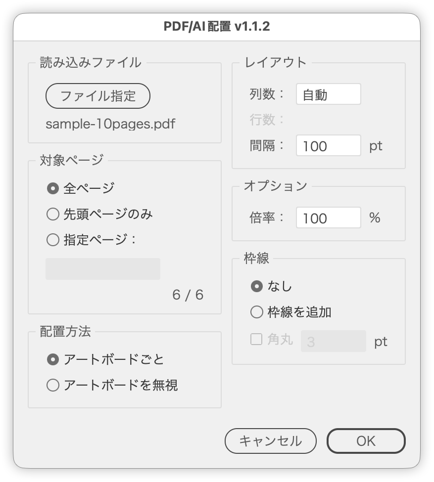

# Import a page range from a PDF/AI file

---

### Overview

Imports a PDF or AI file over a given page range and places the pages on the current document. The pages can be laid out as one artboard each, or placed as objects without adding artboards.

It is meant for arranging multiple pages in a grid or building a contact-sheet style overview. Placed pages can also be given a stroke.

### Features

- Choose all pages, the first page only, or a custom range (for example `1-10` or `1,3,5`)
- Estimates the total page count of the source file and shows "pages to place / total pages"
- Running the script with a placed image selected picks up its linked file as the default source
- The file dialog offers PDF and AI files only
- Two placement methods: per artboard, or ignoring artboards
- Setting a column count arranges the pages in a grid; Auto wraps at the row width limit
- Shows the number of rows the given column count needs
- Adjustable gap between pages, whose meaning follows the placement method
- Scale can be set when ignoring artboards
- Adds a stroke to the placed pages, with optional rounded corners
- Centers the whole layout on the canvas
- Fits the view to the result once placement finishes
- Shows progress in a palette while importing many pages
- Numeric fields step with the arrow keys (±10 with Shift)
- Japanese and English UI

### Usage

1. Open the document you want to place into.
2. Run `PDFAIImporter.jsx`.
3. Choose a PDF or AI file with the file button. (If you ran the script with a placed image selected, its linked file is used as the default.)
4. Set the pages, placement method, layout, options and stroke.
5. Click OK. The dialog closes first, then placement begins.

### Options

| Item | Default | Description |
| --- | --- | --- |
| Pages | All Pages | All pages / first page only / custom pages. Custom pages accept formats such as `1-10` or `1,3,5` |
| Placement Method | Per Artboard | Per Artboard creates an artboard matching each page size and places it at 100%. Place as Objects adds no artboards |
| Columns | Auto | Columns per row. Auto wraps once a row exceeds about 7,920 pt (about 2,794 mm). Entering 0 or less resets the field to Auto |
| Rows | - | Rows needed for the given column count. Dimmed while Columns is Auto, because the wrap position is not fixed |
| Gap | 100 pt | Gap between artboards, or between placed objects when ignoring artboards |
| Scale | 100% | Placement scale. Active only when Place as Objects is selected |
| Stroke | None | None, or Add stroke: builds a clipping mask from the page's bounding rectangle and strokes it |
| Round corners | Off (3) | Available only when a stroke is added. Uses the current ruler unit |

Numeric fields step with the arrow keys (Shift steps by 10 and snaps to multiples of 10). Pressing Up while Columns shows Auto sets it to 1, and pressing Down from 1 returns it to Auto.

### Notes

- The panels below the source file stay disabled until a source file is chosen.
- The whole layout is centered on the largest canvas area.
- Per Artboard reuses the active artboard for the first page. Running the script on an existing working document moves that artboard to the layout position.
- The total page count is estimated by scanning the file, so some PDF structures cannot be read. When the count is unavailable, only the first page is placed.
- Pages that cannot be placed are skipped, and a single notice is shown at the end.
- The PDF crop box is fixed to Crop. The preference in effect before the run is restored when placement finishes.
- Progress appears in its own palette after the dialog closes. Some environments may not show the palette, but placement still runs.

### Article

https://note.com/dtp_tranist/n/n42595650216f

### Changelog

- v1.1.2 (2026-09-19): Run placement after the dialog closes, add the row count readout, move Scale to its own Options panel, remove duplicate page measurement, fix restoring the crop preference
- v1.1.1 (2026-06-14): Internal restructuring
- v1.1.0 (2026-04-13): Added stroke and rounded corners
- v1.0.0 (2026-04-13): Initial release
