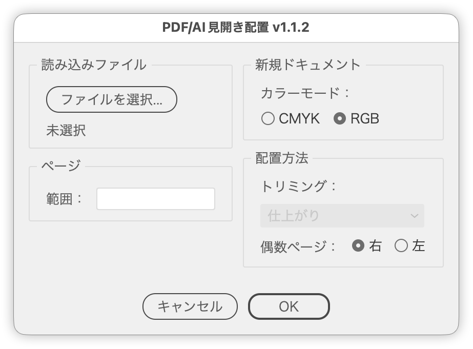
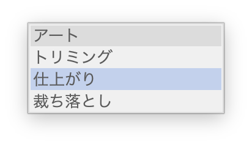

# Import PDF/AI pages as artboards in a new document

---

### Overview

Imports a PDF/AI file over a given page range and places each page on its own artboard in a new document.

Landscape pages are detected as spreads and split into two artboards, left and right.

### Features

- Page range selection (all pages / first page only / specific pages)
- Automatic spread detection for landscape pages, split left and right
- Even-page position selectable as right or left
- PDF crop box selection (Art / Crop / Trim / Bleed)
- Color mode of the new document selectable as CMYK or RGB

### Usage

1. Run the script.
2. Choose the PDF/AI file to import (a selected placed image is used if there is one).
3. Set the page range, the even-page position, the crop box and the color mode.
4. Run it, and the artboards are laid out in a new document.

### Options

#### Crop to

Chooses which PDF box the pages are placed from. Not used for AI files (available only for PDFs).

| Option | Box | What it covers |
|---|---|---|
| Art | ArtBox | The art area set by the author; same as Crop when the PDF has none |
| Crop | CropBox | The visible/printed area (what Acrobat shows) |
| Trim (default) | TrimBox | The finished size after trimming; same as Crop when the PDF has none |
| Bleed | BleedBox | The trim area plus bleed; same as Crop when the PDF has none |

For print-ready PDFs with crop marks or bleed, use Trim so each spread splits at the finished page edge.

### Notes

- The page count is estimated from the selected placed image or the chosen file and applied to the page range.
- The artboard spacing is fixed at 100 pt.
- The raster effects resolution is fixed at 300 ppi.
- Use PDFAIImporter.jsx when you do not want the pages split.

### Article

[Import a spread PDF one page at a time in Illustrator (Japanese)](https://note.com/dtp_tranist/n/n5514d9f2c5f8)

### Update History

- v1.1.2 (2026-09-25): Added colons to field labels, a label and tooltip for the crop box and color mode, renamed the button to “Choose File...” and the panel to “Pages”, fixed the crop box values so Trim, Bleed and Art place the box you choose, wrapped artboards onto a new row at the canvas edge to fix an error with many pages, and removed internal duplication
- v1.1.1 (2026-09-19): Added a link to the article and tooltips to each option, and reorganised the internal naming and structure
- v1.1.0 (2026-03-18)
