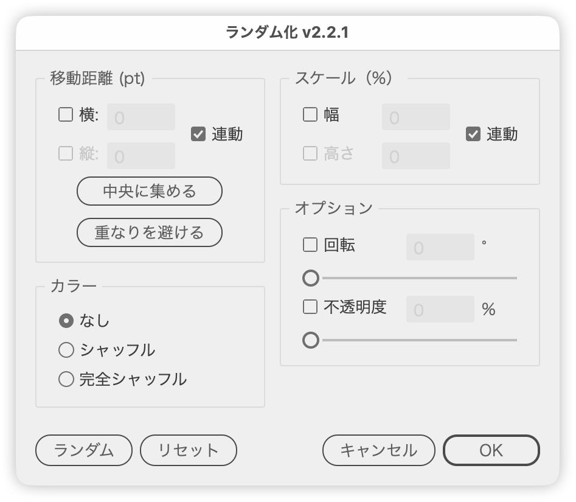

# RandomizeObjects

---

### Overview

Randomizes the position, scale, rotation, opacity, and fill color of the selected objects. Enter the amount of variation in the dialog to see it previewed right away, and reposition the selection with "Gather to Center" or "Avoid Overlap".

### Features

- Move distance set separately for the horizontal and vertical axes, or kept identical with "Link" (values are in pt)
- Scale (width and height) in %, also with a "Link" option
- Rotation (0-180 deg) and opacity (0-100%) set with a slider or by typing
- Fill color "Shuffle" (swap the colors within the selection) and "Full Shuffle" (generate random colors)
- "Gather to Center" collects the selected objects at the center of their combined bounds
- "Avoid Overlap" repositions the objects, widening the move range until nothing overlaps
- Up/Down keys step the values (Shift for steps of 10, Option for steps of 0.1)
- The preview is recomputed from the base state every time, so transforms never accumulate
- "Reset" and "Cancel" restore the state from before the dialog opened (fill colors excepted)
- The dialog position is remembered (until Illustrator quits)

### Flow

1. Check the document and the selection
2. Show the dialog (move distance, scale, rotation, opacity, color)
3. Type a value or drag a slider to preview immediately
4. Press "Random" to draw new random values (colors are applied at this point)
5. Commit on OK, or restore the original state on Cancel

### Notes

- Every amount means "plus or minus": a move distance of 20 pt moves each object somewhere between -20 and 20 pt.
- Rotation is capped at 180 degrees and opacity at 100%; larger values entered in the fields are pinned to those maximums.
- Turning a checkbox on fills its field with 20 (the vertical distance is the one exception and stays at 0).
- Colors are applied only when "Random" is pressed. "Shuffle" swaps the fill colors within the selection, while "Full Shuffle" generates colors that match the document color mode (K stays within 0-30 in CMYK so nothing turns too dark).
- "Shuffle" needs two or more objects; "Full Shuffle" needs at least one.
- **Fill colors are not restored by "Reset" or "Cancel".** Position, scale, rotation, and opacity go back to the state from before the dialog opened, but a color change is final once applied. Use Illustrator's own undo (Command + Z) to take it back.
- Fill colors are read from and written to paths, compound paths, text frames, and groups (the first eligible object inside).
- "Avoid Overlap" tries up to 300 positions per object and widens the move range up to 20x when the objects do not fit, allowing 5 pt of padding between them. The widened range is written back to the distance fields only when the placement succeeds; on failure the fields keep what you typed.
- The Live Corner Annotator is toggled while the dialog is open, since it gets in the way of the preview.

### note

https://note.com/dtp_tranist/n/nba8235fe91b2

### Change Log

- v2.1 (20260227): Full shuffle now generates random colors (K is 0-30 in CMYK), and colors are applied under Random
- v2.2 (20260305): Extracted the "avoid overlap" placement logic into a general-purpose function other scripts can reuse
- v2.2.1 (20260819): Bug fixes - rotation and scale previews now really are undone by Cancel and Reset (the old code restored a `matrix` property that PageItem does not have; the applied transforms are now undone in reverse order, and the stopgap that straightened rectangles is gone, so a rectangle you drew rotated stays rotated); the rotation field syncs to its slider again; rotation is capped at the slider maximum (180 degrees); scale [Link] reuses one random factor for width and height, so linked scaling keeps the aspect ratio; toggling distance [Link] refreshes the preview; Reset rebuilds the preview base, so a previous "Gather to Center" no longer comes back; "Avoid Overlap" keeps its placement instead of losing it on the next preview, puts the objects back when it fails, leaves the distance fields alone on failure, and writes back the range it actually used when the fields were empty; closing with the title-bar button restores the artwork and the Live Corner Annotator like Cancel does; and running the script with characters selected by the type tool no longer throws. The sliders also reset to 0 along with the fields. Housekeeping: wrapped the whole script in an IIFE, trimmed the header to an overview + README pointer, added the basic-info block (README links and the article URL), split user settings from layout constants, categorized LABELS and unified lookups on `getLabel()`, deduplicated the UI with helpers (setupPanel/setupRow/addPanel/addNumericFieldRow) and a shared builder for the distance and scale panels, split state capture / preview / panel building / dialog wiring into smaller functions, added JSDoc to every function, aligned names with the naming rules, and removed dead code
