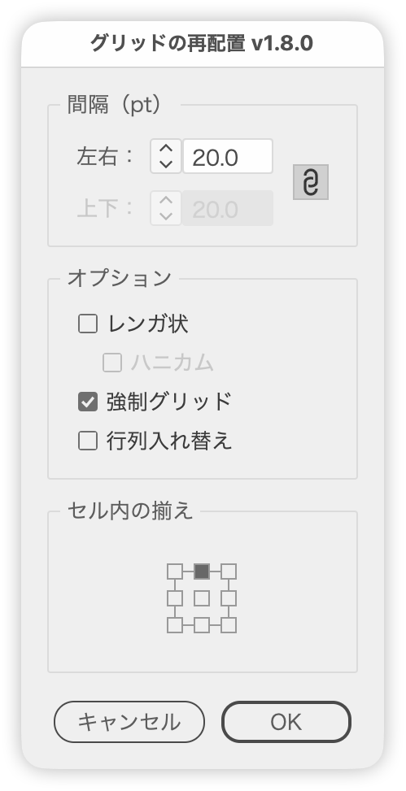
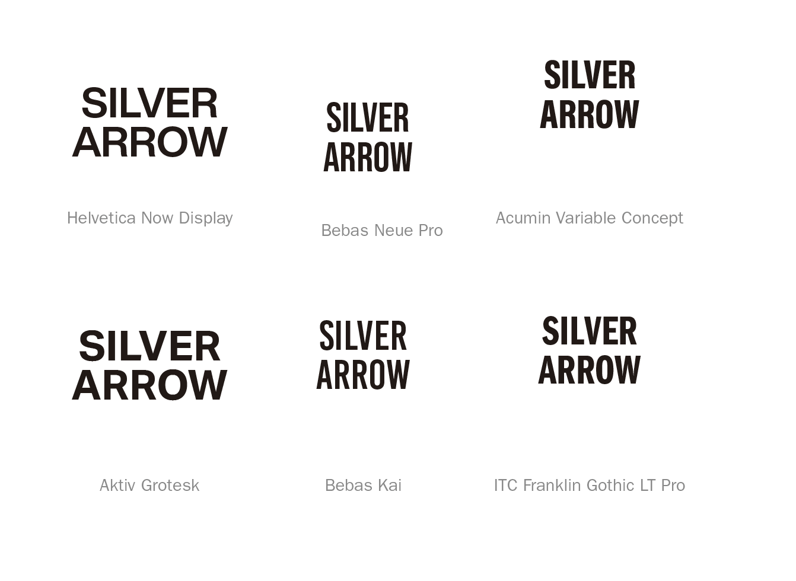

# Re-space a roughly gridded selection

---

### Overview

- Assumes the selected objects are roughly arranged in a grid, and re-lays them out using horizontal and vertical spacing values.
- Always-on preview. Values are typed directly into the fields, or stepped with the stepper buttons left of each field or with Up/Down (to the next whole number, 1.5 → 2; to the next multiple of ten with Shift; by 0.1 with Option).
- Spacing is entered in the current ruler unit (mm / pt / px, and so on) and converted to points internally; the unit is shown inside the fields.
- Existing groups (including clip groups) are treated as a single object with one bounding box, rather than being broken apart.
- Objects are not grouped automatically afterwards; they simply stay selected.
- The dialog switches between Japanese and English automatically (`$.locale`).
- The link icon to the right of the fields mirrors the horizontal value into the vertical one.
- Brick: offsets every other row horizontally by half a pitch.
- Honeycomb: used together with Brick, it shifts odd rows by half of (width + horizontal spacing) and scales the row height to 0.75, producing a honeycomb layout (the vertical value still applies).
- Rows and columns are detected from overlapping extents, so objects of different sizes and shapes (such as headings and captions) stay in their rows and columns.
- Force Grid: instead of inferring columns from position, it assigns (row, column) top to bottom and left to right.
- Align in Cell: a 3×3 picker sets where each object sits within its cell (column width × row height); top left by default.
- Transpose is a toggle: on, it swaps rows and columns while tolerating gaps; off, it returns to the pre-transpose state.
- Transposing a single row into a single column, and vice versa, is supported.

Example with objects of different sizes and shapes (sample text and font names selected separately; detected as 4 rows × 3 columns)

### Update History

- v1.8.4 (2026-10-03): Units now appear inside the numeric fields; removed the unit from the panel title
- v1.8.3 (2026-10-01): Added space below the button row to match Illustrator's own dialogs
- v1.8.2 (2026-10-01): The button row, previously always centered, is now centered in dialogs up to 200 px wide (inside the margins) and right-aligned in wider ones. Unified the window and panel margins and spacing with the shared layout part
- v1.8.1 (2026-09-30): Fixed an error when running with characters selected by the Type tool
- v1.8.0 (2026-09-29): Rows and columns are now detected from overlapping extents, so objects of different sizes and shapes no longer break the grid. Center in Cell became Align in Cell (a 3×3 picker) and works without Force Grid. A non-numeric gap reverts to the previous value; the V label also dims while Link is on; code cleanup
- v1.7.3 (2026-09-29): Dialog opacity changed to 98%
- v1.7.2 (2026-09-28): The button row is now built with the shared part
- v1.7.1 (2026-09-28): Replaced the Link checkbox with a link icon
- v1.7.1 (2026-09-28): The dialog now reopens where it was last closed and moves sideways to avoid covering the selection; opacity unified at 97%
- v1.7.0 (2026-09-27): Added stepper buttons to the number fields. The arrow keys now share the steppers' logic (to the next whole number; Shift to the next multiple of ten)
- v1.6.2 (2026-09-25): Fixed Force Grid moving objects to the top of the artboard, renamed the dialog to "Regrid Objects", clarified the message shown when transposing puts two objects in one cell, and tidied the code
- v1.6.0 (2026-07-08): Added Center (a sub-option of Force grid), made Transpose a toggle that reverts when off, added ruler-unit input (mm / pt / px, converted to points internally), and tidied the apply functions and their naming
- v1.0 (2025-10-31): Always-on preview, linked values (vertical dimmed), and arrow-key stepping

### Article

https://note.com/dtp_tranist/n/n08861d0e40c3

### Script info

- Version: v1.8.0
