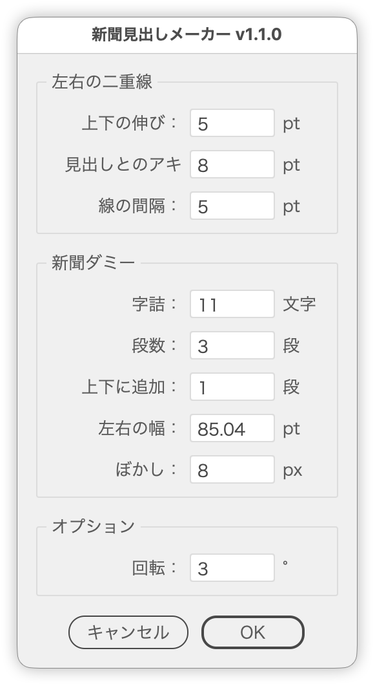

# Make a newspaper-style headline

---

### Overview

This script draws double rules on both sides of the selected headline (text or group) and lays newspaper-style dummy columns around it, so the result looks like a clipping from a Japanese newspaper page.

The dummy text is split into tiers to match the height of the rules and blurred. The whole piece is tilted with the Transform effect and masked by a rectangle that leaves no corner missing after the rotation. Every change is reflected in the preview, so you can check the result without closing the dialog.

### Main features

- Double rules (0.6 pt) on both sides of the headline, with adjustable extension, distance from the headline and gap between the two rules
- Vertical dummy text on both sides, with the rule height split into tiers (one character of space and a tier rule between tiers)
- Type size calculated from the characters per line; 85% vertical scale, Hiragino Mincho W3
- Full-width tiers added above and below
- The horizontal spacing of the rules nudged so the lines of the tiers above and below align with the side tiers
- The side dummy text trimmed to whole lines, keeping the space next to the rules equal on both sides
- A paper-colored rectangle (Y10 K25) behind the dummy text
- Gaussian Blur on the dummy text only; the headline and rules stay sharp
- Everything grouped and rotated around its center with the Transform effect
- A mask with the largest rectangle that leaves no corner missing after the rotation (the blurred fringe stays outside); can be turned off
- A preview that shows the result without closing the dialog (built on a copy; the original is left untouched)
- Japanese and English UI

### Usage

1. Select one headline text (vertical) or one group.
2. Run `ShimbunTitleMaker.jsx`.
3. Set the Side Rules, Newspaper Dummy and Options panels and check the preview.
4. Click OK.

### Options

| Panel | Item | Default | Description |
| --- | --- | --- | --- |
| Side Rules | Extend | 5 pt | How far the rules extend beyond the top and bottom of the headline |
| Side Rules | Spacing | 8 pt | Distance between the headline and the inner rule; may widen slightly so the dummy lines align |
| Side Rules | Gap | 5 pt | Distance between the inner and outer rule; 0 draws a single rule |
| Newspaper Dummy | Chars per line | 11 chars | Characters in one line of a tier |
| Newspaper Dummy | Tiers | 3 tiers | Number of tiers the rule height is split into; 0 adds no dummy text |
| Newspaper Dummy | Extra tiers | 1 tier | Full-width tiers added above and below each |
| Newspaper Dummy | Width | 30 mm | Width of the dummy text on each side (trimmed to whole lines) |
| Newspaper Dummy | Blur | 8 px | Radius of the Gaussian Blur on the dummy text; 0 applies none |
| Options | Rotation | 3° | Rotation applied to the whole piece with the Transform effect; 0 adds no effect |
| Options | Mask | On | Masks the whole piece with a rectangle that leaves no corner missing after the rotation; when off, no clip group is made. Turns off automatically when Extra tiers is set to 0 |

Lengths are shown in the ruler unit. The numeric fields step with the Up/Down arrow keys (Shift: ±10 snapped to multiples of ten, Option: ±0.1). Only Rotation accepts negative values.

### Dummy text dimensions

| Item | Value |
| --- | --- |
| Character advance | Rule height ÷ (tiers × characters per line + tiers − 1) |
| Type size | Character advance ÷ vertical scale (85%) |
| Leading | Type size × 1.4 |
| Between tiers | One character, with a tier rule (0.3 pt) in the middle |
| Space next to the rules | One character |
| Font | Hiragino Mincho W3 (the default font when it is missing) |
| Background | Y10 K25 rectangle |

The rule and background colors, the font, the vertical scale, the leading and so on can be changed under "User Settings" at the top of the script. In RGB documents, the CMYK values are converted to RGB with a simple formula.

### Resulting objects

From front to back, everything is wrapped in one clip group (with Mask off, only the group in item 2):

1. The mask rectangle
2. The group rotated with the Transform effect
   - The headline
   - The rules (`Side rules`)
   - The dummy text (`Newspaper dummy`, blurred)
   - The background rectangle

### Notes

- Works with Illustrator 2024–2026.
- Select exactly one text object or one group before running.
- The headline is expected to be vertical text (the rules are drawn on its left and right).
- The dummy text repeats the opening of "I Am a Cat". Kinsoku is set to None so every line keeps the set length (a period may start a line).
- The blur and the rotation are live effects, so they can be adjusted later in the Appearance panel.
- While previewing, the selected headline is hidden and a copy is shown. Cancel restores the original state.

### Article

https://note.com/dtp_tranist/n/ndb9bee6b7a2e

### Change log

- v1.2.0 (2026-09-24): Added Mask to Options (off: no clip group; turns off automatically when Extra tiers is set to 0)
- v1.1.1 (2026-09-24): Added periods to the dummy text (kinsoku set to None); widened the label column so long labels are not clipped
- v1.1.0 (2026-09-24): Added the dummy text (tiers, tiers above and below, blur, background), rotation, mask and preview; the margins are now two items, vertical and horizontal
- v1.0.0 (2026-09-23): Initial release
