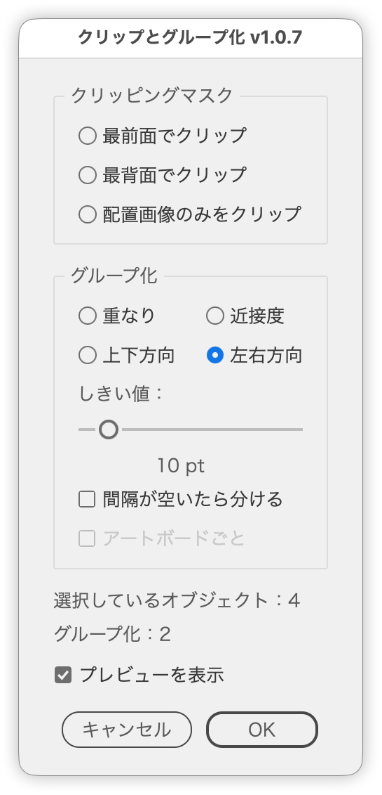

# Group or mask objects in logical sets

---

### Overview

Finds clusters in the selection by overlap, distance, column or row, and groups or clips each cluster. Before you click OK, the dialog shows how many groups will be created, and red frames show where they will be while Show preview is on.

The features of the former SmartAutoGroup.jsx and SmartAutoGroup-yoko.jsx are merged into this script (v1.0.7).

### Main Features

- Grouping by four rules: Overlap, Proximity, Vertical (columns) and Horizontal (rows)
- Clipping each cluster of overlapping objects with its frontmost or backmost path
- Clipping each placed image with a rectangle of the same size
- A count and preview frames that show the result before you run it
- Per-artboard grouping
- Groups keep the original layer and stacking order
- Japanese / English UI

### Usage

1. Select all the objects you want to group or clip.
2. Run the script.
3. Pick a mode, and adjust the Threshold and checkboxes if needed.
4. Check the count, and the preview frames when Show preview is on, then click OK.

The preview frames disappear when the dialog closes. The new groups are left selected.

### Options

**Clipping Mask**

| Mode | What it does |
| --- | --- |
| Clip with Frontmost | Clips each cluster of overlapping objects, using its frontmost path as the mask |
| Clip with Backmost | Clips each cluster of overlapping objects, using its backmost path as the mask |
| Clip Placed Images Only | Clips each image with a rectangle of the same size |

- Only paths can be masks. A cluster without a path is not clipped.
- When a clipping group is selected in Clip Placed Images Only, only its old mask is removed and the images inside are clipped again. Text and other non-image objects stay where they are.
- When the selection contains only images, Clip Placed Images Only is selected at start.

**Grouping**

| Mode | Objects join the same group when |
| --- | --- |
| Overlap | Their bounding boxes overlap or touch |
| Proximity | The gap between them is within the Threshold, in any direction |
| Vertical | They sit in the same column: the horizontal offset is within the Threshold, however far apart they are vertically |
| Horizontal | They sit in the same row: the vertical offset is within the Threshold, however far apart they are horizontally |

Vertical and Horizontal never consider the distance along the line. In Horizontal, objects at opposite edges of the artboard still form one row as long as they line up vertically. At a Threshold of 0, only objects that actually overlap across the line are grouped.

**Threshold**

How close objects must be to land in the same group. Used by Proximity, Vertical and Horizontal. The unit is points (default 10 pt, range 0–100 pt).

**Split at gaps**

Used by Vertical and Horizontal. When on, a column (row) is split wherever the gap exceeds the Threshold. Only aligned objects (horizontally overlapping, for columns) are linked.

For example, with a Threshold of 10 pt and a column of A and B (5 pt apart), a 100 pt gap, then C and D (5 pt apart): when off, A–D form one group; when on, A–B and C–D form two groups.

When off, the Threshold is how far an object may be offset across the line and still join it. When on, it is the largest gap allowed along the line.

**Within each artboard**

Used by the four grouping modes. When on, objects on different artboards end up in separate groups even if they meet the rule. An object belongs to whichever artboard rectangle contains its center point. The initial state depends on the situation: dimmed and off when there is only one artboard, on when the selection spans several artboards, and off otherwise. Objects whose center is on no artboard are ignored when checking whether the selection spans artboards.

**Show preview**

When on, red frames (no fill, 10 pt stroke, 50% opacity) show where the groups will be created. They are redrawn when you change the mode or settings, and disappear when the dialog closes. On by default.

### Notes

- Clusters are built by walking from neighbour to neighbour. If A and B meet the rule and B and C meet the rule, A and C end up in one group even when they do not meet it themselves. Lower the Threshold if objects chain together unexpectedly.
- A cluster with only one member is not grouped.
- The tests use `geometricBounds`, which exclude stroke width. Overlap and distance are measured on bounding boxes, not on the actual shapes.
- Each group is created where the frontmost object of its cluster was, on the same layer and at the same stacking position. The stacking order inside the group is kept.
- The preview frames are drawn on a temporary layer named "SmartClipAndGroup Preview", created at the very top of the layer stack, so they appear in front of every object. Drawing them also adds steps to the undo history.
- With more than 300 selected objects, the count and preview update when you release the slider rather than while you drag it.

**Moving from the former scripts**

| Former setting | Setting in this script |
| --- | --- |
| SmartAutoGroup: Overlap Only | Overlap (touching objects are grouped too) |
| SmartAutoGroup: Vertical | Vertical + Split at gaps |
| SmartAutoGroup: Horizontal | Horizontal + Split at gaps |
| SmartAutoGroup: Proximity | Proximity |
| SmartAutoGroup-yoko: Vertical tolerance | Threshold in Horizontal |
| SmartAutoGroup-yoko: Per artboard | Within each artboard |

### Update History

- v0.0.1 (20240605): Initial release
- v0.0.2 (20240610): Simplified UI and restructured
- v0.0.3 (20240610): Added placed-only and square mask options
- v0.0.4 (20240610): Added overlap-based grouping
- v0.0.5 (20240610): Improved z-order retention, re-execution support, and threshold restore
- v0.0.6 (20260919): Added tooltips to the radio buttons and the slider
- v1.0.7 (20260922): Merged SmartAutoGroup.jsx and SmartAutoGroup-yoko.jsx. Implemented Vertical (column) and Horizontal (row) grouping, and added Split at gaps and Within each artboard. Added a count and preview frames, toggled by Show preview, for the groups to be created. Arranged the grouping radio buttons in two rows and two columns. Fixed clipping stopping partway, and grouping reversing the stacking order and moving groups to the active layer. Removed the square mask code, which the UI could not reach
