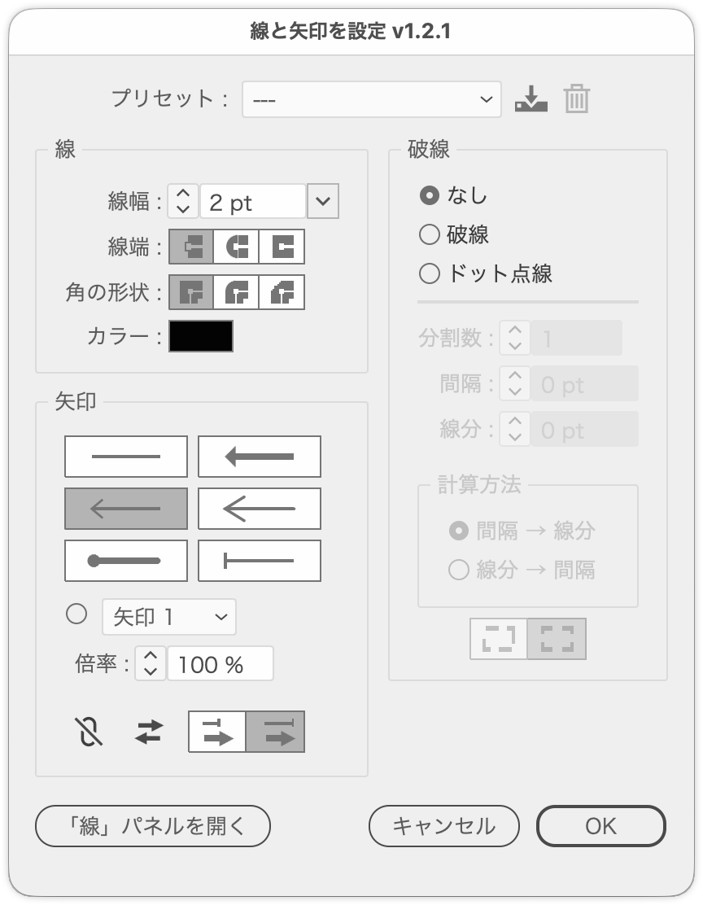

# Apply a favorite arrowhead and stroke settings at once

---

### Overview

- Applies a favorite arrowhead together with the stroke settings — weight, cap, corner, color and dashes — to the selected paths.
- Arrowheads cannot be reached from the Illustrator DOM, so a temporary action (ai_plugin_setStroke) is generated and played instead.
- An adaptation of [SetStrokeAndArrowheads](SetStrokeAndArrowheads.md) that adds the cap and corner settings from SetStrokeAlignment and the dash calculation from [DashGapCalculator](DashGapCalculator.md).

### Features

The dialog has the presets at the top, **Stroke** and **Arrowheads** in the left column, and **Dashes** in the right column.

#### Presets

- The pop-up loads saved settings (stroke, arrowheads and dashes)
- The save icon (tray with a down arrow) names and saves the current settings; an existing name is overwritten after confirming
- The delete icon (trash can) removes the selected preset
- Presets survive an Illustrator restart (Folder.userData/illustrator-scripts/SmartStrokeSettingsPresets.json). Presets saved under the old name FavoriteArrow are read too. The color is not stored in presets

#### Stroke

- Weight: starts from the selected path's stroke weight (without a stroke, from a default that follows the general unit). The ▼ on the right picks a common weight (0.25 to 100 pt)
- Cap (Butt / Round / Projecting) and corner (Miter / Round / Bevel): picked with icons like those in the Stroke panel. Option-clicking Round Cap also sets Round Join
- Color: click the swatch to open Illustrator's standard Color Picker
  - The swatch starts from the selected path's stroke color (or its fill color when it has no stroke)
  - Unless you change the color, each path gets its own original color as the stroke (its stroke color, or its fill color when it has no stroke)
  - A changed color is applied to every selected path

#### Arrowheads

- Pick [None] or a favorite arrowhead (Arrow 8, 11, 13, 21, 27) with icons showing their shapes (3 rows by 2 columns). The selected one has a gray background
  - [None] removes the arrowheads from both ends
  - Option-click swaps the start and end; Cmd-Option-click toggles Same at end
- Each arrowhead sets its own scale, tip alignment, weight, cap and corner (Arrow 11 is selected at start)

  | Arrow | Scale | Tip alignment | Other |
  |---|---|---|---|
  | 8 | 25% | At end of path | Weight at 300% (restored when another arrowhead is picked) |
  | 11 | 100% | At end of path | |
  | 13 | 100% | | Round Cap and Round Join |
  | 21 | 33% | | Round Cap and Round Join |
  | 27 | 100% | Beyond end of path | |

  Any arrowhead other than 13 and 21 returns the cap to Butt and the corner to Miter
- Pick any other arrowhead from the pop-up menu (scale: 100%)
- Scale: the size of the arrowhead (%)
- Options (icons in one row; names are in the tooltips; dimmed while the arrowhead is [None])
  - **Same at end** (link icon): puts the same arrowhead on the end. While on, the arrowhead icons show both ends. When off, the end has no arrowhead
  - **Swap start and end** (⇄ icon): puts the arrowhead on the end instead of the start (dimmed while Same at end is on)
  - Tip alignment (left: beyond end of path / right: at end of path)

#### Dashes

- Choose **None**, **Dashed** or **Dotted**
  - Choosing Dashed or Dotted fills in Segments, Gap and Dash based on the stroke weight, and sets the arrowhead to [None]
  - With None, any dashes the paths already had are removed, leaving a solid line
- Dash calculation: works out the dashes from Segments, Gap and Dash. With several paths selected, each path is calculated from its own length
- Calculation: Gap → Dash / Dash → Gap
- Dotted works out the gap between zero-length dots from Segments and fixes the cap to Round
- Corner alignment (picked with icons; left: keep dash lengths / right: adjust ends): Adjust ends distributes the dashes on an open path so both ends finish with a dash (or dot)

#### Preview and buttons

- The preview is always on (from the moment the dialog opens). The weight updates live while you type; settings that include arrowheads are previewed on copies (the original paths are hidden only while previewing). Cancel restores the original state
- **Open Stroke Panel** at the bottom left closes the dialog (reverting like Cancel) and opens Illustrator's Stroke panel

### Usage

1. Select the paths to style (paths inside groups and compound paths are included)
2. Run the script and set the stroke, arrowheads and dashes in the dialog (or pick a saved preset)
3. Click **OK** to apply

### Notes

- Arrowhead, tip alignment, cap and corner names must match Illustrator's UI labels (they depend on the UI language).
- The arrowhead scale keys (asc1 / asc2) are estimated.
- Dashes and the stroke color are set through the DOM after the action runs.
- The favorite arrowheads and their scale, tip alignment, weight multiplier, cap and corner can be changed in `FAVORITE_ARROWS` at the top of the script.

### Article

https://note.com/dtp_tranist/n/n1726fc0f8dc9

---

### Update History

- v1.2.3 (2026-10-06) Confirmation dialogs for deleting or overwriting now default to No (Enter cancels)
- v1.0.0 (2026-10-03) Initial release
- v1.0.1 (2026-10-04) The initial stroke weight now follows the general unit (0.25 pt for mm, 1 px for px, 5 pt otherwise)
- v1.0.2 (2026-10-04) The cap and corner now start at Butt and Miter. Arrow 27 joins the favorite arrowheads
- v1.1.0 (2026-10-04) Added presets (save, load, delete). Added [None] at the top of the favorite arrowheads to remove arrowheads. Dashed and Dotted are now None / Dashed / Dotted radio buttons instead of checkboxes. Tip alignment moved into Options in the Arrowheads panel. Arrow 11 is now selected at start
- v1.1.1 (2026-10-04) Same at end and Swap start and end moved into Options in the Arrowheads panel. Gap and Dash now show their unit (pt) inside the field. Arrow 1 moved from the favorites to the pop-up menu. Picking a favorite arrowhead also sets the tip alignment. Calculation and Adjust ends moved into the Dash Calculation panel
- v1.1.2 (2026-10-04) Options are now a row of icons instead of a panel (link icon for Same at end, ⇄ for Swap start and end, two icons for tip alignment). Tightened the gap between the favorite arrowheads and the pop-up menu
- v1.1.3 (2026-10-04) The icons added for tip alignment in v1.1.2 now belong to Adjust ends (keep dash lengths / adjust ends). Tip alignment got its own icons (beyond end of path / at end of path). Fixed the last dot sometimes missing on dotted lines with Adjust ends. Options are dimmed while the arrowhead is [None]. Choosing Dashed or Dotted sets the arrowhead to [None]. Larger option icons, and the Adjust ends icons now have space between the frame and the shapes. [None] and the favorite arrowheads are now icons instead of radio buttons. The preview is always on; the Preview checkbox is replaced by an Open Stroke Panel button. The scale shows its % inside the field
- v1.1.4 (2026-10-04) Code cleanup (naming, split functions, removed duplication). Fixed the colon being cut off after "Corner" and "Segments" labels. Caps and corners are now picked with icons. The weight now starts from the selected path's stroke weight. Option-clicking Round Cap also sets Round Join. The preset Save and Delete buttons are now icons. Dash Calculation is no longer a framed panel; a separator line sits above it. The weight shows its pt inside the field
- v1.1.5 (2026-10-04) Picking Arrow 8 sets the weight to 300%; picking another arrowhead restores it
- v1.1.6 (2026-10-04) Added Arrow 21 to the favorites (33%; picking it sets Round Cap and Round Join). Thickened the bar in the Arrow 27 icon. Other arrowheads return the cap and corner to Butt and Miter. Added Arrow 13 (Round Cap and Round Join). Added a pop-up of common weights next to the weight field. Option-clicking an arrowhead icon swaps the start and end. The weight pop-up is now a drawn ▼ button with a list. Arrowhead icons sit in 3 rows by 2 columns, [None] included
- v1.2.0 (2026-10-04) Added Color to the Stroke panel (click the swatch for the standard Color Picker; it starts from the selected stroke color). With dashes set to None (including presets without dashes), existing dashes are removed. Cmd-Option-clicking an arrowhead icon toggles Same at end. Without a color change, each path takes its original color (stroke, or fill when unstroked) as the stroke color. Stroke and dash calculation labels now take the width of their actual text. Japanese labels now end with " :" (half-width space and colon) (shared part update)
- v1.2.1 (2026-10-04) Renamed from FavoriteArrow to SmartStrokeSettings (presets saved under the old name are carried over). Added the article link
- v1.2.2 (2026-10-04) Fixed an error when run with characters selected by the Type tool. Fixed every path taking the first path's color when the Color Picker was closed with OK without changing the color. The preview is now built on copies instead of undo (fixes arrowheads or caps sometimes remaining after Cancel). A message now appears when the action fails. Fixed the weight multiplier not being applied when the starting arrowhead has one

### Script info

- Version: v1.2.2
- First release: 2026-10-03
- Last updated: 2026-10-04
