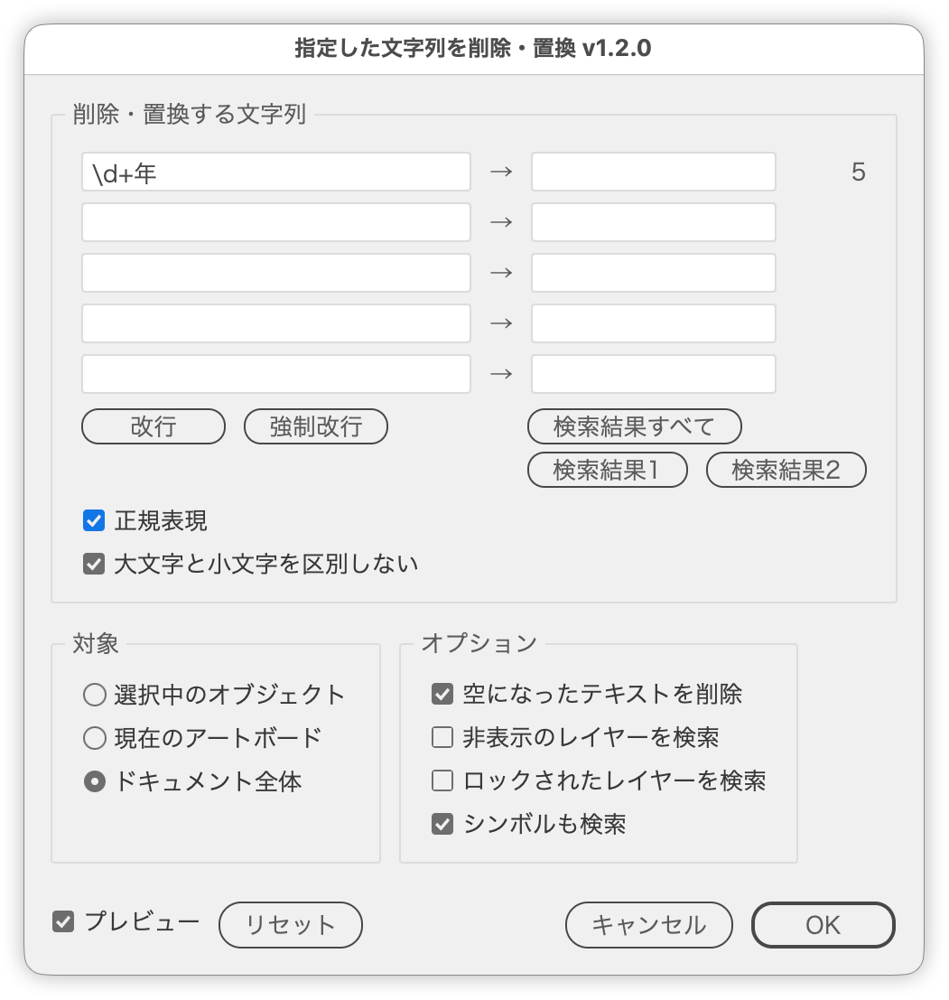

# Remove or replace specified strings in text

---

### Overview

- Removes the entered strings from text in one go. Fill in the replace field to replace them instead.
- There are five fields, processed from top to bottom. Regular expressions are supported.
- Choose the scope: selected objects, the current artboard, or the entire document. Text inside symbols can be included.
- Characters are removed one by one, so the formatting of the remaining text (color, font, size, etc.) is kept. Replaced text takes the formatting of the first character of the match.

### Features

- Up to five strings to remove (empty fields are ignored)
- A replacement for each field (empty to remove; with regular expressions, `$1` / `\1`, `$&` / `\0` etc. refer to the match)
- Shows the number of matches in the scope for each field (updated as you type or change the scope)
- Regular expressions and case-insensitive search
- `\n` for a paragraph break and `@#` for a forced line break (inserted at the cursor with buttons or shortcuts)
- Buttons and shortcuts that insert the match references `\0`, `\1` and `\2`
- Preview the result without closing the dialog
- Scope: selected objects (including inside groups) / current artboard (text that overlaps it) / entire document
- Falls back to the entire document when nothing is selected
- Deletes text left empty by the removal
- Processes text in hidden or locked layers and objects (released only while processing, then restored)
- Processes text in symbols (by rewriting the symbol definition)
- Reports the removed / replaced count per field, and the numbers of changed text, deleted text and rewritten symbols
- Remembers the entries and settings for the next run

### How to use

1. Select the target, or run the script with nothing selected
2. Enter strings in the left fields under "Text to Remove / Replace" (to replace, also fill in the field right of "→"; the match count appears at the right end)
3. Choose the scope and options, check the result with Preview if needed, then click OK

### Dialog

| Item | Description |
| --- | --- |
| Text to Remove / Replace | Left: strings to search for (five fields). Empty fields are ignored; fields are processed from top to bottom. Right of "→": replacement text; leave empty to remove. The number at the right end is the match count in the scope; "!" means an invalid regular expression |
| Paragraph Break | Inserts `\n` (paragraph break) into the field with the cursor. Command (Ctrl) + Enter does the same |
| Forced Line Break | Inserts `@#` (forced line break) into the field with the cursor. Shift + Enter does the same |
| Whole Match | Inserts `\0` (the whole match) into the field with the cursor. Option (Alt) + 0 does the same. Available with regular expressions only |
| Group 1 / Group 2 | Inserts `\1` / `\2` (the text matched by the first / second `( )`) into the field with the cursor. Option (Alt) + 1 / 2 does the same. Available with regular expressions only |
| Regular expression | Treats the input as JavaScript regular expressions. `^` and `$` match the start and end of each paragraph. Replacements can use `$1`–`$99`, `$&` and `$$`, as well as `\0` (whole match), `\1`–`\9` (groups) and `\\` (a literal `\`) |
| Ignore case | Treats upper- and lowercase letters as the same |
| Selected objects | Selected text (including inside groups). Unavailable when nothing is selected |
| Current artboard | Text that overlaps the active artboard, even partly |
| Entire document | All text in the document |
| Delete emptied text | Deletes text frames emptied by this run. Frames that were already empty and threaded text frames are kept |
| Search hidden layers | Includes text in hidden layers and objects. They are shown only while processing, then hidden again |
| Search locked layers | Includes text in locked layers and objects. They are unlocked only while processing, then locked again |
| Search symbols too | Includes text inside symbols in the scope |
| Reset | Clears the fields and restores the scope and options to their defaults. The preview setting is kept |
| Preview | While on, shows the result without closing the dialog and updates it as the input, scope or options change |

### Notes

- The match count of each field ignores removals and replacements by the other fields. When the strings overlap, the actual number processed may differ.
- Replaced text is searched by the fields below.
- Replaced text takes the formatting of the first character of the match. Mixed formatting within a match becomes a single format.
- In the search and replace fields, `\n` means a paragraph break and `@#` a forced line break, with or without regular expressions. To find a backslash followed by `n` with regular expressions, write `\\n`.
- The preview covers only visible, unlocked, standalone text. Text in symbols, hidden or locked text, and threaded text stay unchanged in the preview but are processed on OK.
- "Search symbols too" rewrites the symbol definition itself, so instances of the same symbol outside the scope change as well.
- Symbols are recreated and swapped, so symbol options such as the registration point and 9-slice scaling are reset.
- With "Search symbols too" on, symbols are expanded temporarily in the dialog to count matches. The dialog may open slowly in documents with many symbols.
- Clicking OK saves the entries and settings for the next run.

### Article

- [DTP Transit (Japanese)](https://note.com/dtp_tranist/n/nec5dfffce709)

### Changelog

- v1.0.0 (20260926) : Initial release
- v1.1.0 (20260926) : Added replace fields
- v1.2.0 (20260926) : Added Preview. Added buttons and shortcuts for paragraph and forced line breaks, buttons for match references, and a Reset button. Replacements accept `\0`–`\9` and `\\`. Fixed an error when selected text was emptied and deleted
