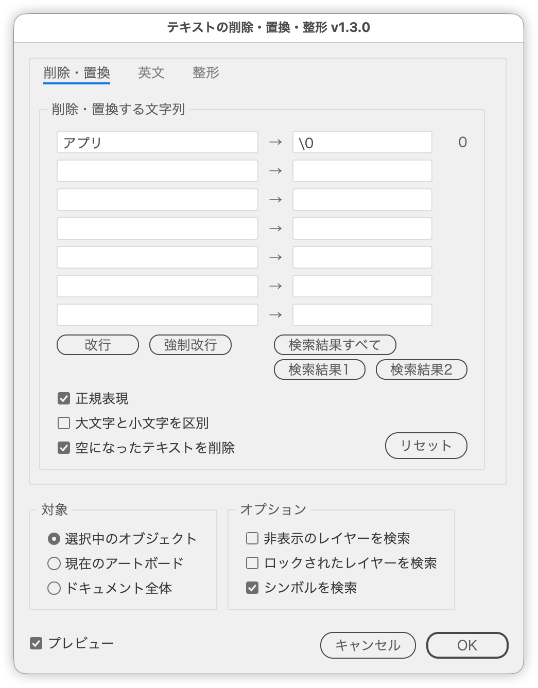
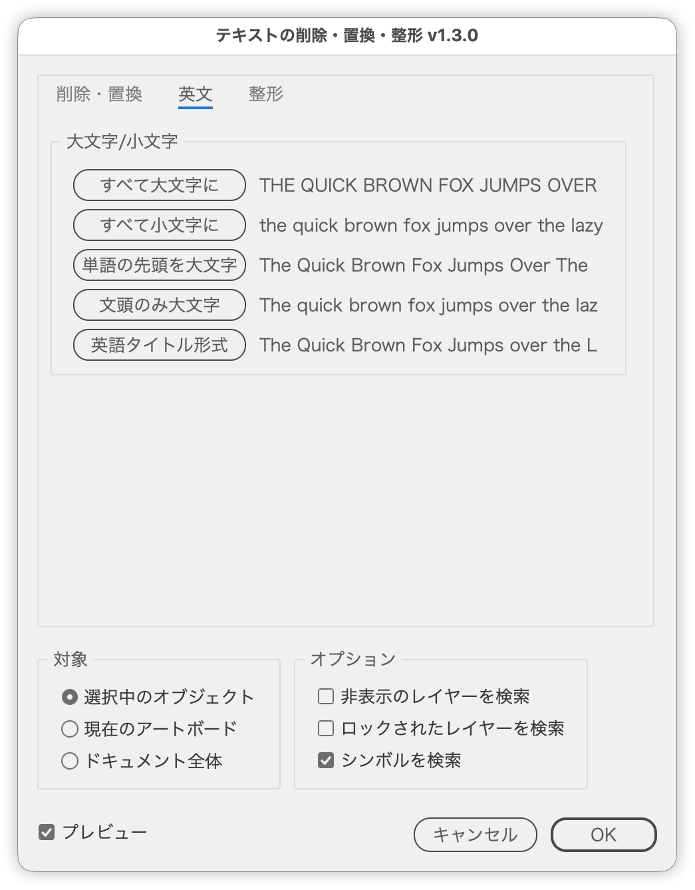
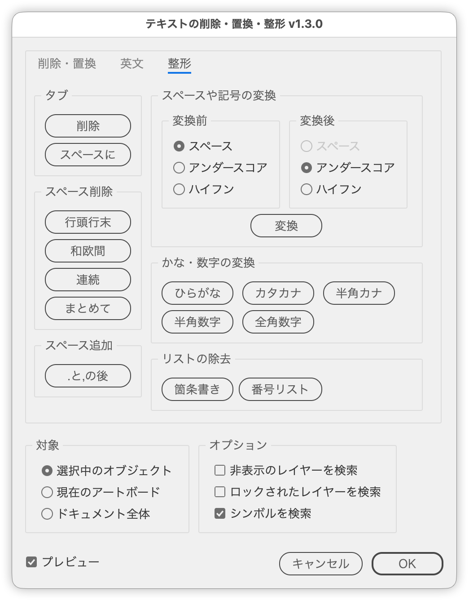

# Remove, replace and clean up text

---

### Overview

- Removes or replaces strings in text in one go, and also changes letter case and tidies spaces, symbols, kana and digits.
- The dialog has three tabs: Remove / Replace, English and Cleanup. The scope (selected objects, current artboard or entire document) and options are shared by all three.
- Only the changed characters are rewritten, so the formatting of the remaining text (color, font, size, etc.) is kept.
- Text in symbols and hidden or locked text can be included.

### Features

#### Remove / Replace tab

- Up to seven strings to remove (empty fields are ignored; fields are processed from top to bottom)
- A replacement for each field (empty to remove; with regular expressions, `$1` / `\1`, `$&` / `\0` etc. refer to the match)
- Shows the number of matches in the scope for each field (updated as you type or change the scope)
- Regular expressions and case-sensitive or case-insensitive search
- `\n` for a paragraph break and `@#` for a forced line break (inserted at the cursor with buttons or shortcuts)
- Buttons and shortcuts that insert the match references `\0`, `\1` and `\2`
- Deletes text left empty by the removal
- Reports the removed / replaced count per field, and the numbers of changed text, deleted text and rewritten symbols
- Remembers the entries and settings for the next run

#### English tab

- UPPERCASE / lowercase / Capitalize Words / Sentence case / Title Case
- A sample of the result is shown next to each button

#### Cleanup tab

- Tabs: Remove / To Spaces
- Remove Spaces: leading/trailing, between CJK and Latin, consecutive, all at once
- Add Space: after . and ,
- Spaces & Symbols: convert between space, underscore and hyphen
- Kana & Digits: Hiragana / Katakana / Halfwidth Kana, Halfwidth Digits / Fullwidth Digits (kanji numerals become Arabic too)
- Remove List: strip leading bullets and numbers

#### Common

- Preview the result without closing the dialog
- Scope: selected objects (including inside groups) / current artboard (text that overlaps it) / entire document
- Falls back to the entire document when nothing is selected
- Processes text in hidden or locked layers and objects (released only while processing, then restored)
- Processes text in symbols (by rewriting the symbol definition)

### How to use

1. Select the target, or run the script with nothing selected
2. Enter strings in the left fields under "Text to Remove / Replace" (to replace, also fill in the field right of "→"; the match count appears at the right end)
3. Choose the scope and options, check the result with Preview if needed, then click Apply (or press Enter). The dialog stays open so you can continue; click Close when done

### Dialog

| Item | Description |
| --- | --- |
| Text to Remove / Replace | Left: strings to search for (seven fields). Empty fields are ignored; fields are processed from top to bottom. Right of "→": replacement text; leave empty to remove. The number at the right end is the match count in the scope; "!" means an invalid regular expression |
| Paragraph Break | Inserts `\n` (paragraph break) into the field with the cursor. Command (Ctrl) + Enter does the same |
| Forced Line Break | Inserts `@#` (forced line break) into the field with the cursor. Shift + Enter does the same |
| Whole Match | Inserts `\0` (the whole match) into the field with the cursor. Option (Alt) + 0 does the same. Available with regular expressions only |
| Group 1 / Group 2 | Inserts `\1` / `\2` (the text matched by the first / second `( )`) into the field with the cursor. Option (Alt) + 1 / 2 does the same. Available with regular expressions only |
| Regular expression | Treats the input as JavaScript regular expressions. `^` and `$` match the start and end of each paragraph. Replacements can use `$1`–`$99`, `$&` and `$$`, as well as `\0` (whole match), `\1`–`\9` (groups) and `\\` (a literal `\`) |
| Match case | When on, upper- and lowercase letters are treated as different. When off, they are treated as the same |
| Delete emptied text | Deletes text frames emptied by this run. Frames that were already empty and threaded text frames are kept |
| Selected objects | Selected text (including inside groups). Unavailable when nothing is selected |
| Current artboard | Text that overlaps the active artboard, even partly |
| Entire document | All text in the document |
| Check hidden layers | Includes text in hidden layers and objects. They are shown only while processing, then hidden again |
| Check locked layers | Includes text in locked layers and objects. They are unlocked only while processing, then locked again |
| Check symbols | Includes text inside symbols in the scope |
| Cleanup tab buttons | Tidy the text in the scope right away, following options such as "Check hidden layers". For Spaces & Symbols, choose Before and After, then click Convert |
| English tab buttons | Convert the text in the scope right away, following options such as "Check hidden layers". The sample on the right is the first text in the scope converted |
| Reset | Clears the fields and restores the scope and options to their defaults. The preview setting is kept |
| Preview | While on, shows the result without closing the dialog and updates it as the input, scope or options change |
| Apply | Removes or replaces in the scope. No result message is shown; the match counts update instead. The dialog stays open |

### Notes

- The match count of each field ignores removals and replacements by the other fields. When the strings overlap, the actual number processed may differ.
- Replaced text is searched by the fields below.
- Replaced text takes the formatting of the first character of the match. Mixed formatting within a match becomes a single format.
- In the search and replace fields, `\n` means a paragraph break and `@#` a forced line break, with or without regular expressions. To find a backslash followed by `n` with regular expressions, write `\\n`.
- The preview covers only visible, unlocked, standalone text. Text in symbols, hidden or locked text, and threaded text stay unchanged in the preview but are processed on Apply.
- "Check symbols" rewrites the symbol definition itself, so instances of the same symbol outside the scope change as well.
- Symbols are recreated and swapped, so symbol options such as the registration point and 9-slice scaling are reset.
- With "Check symbols" on, symbols are expanded temporarily in the dialog to count matches. The dialog may open slowly in documents with many symbols.
- Clicking Apply or closing with Close saves the entries and settings for the next run.
- Apply and the buttons on the English and Cleanup tabs take effect as soon as they are clicked. To revert, close the dialog and use Undo.
- Pressing Enter on the English or Cleanup tab does not run Remove / Replace.
- When a conversion changes the number of characters (halfwidth kana voicing marks, kanji numerals, etc.), the changed part takes the formatting of its first character. Added spaces take the formatting of the preceding character.
- Bullets and Numbers first run *Convert to Text* (the menu command) on Illustrator bullet and numbered lists, then remove the leading markers. Markers typed as text are removed as well. Text is selected temporarily for the conversion; the original selection is restored when the dialog closes.

### Article

- [DTP Transit (Japanese)](https://note.com/dtp_tranist/n/nec5dfffce709)

### Changelog

- v1.0.0 (20260926) : Initial release
- v1.1.0 (20260926) : Added replace fields
- v1.2.0 (20260926) : Added Preview. Added buttons and shortcuts for paragraph and forced line breaks, buttons for match references, and a Reset button. Replacements accept `\0`–`\9` and `\\`. Fixed an error when selected text was emptied and deleted
- v1.2.1 (20260926) : Renamed options to match Illustrator's Find and Replace ("Ignore case" → "Match case" with saved settings converted; "Search …" → "Check …"). Fixed saved settings not being applied to the match counts when the dialog opens
- v1.3.0 (20260926) : Split the dialog into Remove / Replace, English and Cleanup tabs, and added English (letter case) and cleanup (tabs, spaces, symbols, kana, digits, list removal, etc.). Moved "Delete emptied text" into the Text to Remove / Replace panel. Increased the fields from five to seven. Renamed the dialog to "Remove, Replace & Clean Up Text" and added tooltips to the buttons
- v1.4.0 (20260926) : Replaced OK and Cancel with an Apply button in the Remove / Replace panel and a Close button. Remove / Replace now runs without closing the dialog. Moved Preview into the Remove / Replace panel. Remove / Replace no longer runs while the English or Cleanup tab is open. Removed the result message after Remove / Replace
