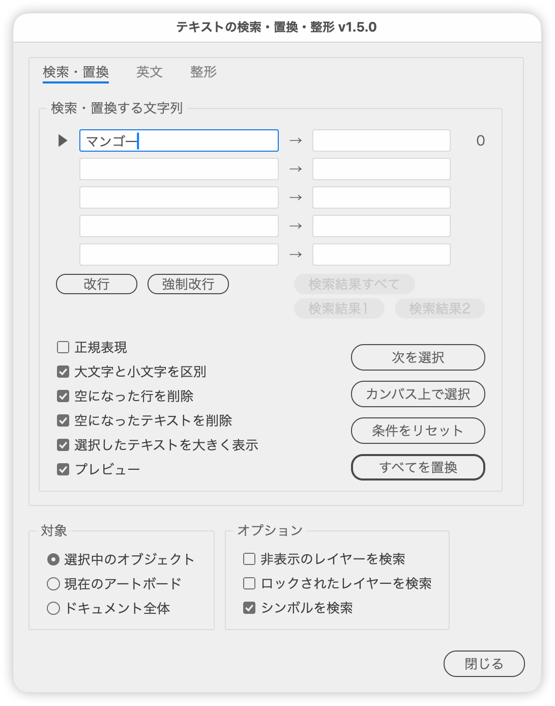
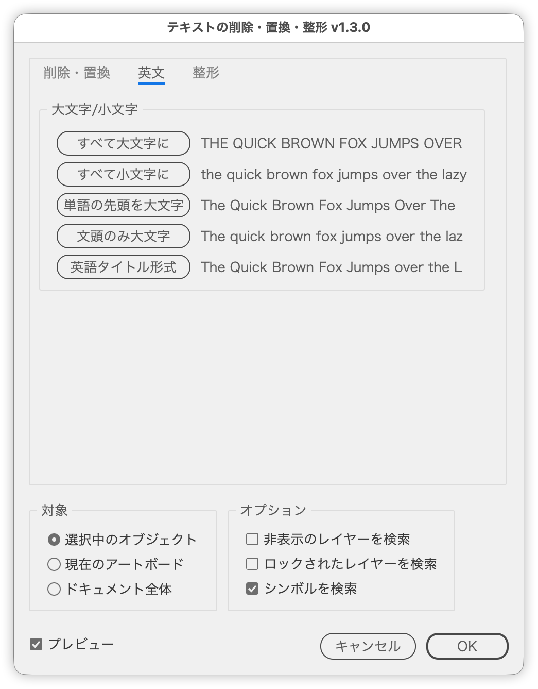
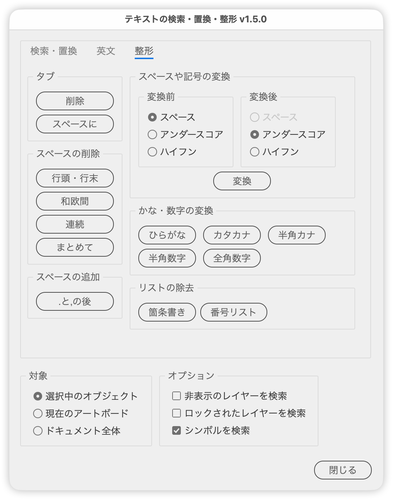

# Find, replace and clean up text

---

### Overview

- Finds, removes or replaces strings in text in one go, and also changes letter case and tidies spaces, symbols, kana and digits.
- Characters matching a search string can be selected on the canvas, one at a time or all at once.
- The dialog has three tabs: Find / Replace, English and Cleanup. The scope (selected objects, current artboard or entire document) and options are shared by all three.
- Only the changed characters are rewritten, so the formatting of the remaining text (color, font, size, etc.) is kept.
- Text in symbols and hidden or locked text can be included.

### Features

#### Find / Replace tab

Find

- Up to five strings to search for (empty fields are ignored; fields are processed from top to bottom)
- Shows the number of matches in the scope for each field (updated as you type or change the scope)
- Regular expressions and case-sensitive or case-insensitive search
- `\n` for a paragraph break and `@#` for a forced line break (inserted at the cursor with buttons or shortcuts)
- Running with characters selected by the Type tool puts them in the first field (or, with a single text object selected with the Selection tool, its first line)

Remove / Replace

- A replacement for each field (empty to remove; with regular expressions, `$1` / `\1`, `$&` / `\0` etc. refer to the match)
- Buttons and shortcuts that insert the match references `\0`, `\1` and `\2`
- Deletes lines (paragraphs) and text left empty by the removal
- Preview the result without closing the dialog (with regular expressions)

Select

- Select Next: selects the next matching characters, wrapping around at the end. The view can zoom so that text fills the window
- Select All: selects every text object containing a match
- Both use the text in the row with the cursor (marked ▶ at the left)

- Remembers the entries and settings for the next run

#### English tab

- UPPERCASE / lowercase / Capitalize Words / Sentence case / Title Case
- A sample of the result is shown next to each button

#### Cleanup tab

- Tabs: Remove / To Spaces
- Remove Spaces: leading/trailing, between CJK and Latin, consecutive, all at once
- Add Space: after . and ,
- Spaces & Symbols: convert between space, underscore and hyphen
- Kana & Digits: Hiragana / Katakana / Halfwidth Kana, Halfwidth Digits / Fullwidth Digits (kanji numerals become Arabic too)
- Remove List: strip leading bullets and numbers

#### Common

- Scope: selected objects (including inside groups) / current artboard (text that overlaps it) / entire document
- Falls back to the entire document when nothing is selected
- Processes text in hidden or locked layers and objects (released only while processing, then restored)
- Processes text in symbols (by rewriting the symbol definition)

### How to use

To remove or replace

1. Select the target, or run the script with nothing selected
2. Enter strings in the left fields under "Text to Find / Replace" (to replace, also fill in the field right of "→"; the match count appears at the right end)
3. Choose the scope and options, with regular expressions, check the result with Preview if needed, then click Replace All (or press Enter). The dialog stays open so you can continue; click Close when done

To find and select

1. Select the characters to find with the Type tool, or select a single text object, and run the script (the text goes into the first field), or type a string into a field
2. Put the cursor in the row to search (a ▶ appears at the left) and click Select Next to select each match in turn, or Select All to select them all
3. Close the dialog with Close; the selection is kept

### Dialog

| Item | Description |
| --- | --- |
| ▶ | Marks the row with the cursor. Select Next and Select All use the text in this row |
| Text to Find / Replace | Left: strings to search for (five fields). Empty fields are ignored; fields are processed from top to bottom. Right of "→": replacement text; leave empty to remove. The number at the right end is the match count in the scope; "!" means an invalid regular expression |
| Paragraph Break | Inserts `\n` (paragraph break) into the field with the cursor. Command (Ctrl) + Enter does the same |
| Forced Line Break | Inserts `@#` (forced line break) into the field with the cursor. Shift + Enter does the same |
| Whole Match | Inserts `\0` (the whole match) into the field with the cursor. Option (Alt) + 0 does the same. Available with regular expressions only |
| Group 1 / Group 2 | Inserts `\1` / `\2` (the text matched by the first / second `( )`) into the field with the cursor. Option (Alt) + 1 / 2 does the same. Available with regular expressions only |
| Regular expression | Treats the input as JavaScript regular expressions. `^` and `$` match the start and end of each paragraph. Replacements can use `$1`–`$99`, `$&` and `$$`, as well as `\0` (whole match), `\1`–`\9` (groups) and `\\` (a literal `\`) |
| Preview | Available with regular expressions only. While on, shows the result without closing the dialog and updates it as the input, scope or options change. Not saved; always off when the dialog opens. Turning Regular expression off turns Preview off too |
| Match case | When on, upper- and lowercase letters are treated as different. When off, they are treated as the same |
| Delete emptied lines | When removing leaves a paragraph empty, also removes its break so no blank line is left. Lines that were already empty are kept. On by default |
| Delete emptied text | Deletes text frames emptied by this run. Frames that were already empty and threaded text frames are kept |
| Zoom on select | Changes the zoom and position so the text containing the characters picked by Select Next fills the window (up to 400%). On by default |
| Select Next | Selects the next characters matching the text in the ▶ row, wrapping around at the end. Hidden or locked text and text in symbols are skipped |
| Select All | Selects every text object containing a match for the ▶ row. Hidden or locked text and text in symbols are not selected |
| Reset Criteria | Clears the fields and restores the scope and options to their defaults. The preview setting is kept |
| Replace All | Replaces every match in the scope (removes it when the replacement is empty). No result message is shown; the match counts update instead. The dialog stays open |
| English tab buttons | Convert the text in the scope right away, following options such as "Check hidden layers". The sample on the right is the first text in the scope converted |
| Cleanup tab buttons | Tidy the text in the scope right away, following options such as "Check hidden layers". For Spaces & Symbols, choose Before and After, then click Convert |
| Selected objects | Selected text (including inside groups). Unavailable when nothing is selected |
| Current artboard | Text that overlaps the active artboard, even partly |
| Entire document | All text in the document |
| Check hidden layers | Includes text in hidden layers and objects. They are shown only while processing, then hidden again |
| Check locked layers | Includes text in locked layers and objects. They are unlocked only while processing, then locked again |
| Check symbols | Includes text inside symbols in the scope |

### Notes

- The match count of each field ignores removals and replacements by the other fields. When the strings overlap, the actual number processed may differ.
- Replaced text is searched by the fields below.
- Replaced text takes the formatting of the first character of the match. Mixed formatting within a match becomes a single format.
- In the search and replace fields, `\n` means a paragraph break and `@#` a forced line break, with or without regular expressions. To find a backslash followed by `n` with regular expressions, write `\\n`.
- When selected characters (or the first line of a single selected text object) go into the first field, the previous entries are cleared. Nothing is put in when several objects are selected. With Regular expression on, symbols such as `.` and `(` are escaped with `\` so they are searched literally.
- Select Next and Select All select only visible, unlocked text. Text in symbols cannot be selected.
- A selection made with Select Next or Select All is kept after the dialog closes.
- Clicking Select Next or Select All clears the preview on screen. It comes back when you change the input or scope.
- The preview covers only visible, unlocked, standalone text. Text in symbols, hidden or locked text, and threaded text stay unchanged in the preview but are processed by Replace All.
- "Check symbols" rewrites the symbol definition itself, so instances of the same symbol outside the scope change as well.
- Symbols are recreated and swapped, so symbol options such as the registration point and 9-slice scaling are reset.
- With "Check symbols" on, symbols are expanded temporarily in the dialog to count matches. The dialog may open slowly in documents with many symbols.
- Clicking Replace All or closing with Close saves the entries and settings for the next run.
- Replace All and the buttons on the English and Cleanup tabs take effect as soon as they are clicked. To revert, close the dialog and use Undo.
- Pressing Enter on the English or Cleanup tab does not run Replace All.
- When a conversion changes the number of characters (halfwidth kana voicing marks, kanji numerals, etc.), the changed part takes the formatting of its first character. Added spaces take the formatting of the preceding character.
- Bullets and Numbers first run *Convert to Text* (the menu command) on Illustrator bullet and numbered lists, then remove the leading markers. Markers typed as text are removed as well. Text is selected temporarily for the conversion; the original selection is restored when the dialog closes.

### Article

- [DTP Transit (Japanese)](https://note.com/dtp_tranist/n/nec5dfffce709)

### Changelog

- v1.0.0 (20260926) : Initial release
- v1.1.0 (20260926) : Added replace fields
- v1.2.0 (20260926) : Added Preview. Added buttons and shortcuts for paragraph and forced line breaks, buttons for match references, and a Reset button. Replacements accept `\0`–`\9` and `\\`. Fixed an error when selected text was emptied and deleted
- v1.2.1 (20260926) : Renamed options to match Illustrator's Find and Replace ("Ignore case" → "Match case" with saved settings converted; "Search …" → "Check …"). Fixed saved settings not being applied to the match counts when the dialog opens
- v1.3.0 (20260926) : Split the dialog into Remove / Replace, English and Cleanup tabs, and added English (letter case) and cleanup (tabs, spaces, symbols, kana, digits, list removal, etc.). Moved "Delete emptied text" into the Text to Remove / Replace panel. Increased the fields from five to seven. Renamed the dialog to "Remove, Replace & Clean Up Text" and added tooltips to the buttons
- v1.4.0 (20260926) : Replaced OK and Cancel with an Apply button in the Remove / Replace panel and a Close button. Remove / Replace now runs without closing the dialog. Moved Preview into the Remove / Replace panel. Remove / Replace no longer runs while the English or Cleanup tab is open. Removed the result message after Remove / Replace
- v1.4.1 (20260928) : The dialog now reopens where it was last closed and moves sideways to avoid covering the selection; opacity unified at 97%
- v1.4.2 (20260928) : The button row is now built with the shared part. Settings are now saved through the shared part (stored in Folder.userData/illustrator-scripts/SmartTextFindReplace.json)
- v1.4.3 (20260929) : Dialog opacity changed to 98%
- v1.5.0 (20260930) : Renamed the dialog to "Find, Replace & Clean Up Text" and the Remove / Replace tab to Find / Replace. Added Select Next, Select All, "Zoom on select" and "Delete emptied lines" to Find / Replace. Running with characters selected by the Type tool puts them in the first field. Reduced the fields from seven to five. Renamed Apply to Replace All and Reset to Reset Criteria. Fixed an error when running with characters selected
- v1.5.1 (20260930) : Preview is now available with regular expressions only and sits right below Regular expression. Running with a single text object selected with the Selection tool now also puts its first line in the first field. Fixed Preview sometimes starting on, and an error when running with characters selected and the scope set to Selected objects
- v1.5.2 (20260930) : Button rows with only right-side buttons are now centered
- v1.5.3 (2026-10-01) Unified the window and panel margins and spacing with the shared layout part
- v1.5.4 (2026-10-01) Added space below the button row to match Illustrator's own dialogs
