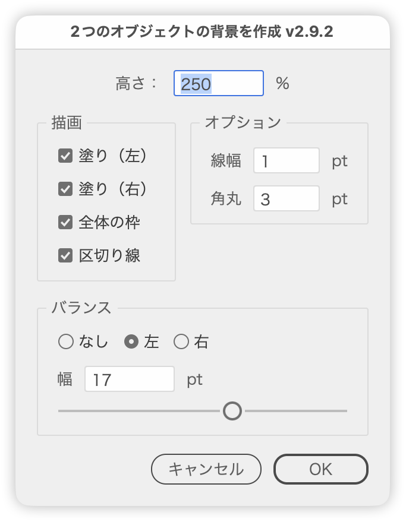

# Build a split background behind two objects

---

### Overview

- Select two objects (text, paths, groups and so on) and run the script to draw a two-color background behind them.
- Whether it splits left/right or top/bottom is decided from how the two objects are placed (whichever gap is larger; a tie goes left/right).
- Set the size and split position in the dialog, adjust them while watching the preview, and click OK to commit.

### Main Features

- Background size: the height for a left/right split, or the width for a top/bottom split, as a percentage of the area spanning both objects (200% by default). In the other direction the background extends past the objects by the same margins as the gap.
- Split position: the split falls in the gap between the objects. Balance chooses between splitting at the middle and pinning the width of one side.
- Elements: combine a fill on each side, an overall frame and a divider. The left (top) fill is light gray (RGB 220), the right (bottom) fill is dark gray (RGB 128), and the frame and divider are K100. The colors can be changed in the user settings at the top of the script.
- Corners: fills are rounded on their two outer corners only; the overall frame gets the Round Corners effect.
- Accurate measuring: text is measured from an outlined copy so side bearings do not shift the background (the copy is deleted right away). Clip groups are measured by their mask.
- Placement: the background goes on the backmost of the two objects' layers. Fills sit at the back of that layer, with the overall frame and divider in front of them.

### Usage

1. Select the two objects that need a background
2. Run the script
3. Adjust the values while watching the preview, then click OK

### Options

- Height (Width for a top/bottom split): background size in percent
- Drawing panel: Fill (Left) and Fill (Right) (Fill (Top) and Fill (Bottom) for a top/bottom split), Overall frame, Divider
- Options panel: Stroke width sets the weight of the frame and divider (in the stroke units preference); Corner radius sets the corner size (in ruler units; 0 keeps square corners). Controls that do not apply are dimmed
- Balance: None splits at the middle of the gap. Left or Right (Top or Bottom for a top/bottom split) pins that side's margin to Width and gives the rest to the other side. Width is capped at the gap and can also be set with the slider (hold Option while dragging for whole units)
- In the number fields, Up/Down steps by ±1, Shift+Up/Down by ±10 (snapping to multiples of 10), and Option+Up/Down by ±0.1
- Dialog values carry over to the next run until Illustrator quits

### Notes

- Runs only with exactly two objects selected, and not while characters are selected with the Type tool.
- The preview is drawn on a dedicated layer (`__SplitBackgroundForTwo__PreviewLayer__`) that is removed when the dialog closes. Cancel also restores the selection.
- Preview drawing stays in the undo history. Undoing after Cancel can briefly bring the preview back.
- On OK, the two original objects move to the front of their layer so they sit above the overall frame and divider.
- Clicking OK with an invalid stroke or corner value returns to that field (fields that are not in use are ignored).

### Article

- [DTP Transit 別館 (Japanese)](https://note.com/dtp_tranist/n/n1b7b8759e53b)

### Update History

- v1.0 (20260124): Initial version
- v1.1 (20260126): Added Balance (None / Left / Right) and Width so the left/right ratio can be tuned; Width takes the inter-object gap as its maximum and supports slider, numeric input and arrow keys
- v2.0 (20260126): Added Direction (Left/Right, Top/Bottom). A top/bottom arrangement gets a top/bottom split, and Balance (None / Top / Bottom) with Width sets where the gap is divided
- v2.1 (20260126): Left/right versus top/bottom is detected from the selected objects' positions, and the Direction control was removed from the dialog
- v2.2 (20260126): Added #targetengine so the last dialog values are restored until Illustrator restarts
- v2.3 (20260126): Added PreviewHistory to undo previews in one go, keeping them out of the history
- v2.4 (20260126): OK now always draws the final result after undoing the preview, so it matches what was shown
- v2.5 (20260126): Fixed OK resetting the last values when the preview was removed (corner radius and others were not applied)
- v2.6 (20260126): Removed temporary outline items that came back after PreviewHistory.undo()
- v2.7 (20260228): Each preview refresh now undoes the previous preview once and replaces it, fixing shapes and strokes created twice on OK
- v2.8 (20260228): Preview rollback now deletes preview-marked objects directly instead of relying on undo, fixing stroke previews that did not update or doubled up
- v2.9 (20260228): Previews are drawn on a dedicated layer and cleared layer by layer, further reducing leftovers and duplicates
- v2.9.2 (20260922): Fixed OK drawing with the last preview's values instead of the dialog's (settings could be ignored, for example after clearing the stroke or corner field). Removed the Preview checkbox; the preview is now always on. OK with an invalid stroke or corner value now returns to that field. Fixed the default stroke becoming 0 with inch or cm stroke units, which kept the preview from appearing. Fixed Cancel still moving the original objects to the front and dropping the selection, and the script rewriting the print and template settings of the objects' layer. Fixed an error on whitespace-only text, and shapes appearing at the origin when run with two characters selected while editing text. Fixed preview layers piling up for objects on sublayers. Clip groups are now measured by their mask. Fixed Width not accepting a decimal point. Rounding now follows the unit size (1 decimal for pt, 2 for mm, 3 for in, cm and larger units), and the last values are kept in pt so they survive a unit change. In a top/bottom split, the Balance tooltips now describe top and bottom. Objects are measured once when the dialog opens, which speeds up the preview. Internal cleanup
