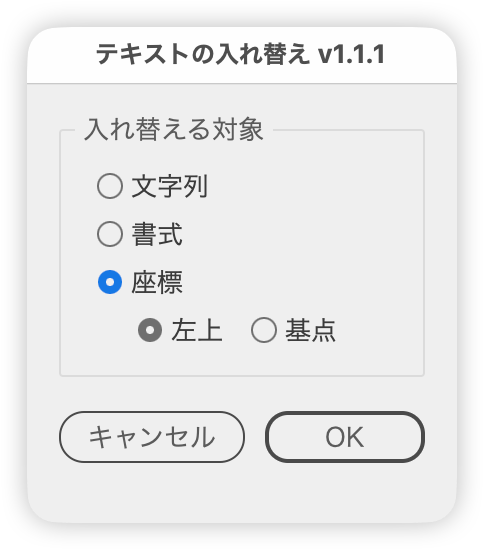

# Swap the contents of two text objects

---

### Overview

Swaps the contents of two selected text objects.
A dialog lets you choose what to swap (string / format / position).

- String: swaps only the strings. The formatting and positions stay put. Text with mixed formatting takes on the formatting of its first character.
- Format: swaps the font, size, fill color, stroke color, stroke weight, tracking, leading, horizontal / vertical scale, baseline shift, and capitalization. The strings and positions stay put.
- Position: swaps only the positions, using one of two reference points.
  - Top left: lines up the top-left corners of the text bounds.
  - Anchor point: lines up the text anchor points (on the baseline, at the alignment point). Point text of different sizes or alignments lands where the other one's anchor was.

### Notes

- Exactly two objects must be selected, and both must be text objects. Shows an alert if the conditions are not met.
- Paragraph formatting, such as the auto leading percentage and the paragraph alignment, is not swapped by Format.

### Update history

- v1.1.1 (2026-10-09) The button row is now always centered
- v1.1.0 (2026-10-09) Position can now swap by the top-left corner or by the anchor point. Fixed again an error when running with characters selected by the Type tool. Swapping the format no longer adds a stroke to text without one
- v1.0.10 (2026-10-04) Japanese labels now end with " :" (half-width space and colon) (shared part update)
- v1.0.9 (2026-10-01): Added space below the button row to match Illustrator's own dialogs
- v1.0.8 (2026-10-01): Unified the window and panel margins and spacing with the shared layout part
- v1.0.7 (2026-10-01): Button rows with only right-side buttons are now centered in dialogs up to 200 px wide (inside the margins) and right-aligned in wider ones
- v1.0.6 (2026-09-30): Button rows with only right-side buttons are now centered
- v1.0.5 (2026-09-30): Fixed an error when running with characters selected by the Type tool
- v1.0.4 (2026-09-29): Dialog opacity changed to 98%
- v1.0.3 (2026-09-28): The button row is now built with the shared part
- v1.0.2 (2026-09-28): The dialog now reopens where it was last closed and moves sideways to avoid covering the selection; opacity unified at 97%

### Script info

- Version: v1.1.1
