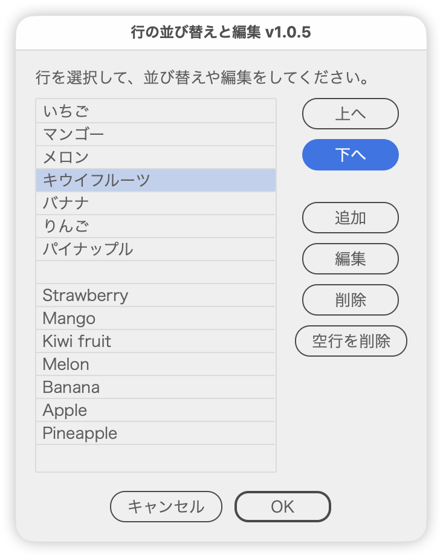

# Reorder and edit the lines of a text object

---

### Overview

Reorders and edits the lines of the selected text object from a list.

### Features

- Up and Down buttons change the line order
- Line contents can be edited in the list

### Usage

1. Select a single text object.
2. Run the script.
3. Pick a line, reorder it, edit it if needed, and apply.

### Notes

- Multi-line text is required; empty or single-line text produces a warning.

### Article

https://note.com/dtp_tranist/n/n21bb9a835075

### Update History

- v1.0.9 (2026-10-06) Confirmation dialogs for deleting or overwriting now default to No (Enter cancels)
- v1.0
- v1.0.2 (2026-09-28): The dialog now reopens where it was last closed and moves sideways to avoid covering the selection; opacity unified at 97%
- v1.0.3 (2026-09-28): The button row is now built with the shared part
- v1.0.4 (2026-09-29): Dialog opacity changed to 98%
- v1.0.5 (2026-09-30): Revised the instruction text, added tooltips to Add, Remove Empty Lines and the line list, and cleaned up the code. Fixed an error when running with characters selected by the Type tool
- v1.0.6 (2026-10-01) The button row, previously always centered, is now centered in dialogs up to 200 px wide (inside the margins) and right-aligned in wider ones. Unified the window and panel margins and spacing with the shared layout part
- v1.0.7 (2026-10-01) Added space below the button row to match Illustrator's own dialogs
- v1.0.8 (2026-10-04) Japanese labels now end with " :" (half-width space and colon) (shared part update)
