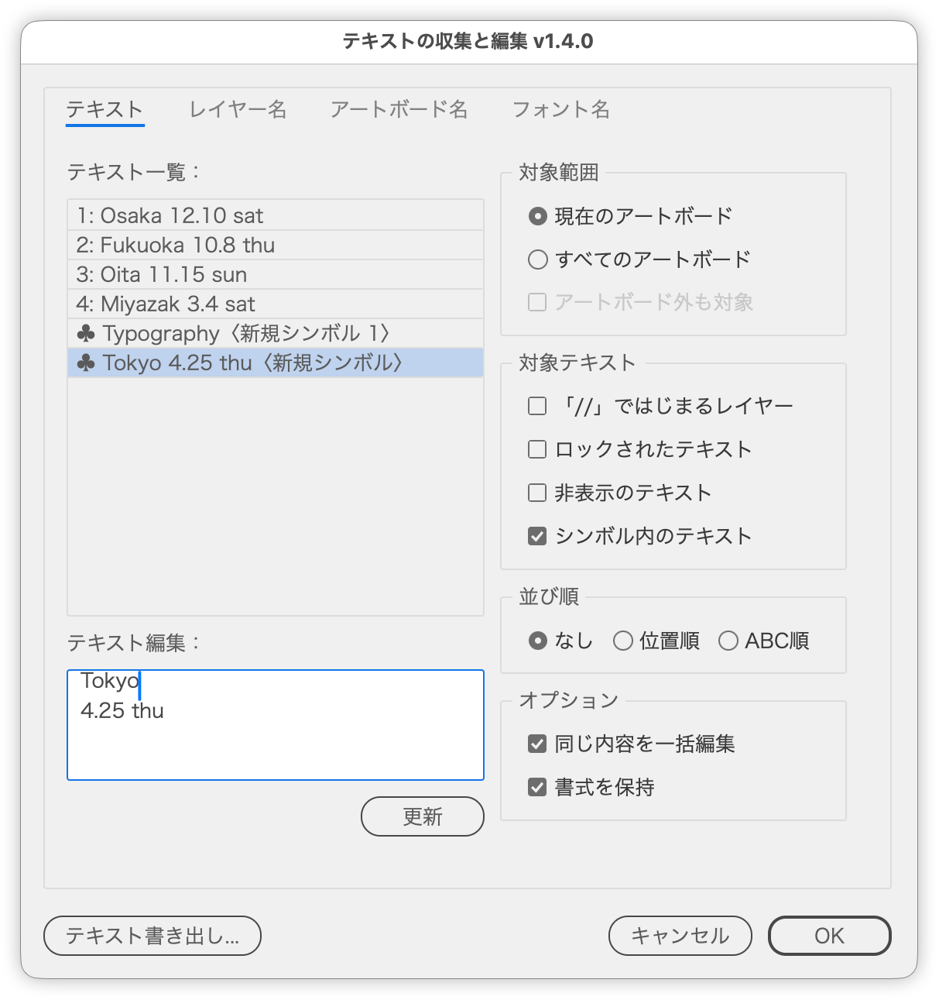

# List the document's text, edit it and write it back

---

### Overview

Lists the text in the document, including text in symbols, and writes your edits back while keeping the formatting.
You can also review layer, artboard and font names, and export the text and font names to a text file.

### Features

- Text tab: lists the target text; select a row and edit it
  - Text in symbols is listed at the end, marked with ♣, and can be edited the same way
  - The Paragraph Break and Forced Line Break buttons insert a break at the cursor
  - Update applies the edit to the document so you can move on to the next row without closing the dialog
- Layer Names and Artboard Names tabs: show the name lists
- Font Names tab: lists the fonts in use, including those in symbols; click a row to select the text that uses it
- Export Text...: writes the text and font names, grouped by artboard, to a text file on the desktop
- Copy Text: copies the full text of every row in the text list to the clipboard

### Usage

1. Run the script.
2. Choose which text to list with Scope and Text to Include.
3. Select a row in the Text List and rewrite it in Edit Text.
4. Click Update to keep editing, or OK to finish.

Insert paragraph and forced line breaks at the cursor with the buttons at the top right of Edit Text. A forced line break can also be typed with Shift+Enter and is shown as `@#` in the edit field.

### Options

| Option | Description |
|---|---|
| Scope | Current Artboard / All Artboards. Include Outside Artboards widens it to the whole document |
| Text to Include | Whether to include layers starting with //, locked or hidden text, and text in symbols |
| Sort | None / By Position (top to bottom, left to right at the same height) / Alphabetical |
| Selected Text Only | Limits the list, edits, and export to the text selected when the script started. Text in a symbol is listed only when one of its instances was selected. Unavailable when nothing is selected |
| Edit Identical Text Together | Lists identical text as one row and applies the edit to every copy |
| Keep Formatting | Rewrites only the changed characters and keeps character and paragraph formatting. When off, the whole text takes the formatting of its first character |

### Notes

- Editing text in a symbol rewrites the symbol definition. Instances outside the scope change too, and symbol options such as the registration point are reset.
- Edits applied with Update are not reverted by Cancel (use Illustrator's Undo).

### Article (Japanese)

https://note.com/dtp_tranist/n/nb845889dd553

### Update History

- v1.6.1 (2026-10-04) Japanese labels now end with " :" (half-width space and colon) (shared part update)
- v1.6.0 (2026-10-01)Added Paragraph Break and Forced Line Break buttons above the right of the Edit Text field to insert them at the cursor
- v1.5.6 (2026-10-01) The button row, previously always centered, is now centered in dialogs up to 200 px wide (inside the margins) and right-aligned in wider ones. Unified the window and panel margins and spacing with the shared layout part
- v1.5.5 (2026-09-30)Fixed an error when running with characters selected by the Type tool
- v1.5.4 (2026-09-29)Dialog opacity changed to 98%
- v1.5.3 (2026-09-28)
  - The button row is now built with the shared part
- v1.5.2 (2026-09-28)
  - The dialog now reopens where it was last closed and moves sideways to avoid covering the selection; opacity unified at 97%
- v1.5.1 (2026-09-27)
  - Added Selected Text Only to the left of Update
- v1.5.0 (2026-09-26)
  - Added Copy Text (merged in from TextExport.jsx)
- v1.4.0 (2026-09-26)
  - Text in symbols can now be edited (added "Text in Symbols" to Text to Include)
  - Text inside locked groups or locked parent layers can now be rewritten
  - Renamed Keep Paragraph Formatting to Keep Formatting; it now rewrites only the changed characters (fixes the first character of line 2 taking line 1's formatting)
  - Added an Update button below the edit field to apply edits without closing the dialog
  - The Font Names tab and exported font names now include fonts used in symbol text
  - Fixed the selection being cleared after export, and font selection matching fonts whose names only partly match
  - Removed the Preview option, and moved the edit options into an Options panel
  - Revised panel and option wording (Canvas tab → Text tab, and others)
- v1.5.8 (2026-10-01)Selected Text Only now also limits the list and export to the selected text
- v1.5.7 (2026-10-01)Added space below the button row to match Illustrator's own dialogs
- v1.3.6 (2026-04-08)
