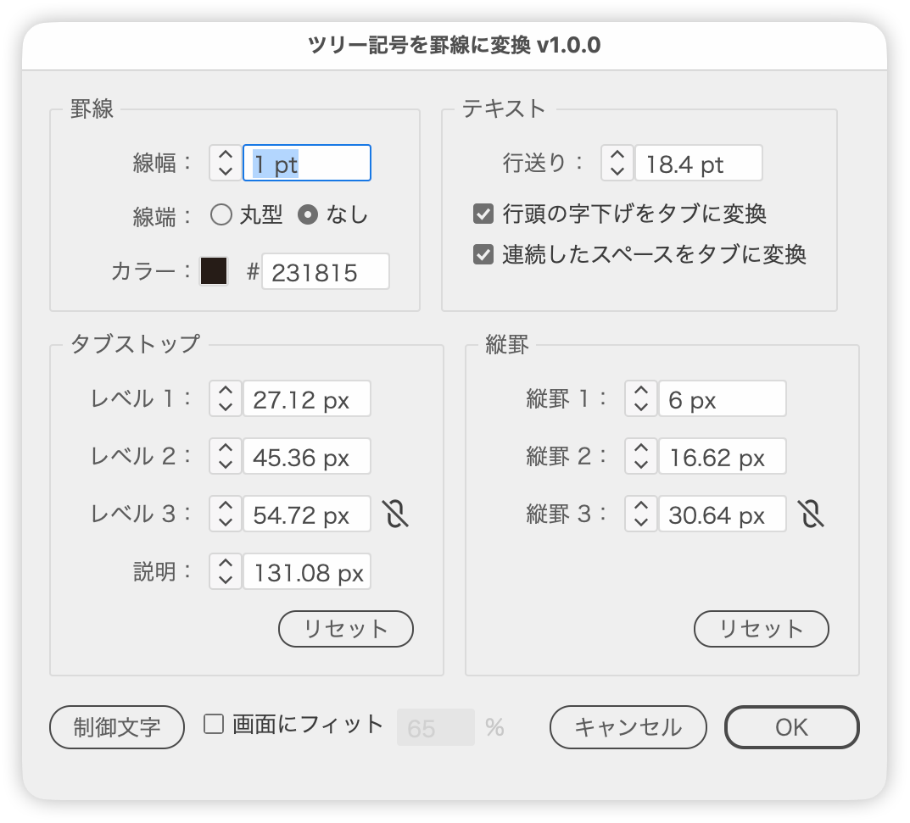

# Convert tree symbols in text into stroked paths

---

### Overview

Converts the tree symbols (├─, └─, │, the ├── from the tree command and so on) in the selected text into stroked paths, and turns indents and the gaps
between names and descriptions into tabs. The line and tab stop positions are adjusted with a live preview.

### Features

- Converts ├─, └─ and │ (including the heavy ┣, ┗, ┃ and ━, and the ├── from the tree command) into stroked paths
- Deletes the symbols from the text without moving the names
- Turns indents into tabs, with one tab stop per level
- Turns two or more spaces between a name and its description into a tab and lines up the descriptions
- Joins the vertical lines across the line gaps, and drops a child's └ from its parent's arm
- Keeps a live preview of the result while the dialog is open
- Japanese / English UI

### Usage

1. Select text that contains tree symbols (text inside groups, or text you are editing, also works).
2. Run the script.
3. Adjust the lines and positions, then click OK. Cancel restores the original text and view.

The lines are created as a group named "Tree Lines" on the current layer.

### Options

| Panel | Item | What it does |
| --- | --- | --- |
| Lines | Weight | Line weight, in the Stroke units set in Preferences |
| Lines | Cap | Round or Butt. The join follows: round for Round, miter for Butt |
| Lines | Color | Click the swatch for the standard Color Picker, or type a hex value (RRGGBB) in the field |
| Text | Leading | Leading for the whole text. Changing it sets a fixed value |
| Text | Convert indents to tabs | Turns indents into tabs with tab stops at the names. When off, the gaps are filled with kerning |
| Text | Convert space runs to tabs | Turns the gap between a name and its description into a tab and lines up the descriptions |
| Tab Stops | Level 1… / Description | Tab stop positions for the names at each level and for the description column |
| Vertical Rules | Rule 1… | Horizontal position of each vertical line |
| (bottom) | Hidden Characters | Toggles hidden characters |
| (bottom) | Fit to Window | Zooms so the preview fills the given share of the window |

- When a tab stop or rule catches up with its neighbor, the neighbor is pushed 1 unit further.
- The link icon (Link evenly) next to Level 3 and Rule 3 places the third one onward at the spacing between the first two.
- Reset in each panel returns the positions to their automatic values.

### Notes

- Works on horizontal text. Empty text is skipped.
- A corner (├, └, ┣, ┗) becomes a line only when a bar (─, ━) follows it. The long vowel mark ー is not a bar and stays as text.
- The tab stops of converted paragraphs are replaced by the ones the script sets.
- Text whose glyph count does not match its characters (ligatures and the like) cannot be measured and is skipped; the count is reported at the end.
- With large text, redrawing the preview after a change can take a while.

### Update History

- v1.0.0 (2026-10-01) Initial release
- v1.0.1 (2026-10-01) The long vowel mark ー is no longer treated as a line and stays as text. Supports the heavy corners ┣ and ┗ and runs of bars such as ├── (tree command output). Empty text is now skipped
