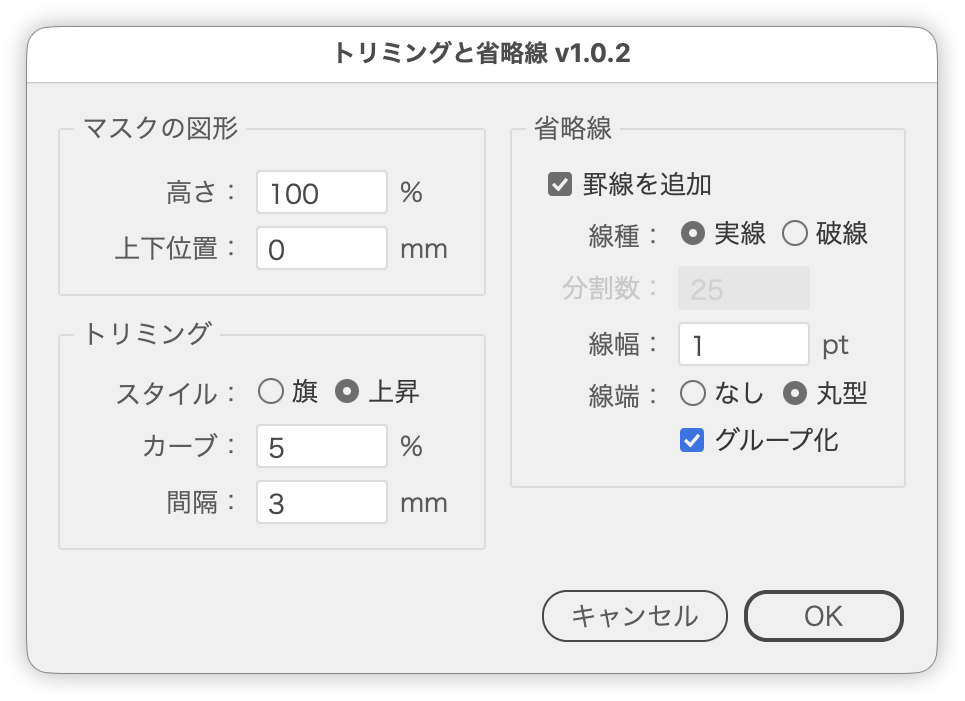

# Trim an image with break lines

---

### Overview

- Select an object (image, group, path, …) and a path drawn over it: the script builds the two parts without the covered area and closes them up to a set gap.
- A path spanning the artwork horizontally splits it top and bottom, one spanning it vertically splits it left and right (decided from how much of the artwork it spans).
- Handy for shortening long screenshots or menus while keeping both ends visible.
- The cut edge can be bent with a Flag or Rise warp, and break lines can be drawn along it.

### Features

- Trims the artwork to the width of the mask path (its height when cutting left and right)
- Picks the cut direction automatically (top/bottom or left/right)
- Cut-edge shape from Flag or Rise, with the bend set in percent
- Both cut edges come from the same curve, so the gap stays even after closing up
- Gap between the parts, entered in the ruler unit
- Break lines along the cut edge (solid or dashed, segment count, cap)
- Groups each break line with the part it belongs to
- Live preview from the moment the dialog opens
- Restores the settings used last time (`~/Library/Application Support/TrimWithBreakLine/settings.txt`)
- Distances use the ruler unit, the stroke weight uses the Stroke unit (Preferences › Units)

### How to use

1. Draw a rectangle (or any path) over the area to drop, then select it together with the artwork (image, group, path, …).
2. Run the script.
3. Set the cut-edge shape, the gap and the break lines in the dialog while watching the preview.
4. Click OK. The original artwork and the mask path are removed, and the two new parts are selected.

The path acts as the mask shape, and its size across the cut sets the finished size (when the artwork is a path too, the one in front is the mask). The cut direction follows how much of the artwork's width and height the path spans. Draw it inside the two edges along the cut (the top and bottom edges when cutting top and bottom).

### Dialog

| Item | Description |
| --- | --- |
| Height / Width | Size of the mask shape along the cut (%). 100% keeps it as drawn; the label follows the direction |
| Offset | Position of the mask shape (ruler unit). Positive moves it down or right, negative up or left |
| Style | Shape of the cut edge: Flag waves, Rise curves upward to the right |
| Bend | How much the cut edge bends (0-100%). 0 cuts along a straight line |
| Gap | Distance between the two parts after closing up (ruler unit) |
| Add rules | Draws a break line along each cut edge |
| Style | Solid or dashed |
| Segments | Number of dashes. Dash and gap are equal, and both ends finish with a dash |
| Weight | Stroke weight of the break lines (Stroke unit) |
| Cap | None (butt cap) or Round |
| Group with parts | Groups each break line with the part it was cut from |

### Keyboard

| Key | Action |
| --- | --- |
| Up / Down | Change a number field by 1 |
| Shift + Up / Down | Snap to multiples of ten |
| Option + Up / Down | Change by 0.1 |

### Notes

- Select exactly two objects: the artwork and one path.
- The mask path must sit inside the two edges along the cut direction.
- The tone of the lines is set by `RULE_STROKE_GRAY` at the top of the script.
- Clicking OK stores the settings and the next run starts from them.
- The preview is built from duplicates; Cancel removes them and restores the original selection.

### Article

- [DTP Transit (Japanese)](https://note.com/dtp_tranist/n/n2483bd96e284)

### Update history

- v1.0.2 (20260921) : Left/right cutting with automatic direction detection; any object can be the artwork; settings are restored. Added the Mask shape panel (height and offset) and the stroke weight of the break lines; distances use the ruler unit and the weight uses the Stroke unit
- v1.0.1 (20260921) : Initial release
