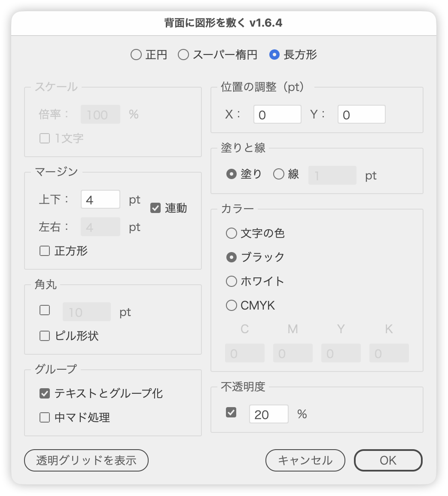

# テキストやオブジェクトの背面に図形を敷く

---

### 概要

選択したテキストやオブジェクトの背面に、正円・スーパー楕円・長方形の図形を敷きます。

図形の大きさは、テキストをアウトライン化したときの見た目の寸法を基準に決まります。既存の背面図形を一緒に選んでいれば、形状を読み取って置き換えます。

### 主な機能

- 形状は正円／スーパー楕円／長方形の3種類（E / S / R キーでも切り替え）
- 長方形は、マージン・正方形・角丸・ピル形状を指定可能
- 塗りか線か、カラー（文字の色／ブラック／ホワイト／CMYK）、不透明度を指定
- 背景とテキストのグループ化、中マドで文字部分を抜く処理に対応
- ダイアログを開いている間はプレビューを表示し、［OK］で1回のUndoにまとめて確定
- 設定は Illustrator を終了するまで記憶

### 使い方

1. 背景を敷きたいテキストまたはオブジェクトを選択します。
2. スクリプトを実行します。
3. 形状と各項目を指定し、プレビューを確かめて［OK］をクリックします。

**対象の決まり方**

- 選択にテキストが含まれていれば、最初のテキスト（グループ内も探します）が対象です。
- テキストが無ければ、選択したオブジェクト全体の範囲が対象です。この場合「1文字」と「文字の色」は使えません。

**既存の背面図形の置き換え**

次の選び方では、既存の図形を背面図形とみなし、形状を読み取ってラジオボタンに反映します。［OK］で古い図形を削除し、新しい図形に置き換えます。

- テキストと図形をまとめたグループを1つだけ選択
- テキスト（またはグループ）と図形を一緒に選択

### オプション

| 項目 | 動作 |
| --- | --- |
| スケール：倍率 | 基準の寸法に対する図形の大きさ（％）。初期値は90%。長方形では100%に固定されます（正方形のときを除く） |
| スケール：1文字 | 文字サイズの1.5倍を直径とする円を作ります。空白を除いて1文字だけのテキストでは自動でオンになります |
| マージン：上下／左右 | 基準の寸法の上下・左右に足す余白。初回は対象の短辺の1/4 |
| マージン：連動 | 左右を上下と同じ値にそろえます |
| マージン：正方形 | 正円と同じ直径を一辺にした正方形にします |
| 角丸 | 角の半径。ライブ効果「角を丸くする」で適用します。初回は対象の短辺の1/5 |
| ピル形状 | 高さの半分を半径にして、両端を半円にします |
| テキストとグループ化 | 背景と対象を1つのグループにします |
| 中マド処理 | 「ライブパスファインダー（中マド）」で文字部分を抜きます。オンにするとグループ化と「文字の色」も選ばれます。線のときは使えません |
| 位置の調整：X／Y | 図形の位置をずらす量（定規の単位） |
| 塗りと線 | 塗りにするか、線にするか。線のときは線幅を指定します |
| カラー | 文字の色／ブラック／ホワイト／CMYK |
| 不透明度 | オンにすると、図形の不透明度を指定できます |

マージン・正方形・角丸・ピル形状は、長方形のときだけ使えます。

［透明グリッドを表示］ボタンで、透明グリッドの表示／非表示を切り替えられます。白い背景の見え方を確かめるときに便利です。

**キー操作**

| キー | 動作 |
| --- | --- |
| E / S / R | 正円／スーパー楕円／長方形に切り替え |
| ↑↓ | 数値を±1 |
| Shift + ↑↓ | ±10（10の倍数にスナップ） |
| Option + ↑↓ | ±0.1 |

### 注意点

- 確定時、正円は「シェイプに変換」でライブシェイプに、長方形は「ライブパスファインダー（合体）」の複合シェイプになります。スーパー楕円は8点のパスです。
- プレビューは Illustrator の Undo 履歴を使っています。

### 紹介記事

https://note.com/dtp_tranist/n/na8af4a7016ad

### 更新履歴

- v1.6.4 (2026-09-23): UI文言を見直し（タイトル・パネル名・項目名のコロン・ツールチップ）、ボタンエリアを左右に分けて［透明グリッドを表示］ボタンを追加
- v1.6.3 (2026-09-23): 入力中の線幅とCMYK値が範囲外になっても補正されなかった不具合、角丸ONのとき前回の半径が復元されなかった不具合、ドキュメント未オープン時のメッセージを修正。内部処理を整理
- v1.6.1 (2026-03-26)
