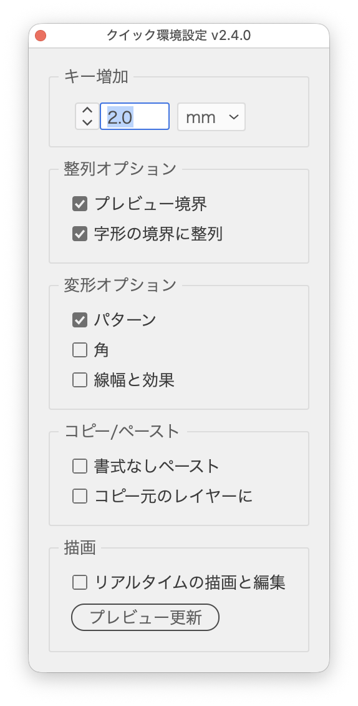

# よく使う環境設定を常駐パレットで切り替える

---

### 概要

「線幅と効果を拡大・縮小」を切り替えたい。「プレビュー境界を使用」を一時的にオンにしたい。矢印キーの移動量を 1mm にしたい。

どれも作業中に何度も発生するのに、そのたびに環境設定ダイアログを開いて、目的のカテゴリを探して、チェックを入れて、［OK］。しかも項目は環境設定の「一般」「単位」「クリップボード処理」「パフォーマンス」や、整列パネル・レイヤーパネルのメニューとバラバラの場所に散っていて、**普段よく触る数個だけが遠い**という状態です。

そこで、よく使う項目だけを1枚のパレットに集めて、操作した瞬間に反映されるようにしました。開きっぱなしにしておく前提のパレットです。

ビデオ定規・アートボード・境界線などの表示の切り替えは、[ViewTogglePalette](ViewTogglePalette.md) に分けました。

### 主な機能

| パネル | 項目 | 内容 |
| --- | --- | --- |
| キー入力 | 数値＋単位 | 矢印キーでの移動量（環境設定 > 一般 > キー入力）。単位ポップアップで定規単位を切り替え |
| 整列オプション | プレビュー境界を使用 | 整列・分布で線幅・効果を含む境界を使う |
| | 字形の境界に整列 | ポイント文字・エリア内文字を字形の境界で整列（2つまとめてON/OFF） |
| 変形オプション | パターン / 角 / 線幅と効果 | 変形時にパターンも変形、拡大・縮小時に角（ライブコーナー）の半径・線幅と効果も追従 |
| コピー/ペースト | 書式なしペースト / コピー元のレイヤーにペースト | |
| 描画 | リアルタイムの描画と編集 / プレビュー更新 | プレビュー更新は GPU プレビューの再描画ボタン |

各項目にはツールチップが付いているので、どの環境設定に対応するかはポインタを重ねれば確認できます。

### 使い方

スクリプトを実行するとパレットが開きます。あとはチェックボックス・ボタン・数値欄・単位ポップアップを操作するだけで、**その時点で即座に反映**されます。数値欄は確定（return・tab・ほかの欄へ移動）したとき、∧∨や ↑↓ キーでは押すたびに反映します。

**［OK］も［適用］もありません。** 押した瞬間が確定です。パレットは `Esc` キー（パレットがアクティブなとき）でも閉じられます。

すでにパレットが開いている状態でもう一度実行すると、新しく開き直さずに既存のパレットを前面に出します。

### オプション

#### Option+クリックで一括切替

「変形オプション」の3つのチェックボックス（パターン／角／線幅と効果）は、**Option+クリックで3つとも同じ状態になります**。通常のクリックは個別切替です。3つまとめてオン／オフしたい場面が多いので、Option を添えるだけで済みます。

「字形の境界に整列」はチェックボックスが1つで、ポイント文字とエリア内文字の両方を常に同時に切り替えます。

#### キー入力の数値欄

数値欄では左の∧∨ボタンか `↑` `↓` キーで増減できます（どちらも同じ動作）。

| 操作 | 増減 |
| --- | --- |
| `↑` `↓`（∧∨） | 次の整数へ（1.5→2、2→3） |
| `Shift` + `↑` `↓`（shift＋クリック） | 次の10の倍数へ（232→240） |
| `Option` + `↑` `↓`（option＋クリック） | ±0.1 |

負の値にはならず、0 でクランプされます。

単位ポップアップは表示単位を変えるだけのものではなく、**定規単位（rulerType）そのものを切り替えます**。ここが少し分かりにくいところです。単位を切り替えても、保存されている移動量の実寸（pt）は変わりません。表示だけが新しい単位で計算し直されます。

ポップアップに並ぶのは in / mm / pt / pica / cm / Q / px の7つです。

### 注意点

環境設定ダイアログなど、パレットの外で設定を変更した場合は、**パレットをクリック（再アクティブ）すれば表示が同期します**。ただし、キー入力の数値欄にフォーカスがある間は同期しません。入力中の値が上書きされてしまうのを防ぐためです。

常駐パレットからは Illustrator の DOM を直接操作できないため、環境設定の**書き込み**はすべて BridgeTalk 経由でメインエンジンに委譲しています。一方、**読み出し**はエンジンを跨いでも安全なため、パレット側で直接・同期的に取得しています。

「角」だけは Boolean ではなく整数のプリファレンス（`policyForPreservingCorners`、1=ON / 2=OFF）なので、書き込み処理で吸収しています。

「プレビュー更新」ボタンは、メニューコマンド `View using GPU` を2回トグルして再描画を起こしています。

選択オブジェクトの反転・回転は [QuickTransformPalette](QuickTransformPalette.md)、アートボード名と枠線の設定は [ArtboardDisplayPresetManagerPalette](ArtboardDisplayPresetManagerPalette.md)、ビデオ定規・アートボード・境界線などの表示の切り替えは [ViewTogglePalette](ViewTogglePalette.md) が担当します。

### 紹介記事（note）

https://note.com/dtp_tranist/n/n41d8dc1961be

### 更新履歴

- v2.4.1（2026-10-04）項目名のコロンを「 :」（半角スペース＋半角コロン）に変更（共通部品の更新）
- v2.4.0（2026-10-03）表示パネルを [ViewTogglePalette](ViewTogglePalette.md) として別のスクリプトに分けた。UI の文言を Illustrator の用語にそろえた（［キー増加］→［キー入力］、［プレビュー境界］→［プレビュー境界を使用］、［コピー元のレイヤーに］→［コピー元のレイヤーにペースト］）
- v2.3.2（2026-10-03）常駐エンジンを共通エンジン `SwwwitchPalettes` に変更し、［常駐パレットをまとめて閉じる］で閉じられるようにした
- v2.3.1（2026-10-01）ウィンドウ・パネルの余白と間隔を共通部品（UIレイアウト）にそろえた
- v2.3.0（2026-09-27）数値欄にステップボタン（∧∨）を追加。↑↓キーもステップボタンと同じ処理で増減するように変更（次の整数へ、shift＋で次の10の倍数へ）
- v2.2.1（2026-09-19）AiQuickPrefsPalette-simple.jsx / AiQuickPrefsPalette-SuperSimple.jsx を本スクリプトへ統合。反転・回転は QuickTransformPalette.jsx、アートボード名・枠線は PresetManagerArtboard.jsx へ移管。
- v2.0.4（2026-07-23）「ファイル管理を開く」ボタンを追加。
- v2.0.3 環境設定の切り替えに特化（キー増加／整列オプション／変形オプション／コピー・ペースト／描画）。書き込みは BridgeTalk 委譲、読み出しは同期取得。Option+クリックによるグループ一括切替、外部変更へのクリック同期に対応。
- v1.0（2025-08-04）初期バージョン。
