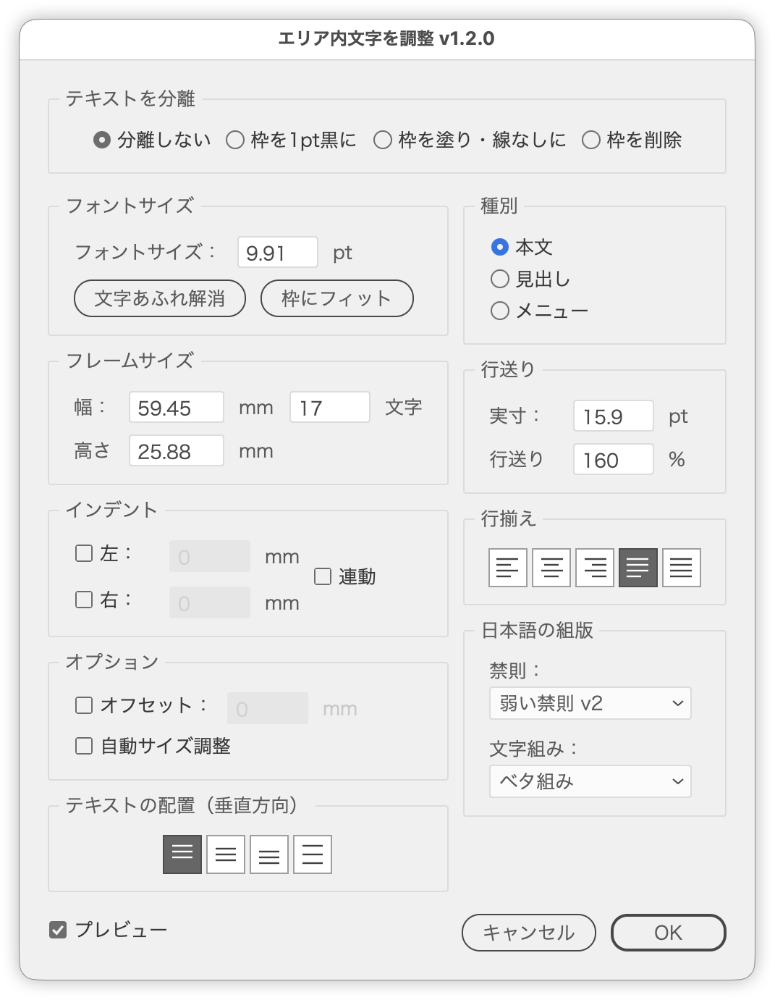

# エリア内文字ツールキット

---

ポイント文字で組んだ見出しやボタンのラベルを、あとから「エリア内文字にしておけばよかった」と思う場面があります。テキスト量が変わっても枠内で折り返してほしい、上下中央に収めたい、といった理由です。

手作業だと、長方形を描いて → エリア内文字にして → 元のテキストを流し込んで → フォントを設定し直して……と手数がかかります。そのうえ、エリア内文字にしたあとの調整（フレームサイズ、行送り、インデント、テキストの配置）は、パネルを行き来しないと終わりません。

このスクリプトは、**作成と調整をひとつの流れにまとめた**ツールキットです。

## 使い方

1. ポイント文字・パス上文字・図形（閉じたパス）、またはエリア内文字を選択
2. スクリプトを実行
3. 変換ダイアログで作成方法を選ぶ → 調整ダイアログで体裁を整える

**エリア内文字だけを選択して実行したときは、変換ダイアログを飛ばして調整ダイアログから始まります。**

何も選択していないと警告して終了します。

## 変換ダイアログ

作成方法を4つから選びます。選択内容に応じて、使えない方法は自動でディムします。

| 方法 | 動作 |
| --- | --- |
| シンプル | ポイント文字の実寸＋1pt の長方形をフレームにする |
| ボタン風 | 幅1.2倍・高さ1.8倍の長方形をフレームにし、行揃え中央・テキストの配置中央にする |
| 選択した図形に流し込む | 選択した図形を複製してフレームにし、選択テキストを流し込む |
| 選択した図形にダミーテキスト | 選択した図形自体をエリア内文字にして、ダミー文字を流し込む |

選択内容と選べる方法の対応は次のとおりです。

| 選択内容 | 選べる方法 |
| --- | --- |
| ポイント文字・パス上文字のみ | シンプル／ボタン風 |
| 図形のみ | 選択した図形にダミーテキスト |
| テキスト＋図形 | 選択した図形に流し込む／選択した図形にダミーテキスト |

パス上文字は、実行時に自動でポイント文字へ分離してから処理します。文字ごとのフォント・サイズ・塗り・線・行送りを退避して復元するので、見た目は保たれます。

### テキストと図形の組み合わせ

「選択した図形に流し込む」では、テキストと図形を複数組まとめて選択できます。組み合わせは、**テキストの中心を含む図形**を優先し、含む図形がなければ**中心がいちばん近い図形**を割り当てます。判定は `geometricBounds`（矩形の範囲）で行います。

変換できる対象がひとつも無かったときは、その旨を表示してダイアログに戻ります。

## 調整ダイアログ

エリア内文字の体裁をまとめて設定します。**プレビューは常にON**で、値を変えるたびに結果が反映されます。

［OK］で確定、［キャンセル］で元に戻して閉じます。ただし、テキストの配置（垂直方向）・自動サイズ調整・種別・文字あふれ解消・枠にフィット・テキストを分離は、押した時点でその場に反映されます（後述）。

### 種別

用途ごとの設定を1クリックでまとめて適用します。

| 種別 | 行送り | 行揃え | 禁則 | 文字組み | テキストの配置 | タブ |
| --- | --- | --- | --- | --- | --- | --- |
| 本文 | 160% | 均等配置（最終行左揃え） | 弱い禁則 v2 | ベタ組み | 上揃え | 削除 |
| 見出し | 120% | 左揃え | 弱い禁則 v2 | ツメ組み | 上揃え | 削除 |
| メニュー | 150% | 右揃え | 弱い禁則 v2 | ツメ組み | 上揃え | 右揃えタブ（リーダー「…」／400pt） |

「メニュー」は各段落に右揃えタブを設定します。行揃えを右揃え以外に変えると、メニューの指定は解除され、設定したタブも削除されます。

### フォントサイズ

| 項目 | 動作 |
| --- | --- |
| フォントサイズ | 直接指定 |
| 文字あふれ解消 | あふれが消えるまでフォントサイズを縮小（2分探索・最大40回） |
| 枠にフィット | あふれるまで拡大してから縮小し、枠いっぱいに収める |

［文字あふれ解消］［枠にフィット］は、**改行を含むテキストには使えません**（行数を保ったまま収めようとして極端に小さくなるため、警告して中止します）。フレーム内でフォントサイズが混在しているときは、1つのサイズに揃います。

どちらも押した時点で確定し、結果のサイズをフォントサイズ欄に、変わった枠のサイズをフレームサイズ欄に書き戻します。最小サイズでも収まらなかったときは、極小のまま残さず元のサイズに戻します。

自動サイズ調整がONのままでも押せます。ONのあいだは枠が文字に追従して「あふれ」が発生せず判定できないため、**いったんOFFにして実行し、終わったらONに戻します**（戻した時点で、新しい文字サイズに合わせて枠が引き直されます）。スクリプトの外で自動サイズ調整をONにしてあったフレームは検知できないので、拡大中に枠の高さが変わったら中止して元のサイズに戻します。

### 行送り

行送りは**自動行送り量（%）**として設定します。Illustrator 上は「自動」表示になり、フォントサイズを変えても比率が保たれます。

| 項目 | 動作 |
| --- | --- |
| 実寸 | フォントサイズ × % の値（pt）。ここに入れると % を逆算する |
| 行送り | 自動行送り量（%） |

固定の行送りが設定されているテキストでは、欄は空のまま開きます。空のあいだは行送りに触れません。

### 行揃え／テキストの配置（垂直方向）

行揃え（左揃え・中央揃え・右揃え・均等配置（最終行左揃え）・両端揃え）と、テキストの配置（垂直方向）（上揃え・中央揃え・下揃え・均等配置）を設定します。

行揃えは Illustrator の段落パネルと同じ**アイコンボタン**です。名称はツールチップで確認できます。

行揃えは **L / C / R / J / F** キーでも切り替えられます（入力欄にフォーカスがあるときは無効）。

テキストの配置（垂直方向）は DOM から安定して設定できないため、ダイナミックアクション（`adobe_frameAlignment`）を一時的に読み込んで適用しています。実行時に一時ファイルとして書き出し、終了時に破棄するので、アクションパネルには残りません。

このアクションはモーダルダイアログ中のプレビューからは呼べないため、**アイコンをクリックした時点でその場に反映**します（プレビューをいったん外し、適用してから貼り直す）。

### 日本語の組版

| 項目 | 動作 |
| --- | --- |
| 禁則 | なし／強い禁則／弱い禁則／弱い禁則 v2 |
| 文字組み | 文字組みアキ量設定（なし／行末約物全角/半角／約物半角／…／ツメ組み／ベタ組み） |

段落単位の設定なので、フレーム内の全段落に適用します。設定が混在しているフレームでは文字組みの選択が空になり、そのまま触らなければ変更しません。

禁則が「なし」のテキストを選んで開いたときは、初期値の「弱い禁則 v2」が選ばれた状態になります（未設定と区別できないため）。「なし」のままにしたいときは、あらためて「なし」を選び直してください。

### フレームサイズ

幅・高さを定規単位で指定します。幅は「文字」（1行の文字数）からの逆算にも対応します（日本語UIのみ。欧文では字幅が一定でないため使用不可）。

「文字」は、オフセットと左右インデントを差し引いた幅をフォントサイズで割った値です。

自動サイズ調整がONのあいだ、**高さ欄はディム**します（枠が文字に追従するため、こちらから指定できません）。ONのあいだは高さに触らないので、プレビューが枠を引き戻すこともありません。

### インデント／オプション

- 左・右インデント（「連動」で左右を同値に）
- オフセット（フレームとテキストの距離）
- 自動サイズ調整（エリア内文字の高さをテキスト量に追従させる）

［自動サイズ調整］はダイナミックアクション（`adobe_SLOAreaTextDialog`）で切り替えます。プレビューからは呼べないため、**チェックした時点でその場に反映**します（プレビューをいったん外し、適用してから貼り直す）。

## テキストを分離ダイアログ

調整ダイアログの左下にある［テキストを分離...］ボタンで開きます。エリア内文字を、**囲み罫（長方形）とポイント文字**に分解します。

| 選択肢 | 動作 |
| --- | --- |
| 枠を1pt黒に | 長方形を1pt・黒の線にする（既定） |
| 枠を塗り・線なしに | 長方形を塗り・線なしにする |
| 枠を削除 | 長方形を削除する |

［OK］で分解します。エリア内文字が無くなるため、続けて調整ダイアログも閉じます。［キャンセル］なら何もせず調整ダイアログに戻ります。

［テキストを分離...］を押した時点で、調整ダイアログの内容（フレームサイズなど）をいったん確定します。囲み罫はその大きさ（＋オフセット）から作られるので、幅を決めてから分離できます。

できたポイント文字には、調整ダイアログで設定していた行揃え・インデント・行送り・禁則・文字組み・タブが引き継がれます。**文字ごとのフォント・サイズ・塗り・線・ベースライン移動・拡大縮小もそのまま保持**します。分解後は、できた長方形とポイント文字が選択された状態になります。

## 入力欄の操作

すべての数値欄は↑↓キーで増減できます。

| キー | 増減 |
| --- | --- |
| ↑ / ↓ | ±1 |
| Shift + ↑ / ↓ | ±10（10の倍数にスナップ） |
| Option(Alt) + ↑ / ↓ | ±0.1 |

## 対象

TextFrame（ポイント文字／パス上文字／エリア内文字）、PathItem・CompoundPathItem（閉じたパス）

## 補足

- 幅・高さは 0以下・NaN・極端な値を弾き、直前の有効値に戻します（上限は 100000pt 相当）。
- プレビューは `app.undo()` で取り消しています。他の操作と混在すると不整合が起こる可能性があります。
- 定規単位は mm / cm / inch / pt / pica / px / Q に対応します。

## 更新履歴

- v1.2.0（2026-07-28）「テキストを分離」を別ダイアログに分離し、調整ダイアログには［テキストを分離...］ボタンを配置。分離時に文字ごとの書式を保持し、できた長方形とポイント文字を選択するよう改善。プレビューのチェックボックスを削除し、常にプレビューする動作に変更。「種別（本文／見出し／メニュー）」「行送り」「日本語の組版（禁則・文字組み）」パネルを追加。行揃えとテキストの配置をアイコンボタン化。リーダー罫のチェックボックスを「メニュー」種別に統合。自動サイズをチェックボックスにし、クリックで即反映するよう変更。自動サイズ調整ON時は高さ欄をディムし、高さを上書きしないよう修正。文字あふれ解消・枠にフィットは、自動サイズ調整ONのときいったんOFFにして実行するよう修正。「内側のマージン」を「オフセット」に改称。文字あふれ解消・枠にフィットを改行を含むテキストで中止し、結果をフォントサイズ欄・フレームサイズ欄に反映するよう修正。UI文言をIllustratorの用語に合わせ、各項目にツールチップを追加。既存エリア内文字の行揃え・インデントを正しく読み込むよう修正。「選択した図形に流し込む」を複数組に対応。Q（歯）単位に対応。変換できないときの警告を追加
- v1.1.3（2026-03-04）幅・高さの入力バリデーションを追加
- v1.0.0（2026-03-03）初期バージョン

### note

- [記事URL]
