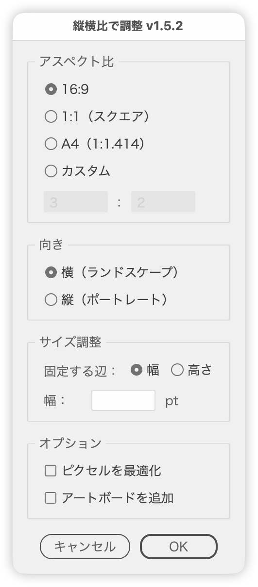

# 縦横比を指定してサイズ変更

---

### 概要

選択したオブジェクトを、指定した縦横比（16:9・1:1・A4・カスタム）に合わせてサイズ変更します。固定する辺の長さや基準点も指定でき、何も選択していないときは、その比率の長方形をアートボードの中央に作ります。

### 主な機能

- 縦横比：16:9、1:1（スクエア）、A4（1:1.414）、カスタム（横:縦を入力）
- 向き：縦（ポートレート）／横（ランドスケープ）をアイコンで選択
- 基準点：9軸で、サイズを変えても動かない点を指定（初期値は中央）
- サイズ：固定する辺（幅／高さ）を選び、その長さを入力。もう一方には比率から求めた長さを表示
- プレビュー：設定を変えるたびにアートボード上で結果を確認
- 数値欄は ↑↓ キーで ±1、shift 併用で ±10、option 併用で ±0.1

### 使い方

1. オブジェクトを選択して実行します（選択なしでも実行できます）
2. 縦横比と向きを選びます
3. 必要なら基準点と、固定する辺・長さを指定します
4. OK で確定します。キャンセルすると元に戻ります

### オプション

- **ピクセルグリッドに最適化**：確定後に［ピクセルを最適化］を実行します（初期値 ON）
- **アートボードを追加**：結果と同じ範囲にアートボードを追加します。オブジェクトは残ります

### 注意点

- 固定する辺の欄が空欄のときは、各オブジェクトの今の長さを基準にします
- 複数のオブジェクトを選択しているときは、もう一方の辺の長さは表示しません（オブジェクトごとに異なるため）
- 選択なしで実行し、固定する辺の欄が空欄のときは、長方形の固定する辺を 200pt にします

### 紹介記事

https://note.com/dtp_tranist/n/n4a212e6eacf1

### 更新履歴

- v1.0 (20250720) : 初期バージョン
- v1.1 (20250721) : アートボード変換・カスタム比率機能を追加
- v1.2 (20250722) : ダイアログ構成改善・ローカライズ・キー操作追加
- v1.5.2 (20260923) : 数値欄で小数を入力できない不具合を修正、shift／option での増減に対応、UIの文言を見直し
- v1.6.0 (20260927) : ダイアログを2カラムに変更、［ピクセルグリッドに最適化］を初期ONに、幅と高さの欄を両方表示（固定する辺だけ編集可）、基準点（9軸）を追加、向きをアイコンで選ぶ形に変更、ドキュメントが無いときに警告を表示、ダイアログのタイトル・パネル名・ツールチップの文言を見直し
