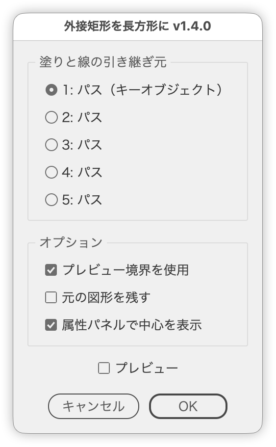

# 選択全体の外接矩形をひとつの長方形に

---

### 概要

選択した複数オブジェクト全体の外接矩形をもとに、ひとつの長方形へ統合します。

### 主な機能

- 塗りと線の引き継ぎ元を選択（キーオブジェクトがあれば、それを優先）
- プレビュー境界／オブジェクト境界の切り替え
- 元の図形を残すオプション
- プレビュー表示と、属性パネルでの中心表示

### 使い方

1. 対象のオブジェクトを選択します。塗りと線を引き継ぎたいオブジェクトがあれば、もう一度クリックしてキーオブジェクトにします。
2. スクリプトを実行します。
3. オプションを指定して［OK］をクリックします。

### 紹介記事

https://note.com/dtp_tranist/n/nd4afdd8315f0

### 更新履歴

- v1.4.0 (2026-09-23): キーオブジェクトに対応（あれば［塗りと線の引き継ぎ元］で初期選択）。［プレビュー境界を使用］がONのままOKしたとき、オブジェクト境界で計算されていた不具合と、長方形が元のアクティブレイヤー以外に作られることがある不具合を修正。UI文言を見直し（タイトル・パネル名・ツールチップ）、内部処理を整理し、引き継ぎ元のラジオボタンにショートカットキーのツールチップを追加
- v1.3 (2026-03-08)
