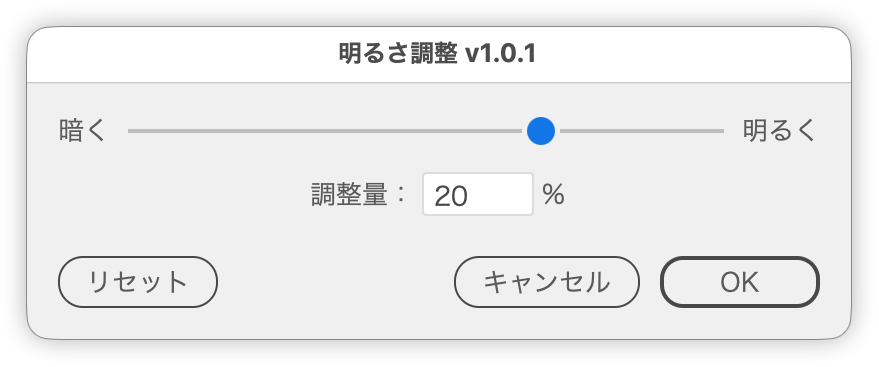

# 明るさをスライダーで調整

---

### 概要

選択したオブジェクトの明るさを、スライダーで調整します。プラスで明るく、マイナスで暗くなります。

### 主な機能

- スライダーは -50〜+50、［調整量］の入力欄は -100〜+100（スライダーの範囲を超える量は入力欄で指定）
- スライダーは shift 併用で10%刻み
- 入力欄は ↑↓キーで ±1、shift 併用で ±10
- R キーでリセット
- ヒストリーを汚さないよう、確定時の取り消しは1ステップ
- CMYK／RGB／グレースケール／特色（濃度）に対応
- 日本語／英語UI

### 使い方

1. 対象のオブジェクトを選択します。
2. スクリプトを実行します。
3. スライダーをドラッグするか、［調整量］に数値を入力して明るさを調整します。
4. 結果をプレビューで確認して［OK］をクリックします。［キャンセル］または Esc で元に戻ります。

### 注意点

- グラデーション、パターン、画像（リンク・埋め込み）は調整の対象外です。
- グループと複合パスは、中のオブジェクトをたどって調整します。
- テキストはテキストオブジェクト単位で処理します。文字ごとに書式が異なる場合は調整されないことがあります。
- プレビューは Illustrator の取り消しを使って作り直します。ダイアログの表示中に他の操作を挟むと、履歴が想定どおりにならない場合があります。

### 紹介記事

https://note.com/dtp_tranist/n/n88e33648b19a

### 更新履歴

- v1.0.1 (2026-09-17) スライダーを shift 併用で10%刻みに。［リセット］のラベルから「(R)」を削除、UI文言を見直し（タイトル、スライダー両端の「暗く／明るく」、［調整量］の項目名、アラートの追加）、ツールチップを追加し、内部の命名・関数分割を整理
- v1.0 (2025-12-28) 初版
