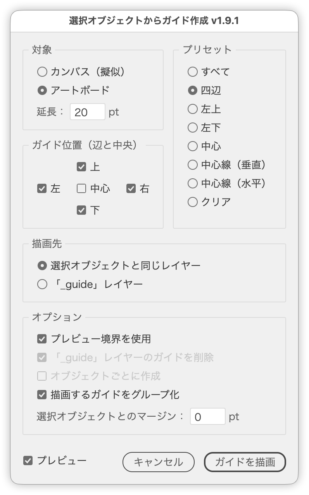

# 選択したオブジェクトに対してガイドを自動作成

---

### 概要

- Illustrator の選択オブジェクトからガイドを作成するスクリプト。
- ダイアログ上で上下左右中央のガイドを自由に指定して描画可能。

### 主な機能

- 基準は「アートボード」または「カンバス（擬似）」から選択
- アートボード基準時はガイドを外側へ「延長」、対象からは「マージン」を指定
- プレビュー境界または幾何境界の選択
- 一時アウトライン化とアピアランス分割による正確なテキスト処理
- 描画先の選択（選択オブジェクトと同じレイヤー／「_guide」レイヤー）
- 「_guide」レイヤー管理とガイド削除オプション
- ライブプレビュー（表示中は既存ガイドを一時的に非表示）
- クリップグループと複数選択対応

### 処理の流れ

- ダイアログボックスでオプションを設定（変更に追従してライブプレビュー）
- 基準（選択オブジェクト／アートボード／カンバス）の外接矩形を取得
- ガイドを描画
- テキストオブジェクトは一時アウトライン化およびアピアランス展開して計算後復元
- 「_guide」レイヤーに描画した場合はレイヤーをロック

### note

https://note.com/dtp_tranist/n/nd1359cf41a2c

### 更新履歴

- v1.0 (20250711) : 初期バージョン
- v1.1 (20250711) : 複数選択、クリップグループ、日英対応追加
- v1.2 (20250711) : プレビュー境界OFF時の安定化、テキスト処理修正
- v1.3 (20250711) : アートボード外のオブジェクト自動カンバス選択、テキストアウトライン処理改善
- v1.4 (20250711) : アートボード外のオブジェクト選択時のアラート削除、カンバス選択時のはみだし無効化
- v1.5 (20250711) : 左上、左下、右上、右下モードを追加（それぞれ2本のガイドを作成）
- v1.6 (20250712) : コードリファクタリング、ラジオボタンの表示切り替え機能追加
- v1.7 (20250712) : 複数オブジェクトごとにガイドを作成するオプション追加、アートボード基準のガイド作成機能改善
- v1.8 (20250712) : 中心線（垂直のみ）、中心線（水平のみ）の描画ロジックを追加
- v1.9 (20250712) : ↑↓キー、shift + ↑↓キーでの値の増減機能を追加
- v1.8.0 (20250802) : UIの整理、文言とツールチップの調整
- v1.9.0 (20260628) : ライブプレビュー追加、ローカライズ構造化、プレビュー中は既存ガイドを非表示
- v1.9.1 (20260803) : 「描画先」（選択オブジェクトと同じレイヤー／「_guide」レイヤー）を追加、「描画するガイドをグループ化」を追加、「オブジェクトごとに作成」に整理、中心線のみのときはマージンをディム、テキストと図形の混在選択時の境界計算を修正、内部リファクタリング