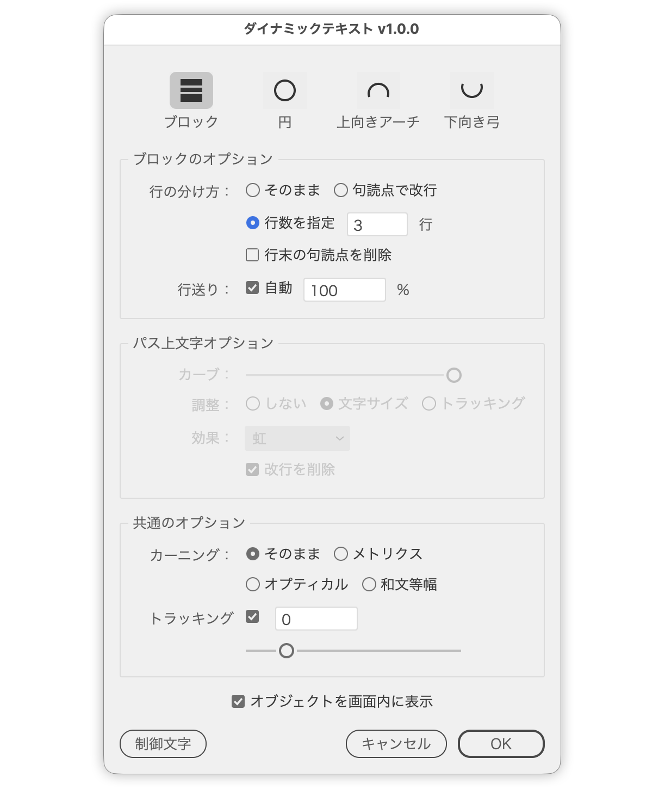

# 選択したテキストをアーチ・円・弓のパス上文字に変換、または行の幅をそろえる

---

### 概要

- 選択したテキストの文字幅に合わせたパスを自動生成し、パス上文字に変換するスクリプト。
- パスの形はアーチ・円・下向き弓から選べる。生成されるパスは塗り・線なし（不可視）なので、文字だけが見える状態になる。
- パス全体のうち文字が占める割合（占有率）を指定でき、パスの端まで並べるか、中央だけに寄せるかを調整できる。
- パスを使わず、各行の文字サイズを変えて行の幅を最長行にそろえる「ブロック」も選べる。
- ポイント文字・エリア内文字・パス上文字のいずれも対象。プレビューは常時ONで、ダイアログを開いたまま結果を確認できる。

### モード

アイコンで選択する。アイコンの下にモード名、ヘルプチップに「モード名：説明」を表示。**起動直後はどのモードも選ばれていない**ので、選ぶまで何も変換されない。

| モード | 内容 |
| --- | --- |
| **ブロック** | パスを作らず、各行の文字サイズを変えて行の幅を最長行にそろえる |
| **円** | 閉じた円形のパスに変換し、円周に沿わせる。文字は円の上側中央に配置される |
| **アーチ** | 上に膨らむパスに変換する |
| **下向き弓** | 下に膨らむパスに変換する |

選ばれていないモードのオプションはディム表示になる。モードを選ばずにOKを押した場合はダイアログを閉じず、モードの選択を促す。

### ブロックオプション

- **行の分け方：**
  - **そのまま**（初期値）：いまの改行のまま、行ごとの幅をそろえる
  - **句読点で改行**：いまの改行を外し、句読点のうしろで改行し直す。和文（`、。，．！？`）は直後で改行し、欧文（`.,!?`）は `3.14` や `e.g.` で切らないよう、うしろにスペースがあるときだけ改行する。`！？` のように句読点が続くときは最後の1つで改行する。句読点のうしろの閉じ括弧・引用符（`）」』】〉》”’)]}"'`）と空白は前の行に残すので、行頭に `」` や空白が落ちない
  - **行数を指定 [3] 行**：いまの改行を外し、指定行数へ均等に分け直す。目標位置の近く（1行分の1/3以内）に句読点があればそこで改行し、句読点がなければ単語の切れ目（スペース）にそろえて欧文の単語が途中で切れないようにする
- 「句読点で改行」「行数を指定」を選んだときは、行を分け直す前に**文字サイズをいちばん大きい値にそろえる**。以前のブロック処理で行ごとに違っていたサイズが1行の中に混ざるのを防ぐため。もともと均一なテキストでは何も変わらない
- **行末の句読点を削除：** 初期値OFF。行の終わりに残った句読点を消す（見出しやキャッチコピー向け）。閉じ括弧・引用符は残す。「そのまま」を選んでいるときはディム表示
- **行送り：** チェックONで行送りを自動に切り替え、比率（初期値100%）を指定できる

### パス上文字オプション

- **カーブ：** スライダー（0〜100、初期値100）でパスの深さを調整。パスは真円の円弧で、0で直線に近く、100で文字幅を直径とするちょうど半円になる。円モードでは文字に対する円の大きさを決める。shiftキーを押しながらのドラッグ・矢印キーで10刻み
- **占有率：** スライダー（30〜100、初期値100）で、パス全体のうち文字が占める長さの割合を指定。右に現在値を表示。100でパスの端まで、30でパスの中央3割だけに文字が並ぶ。パスの形は変わらず文字側だけが詰まり、中央揃えなので詰めたぶんは中央へ寄る。円モードでは円周に対する割合になり、文字は上側中央に集まる。shiftキーを押しながらのドラッグ・矢印キーで10刻み
- **合わせ方：** 「しない」／「文字サイズ」（初期値）／「トラッキング」から選択。円のような閉じたパスでも有効
  - 文字サイズ：あふれるまで文字サイズを拡大してから、収まるところまで縮めてパスの端に合わせる。比率で変倍するので、文字ごとのサイズ差は保たれる
  - トラッキング：文字サイズを保ったまま、字間を粗調整→微調整してパスの端に合わせる
  - 「占有率」は合わせ方のあとに効く。「文字サイズ」「しない」では文字サイズに割合を掛け、「トラッキング」では文字サイズを保つため字間を詰めて短くする
- **効果：** Illustratorの「パス上文字オプション」の効果をポップアップメニューから選択（虹形（初期値）／歪み／3D リボン／階段状／重力）
- **改行を削除：** 初期値ON。1本のパスに沿わせるため、改行を削除して1行にまとめる

### 共通オプション

全モードで働く設定。どちらも文字幅に影響するため、**幅をそろえる前に適用**される。

- **カーニング：** 「そのまま」（初期値）／「メトリクス」／「オプティカル」／「和文等幅」から選択
  - そのまま：カーニングの設定に手を触れない
  - メトリクスを選んだときだけ**プロポーショナルメトリクスもONになる**（それ以外はOFF）
  - 和文等幅は欧文のみメトリクス＝和文は等幅
- **トラッキング：** チェックONのときのみ、既存のトラッキング値に指定値を加算（−100〜500、矢印キーで増減：Shiftで10、Optionで0.1）。OFFにすると0に戻る。「合わせ方：トラッキング」を選択中はディム表示

### 表示とボタン

- **結果を画面内に表示：** 初期値ON。変換した結果が画面から外れたときだけ、見える位置へ表示を移す。すでに見えているときは動かさない。収まらない場合はズームアウトのみ行い、拡大はしない
- **制御文字の表示：** 制御文字の表示・非表示を切り替える。「行数を指定」「句読点で改行」で改行がどこに入ったかを確かめるときに使う
- キャンセルでプレビューを取り消して閉じる

### 文字が欠けないための処理

- 「改行を削除」がONのとき、パスの長さは**改行を外して1行につないだ状態の幅**で決める。元の行のままだと最長行の幅しか得られず、パスが短すぎて文字が欠けるため
- 生成後にオーバーセット（文字がパスに収まりきらない状態）を検出したときだけ、収まるまで文字サイズを縮めてから細かく戻す。円のような閉じたパスも対象。収まっている場合は一切変更しない
- 縮めるときは絶対値の代入ではなく**比率で変倍**するため、文字ごとにサイズが違うテキストでもサイズ差が保たれる

### 処理の流れ

**アーチ・円・下向き弓**

1. 選択からポイント文字／エリア内文字／パス上文字を収集（グループ内も再帰的に探索）
2. ポイント文字以外は、いったん普通のテキスト（ポイント文字）へ写して変換元にする。パス上文字は溢れて隠れていた行が戻り、エリア内文字は枠の折り返しが外れる
3. 変換元を一時的にアウトライン化して実寸を計測し、ベースライン上に真円の円弧パスを作る。カーブで決めた高さの円弧を頂点で2分割し、ベジェ曲線で近似する（円モードは閉じた円形パスを作成）
4. パス上文字を生成して文字属性を複製し、改行の削除・中央揃え・カーニング・トラッキング・効果を適用
5. 選択された方法でパスに合わせ、「占有率」で指定したぶんまで詰めてから、最後に収まりきらないぶんを縮める（元のテキストと同時選択されていたパスは削除）

**ブロック**

1. ポイント文字以外はポイント文字へ変換する
2. 選択された分け方で行を分け直し、指定があれば行末の句読点を削除する
3. カーニングとトラッキングを適用してから、全行をアウトライン幅で測り、行ごとに最長行の幅へ変倍（固定行送りの場合は行送りも追従）
4. 指定があれば行送りを自動に切り替える

### 対象外

- ドキュメントが開かれていない場合
- 選択にテキストが含まれていない場合
- 空のテキスト、行や文字範囲を取得できないテキスト
- ブロックは2行以上のテキストが対象（1行では最長行が自分自身になり変倍が起きないため）
- OKを押しても何も適用できなかったときは、設定を直せるようダイアログを閉じない
- ロック／非表示／編集不可のテキストにはパスへの調整が適用されない

### note

- 紹介記事：https://note.com/dtp_tranist/n/nb9e9082df5e5
- 着想元：高橋としゆき（@gautt）さん https://note.com/gautt/n/n92f6faeda048

### 更新履歴

- v1.1.0 (20260814) : パス上文字オプションに「占有率」スライダー（30〜100）を追加。パスの形は変えずに、文字が占める長さの割合を指定できるようにした。モード名「上向きアーチ」を「アーチ」に変更。「調整」を「合わせ方」に、効果名をIllustratorの表記（虹形・階段状・重力）に、パネル名・チェックボックス・ボタンの文言を整理し、「合わせ方」「カーニング」の各項目にツールチップを追加。カーブ・占有率スライダーをshiftキー併用で10刻みにした
- v1.0.2 (20260812) : モード名を「上向きアーチ」「下向き弓」に変更。カーブ最大でちょうど半円になるよう真円の円弧に変更。句読点で改行の対象に `！？.,!?` を追加し、閉じ括弧・引用符を前の行に残すように変更。「行数を指定」で句読点がないときは単語の切れ目にそろえるように変更。「行末の句読点を削除」を追加。UIの文言を整理
- v1.0.0 (20260811) : 公開バージョン
