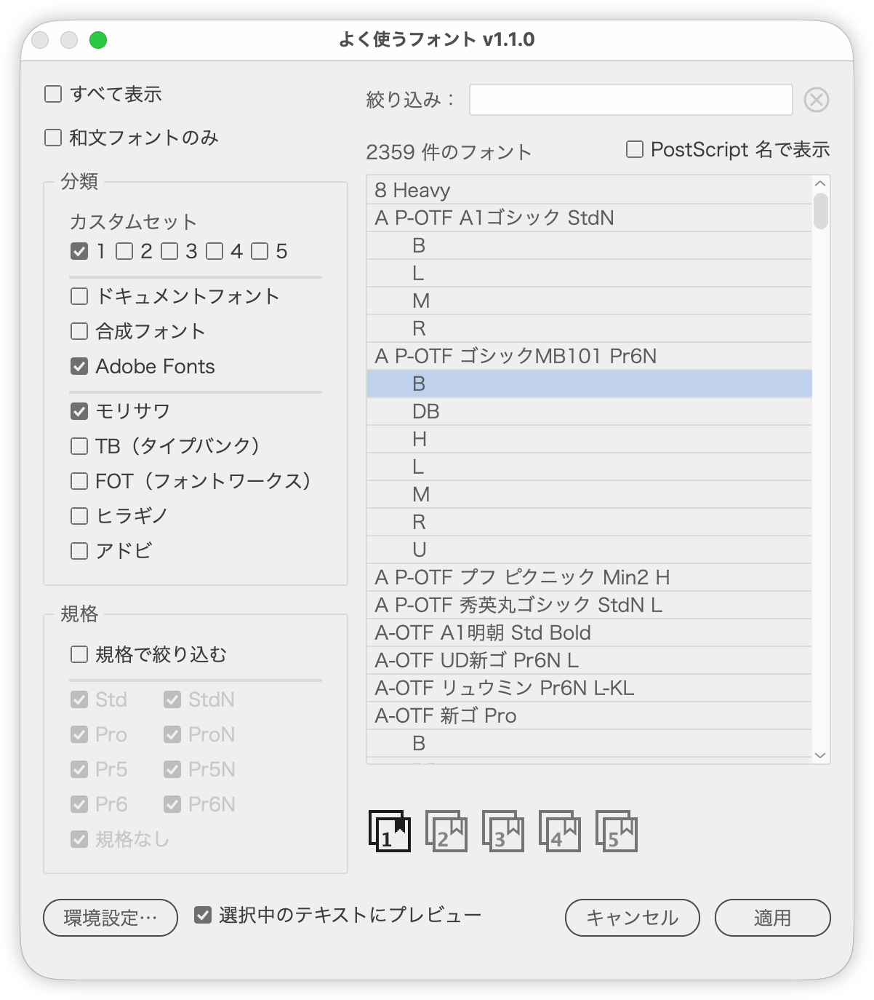

# よく使うフォントだけを一覧から選んで適用

---

### 概要

- よく使うフォントを分類と文字セットで絞り込んだ一覧から選び、選択中のテキストに適用する Illustrator スクリプト
- 同じ書体の文字セット違い（Pr6N・Pr5 など）は、チェックした文字セットの中で優先順位がいちばん高いものだけを一覧に残す
- 中国語・韓国語・タイ語など日本語以外のフォントは、初期状態で一覧から外す
- 一覧でクリックしたフォントを、選択中のテキストにすぐ適用する
- 開いたままテキストを選び直して続けて適用できる常駐パレット
- KOUJI & 相棒（Gem）さんの「よく使うフォントパネル」（favoriteFont_AI.jsx v1.1.2、MIT License）をもとに改変。おもな変更点：
  - 1列だったダイアログを2カラムにし、左に絞り込み、右に一覧を置いた
  - 一覧をツリー表示から、ファミリーの見出しの下にウェイトを並べるリストにした
  - ［すべて表示］のときだけ使えた文字セットのドロップダウンを、［文字セット］のチェックボックスにした（［すべて表示］がオフでも効く）
  - ［分類］にヒラギノ・アドビ・Adobe Fonts・合成フォントを追加し、モリサワの判定を前方一致に改めた
  - ［多言語フォントを非表示］を追加した（外す言語は環境設定で中国語・韓国語・タイ語・その他から選ぶ）
  - PostScript 名に ASCII 以外の文字を含むフォントと合成フォントも一覧に出すようにした（元は外していた）
  - ［ドキュメントフォント］の照合を、前方一致から語単位の一致にした（「Pr5」が「Pr5N」に当たらない）
  - ［カスタム］を5つのカスタムセットにし、一覧の下のボタンで出し入れできるようにした
  - ［環境設定…］を追加し、［再スキャン］・外す言語・カスタムセットの書き出しと読み込みをまとめた
  - ［絞り込み］欄と件数の表示、［PostScript 名で表示］を追加した
  - 選択中のテキストへのプレビューと［適用］ボタンを追加した（一覧のダブルクリック・Enter でも適用）
  - ダイアログを常駐パレットにした（開いたまま選択を変えて続けて適用できる）。一覧のクリックで適用するようにし、プレビューと［適用］ボタンは外した
  - 開いたとき、選択中のテキストのフォントを一覧で選んだ状態にした
  - チェックや絞り込みの状態を、次回も同じ状態で開くようにした
  - フォント情報を読み込む間、プログレスバーを表示するようにした。フォントの増減はキャッシュの確認で自動的に読み直す
  - ［現在のドキュメントから抽出］ボタンを削除した（_ProjectFonts.txt の読み込みは残した）
  - 英語の UI に対応した

### 主な機能

**一覧**

- 左に絞り込みのチェックボックス、右にフォント一覧の2カラム
- ファミリー名の見出しの下にウェイトを字下げして並べる（スタイルが1つだけのファミリーと合成フォントは1行）
- ［PostScript 名で表示］：PostScript 名（RyuminPr6N-Light など）を1フォント1行で並べる
- 開いたときは、選択中のテキストのフォントを選んだ状態にする

**絞り込み**

- ［分類］［ベンダー］：2つのパネルでチェックしたものをすべて合わせて表示
- ［分類］のカスタムセット 1〜5（パネルのいちばん下）：一覧の下の番号のボタンで加えたフォント。チェックしたセットを合わせて表示する。文字セット違いの間引きと除外（［多言語フォントを非表示］を含む）はしない
- ［分類］
  - ドキュメントフォント：ドキュメントと同じフォルダーの `_ProjectFonts.txt`（InDesign 版で作るファイル）に挙げたフォント。文字セット違いの間引きと除外（［多言語フォントを非表示］を含む）はしない
  - 合成フォント：［書式］→［合成フォント］で作ったもの。文字セットの絞り込みと間引きはしない
  - Adobe Fonts：Creative Cloud でアクティベートしているフォント。Creative Cloud の同期状態（`entitlements.xml`）のファミリー名で判定する
- ［ベンダー］
  - モリサワ／写研（A P-SK）／タイプバンク（TB）／フォントワークス（FOT-）／ヒラギノ：ファミリー名・PostScript 名の先頭で判定
  - アドビ：アドビ自社の和文書体（小塚・源ノ角ゴシック／明朝・りょう・貂明朝・百千鳥・かづらき）
- ［すべて表示］：［分類］［ベンダー］・文字セット違いの間引き・`EXCLUDE_FONTS` の除外をやめ、すべてのフォントを表示する（合成フォントも含めて［種別］の絞り込みと［多言語フォントを非表示］は効く）
- ［種別］の文字セット：左に無印（Std・Pro・Pr5・Pr6）、右に N 付きを並べる。チェックした文字セット（と［文字セットなし］）だけを表示し、同じ書体はチェックした中で優先順位がいちばん高い文字セットを残す（Pr6N を外せば Pr6 や Pr5 が残る）
- ［文字セットで絞り込む］：オフにすると［文字セット］のチェックを無視する（同じ書体は、すべての文字セットの中で優先順位がいちばん高いものを残す）。初期値オン
- ［種別］の［AP版］：オンにすると、A P-OTF で始まるフォントだけを表示する（文字セットの設定とは別に効き、［すべて表示］・カスタムセット・ドキュメントフォントにも効く）。オフのときは、通常版（A-OTF など）がある書体では AP版を間引く。写研の A P-SK は AP版に含めない。初期値オフ
- ［分類］［ベンダー］［種別］、環境設定の外す言語のチェックボックスは、パネルごとに option（Alt）＋クリックで「クリックしたものだけオン」と「すべてオン」を切り替える
- ［絞り込み］：ファミリー名・スタイル名・PostScript 名の部分一致。右の丸に×のボタンで文字列を消す
- ［多言語フォントを非表示］：環境設定で選んだ言語（中国語／韓国語／タイ語／その他。初期値はすべて）のフォントを一覧から外す（開くたびにオン。［すべて表示］でも効き、カスタムセット・ドキュメントフォントに挙げたフォントは残す）。言語はフォント名で判定

**フォントの管理**

- 番号のボタン（1〜5）：一覧で選んだフォントのファミリーを、その番号のカスタムセットに出し入れする（入っているセットはアイコン全体が暗くなり、しおりが塗られる）。ほかのフォントにも当たる名前（「DIN」など）を外すときは確認する
- ［環境設定…］（左下）：
  - ［再スキャン］：インストールされているフォントを読み直す
  - ［多言語フォントを非表示］で外す言語を選ぶ
  - カスタムセットごとに中身を表示し、1行1件のテキストファイルに書き出す・読み込む（読み込みは今の中身に加える。重複は除く）

**適用**

- 一覧でフォントをクリックすると、今選択しているテキストに適用する（パレットは開いたまま。矢印キーで選び直しても適用する）
- 選んだままの行をほかのテキストにも当てるときは、ダブルクリックまたは Enter キー
- ［閉じる］または Esc キーでパレットを閉じる
- チェックの状態（［多言語フォントを非表示］と外す言語を含む）・カスタムセットのフォント・絞り込みの文字列は、次回も同じ状態で開く

### 使い方

1. テキストフレームまたはグループを選択する（文字ツールで一部の文字を選択してもよい）
2. スクリプトを実行する
3. 左のチェックボックスと［絞り込み］で一覧を絞る
4. 一覧でフォントをクリックして適用する（元に戻すときは ⌘Z）
5. 続けてほかのテキストに適用するときは、パレットを開いたままアートボードで選択し直して 4 をくり返す（同じフォントはダブルクリックまたは Enter キー）

よく使うフォントは、一覧で選んで下の番号のボタンを押すとカスタムセットに入ります。次からは［分類］のカスタムセットでその番号にチェックを入れるだけで呼び出せます。

［絞り込み］は、結果が800件以下なら入力のたびに一覧を更新し、それより多いときは件数だけを表示して Enter キーで一覧を更新します（件数は `LIVE_SEARCH_MAX_FONTS` で変更可）。

### オプション（スクリプト冒頭のユーザー設定）

| 項目 | 内容 | 初期値 |
|---|---|---|
| CUSTOM_FONTS | カスタムセット 1 の初期値。以後はパレットで変更し、設定ファイルに保存 | Graphik, DIN |
| CUSTOM_SET_COUNT | カスタムセットの数 | 5 |
| EXCLUDE_FONTS | 一覧から外すフォント（部分一致、大文字小文字を区別。［すべて表示］・カスタム・ドキュメントフォントでは外さない） | NT |
| RESCUE_FONTS | EXCLUDE_FONTS に当たっても残すフォント（部分一致、大文字小文字を区別） | なし |
| PRIORITY_PREFIXES | 残す接頭辞の優先順位（先頭ほど優先） | A-OTF, A P-OTF, AP-OTF, G-OTF, U-OTF |
| PRIORITY_SUFFIXES | 残す文字セットの優先順位。［種別］の文字セットのチェックボックスにも並ぶ | Pr6N, Pr6, Pr5N, Pr5, ProN, Pro, StdN, Std |
| FOUNDRY_FILTERS | メーカー別の分類（ファミリー名・PostScript 名の前方一致） | モリサワ・写研・タイプバンク・フォントワークス・ヒラギノ・アドビ・Adobe Fonts |
| LANGUAGE_GROUPS | ［多言語フォントを非表示］で外す言語と、名前での判定の規則（前方一致・正規表現） | 中国語・韓国語・タイ語・その他 |
| LIVE_SEARCH_MAX_FONTS | 入力のたびに一覧を更新する件数の上限 | 800 |

カスタムの名前は前方一致で照合します（「DIN」は「DIN 2014」「DINPro」に当たる）。ドキュメントフォントの名前は語の単位で照合します（「Pr5」は「Pr5N」に当たらない）。

### 注意点

- 初回と、フォントの構成が変わったとき（総数と、一覧から等間隔に取った32件の名前で判定）は、フォント情報を読み込んでから開きます（進み具合を表示）。判定をすり抜けたときは［環境設定…］の［再スキャン］を押してください。キャッシュは `~/Library/Application Support/illustrator-scripts/FavoriteFontPicker-fonts.txt`
- 適用先は、クリックしたときに選択しているテキストです。テキストを選んでいないときは何もしません
- クリックのたびに適用するので、取り消しの履歴もそのぶん増えます
- スクリプトを修正・更新したときは、パレットを閉じてから実行し直してください（開いたままだと前のコードが動き続けます）
- パレットから［再スキャン］できないときは、キャッシュを消して次に開いたときに読み直します
- 環境にないフォントは一覧に出ません
- ロック・非表示のテキストには適用しません

### 紹介記事

- [DTP Transit 別館｜note](https://note.com/dtp_tranist/n/ncf9ff6feebf0)

### 更新履歴

- v1.2.0 (20261002) : 常駐パレットに変更
  - 開いたままアートボードで選択を変えて、続けて適用できるようにした（［キャンセル］は［閉じる］に。Esc キーでも閉じる）
  - 一覧のクリックで適用するようにし、［選択中のテキストにプレビュー］と［適用］ボタンを外した
  - ［分類］に「写研」を追加（モリサワの下）。［規格］を［文字セット］に改めた（［規格で絞り込む］→［文字セットで絞り込む］、［規格なし］→［文字セットなし］）
  - ［文字セット］パネルを［種別］にし、［AP版］を追加。［和文フォントのみ］を［多言語フォントを非表示］にし、開くたびにオンにした
  - ［分類］を［分類］（ドキュメントフォント・合成フォント・Adobe Fonts・カスタムセット）と［ベンダー］の2つのパネルに分けた。［AP版］はオンで AP版だけに絞るようにした
  - `EXCLUDE_FONTS` の「NT」が大文字小文字を区別せず、Montserrat・Century など名前に「nt」を含む欧文フォントまで［Adobe Fonts］などから外れていたのを修正。外す名前のフォントが間引きの比較に入り、ほかの文字セットまで消えることがあったのも修正
  - 分類の「TB（タイプバンク）」「FOT（フォントワークス）」を「タイプバンク」「フォントワークス」に。一覧を1行ぶん高くし、カスタムセットのボタンを列の左右中央に
  - パレットに戻るたびに、ドキュメントの［ドキュメントフォント］（_ProjectFonts.txt）を読み直す
  - ファイル名を FavoriteFontPicker.jsx から FavoriteFontPickerPalette.jsx に変更（設定とキャッシュは引き継ぐ）
- v1.1.0 (20261002) : 機能追加と不具合の修正
  - ［環境設定…］を追加し、［再スキャン］と外す言語を移した。カスタムセットの表示・書き出し・読み込みに対応。［日本語以外を除外］はメインウインドウの［和文フォントのみ］に
  - 見出し行をクリックすると、1つ上のファミリーが選ばれることがあった
  - ［カスタム］を前方一致に戻した（「DIN」で DINPro・DINOT も出る）
  - ヒラギノ角ゴ CNS を［日本語以外を除外］の「中国語」に含めた
  - ［オプション］の［対象外］を、パネル名［日本語以外を除外］にまとめた
  - UI の文言を見直し：［ドキュメント］→［ドキュメントフォント］、中華・ハングル・その他マルチリンガル→中国語・韓国語・その他。メーカーの分類と［適用］にツールチップを追加
  - ［分類］で［合成フォント］を［ドキュメントフォント］の次に移し、メーカー別の分類との間に区切り線を入れた
  - ［絞り込み］の右にクリアボタンを追加。フォント一覧の下に余白を足した。「Adobe」の分類を「アドビ」に
  - ［日本語以外を除外］にも option＋クリックの切り替えを付けた。「タイ」を「タイ語」に。2列に並べた
  - ［すべて表示］を［分類］の上へ、［規格で絞り込む］を［規格］パネルの先頭へ移した
  - ［カスタム］を5つのカスタムセットにした（以前の［カスタム］はセット1に引き継ぐ）。一覧の下に番号のボタンを5つ並べた
  - チェックボックスを押してからの反応を速くした
  - ［分類］に Adobe Fonts を追加（メーカー別の分類の区切り線より上）。「アドビ」に貂明朝・百千鳥を加えた
  - ［使用フォントをフォルダーに記録］を削除。件数表示と［PostScript 名で表示］を一覧の上に、［プレビュー］を［再スキャン］の横に移して［選択中のテキストにプレビュー］に改め、［カスタムに追加］［カスタムから外す］をしおりのボタン1つの切り替えにまとめ、ダイアログを縦に広げると一覧が伸びるようにした
- v1.0.0 (20261001) : 初期バージョン（「よく使うフォントパネル」v1.1.2 をもとに改変）
  - 2カラムのダイアログに。ファミリーの見出しの下にウェイトを並べる一覧、［PostScript名で表示］
  - ［規格］をチェックボックスにし、［すべて表示］がオフでも絞り込めるように。［規格で絞り込む］、option＋クリックの切り替え
  - ［絞り込み］、［カスタム］の追加・削除、プレビュー、［適用］ボタン、開いたときに今のフォントを選ぶ動作、状態の保存
  - ヒラギノ・Adobe・合成フォントの分類と、言語で外す［オプション］を追加
  - フォントの構成の変化を検知して自動で読み直す
  - モリサワの判定で「ud」を含む名前をすべて拾っていたのを前方一致に、［ドキュメント］の照合を語の単位に改めた。［ドキュメント］のフォントを規格違いの間引きで隠さないようにした
