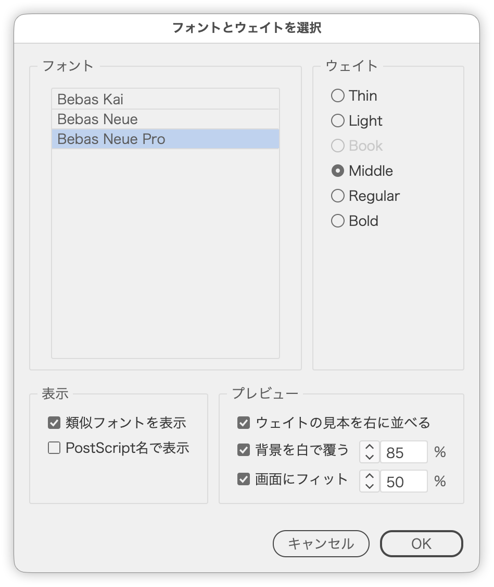

# 似ているフォントのウェイトを見本で見比べて適用

---

### 概要

- 選択しているテキストのフォントと、名前が似ているファミリーのウェイトを一覧表示し、見本を見比べながら選んだフォントを適用する Illustrator スクリプト
- すぐに一つ上／下のウェイトにするときは [FontWeightUp / FontWeightDown](FontWeightUp.md) を使います

### 主な機能

- 左に［フォント］、右に［ウェイト］を表示
  - 右は同じ系列（イタリック、Condensed などの字幅）のウェイトを細い順に並べる
  - 選択中のテキストで使っているウェイトは薄い表示（選べない）
  - ラジオボタンを選ぶと、選択中のテキストにすぐ反映
- 類似フォント：ファミリー名の先頭の語が同じもの（Bebas Neue Pro なら Bebas Neue・Bebas Kai）と、中心の名前を含むもの（A-OTF 新ゴ Pr6N なら 新ゴ ProN・UD新ゴ など）
- ウェイトの見本：選択中のテキストの右に、ウェイトごとの見本を黒で縦に並べ、横にウェイト名を添える（今のウェイトを真横、細いものを上、太いものを下）
- 背景を白で覆う：見本の後ろに半透明の白い長方形を敷き、ほかのオブジェクトを薄くする。選択中のテキストは黒の複製を上に重ねる
- 画面にフィット：選択中のテキストと見本が収まるよう表示倍率を合わせる
- ウェイトの判定は [TypefaceSampler](TypefaceSampler.md) と同じ

### 使い方

1. テキストフレームまたはグループを選択する（文字ツールで一部の文字を選択してもよい）
2. スクリプトを実行する
3. 左でフォント、右でウェイトを選び、［OK］で適用する（［キャンセル］で元のフォントと表示に戻る）

### オプション

| 項目 | 内容 | 初期値 |
|---|---|---|
| 類似フォントを表示 | オフでは選択中のファミリーだけを表示 | オン |
| PostScript名で表示 | フォントの一覧を PostScript 名（BebasNeuePro など）で表示 | オフ |
| ウェイトの見本を右に並べる | 見本とウェイト名を一時レイヤーに並べる | オン |
| 背景を白で覆う［%］ | 白い長方形の不透明度 | オン・85% |
| 画面にフィット［%］ | ウィンドウに対する大きさ | オン・65% |

### 注意点

- 一覧は先頭の文字のフォントを基準にします。選んだフォントは、選択中のすべての文字に適用します
- 見本・白い長方形は一時レイヤー「// weight-preview」に作り、ダイアログを閉じると消えます
- 合成フォントは一覧に出ません

### 紹介記事

- [DTP Transit 別館｜note](https://note.com/dtp_tranist/n/n255437cfdba0)

### 更新履歴

- v1.0.0 (20260928) : 初期バージョン
- v1.0.1 (20260928) : ダイアログを前回閉じた位置で開き、選択中のオブジェクトに重なるときは左右にずらすようにした。不透明度を97%にそろえた
- v1.0.2 (20260928) : ボタン行を共通の部品で組むようにした
- v1.0.2 (20260928) : 対象の収集を共通の部品にした
- v1.0.3 (20260929) : ダイアログの不透明度を98%に変更
- v1.0.4 (20260930) : 文字ツールで文字を選択して実行するとエラーになる不具合を修正
- v1.0.5 (20260930) : 右側のボタンだけのボタン行を左右中央に並べるようにした

### スクリプト情報

- バージョン: v1.0.5
