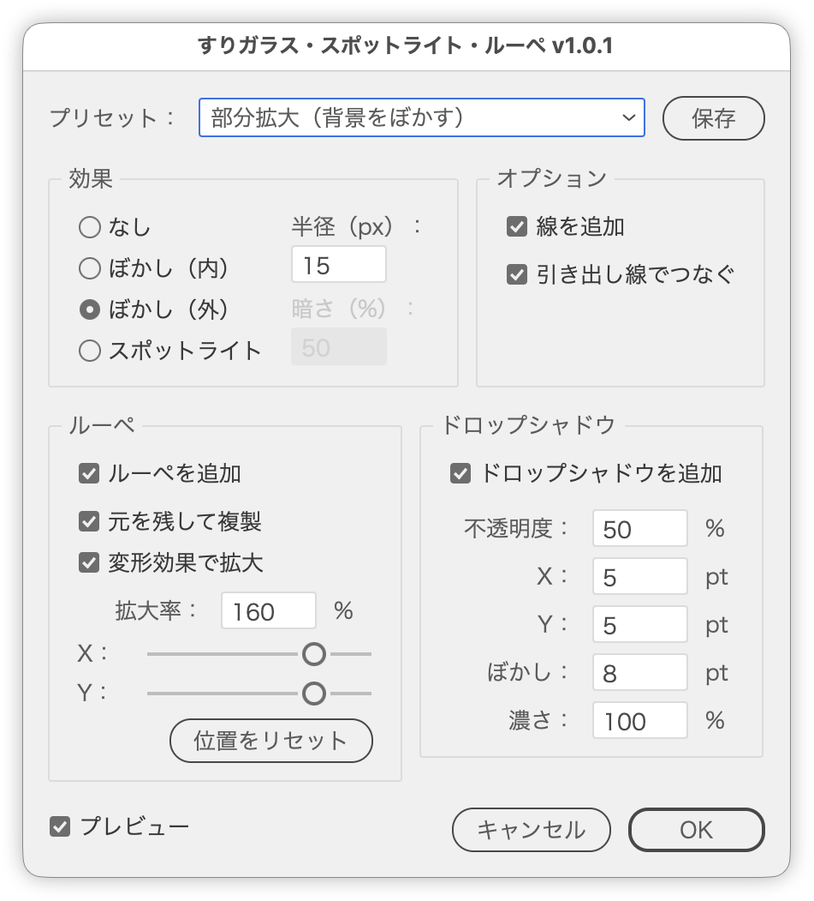

# マスクした複製で、ぼかし・スポットライト・ルーペ・部分拡大をつくる

---

### 概要

画像またはベクターオブジェクトのグループと、マスクに使うパスを選択して実行します。アートワークの複製をパスでマスクし、すりガラス風のぼかし、スポットライト、ルーペ（拡大鏡）、部分拡大（コールアウト）をプレビューしながら作ります。

元のアートワークとパスはそのまま残り、増えるのは複製1つとクリップグループだけです（「ぼかし（外）」では元のアートワークにぼかしが付き、「スポットライト」ではマスク外を暗くする黒い長方形が1つ増えます）。

### 主な機能

- 効果を「なし／ぼかし（内）／ぼかし（外）／スポットライト」から選択（ぼかしの半径0〜1000px、スポットライトの暗さ0〜100%）
- 7種類のプリセット（すりガラス／背景をぼかす／スポットライト／マスク＋ドロップシャドウ／ルーペ／部分拡大／部分拡大（背景をぼかす））
- 今の設定を保存して、次回から「保存した設定」として呼び出し
- クリップグループへの線と、ドロップシャドウ（不透明度・X・Y・ぼかし・濃さ）
- ルーペ：拡大率とマスクサイズ比での移動、実体の複製か［変形］効果かを選択
- 「引き出し線でつなぐ」で、元の位置と拡大したコピーを線でつなぐ
- 元のアートワークを一時的に隠して差し替えるプレビュー
- 日本語／英語UI

### 使い方

1. 画像（配置画像・埋め込み画像）またはグループと、マスクに使うパス（または複合パス）を1つずつ選択します。
2. `MaskSpotlight.jsx` を実行します。
3. プリセットを選ぶか、各項目を指定します（初期状態は「背景をぼかす」）。
4. プレビューを確認して［OK］をクリックします。

### 設定項目

| 項目 | 内容 | 初期値 |
| --- | --- | --- |
| プリセット | よく使う設定をまとめて呼び出す。値を変えると「カスタム」に切り替わる | 背景をぼかす |
| 効果 | なし／ぼかし（内）／ぼかし（外）／スポットライト | ぼかし（外） |
| 半径 | ぼかし（ガウス）の半径（0〜1000px）。「ぼかし（内）」「ぼかし（外）」のときだけ使える | 15px |
| 暗さ | マスク外に重ねる黒の不透明度（0〜100%）。「スポットライト」のときだけ使える | 50% |
| 線を追加 | クリップグループに線を追加し、線に中マドを適用 | オフ |
| 引き出し線でつなぐ | 元の位置と拡大したコピーを線でつなぐグラフィックスタイルを適用 | オフ（部分拡大のプリセットではオン） |
| ドロップシャドウを追加 | クリップグループにドロップシャドウ（乗算）を適用 | オフ |
| 不透明度 | 影の不透明度（0〜100%） | 50% |
| X／Y（ドロップシャドウ） | 影をずらす量（±1000pt。正の値で右・下） | 5pt／5pt |
| ぼかし | 影のぼかし（0〜1000pt） | 8pt |
| 濃さ | 影の濃さ（0〜100%）。カラー指定ではなく「濃さ」で描く | 100% |
| ルーペを追加 | マスクを拡大して、拡大鏡のように重ねる | オフ |
| 元を残して複製 | 元のマスクを残したままルーペを増やす | オフ |
| 変形効果で拡大 | 拡大と移動を［変形］効果として適用し、オブジェクトは変形しない | オフ |
| 拡大率 | ルーペの拡大率（100〜1000%） | 120% |
| X／Y（ルーペ） | ルーペの移動量。マスクの幅・高さに対する割合（±200%。正の値で右・下） | 0／0 |
| プレビュー | 設定の結果をドキュメント上で確認する | オン |

### 注意点

- 選択は「画像またはグループ」と「パス（または複合パス）」を1つずつです。数が合わないときは実行されません。
- 効果が「ぼかし（内）」のときはルーペを使えません（拡大してもぼけたままになるため、パネルがディム表示になります）。
- 「スポットライト」は、元のアートワークのすぐ前面に黒い長方形を重ねて暗くします。マスクした複製がさらに前面に来るため、マスクの内側は暗くなりません（マスクの形に穴を開ける処理はしていません）。
- 「引き出し線でつなぐ」は、ルーペを「元を残して複製」するときだけ使えます。それ以外の設定ではディム表示です。
- 引き出し線は `graphiclibraryzoomin.ai` のグラフィックスタイル `zoomineffect` を使います。このファイルをスクリプトと同じ場所に置いていないときは、項目自体が表示されません。
- グラフィックスタイルは適用先のアピアランスを置き換えるため、引き出し線は結果をグループ化してから適用します（線・ドロップシャドウ・［変形］効果は残ります）。
- ルーペのX／Yは「変形効果で拡大」のオン・オフに関わらず、正の値で右・下に動きます。
- 元がベクターのグループのときは、クリップグループにパスファインダー（効果）の「分割」を適用します。画像には分割するパスがないため適用しません。
- 「線を追加」はメニューコマンドを使うため、環境によっては実行できないことがあります。
- 保存した設定は `~/Library/Application Support/MaskSpotlight/settings.txt`（Windowsは `%APPDATA%\MaskSpotlight\settings.txt`）に置かれます。v1.0.0で保存した設定もそのまま読み込めます。

### 紹介記事

[DTP Transit 別館｜note](https://note.com/dtp_tranist/n/nfc777dda965d)

### 更新履歴

- v1.0.1 (2026-09-20): 効果に「スポットライト」とプリセット「スポットライト」を追加。ダイアログの文言と並びを整理。ルーペのYの向きを「変形効果で拡大」のオン・オフで揃えた
- v1.0.0 (2026-09-20): 初期バージョン
