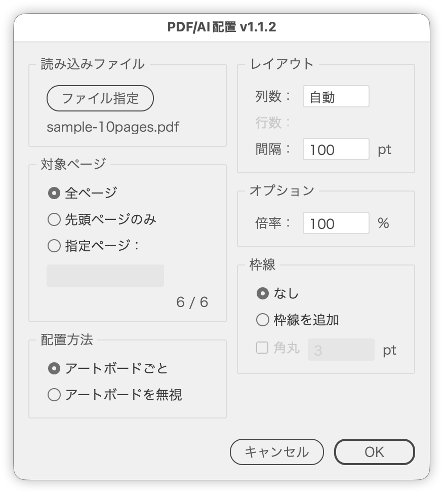

# PDF/AIをページ範囲で読み込んで配置

---

### 概要

PDF/AI ファイルを指定したページ範囲で読み込み、現在のドキュメントまたは新規ドキュメント上に配置するスクリプトです。各ページを個別のアートボードとして並べるか、アートボードを追加せずオブジェクトとして配置するかを選べます。横長の見開きページは左右に分割して並べられます。

複数ページをグリッド状に並べたり、コンタクトシートのように一覧を作ったりする用途を想定しています。配置したページには枠線を付けることもできます。

### 主な機能

- 全ページ／先頭ページのみ／指定ページ（例: `1-10`、`1,3,5`）から対象を選択
- 読み込みファイルの総ページ数を推定し、「配置されるページ数 ／ 総ページ数」を表示
- 配置画像を選択した状態で実行すると、そのリンク先を初期値として読み込む
- ［ファイル指定］のダイアログは PDF/AI ファイルのみを対象にする
- 配置方法は「アートボードごと」「アートボードを無視」の2種類
- 列数を指定するとグリッド状に配置。自動のときは行幅の上限で折り返す
- 指定した列数から必要な行数を算出して表示
- ページ間の間隔を指定（配置方法によって意味が変わる）
- 「アートボードを無視」のときは倍率を指定して配置
- PDF のトリミング（アート／トリミング／仕上がり／裁ち落とし）を選択
- 横長ページを見開きとみなして左右に分割。偶数ページの位置（右／左）は PDF の綴じ方向から自動設定
- 配置先を現在のドキュメント／新規ドキュメントから選択（新規はカラーモードも指定）
- 配置したページに枠線を追加（角丸の指定も可能）
- レイアウト全体をカンバスの中央に揃えて配置
- 配置後は結果全体が見えるよう表示倍率を自動調整
- 多ページの読み込み中は進捗をパレットで表示
- 数値欄は ∧∨ ボタンと ↑↓ キーで増減（Shift で次の10の倍数へ）
- 日本語／英語UI

### 使い方

1. 配置先のドキュメントを開きます。
2. `PDFAIImporter.jsx` を実行します。
3. ［ファイル指定］で PDF または AI ファイルを選びます（配置画像を選択した状態で実行した場合は、そのリンク先が初期値になります）。
4. 対象ページ、配置方法、配置先、レイアウト、オプション、見開き、枠線を設定します。
5. ［OK］をクリックします。ダイアログが閉じてから配置が始まります。

### オプション

| 項目 | 初期値 | 内容 |
| --- | --- | --- |
| 対象ページ | 全ページ | 全ページ／先頭ページのみ／指定ページ。指定ページは `1-10` や `1,3,5` の形式で入力 |
| 配置方法 | アートボードごと | アートボードごと＝各ページサイズのアートボードを作成し倍率100%で配置／アートボードを無視＝アートボードを追加せずオブジェクトとして配置 |
| 配置先 | 現在のドキュメント | 現在のドキュメント／新規ドキュメント。新規のときはカラーモード（CMYK／RGB、初期値は現在のドキュメントに合わせる）を選ぶ |
| 列数 | 自動 | 1行あたりの列数。自動のときは1行の幅が約7,920pt（約2,794mm）を超えたところで折り返す。0以下を入力すると「自動」に戻る |
| 行数 | - | 指定した列数から算出した行数。列数が自動のとき、見開きを分割するときは確定しないためディム表示 |
| 間隔 | 100pt | アートボードごと＝アートボードの間隔／アートボードを無視＝オブジェクト同士の間隔 |
| 倍率 | 100% | 配置倍率。［アートボードを無視］を選んだときのみ有効 |
| トリミング | トリミング | PDF のどのボックスを基準に配置するか。AI ファイルでは使わない |
| 左右に分割 | オフ | 幅が高さの1.2倍を超えるページを見開きとみなし、左右2つに切り分けて並べる。［アートボードを無視］のときは半ページずつクリッピングマスクで切り抜いたオブジェクトになる |
| 偶数ページ | 右 | 見開きを分割したとき、偶数ページを置く側。ファイルを選ぶと PDF の綴じ方向から自動で設定 |
| 枠線 | なし | なし／枠線を追加。追加を選ぶと、ページの外接矩形でクリッピングマスクを作り枠線を付ける |
| 角丸 | オフ（3） | 枠線を追加したときのみ有効。単位は定規の単位に従う |

数値欄は ∧∨ ボタンと ↑↓ キーで増減できます（1ずつではなく次の整数へ。1.5→2。Shift で次の10の倍数へスナップ）。列数は「自動」の状態で ∧ や ↑ を押すと 1 になり、1 から ∨ や ↓ を押すと「自動」に戻ります。

### 注意点

- 読み込みファイルを指定するまで、対象ページ以降のパネルは無効です。
- 配置はレイアウト全体が最大カンバスの中央にくるよう揃えます。
- 「アートボードごと」では1枚目でアクティブアートボードを作り直します。既存の作業中ドキュメントで実行すると、元のアートボードがレイアウト位置へ移動します。
- 総ページ数はファイルを走査して推定するため、PDFの構造によっては取得できないことがあります。取得できない場合は先頭ページのみを配置します。
- 配置できなかったページはスキップして続行し、終了時にまとめて通知します。
- AI ファイルのトリミングは「トリミング（CropBox）」固定です。実行前の環境設定は処理の最後に復元します。
- 入稿用の PDF（トンボや塗り足し付き）を見開きで分割するときは、左右が仕上がり位置で分かれる［仕上がり］を使います。
- 新規ドキュメントのラスタライズ効果解像度は 300 ppi 固定です。
- 進捗はダイアログを閉じたあと、独立したパレットで表示します。環境によってはパレットが表示されないことがありますが、配置自体は実行されます。

### 紹介記事

https://note.com/dtp_tranist/n/n42595650216f

### 更新履歴

- v1.3.7（2026-10-04）項目名のコロンを「 :」（半角スペース＋半角コロン）に変更（共通部品の更新）
- v1.3.6（2026-10-01）ボタン行の下に余白を加え、Illustrator 標準のダイアログに合わせた
- v1.3.5（2026-10-01）ウィンドウ・パネルの余白と間隔を共通部品（UIレイアウト）にそろえた
- v1.3.4（2026-10-01）右側のボタンだけの行は、ダイアログの内側の幅（左右の余白を除く）が 200px 以内なら中央、それより広ければ右揃えに変更
- v1.3.3 (2026-09-30): 右側のボタンだけのボタン行を左右中央に並べるようにした
- v1.3.2 (2026-09-30): 文字ツールで文字を選択して実行するとエラーになる不具合を修正
- v1.3.1 (2026-09-29): ダイアログの不透明度を98%に変更
- v1.3.0 (2026-09-29): PDFAISpreadImporter.jsx を統合。見開きの分割（偶数ページの位置は綴じ方向から自動設定）、トリミングの選択、新規ドキュメントへの配置を追加
- v1.2.2 (2026-09-28): ボタン行を共通の部品で組むようにした
- v1.2.1 (2026-09-28): ダイアログを前回閉じた位置で開き、選択中のオブジェクトに重なるときは左右にずらすようにした。不透明度を97%にそろえた
- v1.2.0 (2026-09-27): 数値欄にステップボタン（∧∨）を追加。↑↓キーもステップボタンと同じ処理で増減するように変更（次の整数へ、shift＋で次の10の倍数へ）
- v1.1.2 (2026-09-19): 配置をダイアログを閉じてから実行するよう変更、行数の表示を追加、倍率をオプションパネルへ分離、ページ計測の重複を解消、切り抜き設定の復元を修正
- v1.1.1 (2026-06-14): 内部構造の整理
- v1.1.0 (2026-04-13): 枠線と角丸の指定を追加
- v1.0.0 (2026-04-13): 初期バージョン
