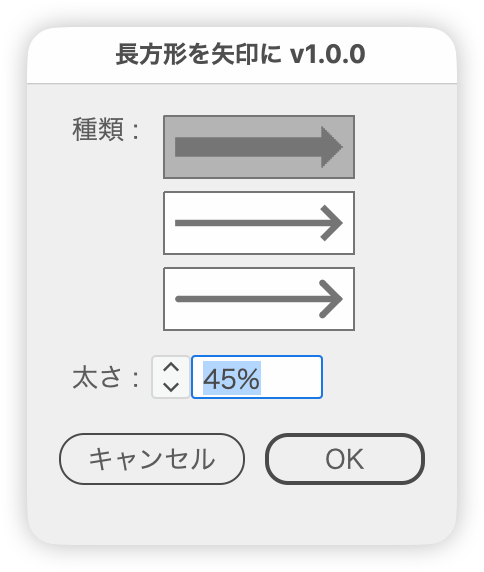

# 長方形を矢印に置き換え

---

### 概要

- 選択中の長方形や水平な罫線を、その範囲いっぱいの矢印に置き換えます。
- 矢印は［塗り］［線（線端なし）］［線（丸型線端）］の3種類から選び、太さと高さはプレビューで確認しながら調整します。
- 向きの反転と両矢印は、アイコンか、種類のボタンの修飾キー＋クリックで切り替えます。

### 主な機能

#### 種類

- 矢印の形を描いたボタン（縦に3つ）で選びます。選択中は灰色の地になります
  - 塗り：1本の閉じたパスの矢印にします。元のパスを書き換えるので、効果や重ね順はそのまま残ります
  - 線（線端なし）：軸の直線とくの字の矢じりを、線端なし・マイター結合の線で組みます
  - 線（丸型線端）：同じく、丸型線端・ラウンド結合の線で組みます
- 線の2種類は、線ごとに［パスのアウトライン］効果を掛けてグループにし、グループに［パスファインダー（合体）］効果を掛けます。アピアランスのままなので、あとから線幅などを編集できます
- 向き：横長の長方形は右向き、縦長は上向きになります
  - ボタンを option（Alt）＋クリックすると、向きが逆（左向き・下向き）になります。もう一度で元に戻ります
  - ボタンを ⌘＋option（Ctrl＋Alt）＋クリックすると、両矢印のオン／オフを切り替えます
  - 種類のボタンの下の［両矢印］（リンク）と［反転］（⇄）のアイコンでも切り替えられます。両矢印のときは反転を使えません
  - 向きと両矢印は3種類で共通です。ボタンの絵も今の向きに合わせて変わります

#### 太さ

- 塗りは軸の太さを、長方形の短辺に対する％で指定します（1〜100%、初期値 45%）
- 線の2種類は線幅を、環境設定の［線］の単位で指定します。初期値は、1つ目の対象の短辺の 15% を換算した値です
- 種類を切り替えると、欄の単位も％と線の単位で切り替わります。種類ごとに値を覚えるので、切り替えても調整した値は消えません
- ∧∨ボタンと↑↓キーで増減できます（shift＋で次の10の倍数へ、option＋で0.1ずつ）

#### 高さ

- 矢印の高さ（矢じりの幅）を、長方形の短辺に対する％で指定します（1〜500%、初期値 100%）。3種類で共通です
- 軸の太さ・線幅は変わりません。塗りの矢印で高さが軸の太さより小さいときは、軸を高さに合わせます
- 矢じりの長さも高さに合わせて変わります（直角を保ちます）

#### 罫線（水平線）

- 長方形のほか、水平な直線のオープンパス（2点）も対象です。高さが 0 なので、線の長さの 1/4 を短辺として扱います

#### 形と色

- 矢じりは直角で、長さは高さの半分です。長方形が短いときは、片矢印は全長、両矢印は全長の半分までに抑えます
- 線の矢印は、パスの形を長方形の範囲に合わせるので、線幅のぶんだけ外へはみ出します
- 色は、元の長方形の塗りの色を使います。塗りがなしか白のときは線の色、塗りも線もなしのときは黒にします

#### プレビュー

- プレビューは常にオンです（ダイアログボックスを開いた時点から反映）。複製を矢印にして見せ、元の長方形はプレビューの間だけ隠します。キャンセルすると元に戻ります

### 使い方

1. 矢印にしたい長方形や罫線を選択します（グループの中のものも対象。複数選択も可）
2. スクリプトを実行し、ダイアログボックスで種類・太さ・高さを設定します
3. ［OK］で置き換えます

### 注意点

- 対象は回転していない長方形（4点・直線の辺が水平と垂直）と、水平な罫線（ハンドルのない2点のオープンパス）です。回転した長方形・角丸・斜めや垂直の線・ロック中や非表示のものは対象外です
- 線の矢印にすると、元の長方形に付いていた効果は引き継がれません
- 線の矢印の線幅は、どの長方形にも同じ値を使います（塗りの軸の太さは長方形ごとの短辺に対する％）
- 線の矢印は、プレビューのたびにメニューコマンドで効果を掛けるため、長方形が多いと描き直しに時間がかかることがあります

### 紹介記事

https://note.com/dtp_tranist/n/n789072361c12

---

### 更新履歴

- v1.1.1（2026-10-11）罫線のときは、線の矢印（線端なし）を選んだ状態で、罫線の線幅を引き継いで始めるように変更。線の矢印に元の罫線の矢印・線幅プロファイルが残る問題、［高さ］が極端なときに頂点が重なる問題、白の判定もれを修正。線幅の初期値と増減幅を線の単位に合わせて調整。線の2種類を切り替えても線幅を保持
- v1.1.0（2026-10-10）［高さ］を追加。罫線（水平線）に対応。線の矢印の太さを線幅（環境設定の線の単位）で指定するように変更。両矢印・反転のアイコンを追加。塗りが白のときも線の色を使うように変更
- v1.0.0（2026-10-10）初版

### スクリプト情報

- バージョン: v1.1.1
- 初回リリース: 2026-10-10
- 最終更新: 2026-10-11
