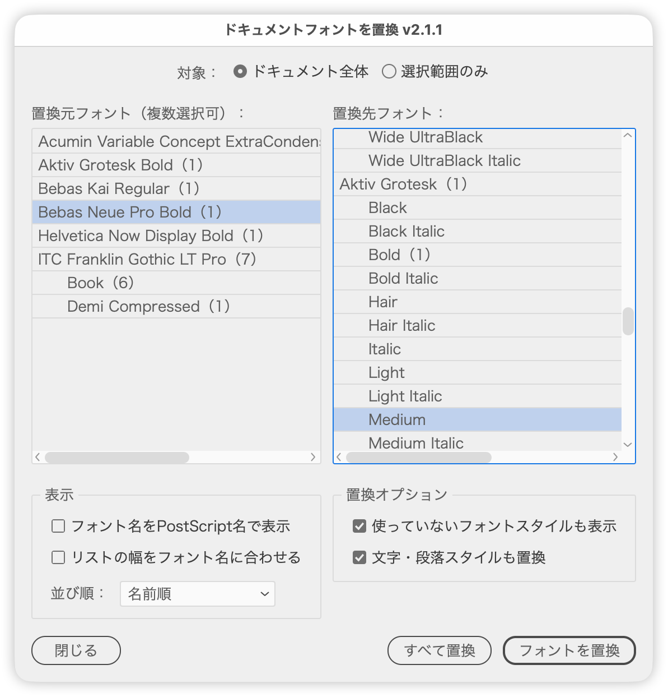

# 使用中のフォントをまとめて別のフォントに置換

---

### 概要

- ドキュメント（または選択範囲）で使用中のフォントをファミリー／スタイル単位で一覧し、選んだフォントを別のフォントへまとめて置き換えるスクリプト。
- ダイアログは［置換元フォント］（複数選択可）と［置換先フォント］の2カラム構成。各リストの下に、表示の切り替えと置換のオプションがある。
- スタイル行には、そのフォントを使っているテキストオブジェクトの数を（ ）で表示。
- 置換してもダイアログは開いたままで、一覧は自動的に作り直される。続けて置換できる。

### 主な機能

#### 対象

- ［ドキュメント全体］［選択範囲のみ］を切り替え
- ［選択範囲のみ］は、実行時に選択していたテキスト（グループ内も含む。文字の編集中はそのストーリー）が対象
- テキストを選択して実行すると［選択範囲のみ］、選択していなければ［ドキュメント全体］で開く。テキストを選択していないときは［選択範囲のみ］は選べない

#### リスト

- **置換元フォント**（複数選択可）：ファミリー名の行（見出し）を選ぶと、そのファミリーのスタイルがすべて選ばれる
- **置換先フォント**（単一選択）：ファミリー名の行は選べない（選ぶと選択が解除される）
- 件数はテキストオブジェクト単位。同じテキストオブジェクトの中で同じフォントが何度使われていても1つと数える
- ファミリー名の行には、スタイルの使用数の合計を表示
- スタイルが1つだけのファミリーは見出しを立てず、「ファミリー名＋スタイル名」の1行で表示

#### 表示（左のパネル）

- **フォント名をPostScript名で表示**：ファミリー／スタイルの入れ子をやめ、PostScript名で1フォント1行の一覧に切り替え
- **リストの幅をフォント名に合わせる**：ON のときはいちばん長いフォント名に合わせてリストを広げる（見切れない表示）。OFF のときは固定幅の簡易表示
- **並び順**：［名前順］［使用数の多い順］［使用数の少ない順］から選ぶ。ファミリーはスタイルの使用数の合計で並べ、使用数が同じときは名前順

#### 置換オプション（右のパネル）

- **使っていないフォントスタイルも表示**：置換先のリストに、同じファミリーでドキュメントに使っていないスタイルも件数なしで並べる（毎回 OFF で開く）
- **文字・段落スタイルも置換**：置換元フォントが設定された文字スタイル・段落スタイルも置換先フォントに書き換える（［ドキュメント全体］のときだけ）

#### ボタン

- **［フォントを置換］**：選んだ置換元フォントを、置換先フォントに置き換える
- **［すべて置換］**：使用中のすべてのフォントを置換先フォントにそろえる。置換先を選んでいないときは、置換元の1つ目のフォントにそろえる
- 置換後に一覧を集め直し、選択はフォント名を手がかりに引き継ぐ（使われなくなったフォントは一覧から消える）

#### キーボードショートカット

| キー | 動作 |
|---|---|
| option＋D | ［ドキュメント全体］に切り替え |
| option＋S | ［選択範囲のみ］に切り替え |
| option＋P | ［フォント名をPostScript名で表示］のオン／オフ |
| option＋L | ［リストの幅をフォント名に合わせる］のオン／オフ |
| option＋Tab | 置換元と置換先のリストのあいだでフォーカスを移す |

#### その他

- 並び順・［フォント名をPostScript名で表示］・［リストの幅をフォント名に合わせる］・［文字・段落スタイルも置換］は、次に開いたときも引き継ぐ
- 各項目にツールチップを表示、日本語／英語の自動切り替え
- スタイル行の字下げ、各オプションの初期状態、リストの高さ・幅は、スクリプト冒頭の「ユーザー設定」「レイアウト」で変更できる

### 使い方

1. ドキュメントを開いてスクリプトを実行します。一部のテキストだけを置換したいときは、テキストを選択してから実行します。
2. 左の［置換元フォント］から置換したいフォントを選びます（複数選択可。ファミリー名の行を選ぶと、そのファミリー全体）。
3. 右の［置換先フォント］から置換後のフォントを選びます。
4. ［フォントを置換］をクリックします。使用中のフォントを1つにそろえたいときは［すべて置換］をクリックします。
5. 続けて置換できます。終わったら［閉じる］をクリックします。

### 処理の流れ

1. 対象（ドキュメント全体または選択範囲）のテキストオブジェクトを走査し、使用中のフォントをファミリー別に収集
2. ファミリー見出し＋スタイル行（［フォント名をPostScript名で表示］のときは1フォント1行）の一覧を作り、2つのリストに流し込む
3. 置換実行時、ロック・非表示のテキストを除いて、該当する箇所のフォントを置換先に差し替え（オプションが ON なら文字・段落スタイルも）
4. 一覧を集め直してリストを更新し、画面を再描画

### 対象外

- ドキュメントが開かれていない場合、および使用中のフォントが見つからない場合
- ロック／非表示のテキスト（一覧と件数には含まれますが、置換されません）
- アウトライン化された文字、配置画像内の文字
- 置換先フォントが環境にインストールされていない場合（警告を表示して中止）

### 紹介記事

https://note.com/dtp_tranist/n/ncc9330ba1f7d

### 更新履歴

- v2.1.1 (2026-09-29) 置換元の選択に連動したテキストのハイライトを廃止。テキストを選択して実行したときは［対象］を［選択範囲のみ］で開くようにした（対象は記憶しない）。［リストの幅をフォント名に合わせる］を追加（OFF は固定幅の簡易表示）。［使っていないフォントスタイルも表示］（旧［使っていないスタイルも表示］）は記憶せず、毎回 OFF で開くようにした。［PostScript名で表示］を［フォント名をPostScript名で表示］に改名。［ソート］をラジオボタンからポップアップに変更し、項目名を［並び順］に。左のパネル名を「表示」に、［全置換］を［すべて置換］に変更。アラートの文言を整理し、ツールチップを補足。キーボードショートカット（option＋D／S／P／L／Tab）を追加。［閉じる］を左端に移動
- v2.1.0 (2026-09-29) ［対象］（ドキュメント全体／選択範囲のみ）、［ソート］（名前順／使用数の降順・昇順）、置換先の［使っていないスタイルも表示］、［文字・段落スタイルも置換］を追加。［PostScript名で表示］［ソート］を左の「オプション」パネルに、置換先の2項目を右の「置換オプション」パネルにまとめた。ファミリー名の行にスタイルの使用数の合計を表示。設定を記憶するようにした。ファミリー名の行を選んだときにリストが大きくスクロールしないようにした。ダイアログのタイトルを「ドキュメントフォントを置換」に変更
- v2.0.3 (2026-09-29) ダイアログの不透明度を98%に変更
- v2.0.2 (2026-09-28) ボタン行を共通の部品で組むようにした。キャンセルを右側にそろえた
- v2.0.1 (2026-09-28) ダイアログを前回閉じた位置で開き、選択中のオブジェクトに重なるときは左右にずらすようにした。不透明度を97%にそろえた
- v2.0.0 (2026-09-17) ファミリー／スタイルの入れ子表示とスタイルごとの使用数表示、［PostScript名で表示］、置換元の選択に連動したテキストのハイライト、［全置換］に対応。ダイアログの幅を拡大。ハウスルール適用（ユーザー設定・レイアウトのブロック分け、LABELSの入れ子化、JSDoc、ツールチップ追加）
- v1.0.0 (2025-03-29) 公開バージョン
